<details>
<summary>Relevant source files</summary>

The following files were used as context for generating this wiki page:

- [.npmrc](.npmrc)
- [build/.moduleignore](build/.moduleignore)
- [build/.webignore](build/.webignore)
- [build/azure-pipelines/linux/setup-env.sh](build/azure-pipelines/linux/setup-env.sh)
- [build/checksums/electron.txt](build/checksums/electron.txt)
- [build/checksums/nodejs.txt](build/checksums/nodejs.txt)
- [build/linux/debian/calculate-deps.js](build/linux/debian/calculate-deps.js)
- [build/linux/debian/calculate-deps.ts](build/linux/debian/calculate-deps.ts)
- [build/linux/debian/dep-lists.js](build/linux/debian/dep-lists.js)
- [build/linux/debian/dep-lists.ts](build/linux/debian/dep-lists.ts)
- [build/linux/dependencies-generator.js](build/linux/dependencies-generator.js)
- [build/linux/dependencies-generator.ts](build/linux/dependencies-generator.ts)
- [build/linux/rpm/dep-lists.js](build/linux/rpm/dep-lists.js)
- [build/linux/rpm/dep-lists.ts](build/linux/rpm/dep-lists.ts)
- [build/monaco/monaco.d.ts.recipe](build/monaco/monaco.d.ts.recipe)
- [build/package.json](build/package.json)
- [cgmanifest.json](cgmanifest.json)
- [extensions/vscode-colorize-perf-tests/test/colorize-fixtures/test-treeView.ts](extensions/vscode-colorize-perf-tests/test/colorize-fixtures/test-treeView.ts)
- [extensions/vscode-colorize-tests/src/colorizer.test.ts](extensions/vscode-colorize-tests/src/colorizer.test.ts)
- [package-lock.json](package-lock.json)
- [package.json](package.json)
- [remote/.npmrc](remote/.npmrc)
- [remote/package-lock.json](remote/package-lock.json)
- [remote/package.json](remote/package.json)
- [remote/web/package-lock.json](remote/web/package-lock.json)
- [remote/web/package.json](remote/web/package.json)
- [src/vs/code/electron-main/app.ts](src/vs/code/electron-main/app.ts)
- [src/vs/code/electron-main/main.ts](src/vs/code/electron-main/main.ts)
- [src/vs/code/node/cliProcessMain.ts](src/vs/code/node/cliProcessMain.ts)
- [src/vs/editor/browser/editorBrowser.ts](src/vs/editor/browser/editorBrowser.ts)
- [src/vs/editor/browser/view/domLineBreaksComputer.ts](src/vs/editor/browser/view/domLineBreaksComputer.ts)
- [src/vs/editor/browser/viewParts/minimap/minimap.ts](src/vs/editor/browser/viewParts/minimap/minimap.ts)
- [src/vs/editor/browser/viewParts/minimap/minimapCharRenderer.ts](src/vs/editor/browser/viewParts/minimap/minimapCharRenderer.ts)
- [src/vs/editor/browser/viewParts/minimap/minimapCharRendererFactory.ts](src/vs/editor/browser/viewParts/minimap/minimapCharRendererFactory.ts)
- [src/vs/editor/browser/viewParts/minimap/minimapCharSheet.ts](src/vs/editor/browser/viewParts/minimap/minimapCharSheet.ts)
- [src/vs/editor/browser/viewParts/minimap/minimapPreBaked.ts](src/vs/editor/browser/viewParts/minimap/minimapPreBaked.ts)
- [src/vs/editor/browser/widget/codeEditor/codeEditorWidget.ts](src/vs/editor/browser/widget/codeEditor/codeEditorWidget.ts)
- [src/vs/editor/common/config/editorConfigurationSchema.ts](src/vs/editor/common/config/editorConfigurationSchema.ts)
- [src/vs/editor/common/config/editorOptions.ts](src/vs/editor/common/config/editorOptions.ts)
- [src/vs/editor/common/core/rgba.ts](src/vs/editor/common/core/rgba.ts)
- [src/vs/editor/common/editorCommon.ts](src/vs/editor/common/editorCommon.ts)
- [src/vs/editor/common/model.ts](src/vs/editor/common/model.ts)
- [src/vs/editor/common/model/guidesTextModelPart.ts](src/vs/editor/common/model/guidesTextModelPart.ts)
- [src/vs/editor/common/model/textModel.ts](src/vs/editor/common/model/textModel.ts)
- [src/vs/editor/common/standalone/standaloneEnums.ts](src/vs/editor/common/standalone/standaloneEnums.ts)
- [src/vs/editor/common/textModelGuides.ts](src/vs/editor/common/textModelGuides.ts)
- [src/vs/editor/common/viewModel/minimapTokensColorTracker.ts](src/vs/editor/common/viewModel/minimapTokensColorTracker.ts)
- [src/vs/editor/common/viewModel/modelLineProjection.ts](src/vs/editor/common/viewModel/modelLineProjection.ts)
- [src/vs/editor/common/viewModel/monospaceLineBreaksComputer.ts](src/vs/editor/common/viewModel/monospaceLineBreaksComputer.ts)
- [src/vs/editor/common/viewModel/viewModelImpl.ts](src/vs/editor/common/viewModel/viewModelImpl.ts)
- [src/vs/editor/common/viewModel/viewModelLines.ts](src/vs/editor/common/viewModel/viewModelLines.ts)
- [src/vs/editor/standalone/browser/standaloneCodeEditor.ts](src/vs/editor/standalone/browser/standaloneCodeEditor.ts)
- [src/vs/editor/standalone/browser/standaloneEditor.ts](src/vs/editor/standalone/browser/standaloneEditor.ts)
- [src/vs/editor/test/browser/view/minimapCharRenderer.test.ts](src/vs/editor/test/browser/view/minimapCharRenderer.test.ts)
- [src/vs/editor/test/browser/viewModel/modelLineProjection.test.ts](src/vs/editor/test/browser/viewModel/modelLineProjection.test.ts)
- [src/vs/editor/test/common/model/modelInjectedText.test.ts](src/vs/editor/test/common/model/modelInjectedText.test.ts)
- [src/vs/editor/test/common/viewModel/lineBreakData.test.ts](src/vs/editor/test/common/viewModel/lineBreakData.test.ts)
- [src/vs/editor/test/common/viewModel/monospaceLineBreaksComputer.test.ts](src/vs/editor/test/common/viewModel/monospaceLineBreaksComputer.test.ts)
- [src/vs/monaco.d.ts](src/vs/monaco.d.ts)
- [src/vs/platform/auxiliaryWindow/electron-main/auxiliaryWindow.ts](src/vs/platform/auxiliaryWindow/electron-main/auxiliaryWindow.ts)
- [src/vs/platform/auxiliaryWindow/electron-main/auxiliaryWindows.ts](src/vs/platform/auxiliaryWindow/electron-main/auxiliaryWindows.ts)
- [src/vs/platform/auxiliaryWindow/electron-main/auxiliaryWindowsMainService.ts](src/vs/platform/auxiliaryWindow/electron-main/auxiliaryWindowsMainService.ts)
- [src/vs/platform/environment/test/node/nativeModules.integrationTest.ts](src/vs/platform/environment/test/node/nativeModules.integrationTest.ts)
- [src/vs/platform/launch/electron-main/launchMainService.ts](src/vs/platform/launch/electron-main/launchMainService.ts)
- [src/vs/platform/menubar/electron-main/menubar.ts](src/vs/platform/menubar/electron-main/menubar.ts)
- [src/vs/platform/native/common/native.ts](src/vs/platform/native/common/native.ts)
- [src/vs/platform/native/electron-main/nativeHostMainService.ts](src/vs/platform/native/electron-main/nativeHostMainService.ts)
- [src/vs/platform/sharedProcess/electron-main/sharedProcess.ts](src/vs/platform/sharedProcess/electron-main/sharedProcess.ts)
- [src/vs/platform/sharedProcess/node/sharedProcess.ts](src/vs/platform/sharedProcess/node/sharedProcess.ts)
- [src/vs/platform/window/common/window.ts](src/vs/platform/window/common/window.ts)
- [src/vs/platform/window/electron-main/window.ts](src/vs/platform/window/electron-main/window.ts)
- [src/vs/platform/windows/electron-main/windowImpl.ts](src/vs/platform/windows/electron-main/windowImpl.ts)
- [src/vs/platform/windows/electron-main/windows.ts](src/vs/platform/windows/electron-main/windows.ts)
- [src/vs/platform/windows/electron-main/windowsMainService.ts](src/vs/platform/windows/electron-main/windowsMainService.ts)
- [src/vs/platform/windows/test/electron-main/windowsFinder.test.ts](src/vs/platform/windows/test/electron-main/windowsFinder.test.ts)
- [src/vs/workbench/contrib/relauncher/browser/relauncher.contribution.ts](src/vs/workbench/contrib/relauncher/browser/relauncher.contribution.ts)
- [src/vs/workbench/electron-sandbox/desktop.contribution.ts](src/vs/workbench/electron-sandbox/desktop.contribution.ts)
- [src/vs/workbench/test/electron-sandbox/workbenchTestServices.ts](src/vs/workbench/test/electron-sandbox/workbenchTestServices.ts)
- [test/automation/package.json](test/automation/package.json)
- [test/integration/browser/package.json](test/integration/browser/package.json)
- [test/smoke/package.json](test/smoke/package.json)

</details>


This document provides a high-level overview of the Visual Studio Code architecture, explaining the core components and how they interact with each other. It covers the process architecture, core services, and the main building blocks that make up VS Code.

For detailed information about specific subsystems, please refer to the dedicated pages for each component, such as the [Monaco Editor](#3), [Extension System](#4), or [Integrated Terminal](#5).

## Process Architecture

VS Code uses a multi-process architecture to ensure stability, performance, and security. The application is split into several processes, each with specific responsibilities:

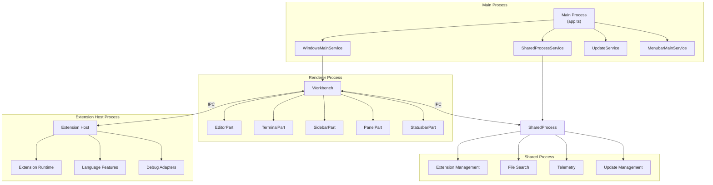

### Main Process

The main process is the entry point of the application and is responsible for:
- Managing application lifecycle
- Creating and managing windows
- Handling native OS integration
- Coordinating other processes

The main process is implemented in `CodeApplication` class, which initializes all the core services and sets up the necessary event listeners.

Sources:
- [src/vs/code/electron-main/app.ts:130-1000]()
- [src/vs/code/electron-main/main.ts:84-200]()

### Renderer Process

The renderer process hosts the VS Code workbench UI and is responsible for:
- Rendering the user interface
- Handling user interactions
- Managing editors and views
- Communicating with other processes

Each window in VS Code has its own renderer process, which helps isolate windows from each other.

Sources:
- [src/vs/platform/windows/electron-main/windowImpl.ts:1-100]()
- [src/vs/platform/windows/electron-main/windowsMainService.ts:183-300]()

### Extension Host Process

The extension host process runs extensions in a separate process to ensure stability:
- Isolates extension code from the main application
- Provides extension API surface
- Communicates with the renderer process via IPC
- Hosts language services, debuggers, and other extension features

Sources:
- [src/vs/workbench/api/node/extHost.api.impl.ts]()

### Shared Process

The shared process handles background tasks that are shared across windows:
- Extension management (installation, updates)
- File search and indexing
- Telemetry
- Update management

Sources:
- [src/vs/platform/sharedProcess/electron-main/sharedProcess.ts:1-100]()

## Core Services Architecture

VS Code is built on a service-oriented architecture with dependency injection. The core services are organized in a hierarchical manner:

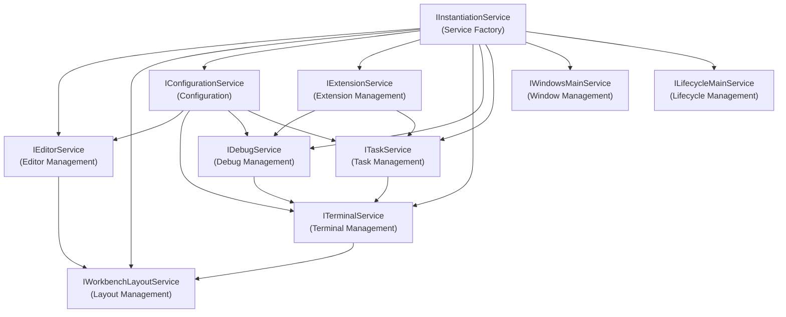

The service architecture uses interfaces to define service contracts and implementations to provide the actual functionality. This allows for:
- Loose coupling between components
- Easier testing through service mocking
- Extensibility through service replacement

Sources:
- [src/vs/platform/instantiation/common/instantiation.js]()
- [src/vs/code/electron-main/app.ts:142-154]()

## Workbench and Layout

The workbench is the main UI component of VS Code, providing the overall layout and hosting various parts:

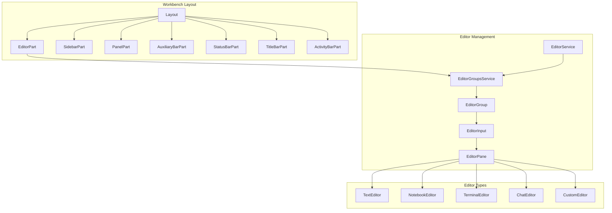

The workbench layout is highly customizable, allowing users to resize, move, and hide different parts according to their preferences.

Sources:
- [src/vs/workbench/browser/layout.ts]()
- [src/vs/workbench/browser/parts/editor/editorPart.ts]()

## Monaco Editor

At the core of VS Code's editing capabilities is the Monaco Editor, a sophisticated text editor component:

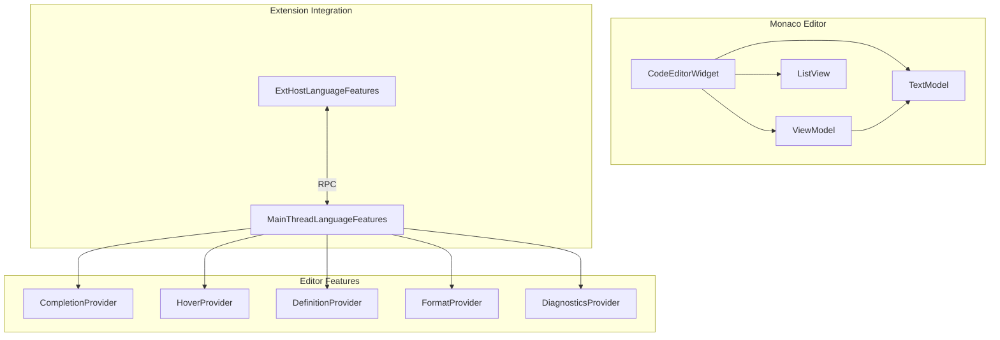

The Monaco Editor is composed of several key components:
- **TextModel**: Manages the text content and provides APIs for text manipulation
- **ViewModel**: Handles the visual representation of the text model, including line wrapping and decorations
- **CodeEditorWidget**: The main editor component that integrates the model, view, and user interactions

Sources:
- [src/vs/editor/common/model/textModel.ts:178-410]()
- [src/vs/editor/common/viewModel/viewModelImpl.ts:47-100]()
- [src/vs/monaco.d.ts:1-100]()

## Extension System

VS Code's extension system allows for powerful customization and additional functionality:

```mermaid
graph TD
    subgraph "Main Thread (Renderer Process)"
        MainThreadAPI["Main Thread API"]
        MainThreadExtensionService["MainThreadExtensionService"]
        MainThreadLanguageFeatures["MainThreadLanguageFeatures"]
        MainThreadDebug["MainThreadDebugService"]
        MainThreadTerminal["MainThreadTerminalService"]
        MainThreadTask["MainThreadTaskService"]
    end
    
    subgraph "Extension Host Process"
        ExtHostAPI["Extension Host API"]
        ExtHostExtensionService["ExtHostExtensionService"]
        ExtHostLanguageFeatures["ExtHostLanguageFeatures"]
        ExtHostDebug["ExtHostDebugService"]
        ExtHostTerminal["ExtHostTerminalService"]
        ExtHostTask["ExtHostTaskService"]
        
        Extensions["Extensions"]
    end
    
    MainThreadAPI <-->|"RPC Protocol"| ExtHostAPI
    
    MainThreadExtensionService <-->|"RPC"| ExtHostExtensionService
    MainThreadLanguageFeatures <-->|"RPC"| ExtHostLanguageFeatures
    MainThreadDebug <-->|"RPC"| ExtHostDebug
    MainThreadTerminal <-->|"RPC"| ExtHostTerminal
    MainThreadTask <-->|"RPC"| ExtHostTask
    
    Extensions --> ExtHostExtensionService
    Extensions --> ExtHostLanguageFeatures
    Extensions --> ExtHostDebug
    Extensions --> ExtHostTerminal
    Extensions --> ExtHostTask
```

The extension system uses a proxy-based architecture to communicate between the main thread and extension host process. This ensures that extensions can't directly affect the stability of the main application.

Sources:
- [src/vs/workbench/api/browser/mainThreadExtensionService.ts]()
- [src/vs/workbench/api/common/extHost.protocol.ts]()

## Configuration System

VS Code's configuration system manages settings from various sources:

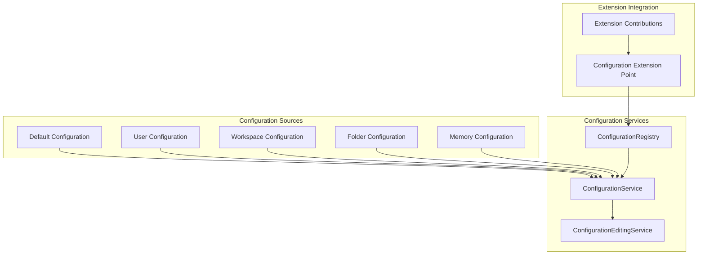

The configuration system merges settings from multiple sources with a specific precedence order:
1. Default settings
2. User settings
3. Workspace settings
4. Folder-specific settings
5. Memory settings (programmatically set)

Sources:
- [src/vs/platform/configuration/common/configuration.js]()
- [src/vs/platform/configuration/common/configurationRegistry.js]()
- [src/vs/editor/common/config/editorOptions.ts:52-786]()

## Dependency Management

VS Code uses npm for dependency management, with a carefully curated set of dependencies:

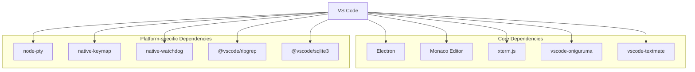

The main dependencies are defined in `package.json` and include:
- **Electron**: The framework for building cross-platform desktop applications
- **Monaco Editor**: The core text editor component
- **xterm.js**: Terminal emulation library
- **vscode-oniguruma** and **vscode-textmate**: For syntax highlighting
- Various native modules for platform-specific functionality

Sources:
- [package.json:71-116]()
- [remote/package.json:5-42]()
- [remote/web/package.json:4-24]()

## Build System

VS Code uses a sophisticated build system based on TypeScript, Gulp, and Webpack:

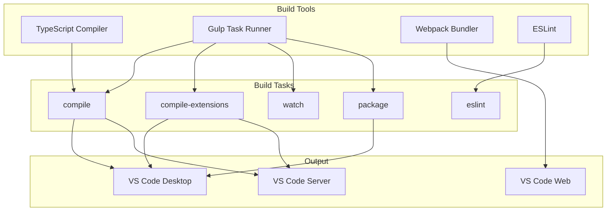

The build system supports multiple targets:
- Desktop application (Electron-based)
- Web version (browser-based)
- Remote server (for remote development)

Sources:
- [package.json:12-69]()
- [build/package.json:4-69]()
- [.npmrc:1-2]()

## Conclusion

VS Code's architecture is designed for extensibility, performance, and stability. The multi-process architecture isolates different components, the service-oriented design enables loose coupling, and the extension system allows for powerful customization.

This overview provides a foundation for understanding the VS Code codebase. For more detailed information about specific components, refer to the dedicated pages for each subsystem.19:T51d7,# Process Architecture

<details>
<summary>Relevant source files</summary>

The following files were used as context for generating this wiki page:

- [src/vs/code/electron-main/app.ts](src/vs/code/electron-main/app.ts)
- [src/vs/code/electron-main/main.ts](src/vs/code/electron-main/main.ts)
- [src/vs/code/node/cliProcessMain.ts](src/vs/code/node/cliProcessMain.ts)
- [src/vs/platform/auxiliaryWindow/electron-main/auxiliaryWindow.ts](src/vs/platform/auxiliaryWindow/electron-main/auxiliaryWindow.ts)
- [src/vs/platform/auxiliaryWindow/electron-main/auxiliaryWindows.ts](src/vs/platform/auxiliaryWindow/electron-main/auxiliaryWindows.ts)
- [src/vs/platform/auxiliaryWindow/electron-main/auxiliaryWindowsMainService.ts](src/vs/platform/auxiliaryWindow/electron-main/auxiliaryWindowsMainService.ts)
- [src/vs/platform/launch/electron-main/launchMainService.ts](src/vs/platform/launch/electron-main/launchMainService.ts)
- [src/vs/platform/menubar/electron-main/menubar.ts](src/vs/platform/menubar/electron-main/menubar.ts)
- [src/vs/platform/native/common/native.ts](src/vs/platform/native/common/native.ts)
- [src/vs/platform/native/electron-main/nativeHostMainService.ts](src/vs/platform/native/electron-main/nativeHostMainService.ts)
- [src/vs/platform/sharedProcess/electron-main/sharedProcess.ts](src/vs/platform/sharedProcess/electron-main/sharedProcess.ts)
- [src/vs/platform/sharedProcess/node/sharedProcess.ts](src/vs/platform/sharedProcess/node/sharedProcess.ts)
- [src/vs/platform/window/common/window.ts](src/vs/platform/window/common/window.ts)
- [src/vs/platform/window/electron-main/window.ts](src/vs/platform/window/electron-main/window.ts)
- [src/vs/platform/windows/electron-main/windowImpl.ts](src/vs/platform/windows/electron-main/windowImpl.ts)
- [src/vs/platform/windows/electron-main/windows.ts](src/vs/platform/windows/electron-main/windows.ts)
- [src/vs/platform/windows/electron-main/windowsMainService.ts](src/vs/platform/windows/electron-main/windowsMainService.ts)
- [src/vs/platform/windows/test/electron-main/windowsFinder.test.ts](src/vs/platform/windows/test/electron-main/windowsFinder.test.ts)
- [src/vs/workbench/contrib/relauncher/browser/relauncher.contribution.ts](src/vs/workbench/contrib/relauncher/browser/relauncher.contribution.ts)
- [src/vs/workbench/electron-sandbox/desktop.contribution.ts](src/vs/workbench/electron-sandbox/desktop.contribution.ts)
- [src/vs/workbench/test/electron-sandbox/workbenchTestServices.ts](src/vs/workbench/test/electron-sandbox/workbenchTestServices.ts)

</details>


This document explains the multi-process architecture of VS Code, including the main process, renderer process, extension host process, and shared process. It covers how these processes communicate with each other and their specific responsibilities within the application.

For information about dependency management and build system, see [Dependency Management and Build System](#1.2).

## Overview

VS Code uses a multi-process architecture to ensure stability, security, and performance. This architecture is built on Electron, which combines Chromium (for rendering) and Node.js (for file system access and other native capabilities).

The application is divided into several processes, each with specific responsibilities:

1. **Main Process**: Coordinates the application lifecycle and manages windows
2. **Renderer Process**: Handles the UI and workbench components
3. **Extension Host Process**: Runs extensions in isolation
4. **Shared Process**: Handles resource-intensive operations shared across windows

This separation provides several benefits:
- Isolates extensions from the main UI to prevent crashes
- Improves security through process boundaries
- Enables better performance by distributing work across processes

Sources:
- [src/vs/code/electron-main/app.ts:126-129]()
- [src/vs/code/electron-main/main.ts:76-83]()

## Process Architecture Diagram

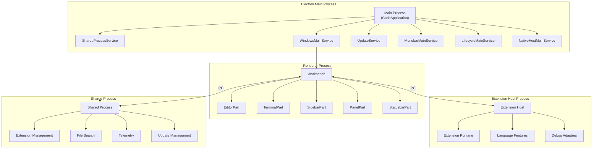

Sources:
- [src/vs/code/electron-main/app.ts:130-607]()
- [src/vs/platform/windows/electron-main/windowsMainService.ts:183-657]()
- [src/vs/platform/sharedProcess/electron-main/sharedProcess.ts:24-193]()

## Main Process

The main process is the entry point of the application and is responsible for coordinating the overall lifecycle of VS Code. It's implemented in the `CodeApplication` class.

### Responsibilities

- Application lifecycle management
- Window management
- Menu management
- Protocol handling
- Security policies enforcement
- IPC (Inter-Process Communication) coordination

### Key Components

1. **CodeApplication**: The core class that initializes and manages the application
2. **WindowsMainService**: Manages window creation, focus, and lifecycle
3. **LifecycleMainService**: Handles application startup and shutdown
4. **MenubarMainService**: Manages the application menu
5. **NativeHostMainService**: Provides native OS functionality
6. **SharedProcessService**: Manages the shared process

### Startup Sequence

1. The application starts in `main.ts` which creates a `CodeMain` instance
2. `CodeMain` initializes core services and claims the instance lock
3. `CodeApplication` is created and starts the application
4. Windows are opened based on command line arguments or previous session state

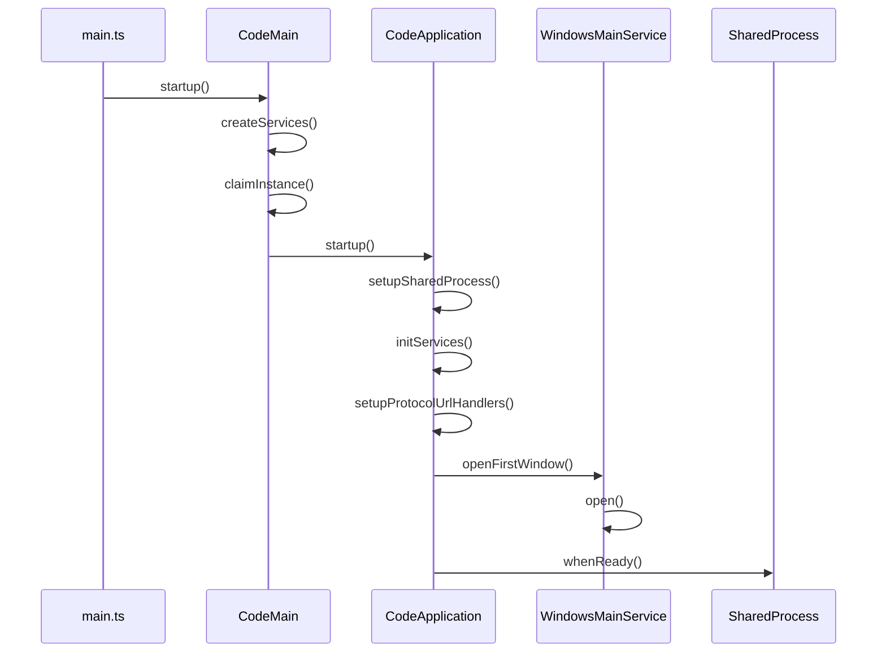

Sources:
- [src/vs/code/electron-main/main.ts:84-484]()
- [src/vs/code/electron-main/app.ts:522-620]()
- [src/vs/platform/windows/electron-main/windowsMainService.ts:272-450]()

## Renderer Process

The renderer process hosts the VS Code workbench UI and is responsible for rendering the user interface. Each window in VS Code has its own renderer process.

### Responsibilities

- Rendering the UI (workbench)
- Handling user interactions
- Managing editors and views
- Communicating with the extension host and shared process

### Key Components

1. **Workbench**: The main UI component that hosts all other UI parts
2. **EditorPart**: Manages editor groups and editors
3. **SidebarPart**: Hosts views like Explorer, Search, etc.
4. **PanelPart**: Hosts panels like Terminal, Output, etc.
5. **StatusbarPart**: Shows status information

### Window Implementation

The `CodeWindow` class (extending `BaseWindow`) represents a window in VS Code and manages the lifecycle of the renderer process associated with it.

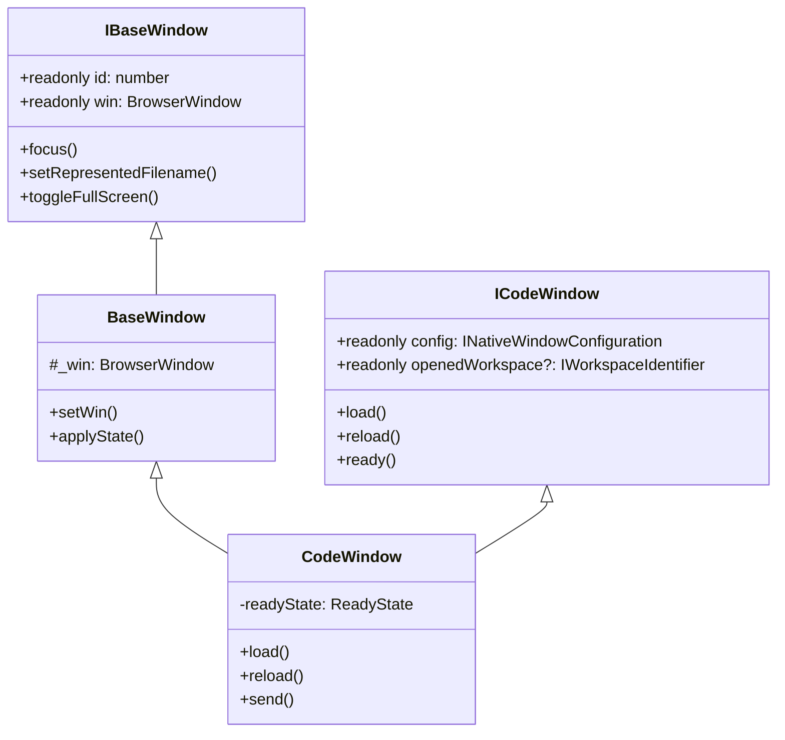

Sources:
- [src/vs/platform/window/electron-main/window.ts:16-83]()
- [src/vs/platform/windows/electron-main/windowImpl.ts:86-200]()
- [src/vs/platform/windows/electron-main/windowImpl.ts:1000-1100]()

## Extension Host Process

The extension host process runs extensions in isolation from the main UI to prevent extensions from affecting the stability of the editor.

### Responsibilities

- Running extension code in isolation
- Providing extension API
- Communicating with the renderer process
- Managing extension lifecycle

### Process Creation

Extensions run in a separate Node.js process that is spawned by the main process. This process communicates with the renderer process through an RPC protocol.

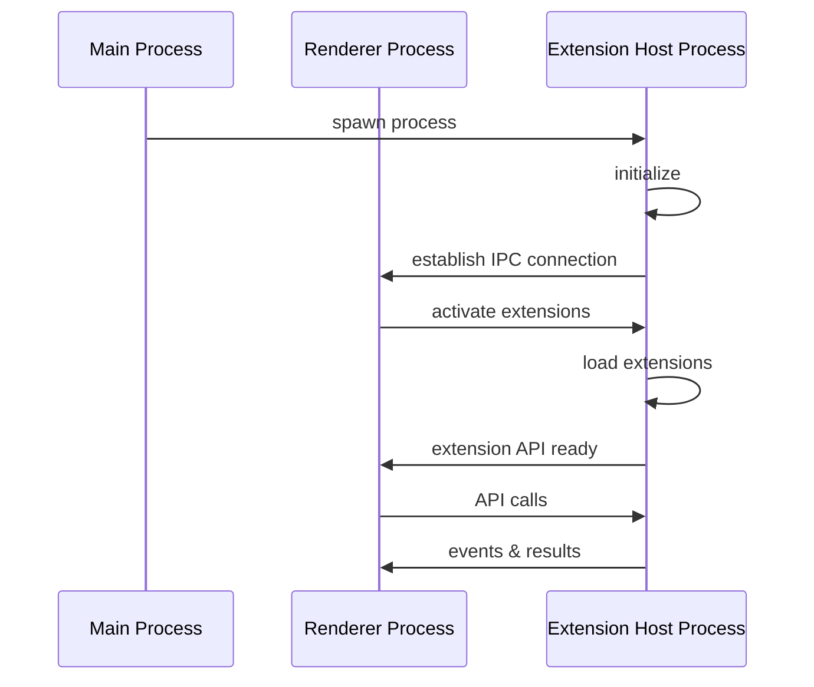

### Extension Isolation

The extension host provides a controlled environment for extensions to run in, with access to a specific set of APIs defined by VS Code. This isolation ensures that:

1. Extensions cannot crash the main editor
2. Extensions have limited access to the UI
3. Extensions run in a consistent environment

Sources:
- [src/vs/code/electron-main/app.ts:42-44]()
- [src/vs/platform/windows/electron-main/windowImpl.ts:252-269]()

## Shared Process

The shared process handles resource-intensive operations that are shared across multiple windows, such as extension management and file search.

### Responsibilities

- Extension management (installation, updates)
- File search and indexing
- Telemetry
- Update management

### Implementation

The shared process is implemented as a utility process that is spawned by the main process. It communicates with the renderer processes through IPC.

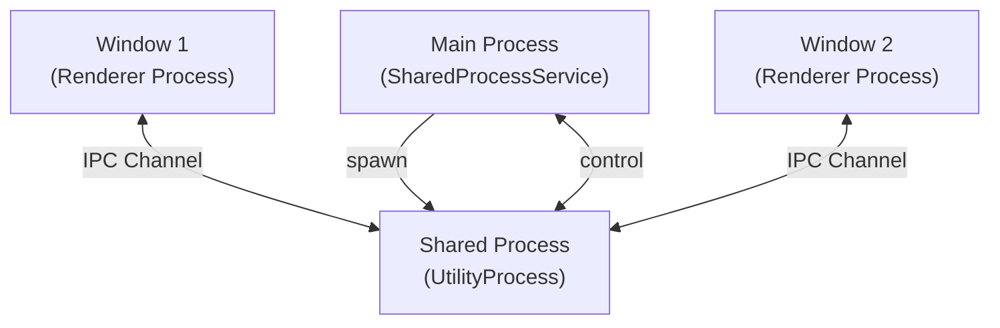

### Initialization

The shared process is initialized during the startup of the application:

1. The main process creates a `SharedProcess` instance
2. The shared process is spawned as a utility process
3. The shared process initializes its services
4. Windows connect to the shared process through IPC

Sources:
- [src/vs/platform/sharedProcess/electron-main/sharedProcess.ts:24-193]()
- [src/vs/code/electron-main/app.ts:573-574]()
- [src/vs/platform/sharedProcess/node/sharedProcess.ts:13-34]()

## Inter-Process Communication

VS Code uses several IPC mechanisms to enable communication between its different processes.

### IPC Channels

1. **Electron IPC**: Used for communication between the main process and renderer processes
2. **Node.js IPC**: Used for communication with the extension host and shared process
3. **Message Ports**: Used for high-performance communication between processes

### Main Process as Coordinator

The main process acts as a coordinator for IPC, setting up channels and routing messages between processes.

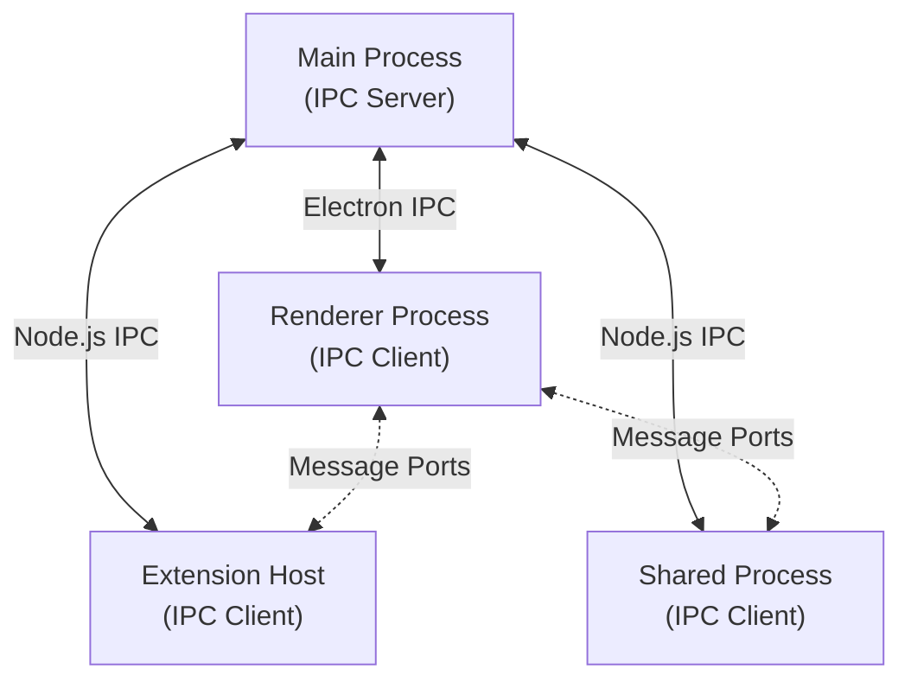

### Service Architecture

VS Code uses a service-oriented architecture where services are exposed through IPC channels. This allows services to be consumed across process boundaries.

Sources:
- [src/vs/code/electron-main/app.ts:551-561]()
- [src/vs/code/electron-main/app.ts:588-594]()
- [src/vs/platform/sharedProcess/electron-main/sharedProcess.ts:51-92]()

## Window Management

Window management is a core responsibility of the main process, handled primarily by the `WindowsMainService`.

### Window Creation

Windows are created through the `WindowsMainService`, which manages the lifecycle of all windows in the application.

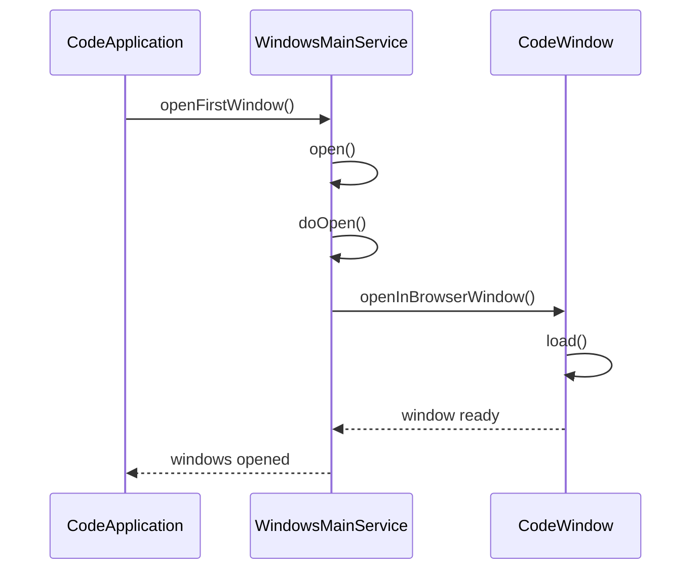

### Window States

Windows go through several states during their lifecycle:

1. **Creation**: Window is created but not yet loaded
2. **Loading**: Window is loading the workbench
3. **Ready**: Window is fully loaded and ready for user interaction
4. **Closing**: Window is in the process of closing

### Multi-Window Support

VS Code supports multiple windows, each with its own renderer process. The `WindowsMainService` keeps track of all open windows and manages focus, z-order, and window state.

Sources:
- [src/vs/platform/windows/electron-main/windowsMainService.ts:183-657]()
- [src/vs/platform/windows/electron-main/windows.ts:58-237]()
- [src/vs/platform/window/electron-main/window.ts:45-83]()

## Process Lifecycle Management

VS Code carefully manages the lifecycle of all its processes to ensure proper startup, shutdown, and resource management.

### Application Lifecycle

The `LifecycleMainService` manages the overall application lifecycle, including:

1. **Startup**: Initializing services and opening windows
2. **Running**: Managing the running application
3. **Shutdown**: Gracefully shutting down all processes

### Lifecycle Phases

The application goes through several phases during its lifecycle:

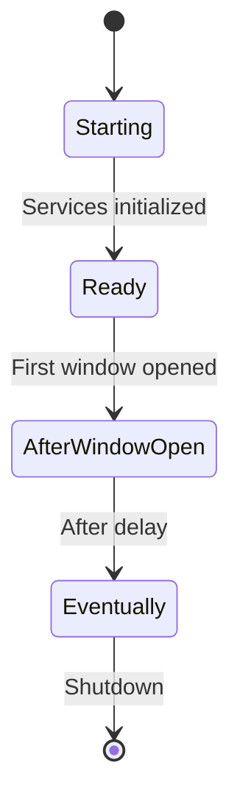

1. **Starting**: Application is initializing
2. **Ready**: Core services are initialized
3. **AfterWindowOpen**: First window is opened
4. **Eventually**: Application is fully initialized
5. **Shutdown**: Application is shutting down

### Process Coordination

During shutdown, processes are terminated in a coordinated manner:

1. Renderer processes are closed first
2. Extension host processes are terminated
3. Shared process is terminated
4. Main process exits

Sources:
- [src/vs/code/electron-main/app.ts:596-620]()
- [src/vs/code/electron-main/app.ts:374-386]()
- [src/vs/platform/windows/electron-main/windowImpl.ts:1000-1100]()

## Security Considerations

VS Code's multi-process architecture provides security benefits by isolating different components.

### Process Isolation

By running extensions in a separate process, VS Code prevents extensions from directly accessing the UI or other sensitive parts of the application.

### Content Security

The main process implements several security measures:

1. **Permission handling**: Controls what permissions are granted to web content
2. **Content filtering**: Blocks potentially dangerous content
3. **Protocol handling**: Securely handles custom protocols

### Sandbox

VS Code uses Electron's sandbox feature to restrict what renderer processes can do, providing an additional layer of security.

Sources:
- [src/vs/code/electron-main/app.ts:161-205]()
- [src/vs/code/electron-main/app.ts:267-320]()
- [src/vs/code/electron-main/app.ts:397-442]()

## Command Line Integration

VS Code supports being launched from the command line with various arguments. This is handled through a special CLI process.

### CLI Process

When VS Code is launched from the command line, a CLI process is created that communicates with the main process to handle the command.

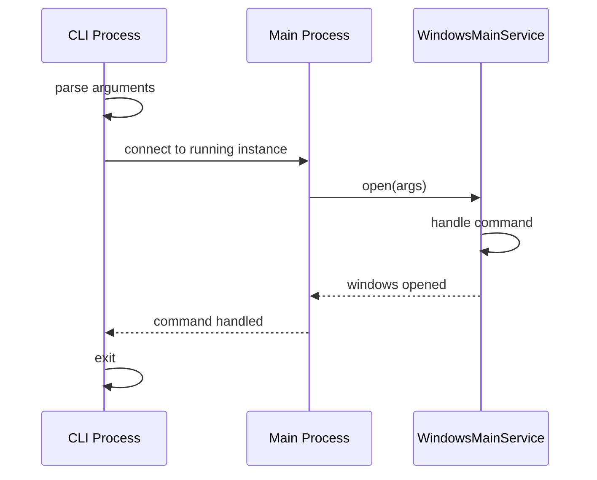

### Single Instance

VS Code ensures that only one instance of the application is running at a time. When a new instance is launched, it communicates with the existing instance and then exits.

Sources:
- [src/vs/code/node/cliProcessMain.ts:72-342]()
- [src/vs/code/electron-main/main.ts:291-419]()
- [src/vs/platform/launch/electron-main/launchMainService.ts:39-93]()

## Auxiliary Windows

VS Code supports auxiliary windows (like dialog windows) that are managed separately from the main application windows.

### Auxiliary Window Management

Auxiliary windows are managed by the `AuxiliaryWindowsMainService`, which handles their creation, focus, and lifecycle.

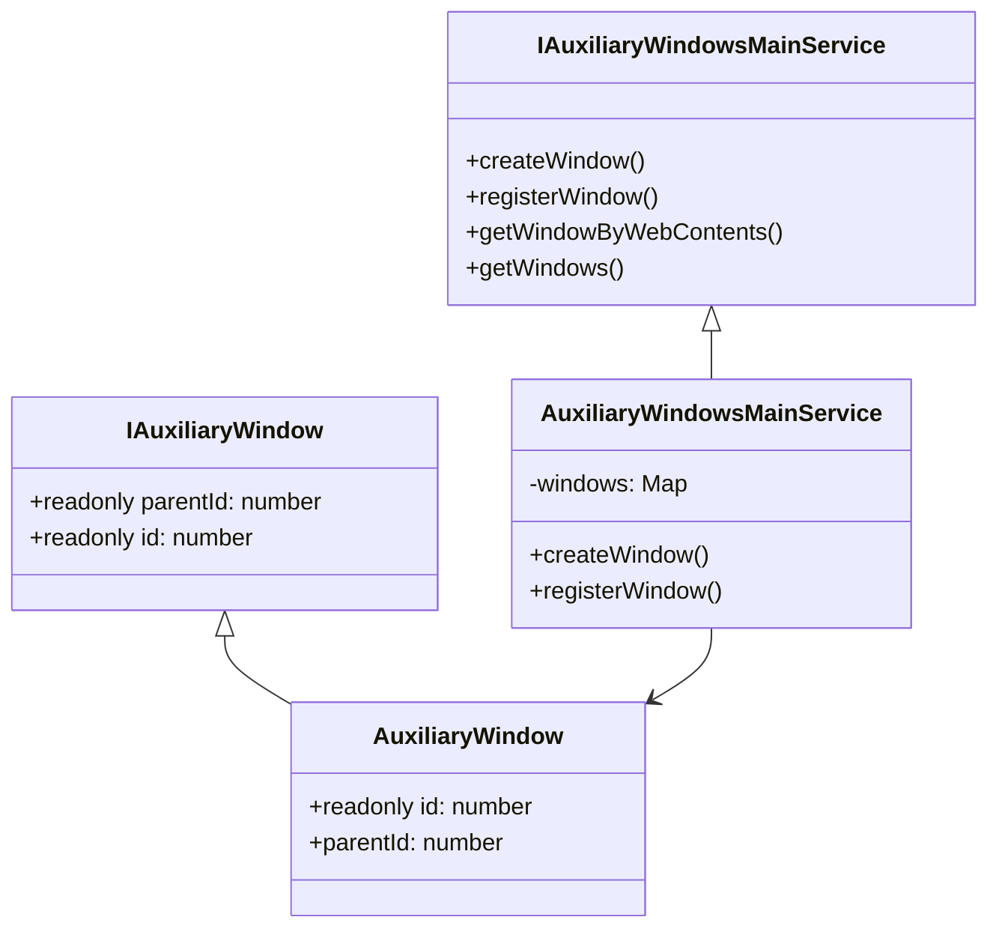

Sources:
- [src/vs/platform/auxiliaryWindow/electron-main/auxiliaryWindow.ts:17-67]()
- [src/vs/platform/auxiliaryWindow/electron-main/auxiliaryWindowsMainService.ts:18-36]()
- [src/vs/platform/auxiliaryWindow/electron-main/auxiliaryWindows.ts:13-32]()

## Summary

VS Code's multi-process architecture provides a robust foundation for the application, with clear separation of concerns between processes:

1. **Main Process**: Coordinates the application and manages windows
2. **Renderer Process**: Handles the UI and user interactions
3. **Extension Host Process**: Runs extensions in isolation
4. **Shared Process**: Handles shared operations across windows

This architecture enables VS Code to be stable, secure, and performant, while providing a rich platform for extensions.

| Process | Main Responsibilities | Key Components |
|---------|----------------------|----------------|
| Main Process | Application lifecycle, Window management | CodeApplication, WindowsMainService, LifecycleMainService |
| Renderer Process | UI rendering, User interaction | Workbench, EditorPart, SidebarPart |
| Extension Host | Running extensions, API provision | Extension Host, Extension Runtime |
| Shared Process | Shared operations, Resource management | Extension Management, File Search |

Sources:
- [src/vs/code/electron-main/app.ts:126-130]()
- [src/vs/platform/windows/electron-main/windowsMainService.ts:183-237]()
- [src/vs/platform/sharedProcess/electron-main/sharedProcess.ts:24-34]()1a:T329a,# Dependency Management and Build System

<details>
<summary>Relevant source files</summary>

The following files were used as context for generating this wiki page:

- [.npmrc](.npmrc)
- [build/.moduleignore](build/.moduleignore)
- [build/.webignore](build/.webignore)
- [build/azure-pipelines/linux/setup-env.sh](build/azure-pipelines/linux/setup-env.sh)
- [build/checksums/electron.txt](build/checksums/electron.txt)
- [build/checksums/nodejs.txt](build/checksums/nodejs.txt)
- [build/linux/debian/calculate-deps.js](build/linux/debian/calculate-deps.js)
- [build/linux/debian/calculate-deps.ts](build/linux/debian/calculate-deps.ts)
- [build/linux/debian/dep-lists.js](build/linux/debian/dep-lists.js)
- [build/linux/debian/dep-lists.ts](build/linux/debian/dep-lists.ts)
- [build/linux/dependencies-generator.js](build/linux/dependencies-generator.js)
- [build/linux/dependencies-generator.ts](build/linux/dependencies-generator.ts)
- [build/linux/rpm/dep-lists.js](build/linux/rpm/dep-lists.js)
- [build/linux/rpm/dep-lists.ts](build/linux/rpm/dep-lists.ts)
- [build/package.json](build/package.json)
- [cgmanifest.json](cgmanifest.json)
- [extensions/vscode-colorize-tests/src/colorizer.test.ts](extensions/vscode-colorize-tests/src/colorizer.test.ts)
- [package-lock.json](package-lock.json)
- [package.json](package.json)
- [remote/.npmrc](remote/.npmrc)
- [remote/package-lock.json](remote/package-lock.json)
- [remote/package.json](remote/package.json)
- [remote/web/package-lock.json](remote/web/package-lock.json)
- [remote/web/package.json](remote/web/package.json)
- [src/vs/editor/common/config/editorConfigurationSchema.ts](src/vs/editor/common/config/editorConfigurationSchema.ts)
- [src/vs/platform/environment/test/node/nativeModules.integrationTest.ts](src/vs/platform/environment/test/node/nativeModules.integrationTest.ts)
- [test/automation/package.json](test/automation/package.json)
- [test/integration/browser/package.json](test/integration/browser/package.json)
- [test/smoke/package.json](test/smoke/package.json)

</details>


This document details how VS Code manages its dependencies, builds the application, and packages it for different platforms. It covers the package management approach, build tools, and the process of creating distributable packages for Windows, macOS, and Linux.

## Overview

VS Code uses npm as its primary package manager and employs a multi-stage build system based on Gulp to compile, bundle, and package the application. The build system handles different target platforms (desktop, web, remote) and architectures (x64, arm64, etc.).

Sources:
- [package.json:1-241]()
- [.npmrc:1-8]()
- [remote/.npmrc:1-8]()

## Dependency Management

VS Code manages three distinct sets of dependencies across different package.json files:

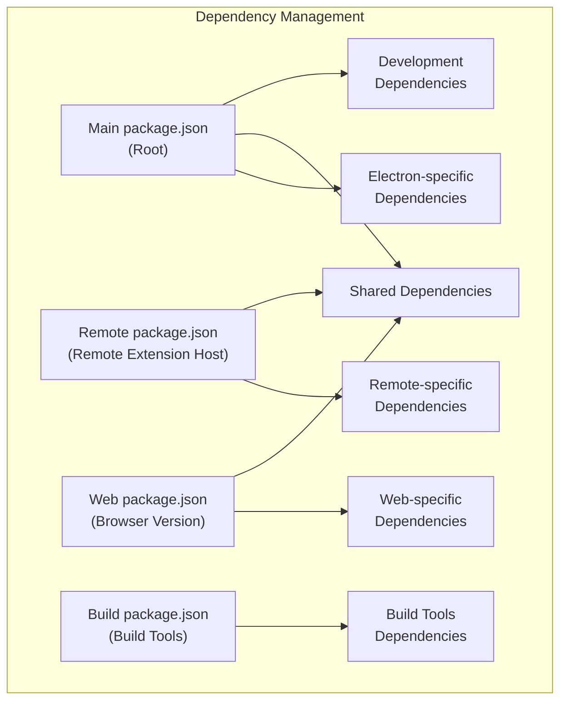

### Main Dependencies

The root `package.json` defines dependencies for the Electron-based desktop application. It includes:

1. **Runtime dependencies**: Libraries required for VS Code's functionality
2. **Native modules**: Platform-specific binary modules
3. **Development dependencies**: Tools for building, testing, and packaging

Key native modules include:
- `@vscode/spdlog`: Logging
- `@vscode/ripgrep`: Fast search
- `node-pty`: Terminal support
- `@vscode/sqlite3`: Database storage
- `native-keymap`: Keyboard handling
- `@parcel/watcher`: File system watching

Sources:
- [package.json:71-116]()
- [package.json:117-224]()
- [package.json:238-240]()

### Remote and Web Dependencies

Separate package.json files exist for:

1. **Remote Extension Host**: A subset of dependencies needed for VS Code's remote capabilities
2. **Web Version**: Dependencies for the browser-based version of VS Code

These package files include only the dependencies needed for their specific environments, avoiding unnecessary packages.

Sources:
- [remote/package.json:1-49]()
- [remote/web/package.json:1-25]()

### Dependency Overrides

VS Code uses the `overrides` field in package.json to enforce specific versions of transitive dependencies, ensuring compatibility and security:

```json
"overrides": {
  "node-gyp-build": "4.8.1",
  "kerberos@2.1.1": {
    "node-addon-api": "7.1.0"
  }
}
```

Sources:
- [package.json:225-230]()
- [remote/package.json:43-48]()

## Build System

VS Code uses a Gulp-based build system to handle the compilation, bundling, and packaging process.

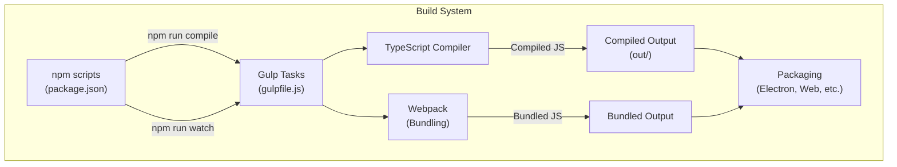

### Build Scripts

The main build commands are defined as npm scripts in package.json:

- `compile`: Compiles the entire codebase
- `watch`: Watches for changes and recompiles
- `compile-web`: Compiles for web target
- `compile-cli`: Compiles for CLI
- `minify-vscode`: Minifies the VS Code codebase
- `download-builtin-extensions`: Downloads built-in extensions

Sources:
- [package.json:12-69]()
- [build/package.json:61-65]()

### Build Tools

The build process relies on several tools:

1. **TypeScript**: Compiles TypeScript to JavaScript
2. **Gulp**: Orchestrates the build process
3. **Webpack**: Bundles modules for production
4. **Electron**: Packages the desktop application

The build tools themselves are defined as dependencies in the build/package.json file.

Sources:
- [build/package.json:5-69]()
- [package.json:117-224]()

### Build Variants

VS Code supports multiple build variants:

1. **Desktop (Electron)**: The standard desktop application
2. **Web**: Browser-based version
3. **Remote Extension Host**: For remote development scenarios

Each variant has specific compilation and packaging steps.

Sources:
- [package.json:50-62]()

## Native Module Management

VS Code depends on several native modules that require compilation for each platform and architecture.

```mermaid
graph TD
    subgraph "Native Module Management"
        PreInstall["preinstall<br>(build/npm/preinstall.js)"]
        PostInstall["postinstall<br>(build/npm/postinstall.js)"]
        
        PreInstall --> |"Platform Detection"| PlatformSetup["Platform Setup"]
        PostInstall --> |"Compile Native Modules"| NativeModules["Native Modules"]
        PostInstall --> |"Download Pre-built Binaries"| PrebuiltBinaries["Pre-built Binaries"]
        
        NativeModules --> ModuleCleanup["Module Cleanup<br>(.moduleignore)"]
        PrebuiltBinaries --> ModuleCleanup
        
        ModuleCleanup --> FinalPackage["Final Package"]
    end
```

### Native Module Compilation

Native modules are compiled during the `postinstall` phase using:

1. **node-gyp**: For compiling C/C++ modules
2. **Electron's headers**: To ensure compatibility with Electron's Node.js version

The `.npmrc` file configures the build environment for native modules:

```
disturl="https://electronjs.org/headers"
target="34.4.1"
ms_build_id="11317338"
runtime="electron"
build_from_source="true"
```

Sources:
- [.npmrc:1-8]()
- [package.json:18-19]()
- [build/.moduleignore:1-189]()

### Native Module Cleanup

After installation, unnecessary files from native modules are removed using the `.moduleignore` file, which specifies patterns for files to exclude from the final package.

Sources:
- [build/.moduleignore:1-189]()
- [build/.webignore:1-60]()

## Platform-Specific Packaging

VS Code is packaged for multiple platforms, each with its own requirements and dependencies.

```mermaid
graph TD
    subgraph "Platform Packaging"
        BuildProcess["Build Process"]
        
        BuildProcess --> WindowsPackaging["Windows Packaging<br>(NSIS, MSI)"]
        BuildProcess --> MacOSPackaging["macOS Packaging<br>(DMG, PKG)"]
        BuildProcess --> LinuxPackaging["Linux Packaging<br>(deb, rpm, snap)"]
        
        WindowsPackaging --> WindowsInstallers["Windows Installers"]
        MacOSPackaging --> MacOSInstallers["macOS Installers"]
        LinuxPackaging --> LinuxPackages["Linux Packages"]
        
        LinuxPackaging --> DebDependencies["Debian Dependencies"]
        LinuxPackaging --> RPMDependencies["RPM Dependencies"]
    end
```

### Linux Packaging

For Linux, VS Code generates both Debian (.deb) and RPM (.rpm) packages with appropriate dependencies.

#### Debian Dependencies

Debian packages require a list of dependencies that VS Code needs to run. These are calculated based on:

1. **Generated dependencies**: Determined by analyzing binary files
2. **Additional dependencies**: Manually specified dependencies

Sources:
- [build/linux/debian/dep-lists.ts:1-141]()
- [build/linux/debian/calculate-deps.ts:1-20]()
- [build/linux/dependencies-generator.ts:1-20]()

#### RPM Dependencies

Similar to Debian, RPM packages have their own dependency format and requirements.

Sources:
- [build/linux/rpm/dep-lists.ts:1-140]()
- [build/linux/rpm/dep-lists.js:1-140]()

### Windows and macOS Packaging

For Windows, VS Code uses:
- Inno Setup for creating installers
- Electron's packaging capabilities

For macOS:
- DMG creation tools
- Code signing for notarization

Sources:
- [cgmanifest.json:538-562]()

## Electron and Node.js Integration

VS Code is built on Electron, which combines Chromium and Node.js.

```mermaid
graph TD
    subgraph "Electron Integration"
        VSCode["VS Code Application"]
        
        VSCode --> Electron["Electron v34.4.1"]
        
        Electron --> Chromium["Chromium<br>v132.0.6834.210"]
        Electron --> NodeJS["Node.js<br>v20.18.3"]
        
        Chromium --> V8["V8 JavaScript Engine"]
        NodeJS --> V8
        
        VSCode --> NativeModules["Native Modules"]
        NativeModules --> NodeJS
    end
```

### Electron Version Management

VS Code tracks specific versions of Electron to ensure stability and compatibility:

- The Electron version is specified in `.npmrc` and package.json
- Checksums for Electron binaries are stored in `build/checksums/electron.txt`

Sources:
- [.npmrc:1-3]()
- [package.json:158]()
- [build/checksums/electron.txt:1-75]()

### Node.js Version Management

For the remote extension host, VS Code uses a specific Node.js version:

- The Node.js version is specified in `remote/.npmrc`
- Checksums for Node.js binaries are stored in `build/checksums/nodejs.txt`

Sources:
- [remote/.npmrc:1-3]()
- [build/checksums/nodejs.txt:1-8]()
- [cgmanifest.json:517-524]()

## Testing Infrastructure

VS Code includes several test suites that depend on the build system:

1. **Unit tests**: For testing individual components
2. **Integration tests**: For testing component interactions
3. **Smoke tests**: For testing the full application
4. **Browser tests**: For testing the web version

Each test suite has its own dependencies and build requirements.

Sources:
- [package.json:13-17]()
- [test/smoke/package.json:1-26]()
- [test/automation/package.json:1-34]()
- [test/integration/browser/package.json:1-18]()

## Third-Party Dependencies

VS Code tracks third-party dependencies in `cgmanifest.json`, which includes:

1. **Chromium**: The browser engine
2. **Node.js**: The JavaScript runtime
3. **Electron**: The application framework
4. **FFmpeg**: For media support
5. **Inno Setup**: For Windows installers

Sources:
- [cgmanifest.json:1-486]()

## Conclusion

VS Code's dependency management and build system is designed to handle multiple platforms, architectures, and deployment scenarios. It uses a combination of npm, Gulp, and platform-specific tools to create optimized packages for each target environment.

The system is highly configurable and extensible, allowing for different build variants and packaging options while maintaining a consistent development experience across platforms.1b:T508b,# Core Services and Components

<details>
<summary>Relevant source files</summary>

The following files were used as context for generating this wiki page:

- [src/vs/platform/configuration/common/configuration.ts](src/vs/platform/configuration/common/configuration.ts)
- [src/vs/platform/configuration/common/configurationModels.ts](src/vs/platform/configuration/common/configurationModels.ts)
- [src/vs/platform/configuration/common/configurationRegistry.ts](src/vs/platform/configuration/common/configurationRegistry.ts)
- [src/vs/platform/configuration/common/configurationService.ts](src/vs/platform/configuration/common/configurationService.ts)
- [src/vs/platform/configuration/test/common/configurationModels.test.ts](src/vs/platform/configuration/test/common/configurationModels.test.ts)
- [src/vs/platform/configuration/test/common/configurationRegistry.test.ts](src/vs/platform/configuration/test/common/configurationRegistry.test.ts)
- [src/vs/platform/configuration/test/common/configurationService.test.ts](src/vs/platform/configuration/test/common/configurationService.test.ts)
- [src/vs/platform/configuration/test/common/configurations.test.ts](src/vs/platform/configuration/test/common/configurations.test.ts)
- [src/vs/platform/userData/common/fileUserDataProvider.ts](src/vs/platform/userData/common/fileUserDataProvider.ts)
- [src/vs/platform/userData/test/browser/fileUserDataProvider.test.ts](src/vs/platform/userData/test/browser/fileUserDataProvider.test.ts)
- [src/vs/workbench/api/browser/mainThreadConfiguration.ts](src/vs/workbench/api/browser/mainThreadConfiguration.ts)
- [src/vs/workbench/api/common/configurationExtensionPoint.ts](src/vs/workbench/api/common/configurationExtensionPoint.ts)
- [src/vs/workbench/api/common/extHostConfiguration.ts](src/vs/workbench/api/common/extHostConfiguration.ts)
- [src/vs/workbench/api/test/browser/extHostConfiguration.test.ts](src/vs/workbench/api/test/browser/extHostConfiguration.test.ts)
- [src/vs/workbench/services/configuration/browser/configuration.ts](src/vs/workbench/services/configuration/browser/configuration.ts)
- [src/vs/workbench/services/configuration/browser/configurationService.ts](src/vs/workbench/services/configuration/browser/configurationService.ts)
- [src/vs/workbench/services/configuration/common/configuration.ts](src/vs/workbench/services/configuration/common/configuration.ts)
- [src/vs/workbench/services/configuration/common/configurationModels.ts](src/vs/workbench/services/configuration/common/configurationModels.ts)
- [src/vs/workbench/services/configuration/test/browser/configuration.test.ts](src/vs/workbench/services/configuration/test/browser/configuration.test.ts)
- [src/vs/workbench/services/configuration/test/browser/configurationService.test.ts](src/vs/workbench/services/configuration/test/browser/configurationService.test.ts)
- [src/vs/workbench/services/configuration/test/common/configurationModels.test.ts](src/vs/workbench/services/configuration/test/common/configurationModels.test.ts)
- [src/vs/workbench/services/keybinding/test/browser/keybindingEditing.test.ts](src/vs/workbench/services/keybinding/test/browser/keybindingEditing.test.ts)

</details>


This document provides an overview of the core services and components that form the foundation of VS Code's architecture. It focuses on the configuration system, service infrastructure, and other essential components that enable VS Code's functionality.

For information about the Monaco Editor, see [Monaco Editor](#3). For details on the Extension System, see [Extension System](#4).

## Configuration System Architecture

VS Code's configuration system is a sophisticated framework that manages settings across multiple scopes and sources. It provides a unified way to access and modify configuration values while respecting priorities between different configuration sources.

### Configuration Sources and Hierarchy

The configuration system combines settings from multiple sources in a specific order of precedence:

```mermaid
flowchart TD
    subgraph "Configuration Sources"
        direction TB
        DefaultConfig["Default Configuration\n(DefaultConfiguration)"]
        PolicyConfig["Policy Configuration\n(PolicyConfiguration)"]
        ApplicationConfig["Application Configuration\n(ApplicationConfiguration)"]
        UserLocalConfig["User Local Configuration\n(UserConfiguration)"]
        UserRemoteConfig["Remote User Configuration\n(RemoteUserConfiguration)"]
        WorkspaceConfig["Workspace Configuration\n(WorkspaceConfiguration)"]
        FolderConfig["Folder Configuration\n(FolderConfiguration)"]
        MemoryConfig["Memory Configuration"]
    end

    DefaultConfig --> PolicyConfig
    PolicyConfig --> ApplicationConfig
    ApplicationConfig --> UserLocalConfig
    UserLocalConfig --> UserRemoteConfig
    UserRemoteConfig --> WorkspaceConfig
    WorkspaceConfig --> FolderConfig
    FolderConfig --> MemoryConfig

    subgraph "Overrides"
        LanguageOverrides["Language-specific Overrides\n([language])"]
    end

    MemoryConfig -.-> LanguageOverrides
```

Sources (from lowest to highest precedence):
1. **Default Configuration**: Built-in default values for all settings
2. **Policy Configuration**: Settings enforced by system policies
3. **Application Configuration**: Settings applied to all profiles
4. **User Configuration**: User settings (local and remote)
5. **Workspace Configuration**: Settings specific to a workspace
6. **Folder Configuration**: Settings specific to a workspace folder
7. **Memory Configuration**: Temporary in-memory settings

Sources: [src/vs/workbench/services/configuration/browser/configurationService.ts:62-170](). [src/vs/platform/configuration/common/configurationModels.ts:29-296]().

### Configuration Scopes

Each configuration property has a scope that determines where it can be set:

```mermaid
flowchart TD
    subgraph "Configuration Scopes"
        APPLICATION["APPLICATION\nApplication-wide settings"]
        MACHINE["MACHINE\nMachine-specific settings"]
        APPLICATION_MACHINE["APPLICATION_MACHINE\nApplication settings for machine"]
        WINDOW["WINDOW\nWindow-level settings"]
        RESOURCE["RESOURCE\nResource-specific settings"]
        LANGUAGE_OVERRIDABLE["LANGUAGE_OVERRIDABLE\nLanguage-specific settings"]
        MACHINE_OVERRIDABLE["MACHINE_OVERRIDABLE\nMachine settings that can be overridden"]
    end

    subgraph "Configuration Targets"
        DEFAULT["DEFAULT\nDefault values"]
        USER["USER\nUser settings"]
        USER_LOCAL["USER_LOCAL\nLocal user settings"]
        USER_REMOTE["USER_REMOTE\nRemote user settings"]
        WORKSPACE["WORKSPACE\nWorkspace settings"]
        WORKSPACE_FOLDER["WORKSPACE_FOLDER\nWorkspace folder settings"]
        MEMORY["MEMORY\nIn-memory settings"]
    end
```

Sources: [src/vs/platform/configuration/common/configurationRegistry.ts:128-157](). [src/vs/workbench/services/configuration/common/configuration.ts:28-35]().

### Configuration Models

The configuration system uses a series of model classes to represent and manage configuration data:

```mermaid
classDiagram
    class ConfigurationModel {
        +contents: any
        +keys: string[]
        +overrides: IOverrides[]
        +getValue(section)
        +inspect(section, overrideIdentifier)
        +override(identifier)
        +merge(others)
    }
    
    class Configuration {
        -defaultConfiguration: ConfigurationModel
        -policyConfiguration: ConfigurationModel
        -applicationConfiguration: ConfigurationModel
        -userLocalConfiguration: ConfigurationModel
        -userRemoteConfiguration: ConfigurationModel
        -workspaceConfiguration: ConfigurationModel
        -folderConfigurations: Map
        -memoryConfiguration: ConfigurationModel
        +getValue(key, overrides)
        +inspect(key, overrides)
        +updateValue(key, value, target)
    }
    
    class ConfigurationModelParser {
        +parse(content, options)
        +configurationModel: ConfigurationModel
    }
    
    ConfigurationModel <-- Configuration
    ConfigurationModelParser --> ConfigurationModel
```

Sources: [src/vs/platform/configuration/common/configurationModels.ts:29-296](). [src/vs/workbench/services/configuration/common/configurationModels.ts:97-172]().

### WorkspaceService

The `WorkspaceService` is the central implementation of the configuration system in VS Code. It implements both `IWorkspaceContextService` and `IWorkbenchConfigurationService` interfaces, providing workspace information and configuration management.

```mermaid
classDiagram
    class WorkspaceService {
        -workspace: Workspace
        -configuration: Configuration
        -defaultConfiguration: DefaultConfiguration
        -policyConfiguration: IPolicyConfiguration
        -applicationConfiguration: ApplicationConfiguration
        -localUserConfiguration: UserConfiguration
        -remoteUserConfiguration: RemoteUserConfiguration
        -workspaceConfiguration: WorkspaceConfiguration
        -cachedFolderConfigs: ResourceMap
        +getWorkspace()
        +getWorkbenchState()
        +getValue(section, overrides)
        +updateValue(key, value, target)
        +reloadConfiguration()
    }
    
    class IWorkspaceContextService {
        +getWorkspace()
        +getWorkbenchState()
        +getWorkspaceFolder(resource)
        +isInsideWorkspace(resource)
    }
    
    class IWorkbenchConfigurationService {
        +getValue(section, overrides)
        +updateValue(key, value, target)
        +inspect(key, overrides)
        +restrictedSettings
        +onDidChangeRestrictedSettings
    }
    
    IWorkspaceContextService <|-- WorkspaceService
    IWorkbenchConfigurationService <|-- WorkspaceService
```

Sources: [src/vs/workbench/services/configuration/browser/configurationService.ts:62-170](). [src/vs/workbench/services/configuration/common/configuration.ts:68-97]().

## Configuration Registration and Extension Points

VS Code uses a registry pattern to manage configuration properties and their metadata.

### Configuration Registry

The `ConfigurationRegistry` maintains a registry of all configuration properties, their schemas, and default values:

```mermaid
classDiagram
    class IConfigurationRegistry {
        +registerConfiguration(configuration)
        +registerConfigurations(configurations)
        +registerDefaultConfigurations(defaults)
        +getConfigurationProperties()
        +onDidUpdateConfiguration
    }
    
    class ConfigurationRegistry {
        -configurationProperties: Map
        -configurationDefaultsOverrides: Map
        -configurationContributors: IConfigurationNode[]
        +registerConfiguration(configuration)
        +registerDefaultConfigurations(defaults)
        +deltaConfiguration(delta)
    }
    
    IConfigurationRegistry <|-- ConfigurationRegistry
```

Sources: [src/vs/platform/configuration/common/configurationRegistry.ts:34-116](). [src/vs/platform/configuration/common/configurationRegistry.ts:276-307]().

### Extension Points for Configuration

VS Code provides extension points that allow extensions to contribute configuration properties and default values:

```mermaid
flowchart TD
    subgraph "Extension Points"
        ConfigEP["configuration\nContributes configuration properties"]
        DefaultsEP["configurationDefaults\nContributes default values"]
    end
    
    subgraph "Configuration Registry"
        Registry["ConfigurationRegistry"]
    end
    
    ConfigEP --> Registry
    DefaultsEP --> Registry
    
    subgraph "Extension Host"
        ExtConfig["ExtHostConfiguration\nProvides configuration to extensions"]
    end
    
    Registry --> ExtConfig
```

Sources: [src/vs/workbench/api/common/configurationExtensionPoint.ts:138-306](). [src/vs/workbench/api/common/extHostConfiguration.ts:97-132]().

## Service Infrastructure

VS Code uses a service-based architecture with dependency injection to manage components and their dependencies.

### Service Instantiation

The instantiation service is responsible for creating and managing service instances:

```mermaid
classDiagram
    class IInstantiationService {
        +createInstance(ctor, ...args)
        +invokeFunction(fn, ...args)
        +createChild(services)
    }
    
    class InstantiationService {
        -_services: Map
        -_strict: boolean
        +createInstance(ctor, ...args)
        +invokeFunction(fn, ...args)
        -_createInstance(ctor, args)
        -_getServiceDependencies(ctor)
    }
    
    IInstantiationService <|-- InstantiationService
```

Sources: [src/vs/workbench/services/configuration/browser/configurationService.ts:492-495]().

### Service Decorators

VS Code uses TypeScript decorators to define service dependencies:

```typescript
// Service interface declaration with decorator
export const IConfigurationService = createDecorator<IConfigurationService>('configurationService');

// Service implementation with dependencies
class ConfigurationService implements IConfigurationService {
    constructor(
        @IFileService private readonly fileService: IFileService,
        @ILogService private readonly logService: ILogService
    ) { /* ... */ }
}
```

Sources: [src/vs/platform/configuration/common/configuration.ts:14-15](). [src/vs/platform/configuration/common/configurationService.ts:42-48]().

## Configuration Access Patterns

### Accessing Configuration Values

VS Code provides several ways to access configuration values:

1. **Direct access through IConfigurationService**:
   ```typescript
   const value = configurationService.getValue('editor.fontSize');
   ```

2. **Scoped access with overrides**:
   ```typescript
   const value = configurationService.getValue('editor.fontSize', { resource: uri });
   ```

3. **Inspecting configuration**:
   ```typescript
   const inspect = configurationService.inspect('editor.fontSize');
   // Access specific layers: inspect.defaultValue, inspect.userValue, etc.
   ```

Sources: [src/vs/platform/configuration/common/configuration.ts:165-168](). [src/vs/workbench/services/configuration/browser/configurationService.ts:323-332]().

### Updating Configuration Values

Configuration values can be updated at different targets:

```typescript
// Update user settings
configurationService.updateValue('editor.fontSize', 14, ConfigurationTarget.USER);

// Update workspace settings
configurationService.updateValue('editor.fontSize', 14, ConfigurationTarget.WORKSPACE);

// Update folder settings
configurationService.updateValue('editor.fontSize', 14, 
    { resource: folderUri }, ConfigurationTarget.WORKSPACE_FOLDER);
```

Sources: [src/vs/platform/configuration/common/configuration.ts:188-192](). [src/vs/workbench/services/configuration/browser/configurationService.ts:334-363]().

## Configuration Change Events

The configuration system provides events to notify components when configuration changes:

```mermaid
sequenceDiagram
    participant User
    participant ConfigService as ConfigurationService
    participant Component as Component
    
    Component->>ConfigService: onDidChangeConfiguration(handler)
    User->>ConfigService: updateValue('setting', value)
    ConfigService->>ConfigService: _onDidChangeConfiguration.fire(event)
    ConfigService->>Component: handler(event)
    Component->>ConfigService: event.affectsConfiguration('setting')
```

Sources: [src/vs/platform/configuration/common/configuration.ts:66-73](). [src/vs/workbench/services/configuration/browser/configurationService.ts:83-86]().

## Configuration Storage

VS Code stores configuration in different locations based on their scope:

| Configuration Type | Storage Location | Format |
|-------------------|------------------|--------|
| Default Configuration | In-memory | JSON |
| User Configuration | `settings.json` in user data directory | JSON |
| Workspace Configuration | `.vscode/settings.json` in workspace | JSON |
| Folder Configuration | `.vscode/settings.json` in folder | JSON |

Sources: [src/vs/workbench/services/configuration/browser/configuration.ts:123-172](). [src/vs/workbench/services/configuration/common/configuration.ts:14-18]().

## Restricted Settings

VS Code supports the concept of restricted settings, which are only applied when the workspace is trusted:

```mermaid
flowchart TD
    Setting["Configuration Setting"] --> IsRestricted{"Is restricted?"}
    IsRestricted -->|Yes| IsTrusted{"Is workspace trusted?"}
    IsRestricted -->|No| Apply["Apply setting"]
    IsTrusted -->|Yes| Apply
    IsTrusted -->|No| Skip["Skip setting"]
```

Sources: [src/vs/workbench/services/configuration/browser/configurationService.ts:451-490](). [src/vs/platform/configuration/common/configurationRegistry.ts:167-169]().

## Configuration Caching

VS Code caches configuration to improve performance, especially for remote workspaces:

```mermaid
flowchart TD
    Start["Load configuration"] --> HasCache{"Cache exists?"}
    HasCache -->|Yes| LoadCache["Load from cache"]
    HasCache -->|No| LoadFiles["Load from files"]
    LoadCache --> NeedsRefresh{"Needs refresh?"}
    NeedsRefresh -->|Yes| LoadFiles
    NeedsRefresh -->|No| UseCache["Use cached configuration"]
    LoadFiles --> UpdateCache["Update cache"]
    UpdateCache --> Done["Configuration loaded"]
    UseCache --> Done
```

Sources: [src/vs/workbench/services/configuration/browser/configurationService.ts:606-631](). [src/vs/workbench/services/configuration/common/configuration.ts:50-56]().

## Integration with Extension Host

VS Code's configuration system integrates with the extension host to provide configuration to extensions:

```mermaid
sequenceDiagram
    participant Main as Main Thread
    participant ExtHost as Extension Host
    participant Extension as Extension
    
    Main->>ExtHost: $initializeConfiguration(data)
    ExtHost->>ExtHost: Create ExtHostConfigProvider
    Extension->>ExtHost: getConfiguration()
    ExtHost->>Extension: Return WorkspaceConfiguration
    Extension->>ExtHost: config.get('setting')
    ExtHost->>Extension: Return setting value
    Extension->>ExtHost: config.update('setting', value)
    ExtHost->>Main: $updateConfigurationOption(target, key, value)
    Main->>ExtHost: $acceptConfigurationChanged(data, change)
    ExtHost->>Extension: onDidChangeConfiguration event
```

Sources: [src/vs/workbench/api/common/extHostConfiguration.ts:97-132](). [src/vs/workbench/api/browser/mainThreadConfiguration.ts:16-48]().

## Key Components and Services

### WorkspaceService

The `WorkspaceService` is the central implementation of both workspace context and configuration services. It manages:

1. Workspace information (folders, state)
2. Configuration from multiple sources
3. Configuration change events
4. Workspace trust state

Sources: [src/vs/workbench/services/configuration/browser/configurationService.ts:62-170]().

### ConfigurationRegistry

The `ConfigurationRegistry` maintains the registry of all configuration properties, their schemas, and default values. It handles:

1. Registration of configuration properties
2. Registration of default values
3. Schema validation
4. Configuration property overrides

Sources: [src/vs/platform/configuration/common/configurationRegistry.ts:276-307]().

### Configuration Models

Several model classes represent configuration data:

1. `ConfigurationModel`: Represents a single layer of configuration
2. `Configuration`: Combines multiple configuration models with proper precedence
3. `ConfigurationModelParser`: Parses configuration from JSON

Sources: [src/vs/platform/configuration/common/configurationModels.ts:29-296](). [src/vs/workbench/services/configuration/common/configurationModels.ts:97-172]().

### Configuration Editing

The `ConfigurationEditing` service provides functionality to edit configuration files:

1. Update configuration values in the appropriate file
2. Handle file format and JSON structure
3. Validate changes against schemas

Sources: [src/vs/workbench/services/keybinding/test/browser/keybindingEditing.test.ts:80-81]().

## Conclusion

VS Code's configuration system is a sophisticated framework that manages settings across multiple scopes and sources. It provides a unified way to access and modify configuration values while respecting priorities between different configuration sources. The system is designed to be extensible, allowing extensions to contribute their own configuration properties and default values.

The core services and components described in this document form the foundation of VS Code's architecture, enabling its rich functionality and extensibility.1c:T65ea,# Configuration System

<details>
<summary>Relevant source files</summary>

The following files were used as context for generating this wiki page:

- [.npmrc](.npmrc)
- [build/.moduleignore](build/.moduleignore)
- [build/.webignore](build/.webignore)
- [build/azure-pipelines/linux/setup-env.sh](build/azure-pipelines/linux/setup-env.sh)
- [build/checksums/electron.txt](build/checksums/electron.txt)
- [build/checksums/nodejs.txt](build/checksums/nodejs.txt)
- [build/linux/debian/calculate-deps.js](build/linux/debian/calculate-deps.js)
- [build/linux/debian/calculate-deps.ts](build/linux/debian/calculate-deps.ts)
- [build/linux/debian/dep-lists.js](build/linux/debian/dep-lists.js)
- [build/linux/debian/dep-lists.ts](build/linux/debian/dep-lists.ts)
- [build/linux/dependencies-generator.js](build/linux/dependencies-generator.js)
- [build/linux/dependencies-generator.ts](build/linux/dependencies-generator.ts)
- [build/linux/rpm/dep-lists.js](build/linux/rpm/dep-lists.js)
- [build/linux/rpm/dep-lists.ts](build/linux/rpm/dep-lists.ts)
- [build/package.json](build/package.json)
- [cgmanifest.json](cgmanifest.json)
- [extensions/vscode-colorize-tests/src/colorizer.test.ts](extensions/vscode-colorize-tests/src/colorizer.test.ts)
- [package-lock.json](package-lock.json)
- [package.json](package.json)
- [remote/.npmrc](remote/.npmrc)
- [remote/package-lock.json](remote/package-lock.json)
- [remote/package.json](remote/package.json)
- [remote/web/package-lock.json](remote/web/package-lock.json)
- [remote/web/package.json](remote/web/package.json)
- [src/vs/editor/common/config/editorConfigurationSchema.ts](src/vs/editor/common/config/editorConfigurationSchema.ts)
- [src/vs/platform/configuration/common/configuration.ts](src/vs/platform/configuration/common/configuration.ts)
- [src/vs/platform/configuration/common/configurationModels.ts](src/vs/platform/configuration/common/configurationModels.ts)
- [src/vs/platform/configuration/common/configurationRegistry.ts](src/vs/platform/configuration/common/configurationRegistry.ts)
- [src/vs/platform/configuration/common/configurationService.ts](src/vs/platform/configuration/common/configurationService.ts)
- [src/vs/platform/configuration/test/common/configurationModels.test.ts](src/vs/platform/configuration/test/common/configurationModels.test.ts)
- [src/vs/platform/configuration/test/common/configurationRegistry.test.ts](src/vs/platform/configuration/test/common/configurationRegistry.test.ts)
- [src/vs/platform/configuration/test/common/configurationService.test.ts](src/vs/platform/configuration/test/common/configurationService.test.ts)
- [src/vs/platform/configuration/test/common/configurations.test.ts](src/vs/platform/configuration/test/common/configurations.test.ts)
- [src/vs/platform/environment/test/node/nativeModules.integrationTest.ts](src/vs/platform/environment/test/node/nativeModules.integrationTest.ts)
- [src/vs/platform/userData/common/fileUserDataProvider.ts](src/vs/platform/userData/common/fileUserDataProvider.ts)
- [src/vs/platform/userData/test/browser/fileUserDataProvider.test.ts](src/vs/platform/userData/test/browser/fileUserDataProvider.test.ts)
- [src/vs/workbench/api/browser/mainThreadConfiguration.ts](src/vs/workbench/api/browser/mainThreadConfiguration.ts)
- [src/vs/workbench/api/common/configurationExtensionPoint.ts](src/vs/workbench/api/common/configurationExtensionPoint.ts)
- [src/vs/workbench/api/common/extHostConfiguration.ts](src/vs/workbench/api/common/extHostConfiguration.ts)
- [src/vs/workbench/api/test/browser/extHostConfiguration.test.ts](src/vs/workbench/api/test/browser/extHostConfiguration.test.ts)
- [src/vs/workbench/services/configuration/browser/configuration.ts](src/vs/workbench/services/configuration/browser/configuration.ts)
- [src/vs/workbench/services/configuration/browser/configurationService.ts](src/vs/workbench/services/configuration/browser/configurationService.ts)
- [src/vs/workbench/services/configuration/common/configuration.ts](src/vs/workbench/services/configuration/common/configuration.ts)
- [src/vs/workbench/services/configuration/common/configurationModels.ts](src/vs/workbench/services/configuration/common/configurationModels.ts)
- [src/vs/workbench/services/configuration/test/browser/configuration.test.ts](src/vs/workbench/services/configuration/test/browser/configuration.test.ts)
- [src/vs/workbench/services/configuration/test/browser/configurationService.test.ts](src/vs/workbench/services/configuration/test/browser/configurationService.test.ts)
- [src/vs/workbench/services/configuration/test/common/configurationModels.test.ts](src/vs/workbench/services/configuration/test/common/configurationModels.test.ts)
- [src/vs/workbench/services/keybinding/test/browser/keybindingEditing.test.ts](src/vs/workbench/services/keybinding/test/browser/keybindingEditing.test.ts)
- [test/automation/package.json](test/automation/package.json)
- [test/integration/browser/package.json](test/integration/browser/package.json)
- [test/smoke/package.json](test/smoke/package.json)

</details>


The VS Code Configuration System manages settings across different scopes and sources, providing a unified way to access and modify configuration values throughout the application. This system is responsible for loading, merging, and providing access to settings from various sources such as user settings, workspace settings, and default settings.

This page focuses on the core configuration architecture and how settings are managed internally. For information about extension configuration contributions, see [Extension System](#4).

## Overview

The Configuration System in VS Code is designed to handle settings from multiple sources with different priorities. It provides a unified API for accessing and modifying configuration values while respecting the appropriate scopes and overrides.

```mermaid
flowchart TD
    subgraph "Configuration Sources"
        DefaultConfig["Default Configuration"]
        PolicyConfig["Policy Configuration"]
        ApplicationConfig["Application Configuration"]
        UserConfig["User Configuration"]
        RemoteUserConfig["Remote User Configuration"]
        WorkspaceConfig["Workspace Configuration"]
        FolderConfig["Folder Configuration"]
        MemoryConfig["Memory Configuration"]
    end
    
    subgraph "Configuration Service"
        ConfigService["ConfigurationService"]
        ConfigModel["Configuration Model"]
    end
    
    subgraph "Consumers"
        Components["VS Code Components"]
        Extensions["Extensions"]
        ExtHost["Extension Host"]
    end
    
    DefaultConfig --> ConfigService
    PolicyConfig --> ConfigService
    ApplicationConfig --> ConfigService
    UserConfig --> ConfigService
    RemoteUserConfig --> ConfigService
    WorkspaceConfig --> ConfigService
    FolderConfig --> ConfigService
    MemoryConfig --> ConfigService
    
    ConfigService --> ConfigModel
    ConfigModel --> Components
    ConfigModel --> ExtHost
    ExtHost --> Extensions
```

Sources:
- [src/vs/workbench/services/configuration/browser/configurationService.ts:130-131](src/vs/workbench/services/configuration/browser/configurationService.ts:130-131)
- [src/vs/workbench/services/configuration/browser/configuration.ts:32-121](src/vs/workbench/services/configuration/browser/configuration.ts:32-121)

## Configuration Scopes

VS Code settings can be applied at different scopes, which determine where a setting can be configured and how it's applied.

```mermaid
graph TD
    subgraph "Configuration Scopes"
        APPLICATION["APPLICATION (1)"]
        MACHINE["MACHINE (2)"]
        APPLICATION_MACHINE["APPLICATION_MACHINE (3)"]
        WINDOW["WINDOW (4)"]
        RESOURCE["RESOURCE (5)"]
        LANGUAGE_OVERRIDABLE["LANGUAGE_OVERRIDABLE (6)"]
        MACHINE_OVERRIDABLE["MACHINE_OVERRIDABLE (7)"]
    end
    
    APPLICATION --> |"Default profile only"| DefaultProfile
    MACHINE --> |"Local and remote"| UserSettings
    APPLICATION_MACHINE --> |"Default profile and remote"| MixedSettings
    WINDOW --> |"User or workspace"| WorkspaceSettings
    RESOURCE --> |"User, workspace, or folder"| FolderSettings
    LANGUAGE_OVERRIDABLE --> |"Language-specific settings"| LanguageSettings
    MACHINE_OVERRIDABLE --> |"Machine settings overridable in workspace"| WorkspaceMachineSettings
    
    subgraph "Setting Locations"
        DefaultProfile["Default Profile Settings"]
        UserSettings["User Settings"]
        MixedSettings["Mixed Settings"]
        WorkspaceSettings["Workspace Settings"]
        FolderSettings["Folder Settings"]
        LanguageSettings["Language Settings"]
        WorkspaceMachineSettings["Workspace Machine Settings"]
    end
```

Sources:
- [src/vs/platform/configuration/common/configurationRegistry.ts:128-157](src/vs/platform/configuration/common/configurationRegistry.ts:128-157)
- [src/vs/workbench/services/configuration/common/configuration.ts:28-33](src/vs/workbench/services/configuration/common/configuration.ts:28-33)

## Configuration Targets

Configuration targets define where a setting is stored when updated. Each target corresponds to a specific settings file or storage location.

| Target | Description | File Location |
|--------|-------------|---------------|
| `APPLICATION` | Application-wide settings | Default profile settings.json |
| `USER` | User settings (auto-determines local vs remote) | User settings.json |
| `USER_LOCAL` | Local user settings | Local user settings.json |
| `USER_REMOTE` | Remote user settings | Remote user settings.json |
| `WORKSPACE` | Workspace settings | workspace.json or .code-workspace file |
| `WORKSPACE_FOLDER` | Folder-specific settings | .vscode/settings.json in folder |
| `DEFAULT` | Default settings (read-only) | Built-in defaults |
| `MEMORY` | In-memory settings (temporary) | Not persisted to disk |

Sources:
- [src/vs/platform/configuration/common/configuration.ts:38-47](src/vs/platform/configuration/common/configuration.ts:38-47)
- [src/vs/workbench/services/configuration/browser/configurationService.ts:362-363](src/vs/workbench/services/configuration/browser/configurationService.ts:362-363)

## Configuration Architecture

The configuration system is built around several key components that work together to provide a unified configuration experience.

```mermaid
classDiagram
    class IConfigurationService {
        <<interface>>
        +getValue(section, overrides)
        +updateValue(key, value, target)
        +inspect(key, overrides)
        +onDidChangeConfiguration
    }
    
    class WorkspaceService {
        -defaultConfiguration: DefaultConfiguration
        -policyConfiguration: IPolicyConfiguration
        -applicationConfiguration: ApplicationConfiguration
        -localUserConfiguration: UserConfiguration
        -remoteUserConfiguration: RemoteUserConfiguration
        -workspaceConfiguration: WorkspaceConfiguration
        -cachedFolderConfigs: ResourceMap~FolderConfiguration~
        -_configuration: Configuration
        +getValue(section, overrides)
        +updateValue(key, value, target)
        +reloadConfiguration()
    }
    
    class Configuration {
        -defaults: ConfigurationModel
        -policy: ConfigurationModel
        -application: ConfigurationModel
        -localUser: ConfigurationModel
        -remoteUser: ConfigurationModel
        -workspace: ConfigurationModel
        -folders: ResourceMap~ConfigurationModel~
        -memory: ConfigurationModel
        +getValue(section, overrides)
        +inspect(key, overrides)
        +toData()
    }
    
    class ConfigurationModel {
        -_contents: any
        -_keys: string[]
        -_overrides: IOverrides[]
        +getValue(section)
        +getOverrideValue(section, overrideIdentifier)
        +override(identifier)
        +merge(others)
    }
    
    IConfigurationService <|-- WorkspaceService
    WorkspaceService --> Configuration
    Configuration --> ConfigurationModel
```

Sources:
- [src/vs/workbench/services/configuration/browser/configurationService.ts:63-109](src/vs/workbench/services/configuration/browser/configurationService.ts:63-109)
- [src/vs/platform/configuration/common/configurationModels.ts:29-296](src/vs/platform/configuration/common/configurationModels.ts:29-296)

## Configuration Loading Process

The configuration loading process involves several steps to gather and merge settings from different sources.

```mermaid
sequenceDiagram
    participant WS as WorkspaceService
    participant DC as DefaultConfiguration
    participant PC as PolicyConfiguration
    participant AC as ApplicationConfiguration
    participant LUC as LocalUserConfiguration
    participant RUC as RemoteUserConfiguration
    participant WC as WorkspaceConfiguration
    participant FC as FolderConfiguration
    participant C as Configuration

    WS->>DC: initialize()
    WS->>PC: initialize()
    WS->>AC: initialize()
    WS->>LUC: initialize()
    WS->>RUC: initialize()
    WS->>WC: initialize()
    
    DC-->>WS: defaultConfigurationModel
    PC-->>WS: policyConfigurationModel
    AC-->>WS: applicationConfigurationModel
    LUC-->>WS: localUserConfigurationModel
    RUC-->>WS: remoteUserConfigurationModel
    WC-->>WS: workspaceConfigurationModel
    
    WS->>C: loadConfiguration(defaults, policy, application, localUser, remoteUser, workspace, folders, memory)
    C-->>WS: configurationModel
    
    WS->>WS: _onDidChangeConfiguration.fire(event)
```

Sources:
- [src/vs/workbench/services/configuration/browser/configurationService.ts:371-386](src/vs/workbench/services/configuration/browser/configurationService.ts:371-386)
- [src/vs/workbench/services/configuration/browser/configurationService.ts:1000-1050](src/vs/workbench/services/configuration/browser/configurationService.ts:1000-1050)

## Configuration Models

Configuration models represent the settings data at different levels. They are responsible for storing and retrieving configuration values.

```mermaid
graph TD
    subgraph "Configuration Models"
        CM["ConfigurationModel"]
        CMP["ConfigurationModelParser"]
        WCMP["WorkspaceConfigurationModelParser"]
        SCMP["StandaloneConfigurationModelParser"]
    end
    
    CM --> |"Stores"| Contents["Contents (settings values)"]
    CM --> |"Tracks"| Keys["Keys (setting names)"]
    CM --> |"Manages"| Overrides["Overrides (language-specific settings)"]
    
    CMP --> |"Parses"| JSON["JSON settings file"]
    CMP --> |"Creates"| CM
    
    WCMP --> |"Extends"| CMP
    WCMP --> |"Parses"| WorkspaceFile["Workspace file"]
    
    SCMP --> |"Extends"| CMP
    SCMP --> |"Parses"| StandaloneFile["Standalone config file (tasks, launch)"]
```

Sources:
- [src/vs/platform/configuration/common/configurationModels.ts:29-296](src/vs/platform/configuration/common/configurationModels.ts:29-296)
- [src/vs/platform/configuration/common/configurationModels.ts:306-650](src/vs/platform/configuration/common/configurationModels.ts:306-650)

## Configuration Registry

The Configuration Registry is responsible for registering configuration properties and their schemas. It's used by extensions and core components to define available settings.

```mermaid
classDiagram
    class IConfigurationRegistry {
        <<interface>>
        +registerConfiguration(configuration)
        +registerConfigurations(configurations)
        +registerDefaultConfigurations(defaultConfigurations)
        +notifyConfigurationSchemaUpdated(configurations)
        +onDidSchemaChange
        +onDidUpdateConfiguration
    }
    
    class ConfigurationRegistry {
        -configurationContributors: IConfigurationNode[]
        -configurationProperties: IStringDictionary~IRegisteredConfigurationPropertySchema~
        -registeredConfigurationDefaults: IConfigurationDefaults[]
        -configurationDefaultsOverrides: Map
        +registerConfiguration(configuration)
        +registerConfigurations(configurations)
        +registerDefaultConfigurations(defaultConfigurations)
    }
    
    IConfigurationRegistry <|-- ConfigurationRegistry
```

Sources:
- [src/vs/platform/configuration/common/configurationRegistry.ts:34-126](src/vs/platform/configuration/common/configurationRegistry.ts:34-126)
- [src/vs/platform/configuration/common/configurationRegistry.ts:276-1000](src/vs/platform/configuration/common/configurationRegistry.ts:276-1000)

## Configuration Extension Point

VS Code allows extensions to contribute configuration properties through the `configuration` and `configurationDefaults` extension points.

```mermaid
graph TD
    subgraph "Extension Contribution"
        EP["Extension Package.json"]
        CP["contributes.configuration"]
        CD["contributes.configurationDefaults"]
    end
    
    EP --> CP
    EP --> CD
    
    CP --> |"Registers"| Properties["Configuration Properties"]
    CD --> |"Sets"| Defaults["Default Values"]
    
    Properties --> |"Added to"| Registry["Configuration Registry"]
    Defaults --> |"Added to"| Registry
    
    Registry --> |"Updates"| Schema["JSON Schema"]
    Registry --> |"Notifies"| Service["Configuration Service"]
```

Sources:
- [src/vs/workbench/api/common/configurationExtensionPoint.ts:26-132](src/vs/workbench/api/common/configurationExtensionPoint.ts:26-132)
- [src/vs/workbench/api/common/configurationExtensionPoint.ts:138-180](src/vs/workbench/api/common/configurationExtensionPoint.ts:138-180)

## Configuration Editing

The Configuration Editing service provides APIs for programmatically editing configuration files.

```mermaid
classDiagram
    class IConfigurationEditingService {
        <<interface>>
        +writeConfiguration(target, value, options)
        +revertConfiguration(target, source)
    }
    
    class ConfigurationEditing {
        -jsonEditingService: IJSONEditingService
        -textFileService: ITextFileService
        -fileService: IFileService
        +writeConfiguration(target, value, options)
        -resolveModelReference(resource)
        -resolveAndValidate(target, key, value, checkDirty)
    }
    
    IConfigurationEditingService <|-- ConfigurationEditing
```

Sources:
- [src/vs/workbench/services/configuration/common/configurationEditing.ts](src/vs/workbench/services/configuration/common/configurationEditing.ts)
- [src/vs/workbench/services/configuration/browser/configurationService.ts:362-363](src/vs/workbench/services/configuration/browser/configurationService.ts:362-363)

## Configuration Access

The Configuration Service provides methods to access configuration values from anywhere in the application.

### Getting Configuration Values

```typescript
// Get a specific configuration value
const tabSize = configurationService.getValue<number>('editor.tabSize');

// Get a configuration value with overrides
const pythonTabSize = configurationService.getValue<number>('editor.tabSize', { 
    overrideIdentifier: 'python' 
});

// Get a configuration value for a specific resource
const fileTabSize = configurationService.getValue<number>('editor.tabSize', { 
    resource: fileUri 
});
```

### Inspecting Configuration Values

```typescript
// Inspect a configuration value to see where it's defined
const inspectResult = configurationService.inspect('editor.tabSize');
console.log(inspectResult.defaultValue); // Default value
console.log(inspectResult.userValue);    // User value
console.log(inspectResult.workspaceValue); // Workspace value
console.log(inspectResult.value);        // Effective value
```

Sources:
- [src/vs/workbench/services/configuration/browser/configurationService.ts:324-332](src/vs/workbench/services/configuration/browser/configurationService.ts:324-332)
- [src/vs/platform/configuration/common/configuration.ts:75-105](src/vs/platform/configuration/common/configuration.ts:75-105)

## Configuration Updates

The Configuration Service provides methods to update configuration values.

```mermaid
sequenceDiagram
    participant App as Application
    participant CS as ConfigurationService
    participant CES as ConfigurationEditingService
    participant FS as FileService
    participant CM as ConfigurationModel
    
    App->>CS: updateValue('editor.tabSize', 4, ConfigurationTarget.USER)
    CS->>CS: deriveConfigurationTargets(key, value, inspect)
    CS->>CES: writeConfiguration(target, value, options)
    CES->>FS: writeFile(resource, content)
    FS-->>CES: success
    CES-->>CS: success
    CS->>CS: reloadConfiguration()
    CS->>CM: update models
    CM-->>CS: updated configuration
    CS->>App: _onDidChangeConfiguration.fire(event)
```

Sources:
- [src/vs/workbench/services/configuration/browser/configurationService.ts:334-363](src/vs/workbench/services/configuration/browser/configurationService.ts:334-363)
- [src/vs/workbench/services/configuration/common/configurationEditing.ts](src/vs/workbench/services/configuration/common/configurationEditing.ts)

## Configuration Change Events

The Configuration Service emits events when configuration values change, allowing components to react to these changes.

```typescript
// Listen for configuration changes
const disposable = configurationService.onDidChangeConfiguration(event => {
    // Check if a specific configuration has changed
    if (event.affectsConfiguration('editor.tabSize')) {
        // Handle the change
    }
    
    // Check if a specific configuration with overrides has changed
    if (event.affectsConfiguration('editor.tabSize', { overrideIdentifier: 'python' })) {
        // Handle the change
    }
});
```

Sources:
- [src/vs/workbench/services/configuration/browser/configurationService.ts:83-96](src/vs/workbench/services/configuration/browser/configurationService.ts:83-96)
- [src/vs/platform/configuration/common/configurationModels.ts:1000-1100](src/vs/platform/configuration/common/configurationModels.ts:1000-1100)

## Configuration Files

VS Code uses several JSON files to store configuration at different levels.

| File | Location | Purpose |
|------|----------|---------|
| `settings.json` | User settings directory | User-specific settings |
| `settings.json` | `.vscode` folder in workspace | Workspace folder-specific settings |
| `*.code-workspace` | Workspace root | Multi-root workspace settings |
| `launch.json` | `.vscode` folder | Debugging configurations |
| `tasks.json` | `.vscode` folder | Task configurations |

Sources:
- [src/vs/workbench/services/configuration/common/configuration.ts:14-26](src/vs/workbench/services/configuration/common/configuration.ts:14-26)
- [src/vs/workbench/services/configuration/browser/configuration.ts:123-221](src/vs/workbench/services/configuration/browser/configuration.ts:123-221)

## Remote Configuration

VS Code supports remote development, which requires handling configuration from both local and remote environments.

```mermaid
graph TD
    subgraph "Local Machine"
        LCS["Local Configuration Service"]
        LUC["Local User Configuration"]
    end
    
    subgraph "Remote Machine"
        RCS["Remote Configuration Service"]
        RUC["Remote User Configuration"]
    end
    
    LCS --> |"Reads"| LUC
    RCS --> |"Reads"| RUC
    
    LCS <--> |"Synchronizes"| RCS
    
    subgraph "Merged Configuration"
        MC["Merged Configuration Model"]
    end
    
    LUC --> MC
    RUC --> MC
```

Sources:
- [src/vs/workbench/services/configuration/browser/configuration.ts:361-459](src/vs/workbench/services/configuration/browser/configuration.ts:361-459)
- [src/vs/workbench/services/configuration/browser/configurationService.ts:136-145](src/vs/workbench/services/configuration/browser/configurationService.ts:136-145)

## Configuration Overrides

VS Code supports language-specific settings through configuration overrides.

```mermaid
graph TD
    subgraph "Configuration Overrides"
        SO["Setting Overrides"]
        LS["Language-specific Settings"]
    end
    
    SO --> |"Format"| Pattern["[language].setting"]
    LS --> |"Example"| Example["[python].editor.tabSize: 4"]
    
    Pattern --> |"Stored in"| OM["Override Model"]
    Example --> |"Applied to"| Python["Python files"]
    
    OM --> |"Retrieved via"| GetOverride["getOverrideValue()"]
```

Sources:
- [src/vs/platform/configuration/common/configurationModels.ts:112-117](src/vs/platform/configuration/common/configurationModels.ts:112-117)
- [src/vs/platform/configuration/common/configurationRegistry.ts:400-420](src/vs/platform/configuration/common/configurationRegistry.ts:400-420)

## Configuration Defaults

VS Code provides default values for all settings, which are used when no user or workspace setting is defined.

```mermaid
graph TD
    subgraph "Default Configuration"
        DC["DefaultConfiguration"]
        PCO["Product Configuration Overrides"]
        ECO["Extension Configuration Overrides"]
    end
    
    DC --> |"Loads"| PCO
    DC --> |"Loads"| ECO
    
    PCO --> |"From"| Product["product.json"]
    ECO --> |"From"| Extensions["Extension contributions"]
    
    DC --> |"Creates"| DCM["Default Configuration Model"]
    DCM --> |"Used as base for"| CM["Configuration Model"]
```

Sources:
- [src/vs/workbench/services/configuration/browser/configuration.ts:32-121](src/vs/workbench/services/configuration/browser/configuration.ts:32-121)
- [src/vs/platform/configuration/common/configurationRegistry.ts:358-397](src/vs/platform/configuration/common/configurationRegistry.ts:358-397)

## Conclusion

The VS Code Configuration System provides a flexible and powerful way to manage settings across different scopes and environments. It handles the complexity of merging settings from multiple sources while providing a simple API for accessing and modifying configuration values.

The system is designed to be extensible, allowing extensions to contribute their own configuration properties and default values. It also supports advanced features like language-specific settings and remote configuration.

Understanding the Configuration System is essential for developing extensions and contributing to the VS Code codebase, as it's a fundamental part of the application's architecture.1d:T6d03,# List and Tree Components

<details>
<summary>Relevant source files</summary>

The following files were used as context for generating this wiki page:

- [src/vs/base/browser/ui/list/list.ts](src/vs/base/browser/ui/list/list.ts)
- [src/vs/base/browser/ui/list/listPaging.ts](src/vs/base/browser/ui/list/listPaging.ts)
- [src/vs/base/browser/ui/list/listView.ts](src/vs/base/browser/ui/list/listView.ts)
- [src/vs/base/browser/ui/list/listWidget.ts](src/vs/base/browser/ui/list/listWidget.ts)
- [src/vs/base/browser/ui/list/rangeMap.ts](src/vs/base/browser/ui/list/rangeMap.ts)
- [src/vs/base/browser/ui/list/rowCache.ts](src/vs/base/browser/ui/list/rowCache.ts)
- [src/vs/base/browser/ui/tree/abstractTree.ts](src/vs/base/browser/ui/tree/abstractTree.ts)
- [src/vs/base/browser/ui/tree/asyncDataTree.ts](src/vs/base/browser/ui/tree/asyncDataTree.ts)
- [src/vs/base/browser/ui/tree/compressedObjectTreeModel.ts](src/vs/base/browser/ui/tree/compressedObjectTreeModel.ts)
- [src/vs/base/browser/ui/tree/dataTree.ts](src/vs/base/browser/ui/tree/dataTree.ts)
- [src/vs/base/browser/ui/tree/indexTree.ts](src/vs/base/browser/ui/tree/indexTree.ts)
- [src/vs/base/browser/ui/tree/indexTreeModel.ts](src/vs/base/browser/ui/tree/indexTreeModel.ts)
- [src/vs/base/browser/ui/tree/media/tree.css](src/vs/base/browser/ui/tree/media/tree.css)
- [src/vs/base/browser/ui/tree/objectTree.ts](src/vs/base/browser/ui/tree/objectTree.ts)
- [src/vs/base/browser/ui/tree/objectTreeModel.ts](src/vs/base/browser/ui/tree/objectTreeModel.ts)
- [src/vs/base/browser/ui/tree/tree.ts](src/vs/base/browser/ui/tree/tree.ts)
- [src/vs/base/test/browser/ui/list/rangeMap.test.ts](src/vs/base/test/browser/ui/list/rangeMap.test.ts)
- [src/vs/base/test/browser/ui/tree/asyncDataTree.test.ts](src/vs/base/test/browser/ui/tree/asyncDataTree.test.ts)
- [src/vs/base/test/browser/ui/tree/compressedObjectTreeModel.test.ts](src/vs/base/test/browser/ui/tree/compressedObjectTreeModel.test.ts)
- [src/vs/base/test/browser/ui/tree/indexTreeModel.test.ts](src/vs/base/test/browser/ui/tree/indexTreeModel.test.ts)
- [src/vs/base/test/browser/ui/tree/objectTree.test.ts](src/vs/base/test/browser/ui/tree/objectTree.test.ts)
- [src/vs/base/test/browser/ui/tree/objectTreeModel.test.ts](src/vs/base/test/browser/ui/tree/objectTreeModel.test.ts)
- [src/vs/platform/list/browser/listService.ts](src/vs/platform/list/browser/listService.ts)
- [src/vs/workbench/browser/actions/listCommands.ts](src/vs/workbench/browser/actions/listCommands.ts)

</details>


This document describes the virtualized list and tree UI components used throughout VS Code. These components provide efficient rendering of large collections of items with support for selection, keyboard navigation, drag and drop, and other interactive features.

For information about the Monaco Editor, see [Monaco Editor](#3).

## Overview

VS Code's list and tree components are foundational UI elements that appear in many parts of the application, including the Explorer, Search Results, Extensions view, and more. These components are designed to efficiently render potentially large collections of items while maintaining smooth performance.

The components are built on a virtualization architecture that only renders items currently visible in the viewport, allowing for efficient memory usage and performance even with very large data sets.

```mermaid
graph TD
    subgraph "Core Components"
        ListView["ListView<T>"]
        List["List<T>"]
        AbstractTree["AbstractTree<T, TFilterData, TRef>"]
        ObjectTree["ObjectTree<T, TFilterData>"]
        DataTree["DataTree<TInput, T, TFilterData>"]
        AsyncDataTree["AsyncDataTree<TInput, T, TFilterData>"]
        CompressibleTree["CompressibleObjectTree<T, TFilterData>"]
    end
    
    subgraph "Models"
        RangeMap["RangeMap"]
        IndexTreeModel["IndexTreeModel<T, TFilterData>"]
        ObjectTreeModel["ObjectTreeModel<T, TFilterData>"]
        CompressedTreeModel["CompressedObjectTreeModel<T, TFilterData>"]
    end
    
    subgraph "Interfaces"
        IListVirtualDelegate["IListVirtualDelegate<T>"]
        IListRenderer["IListRenderer<T, TTemplateData>"]
        ITreeRenderer["ITreeRenderer<T, TFilterData, TTemplateData>"]
        IDataSource["IDataSource<TInput, T>"]
        IAsyncDataSource["IAsyncDataSource<TInput, T>"]
    end
    
    ListView --> RangeMap
    List --> ListView
    
    AbstractTree --> List
    ObjectTree --> AbstractTree
    DataTree --> AbstractTree
    AsyncDataTree --> AbstractTree
    CompressibleTree --> ObjectTree
    
    ObjectTree --> ObjectTreeModel
    DataTree --> ObjectTreeModel
    AsyncDataTree --> ObjectTreeModel
    CompressibleTree --> CompressedTreeModel
    
    ObjectTreeModel --> IndexTreeModel
    CompressedTreeModel --> ObjectTreeModel
    
    IListVirtualDelegate -.-> List
    IListRenderer -.-> List
    ITreeRenderer -.-> AbstractTree
    IDataSource -.-> DataTree
    IAsyncDataSource -.-> AsyncDataTree
```

Sources:
- [src/vs/base/browser/ui/list/listView.ts](src/vs/base/browser/ui/list/listView.ts)
- [src/vs/base/browser/ui/list/listWidget.ts](src/vs/base/browser/ui/list/listWidget.ts)
- [src/vs/base/browser/ui/tree/abstractTree.ts](src/vs/base/browser/ui/tree/abstractTree.ts)
- [src/vs/base/browser/ui/tree/objectTree.ts](src/vs/base/browser/ui/tree/objectTree.ts)
- [src/vs/base/browser/ui/tree/dataTree.ts](src/vs/base/browser/ui/tree/dataTree.ts)
- [src/vs/base/browser/ui/tree/asyncDataTree.ts](src/vs/base/browser/ui/tree/asyncDataTree.ts)

## Component Hierarchy

The list and tree components follow a hierarchical structure, with each level building upon the previous one to add more specialized functionality.

```mermaid
graph TD
    ListView["ListView<T>"] --> List["List<T>"]
    List --> AbstractTree["AbstractTree<T, TFilterData, TRef>"]
    AbstractTree --> ObjectTree["ObjectTree<T, TFilterData>"]
    ObjectTree --> CompressibleObjectTree["CompressibleObjectTree<T, TFilterData>"]
    AbstractTree --> DataTree["DataTree<TInput, T, TFilterData>"]
    AbstractTree --> AsyncDataTree["AsyncDataTree<TInput, T, TFilterData>"]
    AsyncDataTree --> CompressibleAsyncDataTree["CompressibleAsyncDataTree<TInput, T, TFilterData>"]
    
    style ListView fill:#f9f9f9,stroke:#333,stroke-width:1px
    style List fill:#f9f9f9,stroke:#333,stroke-width:1px
    style AbstractTree fill:#f9f9f9,stroke:#333,stroke-width:1px
    style ObjectTree fill:#f9f9f9,stroke:#333,stroke-width:1px
    style CompressibleObjectTree fill:#f9f9f9,stroke:#333,stroke-width:1px
    style DataTree fill:#f9f9f9,stroke:#333,stroke-width:1px
    style AsyncDataTree fill:#f9f9f9,stroke:#333,stroke-width:1px
    style CompressibleAsyncDataTree fill:#f9f9f9,stroke:#333,stroke-width:1px
```

Sources:
- [src/vs/base/browser/ui/list/listView.ts](src/vs/base/browser/ui/list/listView.ts)
- [src/vs/base/browser/ui/list/listWidget.ts](src/vs/base/browser/ui/list/listWidget.ts)
- [src/vs/base/browser/ui/tree/abstractTree.ts](src/vs/base/browser/ui/tree/abstractTree.ts)
- [src/vs/base/browser/ui/tree/objectTree.ts](src/vs/base/browser/ui/tree/objectTree.ts)
- [src/vs/base/browser/ui/tree/dataTree.ts](src/vs/base/browser/ui/tree/dataTree.ts)
- [src/vs/base/browser/ui/tree/asyncDataTree.ts](src/vs/base/browser/ui/tree/asyncDataTree.ts)

## Core Components

### ListView

`ListView<T>` is the foundational component that handles virtualization. It only renders elements that are currently visible in the viewport, recycling DOM nodes as the user scrolls.

Key responsibilities:
- Virtual scrolling
- DOM recycling
- Item rendering
- Scroll event handling
- Drag and drop support

```typescript
export class ListView<T> implements IListView<T> {
    constructor(
        container: HTMLElement,
        virtualDelegate: IListVirtualDelegate<T>,
        renderers: IListRenderer<any, any>[],
        options: IListViewOptions<T> = DefaultOptions
    )
}
```

Sources:
- [src/vs/base/browser/ui/list/listView.ts:288-1472](src/vs/base/browser/ui/list/listView.ts:288-1472)

### List

`List<T>` builds on `ListView<T>` to add:
- Selection management
- Keyboard navigation
- Focus management
- Accessibility support

```typescript
export class List<T> implements IDisposable {
    constructor(
        user: string,
        container: HTMLElement,
        virtualDelegate: IListVirtualDelegate<T>,
        renderers: IListRenderer<T, any>[],
        options?: IListOptions<T>
    )
}
```

Sources:
- [src/vs/base/browser/ui/list/listWidget.ts](src/vs/base/browser/ui/list/listWidget.ts)

### AbstractTree

`AbstractTree<T, TFilterData, TRef>` extends `List<T>` to add hierarchical data support:
- Tree node management
- Expansion/collapse functionality
- Tree-specific keyboard navigation
- Filtering capabilities

```typescript
export abstract class AbstractTree<T, TFilterData, TRef> extends Disposable {
    constructor(
        user: string,
        container: HTMLElement,
        delegate: IListVirtualDelegate<T>,
        renderers: ITreeRenderer<T, TFilterData, any>[],
        options: IAbstractTreeOptions<T, TFilterData> = {}
    )
}
```

Sources:
- [src/vs/base/browser/ui/tree/abstractTree.ts](src/vs/base/browser/ui/tree/abstractTree.ts)

### ObjectTree

`ObjectTree<T, TFilterData>` is a concrete implementation of `AbstractTree` that works with object-based data structures:
- Manages parent-child relationships between objects
- Handles collapsible state
- Supports sorting

```typescript
export class ObjectTree<T extends NonNullable<any>, TFilterData = void> extends AbstractTree<T | null, TFilterData, T | null> {
    constructor(
        protected readonly user: string,
        container: HTMLElement,
        delegate: IListVirtualDelegate<T>,
        renderers: ITreeRenderer<T, TFilterData, any>[],
        options: IObjectTreeOptions<T, TFilterData> = {}
    )
}
```

Sources:
- [src/vs/base/browser/ui/tree/objectTree.ts:38-87](src/vs/base/browser/ui/tree/objectTree.ts:38-87)

### DataTree

`DataTree<TInput, T, TFilterData>` extends `AbstractTree` to work with data sources that provide children on demand:
- Uses a data source to fetch children
- Manages parent-child relationships
- Supports refreshing data

```typescript
export class DataTree<TInput, T, TFilterData = void> extends AbstractTree<T | null, TFilterData, T | null> {
    constructor(
        private user: string,
        container: HTMLElement,
        delegate: IListVirtualDelegate<T>,
        renderers: ITreeRenderer<T, TFilterData, any>[],
        private dataSource: IDataSource<TInput, T>,
        options: IDataTreeOptions<T, TFilterData> = {}
    )
}
```

Sources:
- [src/vs/base/browser/ui/tree/dataTree.ts:16-173](src/vs/base/browser/ui/tree/dataTree.ts:16-173)

### AsyncDataTree

`AsyncDataTree<TInput, T, TFilterData>` extends `AbstractTree` to work with asynchronous data sources:
- Handles async data loading
- Shows loading states
- Manages refresh operations
- Supports cancellation

```typescript
export class AsyncDataTree<TInput, T, TFilterData = void> implements IDisposable {
    constructor(
        private user: string,
        container: HTMLElement,
        delegate: IListVirtualDelegate<T>,
        renderers: ITreeRenderer<T, TFilterData, any>[],
        dataSource: IAsyncDataSource<TInput, T>,
        options: IAsyncDataTreeOptions<T, TFilterData> = {}
    )
}
```

Sources:
- [src/vs/base/browser/ui/tree/asyncDataTree.ts:522-1087](src/vs/base/browser/ui/tree/asyncDataTree.ts:522-1087)

### CompressibleObjectTree and CompressibleAsyncDataTree

These variants add path compression capabilities to their respective base classes:
- Compress single-child nodes into a single visual node
- Support for path-based navigation
- Maintain logical tree structure while simplifying the visual representation

Sources:
- [src/vs/base/browser/ui/tree/objectTree.ts:88-397](src/vs/base/browser/ui/tree/objectTree.ts:88-397)
- [src/vs/base/browser/ui/tree/compressedObjectTreeModel.ts](src/vs/base/browser/ui/tree/compressedObjectTreeModel.ts)
- [src/vs/base/browser/ui/tree/asyncDataTree.ts:1088-1600](src/vs/base/browser/ui/tree/asyncDataTree.ts:1088-1600)

## Models

The tree components use model classes to manage their data structures and state:

### RangeMap

`RangeMap` is a data structure that maps indices to positions in a virtual space, used by `ListView` for virtualization.

```typescript
export class RangeMap implements IRangeMap {
    constructor(paddingTop: number = 0) {
        this.paddingTop = paddingTop;
    }
}
```

Sources:
- [src/vs/base/browser/ui/list/rangeMap.ts](src/vs/base/browser/ui/list/rangeMap.ts)

### IndexTreeModel

`IndexTreeModel<T, TFilterData>` is the base tree model that manages a tree structure using numeric indices for node locations.

```typescript
export class IndexTreeModel<T extends Exclude<any, undefined>, TFilterData = void> implements ITreeModel<T, TFilterData, number[]> {
    constructor(
        private user: string,
        rootElement: T,
        options: IIndexTreeModelOptions<T, TFilterData> = {}
    )
}
```

Sources:
- [src/vs/base/browser/ui/tree/indexTreeModel.ts:92-1000](src/vs/base/browser/ui/tree/indexTreeModel.ts:92-1000)

### ObjectTreeModel

`ObjectTreeModel<T, TFilterData>` extends the tree model concept to work with objects as elements.

```typescript
export class ObjectTreeModel<T extends NonNullable<any>, TFilterData extends NonNullable<any> = void> implements IObjectTreeModel<T, TFilterData> {
    constructor(
        private user: string,
        options: IObjectTreeModelOptions<T, TFilterData> = {}
    )
}
```

Sources:
- [src/vs/base/browser/ui/tree/objectTreeModel.ts:27-392](src/vs/base/browser/ui/tree/objectTreeModel.ts:27-392)

### CompressedObjectTreeModel

`CompressedObjectTreeModel<T, TFilterData>` adds path compression capabilities to the object tree model.

```typescript
export class CompressedObjectTreeModel<T extends NonNullable<any>, TFilterData extends NonNullable<any> = void> implements ITreeModel<ICompressedTreeNode<T> | null, TFilterData, T | null> {
    constructor(
        private user: string,
        options: ICompressedObjectTreeModelOptions<T, TFilterData> = {}
    )
}
```

Sources:
- [src/vs/base/browser/ui/tree/compressedObjectTreeModel.ts:120-445](src/vs/base/browser/ui/tree/compressedObjectTreeModel.ts:120-445)

## Key Interfaces

### IListVirtualDelegate

This interface provides size information for list items:

```typescript
export interface IListVirtualDelegate<T> {
    getHeight(element: T): number;
    getTemplateId(element: T): string;
    hasDynamicHeight?(element: T): boolean;
    getDynamicHeight?(element: T): number | null;
    setDynamicHeight?(element: T, height: number): void;
}
```

Sources:
- [src/vs/base/browser/ui/list/list.ts:13-19](src/vs/base/browser/ui/list/list.ts:13-19)

### IListRenderer

This interface defines how to render list items:

```typescript
export interface IListRenderer<T, TTemplateData> {
    readonly templateId: string;
    renderTemplate(container: HTMLElement): TTemplateData;
    renderElement(element: T, index: number, templateData: TTemplateData, height: number | undefined): void;
    disposeElement?(element: T, index: number, templateData: TTemplateData, height: number | undefined): void;
    disposeTemplate(templateData: TTemplateData): void;
}
```

Sources:
- [src/vs/base/browser/ui/list/list.ts:21-27](src/vs/base/browser/ui/list/list.ts:21-27)

### ITreeRenderer

This interface extends `IListRenderer` with tree-specific rendering capabilities:

```typescript
export interface ITreeRenderer<T, TFilterData = void, TTemplateData = void> extends IListRenderer<ITreeNode<T, TFilterData>, TTemplateData> {
    renderTwistie?(element: T, twistieElement: HTMLElement): boolean;
    onDidChangeTwistieState?: Event<T>;
}
```

Sources:
- [src/vs/base/browser/ui/tree/tree.ts:162-165](src/vs/base/browser/ui/tree/tree.ts:162-165)

### IDataSource and IAsyncDataSource

These interfaces define how to fetch children for tree nodes:

```typescript
export interface IDataSource<TInput, T> {
    hasChildren?(element: TInput | T): boolean;
    getChildren(element: TInput | T): Iterable<T>;
}

export interface IAsyncDataSource<TInput, T> {
    hasChildren(element: TInput | T): boolean;
    getChildren(element: TInput | T): Iterable<T> | Promise<Iterable<T>>;
    getParent?(element: T): TInput | T;
}
```

Sources:
- [src/vs/base/browser/ui/tree/tree.ts:200-208](src/vs/base/browser/ui/tree/tree.ts:200-208)

## Rendering Architecture

The list and tree components use a template-based rendering system to efficiently create and recycle DOM elements.

```mermaid
sequenceDiagram
    participant Client
    participant List
    participant ListView
    participant RowCache
    participant Renderer
    
    Client->>List: new List(delegate, renderers)
    List->>ListView: new ListView(delegate, renderers)
    ListView->>RowCache: new RowCache(renderers)
    
    Client->>List: setElements(elements)
    List->>ListView: splice(0, 0, elements)
    
    loop For each visible element
        ListView->>RowCache: alloc(templateId)
        alt Cache hit
            RowCache-->>ListView: Recycled row
        else Cache miss
            RowCache->>Renderer: renderTemplate(container)
            Renderer-->>RowCache: templateData
            RowCache-->>ListView: New row
        end
        
        ListView->>Renderer: renderElement(element, index, templateData)
    end
    
    Note over ListView: User scrolls
    
    loop For newly visible elements
        ListView->>RowCache: alloc(templateId)
        ListView->>Renderer: renderElement(element, index, templateData)
    end
    
    loop For no longer visible elements
        ListView->>RowCache: release(row)
    end
```

Sources:
- [src/vs/base/browser/ui/list/listView.ts:373-456](src/vs/base/browser/ui/list/listView.ts:373-456)
- [src/vs/base/browser/ui/list/rowCache.ts](src/vs/base/browser/ui/list/rowCache.ts)

### Template-based Rendering

1. Each renderer has a unique `templateId`
2. When an element needs to be rendered:
   - The delegate determines which template to use via `getTemplateId`
   - The renderer creates or reuses a template
   - The renderer populates the template with element data
3. When an element scrolls out of view, its DOM node is cached for reuse
4. When an element scrolls into view, a cached DOM node is reused if available

Sources:
- [src/vs/base/browser/ui/list/listView.ts:373-456](src/vs/base/browser/ui/list/listView.ts:373-456)
- [src/vs/base/browser/ui/list/rowCache.ts](src/vs/base/browser/ui/list/rowCache.ts)

## Tree Node Structure

Tree components use a node structure to represent hierarchical data:

```typescript
export interface ITreeNode<T, TFilterData = void> {
    readonly element: T;
    readonly children: ITreeNode<T, TFilterData>[];
    readonly depth: number;
    readonly visibleChildrenCount: number;
    readonly visibleChildIndex: number;
    readonly collapsible: boolean;
    readonly collapsed: boolean;
    readonly visible: boolean;
    readonly filterData: TFilterData | undefined;
}
```

Sources:
- [src/vs/base/browser/ui/tree/tree.ts:105-115](src/vs/base/browser/ui/tree/tree.ts:105-115)

For compressed trees, nodes can represent multiple elements in a path:

```typescript
export interface ICompressedTreeNode<T> {
    readonly elements: T[];
    readonly incompressible: boolean;
}
```

Sources:
- [src/vs/base/browser/ui/tree/compressedObjectTreeModel.ts:20-24](src/vs/base/browser/ui/tree/compressedObjectTreeModel.ts:20-24)

## Tree Rendering

Trees have additional rendering complexity to handle indentation, twisties (expand/collapse icons), and hierarchical structure:

```mermaid
graph TD
    subgraph "Tree Row Structure"
        Row["monaco-tl-row"]
        Indent["monaco-tl-indent"]
        Twistie["monaco-tl-twistie"]
        Contents["monaco-tl-contents"]
        
        Row --> Indent
        Row --> Twistie
        Row --> Contents
        
        IndentGuide["indent-guide"] --> Indent
    end
    
    style Row fill:#f9f9f9,stroke:#333,stroke-width:1px
    style Indent fill:#f9f9f9,stroke:#333,stroke-width:1px
    style Twistie fill:#f9f9f9,stroke:#333,stroke-width:1px
    style Contents fill:#f9f9f9,stroke:#333,stroke-width:1px
    style IndentGuide fill:#f9f9f9,stroke:#333,stroke-width:1px
```

The `TreeRenderer` class handles the tree-specific rendering aspects:

```typescript
export class TreeRenderer<T, TFilterData, TRef, TTemplateData> implements IListRenderer<ITreeNode<T, TFilterData>, ITreeListTemplateData<TTemplateData>> {
    constructor(
        private readonly renderer: ITreeRenderer<T, TFilterData, TTemplateData>,
        private readonly model: ITreeModel<T, TFilterData, TRef>,
        onDidChangeCollapseState: Event<ICollapseStateChangeEvent<T, TFilterData>>,
        private readonly activeNodes: Collection<ITreeNode<T, TFilterData>>,
        private readonly renderedIndentGuides: SetMap<ITreeNode<T, TFilterData>, HTMLDivElement>,
        options: ITreeRendererOptions = {}
    )
}
```

Sources:
- [src/vs/base/browser/ui/tree/abstractTree.ts:334-574](src/vs/base/browser/ui/tree/abstractTree.ts:334-574)
- [src/vs/base/browser/ui/tree/media/tree.css](src/vs/base/browser/ui/tree/media/tree.css)

## Filtering and Type Navigation

Trees support filtering and keyboard-based navigation:

### Tree Filtering

```typescript
export interface ITreeFilter<T, TFilterData = void> {
    filter(element: T, parentVisibility: TreeVisibility): TreeFilterResult<TFilterData>;
}

export type TreeFilterResult<TFilterData> = boolean | TreeVisibility | ITreeFilterDataResult<TFilterData>;

export enum TreeVisibility {
    Hidden,
    Visible,
    Recurse
}
```

Sources:
- [src/vs/base/browser/ui/tree/tree.ts:12-70](src/vs/base/browser/ui/tree/tree.ts:12-70)

### Find Feature

Trees include a built-in find feature for searching within the tree:

```typescript
export class FindController<T, TFilterData> extends AbstractFindController<T, TFilterData> {
    constructor(
        tree: ObjectTree<IAsyncDataTreeNode<TInput, T>, TFilterData>,
        filter: IFindFilter<T>,
        contextViewProvider: IContextViewProvider,
        options: IFindControllerOptions = {}
    )
}
```

Sources:
- [src/vs/base/browser/ui/tree/abstractTree.ts:1087-1146](src/vs/base/browser/ui/tree/abstractTree.ts:1087-1146)

## Drag and Drop

List and tree components support rich drag and drop interactions:

```typescript
export interface IListDragAndDrop<T> extends IDisposable {
    getDragURI(element: T): string | null;
    getDragLabel?(elements: T[], originalEvent: DragEvent): string | undefined;
    onDragStart?(data: IDragAndDropData, originalEvent: DragEvent): void;
    onDragOver(data: IDragAndDropData, targetElement: T | undefined, targetIndex: number | undefined, originalEvent: DragEvent): boolean | IListDragOverReaction;
    drop(data: IDragAndDropData, targetElement: T | undefined, targetIndex: number | undefined, originalEvent: DragEvent): void;
}
```

Sources:
- [src/vs/base/browser/ui/list/list.ts:120-125](src/vs/base/browser/ui/list/list.ts:120-125)

Trees extend this with tree-specific drag and drop behavior:

```typescript
export interface ITreeDragAndDrop<T> extends IListDragAndDrop<T> {
    onDragOver(data: IDragAndDropData, targetElement: T | undefined, targetIndex: number | undefined, targetSector: ListViewTargetSector | undefined, originalEvent: DragEvent): boolean | ITreeDragOverReaction;
}
```

Sources:
- [src/vs/base/browser/ui/tree/tree.ts:228-230](src/vs/base/browser/ui/tree/tree.ts:228-230)

## Workbench Integration

VS Code's workbench provides wrapper classes that integrate the list and tree components with the workbench's services and context keys:

```typescript
export class WorkbenchList<T> extends List<T> {
    constructor(
        user: string,
        container: HTMLElement,
        delegate: IListVirtualDelegate<T>,
        renderers: IListRenderer<T, any>[],
        options: IWorkbenchListOptions<T>,
        @IContextKeyService contextKeyService: IContextKeyService,
        @IListService listService: IListService,
        @IConfigurationService configurationService: IConfigurationService,
        @IInstantiationService instantiationService: IInstantiationService
    )
}
```

Similar wrapper classes exist for all list and tree variants.

Sources:
- [src/vs/platform/list/browser/listService.ts:254-383](src/vs/platform/list/browser/listService.ts:254-383)

## Usage Examples

### Basic List

```typescript
// Create a list
const list = new List('myList', container, {
    getHeight: () => 22,
    getTemplateId: () => 'template'
}, [
    {
        templateId: 'template',
        renderTemplate: (container) => ({ element: container }),
        renderElement: (element, index, templateData) => {
            templateData.element.textContent = element.toString();
        },
        disposeTemplate: () => {}
    }
]);

// Set elements
list.splice(0, 0, ['Item 1', 'Item 2', 'Item 3']);

// Listen for selection changes
list.onDidChangeSelection(e => {
    console.log('Selection changed:', e.elements);
});
```

### Basic Tree

```typescript
// Create a tree
const tree = new ObjectTree('myTree', container, {
    getHeight: () => 22,
    getTemplateId: () => 'template'
}, [
    {
        templateId: 'template',
        renderTemplate: (container) => ({ element: container }),
        renderElement: (node, index, templateData) => {
            templateData.element.textContent = node.element.label;
        },
        disposeTemplate: () => {}
    }
]);

// Set tree elements
tree.setChildren(null, [
    {
        element: { id: '1', label: 'Parent 1' },
        children: [
            { element: { id: '1.1', label: 'Child 1.1' } },
            { element: { id: '1.2', label: 'Child 1.2' } }
        ]
    },
    {
        element: { id: '2', label: 'Parent 2' },
        children: [
            { element: { id: '2.1', label: 'Child 2.1' } }
        ]
    }
]);
```

### Async Data Tree

```typescript
// Create an async data tree
const tree = new AsyncDataTree('myTree', container, {
    getHeight: () => 22,
    getTemplateId: () => 'template'
}, [
    {
        templateId: 'template',
        renderTemplate: (container) => ({ element: container }),
        renderElement: (node, index, templateData) => {
            templateData.element.textContent = node.element.label;
        },
        disposeTemplate: () => {}
    }
], {
    hasChildren: element => !!element.hasChildren,
    getChildren: element => {
        return fetchChildrenFromServer(element.id)
            .then(children => children.map(c => ({ id: c.id, label: c.name, hasChildren: c.hasChildren })));
    }
});

// Set the root element
tree.setInput({ id: 'root', label: 'Root', hasChildren: true });
```

## Conclusion

VS Code's list and tree components provide a powerful and flexible foundation for building efficient, interactive UIs that can handle large data sets. The virtualization architecture ensures good performance, while the rich set of features like selection, keyboard navigation, filtering, and drag and drop support make these components suitable for a wide range of use cases throughout the application.

The hierarchical design of the component classes allows for code reuse while providing specialized functionality for different scenarios, from simple flat lists to complex asynchronously-loaded trees with path compression.

Sources:
- [src/vs/base/browser/ui/list/listWidget.ts](src/vs/base/browser/ui/list/listWidget.ts)
- [src/vs/base/browser/ui/tree/abstractTree.ts](src/vs/base/browser/ui/tree/abstractTree.ts)
- [src/vs/base/browser/ui/tree/objectTree.ts](src/vs/base/browser/ui/tree/objectTree.ts)
- [src/vs/base/browser/ui/tree/dataTree.ts](src/vs/base/browser/ui/tree/dataTree.ts)
- [src/vs/base/browser/ui/tree/asyncDataTree.ts](src/vs/base/browser/ui/tree/asyncDataTree.ts)1e:T4749,# Monaco Editor

<details>
<summary>Relevant source files</summary>

The following files were used as context for generating this wiki page:

- [build/monaco/monaco.d.ts.recipe](build/monaco/monaco.d.ts.recipe)
- [extensions/vscode-colorize-perf-tests/test/colorize-fixtures/test-treeView.ts](extensions/vscode-colorize-perf-tests/test/colorize-fixtures/test-treeView.ts)
- [src/vs/editor/browser/editorBrowser.ts](src/vs/editor/browser/editorBrowser.ts)
- [src/vs/editor/browser/view/domLineBreaksComputer.ts](src/vs/editor/browser/view/domLineBreaksComputer.ts)
- [src/vs/editor/browser/viewParts/minimap/minimap.ts](src/vs/editor/browser/viewParts/minimap/minimap.ts)
- [src/vs/editor/browser/viewParts/minimap/minimapCharRenderer.ts](src/vs/editor/browser/viewParts/minimap/minimapCharRenderer.ts)
- [src/vs/editor/browser/viewParts/minimap/minimapCharRendererFactory.ts](src/vs/editor/browser/viewParts/minimap/minimapCharRendererFactory.ts)
- [src/vs/editor/browser/viewParts/minimap/minimapCharSheet.ts](src/vs/editor/browser/viewParts/minimap/minimapCharSheet.ts)
- [src/vs/editor/browser/viewParts/minimap/minimapPreBaked.ts](src/vs/editor/browser/viewParts/minimap/minimapPreBaked.ts)
- [src/vs/editor/browser/widget/codeEditor/codeEditorWidget.ts](src/vs/editor/browser/widget/codeEditor/codeEditorWidget.ts)
- [src/vs/editor/common/config/editorOptions.ts](src/vs/editor/common/config/editorOptions.ts)
- [src/vs/editor/common/core/rgba.ts](src/vs/editor/common/core/rgba.ts)
- [src/vs/editor/common/editorCommon.ts](src/vs/editor/common/editorCommon.ts)
- [src/vs/editor/common/model.ts](src/vs/editor/common/model.ts)
- [src/vs/editor/common/model/guidesTextModelPart.ts](src/vs/editor/common/model/guidesTextModelPart.ts)
- [src/vs/editor/common/model/textModel.ts](src/vs/editor/common/model/textModel.ts)
- [src/vs/editor/common/standalone/standaloneEnums.ts](src/vs/editor/common/standalone/standaloneEnums.ts)
- [src/vs/editor/common/textModelGuides.ts](src/vs/editor/common/textModelGuides.ts)
- [src/vs/editor/common/viewModel/minimapTokensColorTracker.ts](src/vs/editor/common/viewModel/minimapTokensColorTracker.ts)
- [src/vs/editor/common/viewModel/modelLineProjection.ts](src/vs/editor/common/viewModel/modelLineProjection.ts)
- [src/vs/editor/common/viewModel/monospaceLineBreaksComputer.ts](src/vs/editor/common/viewModel/monospaceLineBreaksComputer.ts)
- [src/vs/editor/common/viewModel/viewModelImpl.ts](src/vs/editor/common/viewModel/viewModelImpl.ts)
- [src/vs/editor/common/viewModel/viewModelLines.ts](src/vs/editor/common/viewModel/viewModelLines.ts)
- [src/vs/editor/standalone/browser/standaloneCodeEditor.ts](src/vs/editor/standalone/browser/standaloneCodeEditor.ts)
- [src/vs/editor/standalone/browser/standaloneEditor.ts](src/vs/editor/standalone/browser/standaloneEditor.ts)
- [src/vs/editor/test/browser/view/minimapCharRenderer.test.ts](src/vs/editor/test/browser/view/minimapCharRenderer.test.ts)
- [src/vs/editor/test/browser/viewModel/modelLineProjection.test.ts](src/vs/editor/test/browser/viewModel/modelLineProjection.test.ts)
- [src/vs/editor/test/common/model/modelInjectedText.test.ts](src/vs/editor/test/common/model/modelInjectedText.test.ts)
- [src/vs/editor/test/common/viewModel/lineBreakData.test.ts](src/vs/editor/test/common/viewModel/lineBreakData.test.ts)
- [src/vs/editor/test/common/viewModel/monospaceLineBreaksComputer.test.ts](src/vs/editor/test/common/viewModel/monospaceLineBreaksComputer.test.ts)
- [src/vs/monaco.d.ts](src/vs/monaco.d.ts)

</details>


The Monaco Editor is a powerful, standalone code editor that powers VS Code. It provides a rich text editing experience with features like syntax highlighting, code completion, and more. This document explains the architecture, core components, and key concepts of the Monaco Editor.

For information about the editor service that manages editor instances in VS Code, see [Editor Service](#2.2).

## Overview

Monaco Editor is a standalone component that can be used in web applications to provide a full-featured code editing experience. It's built with TypeScript and designed to be highly customizable and performant.

The editor consists of several key components:
- Text model - stores and manages the text content
- View model - handles the visual representation of the text
- View - renders the editor on screen
- Controller - handles user input and commands

Sources:
- [src/vs/monaco.d.ts:1-942]()
- [src/vs/editor/standalone/browser/standaloneEditor.ts:43-105]()

## Architecture

### Core Components

```mermaid
graph TD
    subgraph "Monaco Editor"
        TextModel["TextModel<br>Stores text content"]
        ViewModel["ViewModel<br>Handles visual representation"]
        View["View<br>Renders editor on screen"]
        Controller["Controller<br>Handles user input"]
        
        TextModel --> ViewModel
        ViewModel --> View
        View --> Controller
        Controller --> TextModel
    end
    
    subgraph "Supporting Systems"
        TokenizationService["TokenizationService<br>Syntax highlighting"]
        ConfigurationService["ConfigurationService<br>Editor options"]
        CommandService["CommandService<br>Command execution"]
        
        TokenizationService --> ViewModel
        ConfigurationService --> ViewModel
        CommandService --> Controller
    end
    
    subgraph "External Integration"
        StandaloneServices["StandaloneServices<br>Service initialization"]
        StandaloneCodeEditor["StandaloneCodeEditor<br>Main editor implementation"]
        
        StandaloneServices --> StandaloneCodeEditor
        StandaloneCodeEditor --> TextModel
        StandaloneCodeEditor --> ViewModel
        StandaloneCodeEditor --> View
        StandaloneCodeEditor --> Controller
    end
```

The Monaco Editor architecture follows a model-view-controller pattern with clear separation of concerns. The text model stores the content, the view model handles the visual representation, the view renders the editor, and the controller processes user input.

Sources:
- [src/vs/editor/common/model/textModel.ts:178-410]()
- [src/vs/editor/common/viewModel/viewModelImpl.ts:47-163]()
- [src/vs/editor/browser/widget/codeEditor/codeEditorWidget.ts:1-100]()
- [src/vs/editor/standalone/browser/standaloneCodeEditor.ts:1-100]()

### Initialization Flow

```mermaid
sequenceDiagram
    participant App as Application
    participant Monaco as Monaco API
    participant Services as StandaloneServices
    participant Editor as StandaloneCodeEditor
    participant Model as TextModel
    
    App->>Monaco: create(domElement, options)
    Monaco->>Services: initialize(overrides)
    Services-->>Monaco: instantiationService
    Monaco->>Editor: createInstance(domElement, options)
    Editor->>Model: createTextModel(value)
    Model-->>Editor: textModel
    Editor->>Editor: initialize view & controller
    Editor-->>Monaco: IStandaloneCodeEditor
    Monaco-->>App: editor instance
```

When creating a Monaco Editor instance, the application calls the `create` function with a DOM element and options. This initializes the standalone services, creates a text model, and sets up the editor components.

Sources:
- [src/vs/editor/standalone/browser/standaloneEditor.ts:43-51]()
- [src/vs/editor/standalone/browser/standaloneCodeEditor.ts:100-200]()

## Core Components

### TextModel

The TextModel is the core data structure that holds the text content of the editor. It manages:
- Text content storage and manipulation
- Line and column tracking
- Text change events
- Decorations (like syntax highlighting)

```typescript
// Creating a text model
const model = monaco.editor.createModel(
    'console.log("Hello world");', // text content
    'javascript',                  // language
    monaco.Uri.parse('file:///main.js') // optional URI
);

// Using the model with an editor
const editor = monaco.editor.create(domElement, {
    model: model
});
```

The TextModel uses a piece tree data structure internally for efficient text manipulation, allowing for fast insertions, deletions, and lookups.

Sources:
- [src/vs/editor/common/model/textModel.ts:178-410]()
- [src/vs/editor/common/model.ts:1-100]()
- [src/vs/editor/standalone/browser/standaloneEditor.ts:1029-1070]()

### ViewModel

The ViewModel bridges the gap between the raw text model and what's displayed on screen. It handles:
- Line wrapping
- Whitespace rendering
- Decorations rendering
- Cursor positioning

The ViewModel translates between model coordinates (line/column in the actual text) and view coordinates (line/column as displayed on screen, accounting for line wrapping).

Sources:
- [src/vs/editor/common/viewModel/viewModelImpl.ts:47-163]()
- [src/vs/editor/common/viewModel/viewModelLines.ts:22-58]()

### Line Breaking and Wrapping

Monaco Editor supports line wrapping with different strategies:
- **Simple wrapping**: Breaks lines at the specified column
- **Advanced wrapping**: Takes into account indentation and word boundaries

Two line breaking computers are available:
1. **DOMLineBreaksComputer**: Uses the browser's text measurement for accurate wrapping
2. **MonospaceLineBreaksComputer**: Uses a faster algorithm for monospace fonts

```mermaid
graph TD
    TextModel["TextModel<br>Raw text content"]
    LineBreaksComputer["LineBreaksComputer<br>Calculates line breaks"]
    ViewModel["ViewModel<br>Manages wrapped lines"]
    View["View<br>Renders text with wrapping"]
    
    TextModel -->|"Text content"| LineBreaksComputer
    LineBreaksComputer -->|"Line break positions"| ViewModel
    ViewModel -->|"Wrapped line data"| View
    
    subgraph "Line Breaks Computation"
        DOMLineBreaksComputer["DOMLineBreaksComputer<br>Browser-based measurement"]
        MonospaceLineBreaksComputer["MonospaceLineBreaksComputer<br>Algorithm-based calculation"]
        
        LineBreaksComputer --- DOMLineBreaksComputer
        LineBreaksComputer --- MonospaceLineBreaksComputer
    end
```

Sources:
- [src/vs/editor/browser/view/domLineBreaksComputer.ts:20-42]()
- [src/vs/editor/common/viewModel/monospaceLineBreaksComputer.ts:15-40]()
- [src/vs/editor/common/viewModel/viewModelLines.ts:60-100]()

### Editor Configuration

Monaco Editor is highly configurable with numerous options for customizing appearance and behavior. Key configuration categories include:

| Category | Description | Examples |
|----------|-------------|----------|
| Appearance | Visual styling | `fontSize`, `lineHeight`, `fontFamily` |
| Behavior | Editor functionality | `tabSize`, `insertSpaces`, `wordWrap` |
| Features | Editor capabilities | `minimap`, `scrollBeyondLastLine`, `folding` |
| Performance | Optimization settings | `largeFileOptimizations` |

Configuration options are defined in `editorOptions.ts` and can be set when creating the editor or updated later.

```typescript
// Setting options at creation time
const editor = monaco.editor.create(domElement, {
    fontSize: 14,
    wordWrap: 'on',
    minimap: { enabled: false }
});

// Updating options later
editor.updateOptions({
    fontSize: 16,
    lineNumbers: 'off'
});
```

Sources:
- [src/vs/editor/common/config/editorOptions.ts:52-786]()
- [src/vs/editor/standalone/browser/standaloneCodeEditor.ts:94-130]()

## Rendering System

### View Architecture

```mermaid
graph TD
    ViewModel["ViewModel<br>Manages visual representation"]
    ViewParts["ViewParts<br>Individual rendering components"]
    DOMNode["DOM Elements<br>Rendered in browser"]
    
    ViewModel -->|"View data"| ViewParts
    ViewParts -->|"Render"| DOMNode
    
    subgraph "Key View Parts"
        LinesView["LinesView<br>Renders text lines"]
        Minimap["Minimap<br>Code overview"]
        Scrollbar["Scrollbar<br>Navigation"]
        GlyphMargin["GlyphMargin<br>Line decorations"]
        Overlays["Overlays<br>Widgets and decorations"]
    end
    
    ViewParts --- LinesView
    ViewParts --- Minimap
    ViewParts --- Scrollbar
    ViewParts --- GlyphMargin
    ViewParts --- Overlays
```

The View system is responsible for rendering the editor content to the DOM. It's composed of multiple ViewParts, each handling a specific aspect of the editor's visual representation.

Sources:
- [src/vs/editor/browser/view/viewPart.ts]()
- [src/vs/editor/browser/viewParts/minimap/minimap.ts:48-110]()

### Minimap

The minimap provides a condensed overview of the editor content, allowing for quick navigation through large files. It renders a scaled-down version of the code with syntax highlighting.

Key minimap features:
- Configurable size and position
- Syntax highlighting
- Scrollable with mouse interaction
- Can show decorations like errors and search results

Sources:
- [src/vs/editor/browser/viewParts/minimap/minimap.ts:48-110]()
- [src/vs/editor/browser/viewParts/minimap/minimapCharRenderer.ts:10-17]()

### Decorations

Decorations allow adding visual elements to the editor content without modifying the text. They're used for:
- Syntax highlighting
- Error and warning indicators
- Search result highlighting
- Line numbers
- Custom annotations

```typescript
// Adding decorations
const decorations = editor.deltaDecorations([], [
    {
        range: new monaco.Range(1, 1, 1, 10),
        options: {
            inlineClassName: 'myDecoration',
            hoverMessage: { value: 'Decoration hover message' }
        }
    }
]);
```

Sources:
- [src/vs/editor/common/model.ts:88-284]()
- [src/vs/editor/common/model/textModel.ts:284-287]()

## Integration and Extension

### Standalone Usage

Monaco Editor can be used as a standalone component in web applications:

```html
<!DOCTYPE html>
<html>
<head>
    <meta charset="UTF-8">
    <title>Monaco Editor Example</title>
    <script src="monaco-editor/min/vs/loader.js"></script>
</head>
<body>
    <div id="container" style="height:600px;"></div>
    <script>
        require.config({ paths: { 'vs': 'monaco-editor/min/vs' }});
        require(['vs/editor/editor.main'], function() {
            var editor = monaco.editor.create(document.getElementById('container'), {
                value: 'function hello() {\n\tconsole.log("Hello world!");\n}',
                language: 'javascript'
            });
        });
    </script>
</body>
</html>
```

Sources:
- [src/vs/editor/standalone/browser/standaloneEditor.ts:43-105]()
- [src/vs/editor/standalone/browser/standaloneCodeEditor.ts:94-130]()

### Editor Contributions

Monaco Editor can be extended with contributions that add new functionality:

```typescript
// Adding a custom action
monaco.editor.addEditorAction({
    id: 'my-unique-id',
    label: 'My Label',
    keybindings: [
        monaco.KeyMod.CtrlCmd | monaco.KeyCode.KeyF
    ],
    run: function(editor) {
        console.log('Custom action executed!');
    }
});
```

Sources:
- [src/vs/editor/standalone/browser/standaloneEditor.ts:134-162]()
- [src/vs/editor/standalone/browser/standaloneCodeEditor.ts:49-89]()

### Diff Editor

Monaco also provides a diff editor for comparing two text models side by side:

```typescript
// Creating a diff editor
const diffEditor = monaco.editor.createDiffEditor(document.getElementById('container'));

// Setting models
diffEditor.setModel({
    original: monaco.editor.createModel('Original content', 'javascript'),
    modified: monaco.editor.createModel('Modified content', 'javascript')
});
```

Sources:
- [src/vs/editor/standalone/browser/standaloneEditor.ts:97-100]()

## Advanced Features

### Text Model Projection

Monaco Editor uses a sophisticated projection system to handle features like line wrapping and injected text. The system maps between:
- **Model coordinates**: Raw text positions in the document
- **View coordinates**: Visual positions accounting for wrapping and injected text

This projection is handled by the `ModelLineProjection` class and related components.

Sources:
- [src/vs/editor/common/viewModel/modelLineProjection.ts:14-28]()
- [src/vs/editor/test/common/viewModel/lineBreakData.test.ts:16-21]()

### Tokenization and Syntax Highlighting

Monaco Editor provides syntax highlighting through a tokenization system:

```mermaid
graph TD
    TextModel["TextModel<br>Raw text content"]
    TokenizationService["TokenizationService<br>Language-specific tokenization"]
    TokenTheme["TokenTheme<br>Visual styling of tokens"]
    ViewModel["ViewModel<br>Token rendering"]
    
    TextModel -->|"Text content"| TokenizationService
    TokenizationService -->|"Tokens"| ViewModel
    TokenTheme -->|"Token styles"| ViewModel
    
    subgraph "Language Services"
        LanguageService["LanguageService<br>Language registration"]
        LanguageFeatures["LanguageFeatures<br>Language-specific capabilities"]
        
        LanguageService --> TokenizationService
        LanguageFeatures --> TokenizationService
    end
```

The tokenization system analyzes text content according to language-specific rules and assigns token types, which are then styled according to the current theme.

Sources:
- [src/vs/editor/common/model/textModel.ts:290-296]()
- [src/vs/editor/standalone/browser/standaloneThemeService.ts]()

## Performance Considerations

Monaco Editor includes several optimizations for handling large files:

1. **Large File Optimizations**: Disables certain memory-intensive features for large files
2. **Line Tokenization**: Tokenizes lines on-demand rather than all at once
3. **View Virtualization**: Only renders visible lines
4. **Efficient Text Storage**: Uses piece tree data structure for efficient text manipulation

```typescript
// Configuring large file optimizations
const editor = monaco.editor.create(domElement, {
    largeFileOptimizations: true
});
```

Sources:
- [src/vs/editor/common/model/textModel.ts:330-343]()
- [src/vs/editor/common/viewModel/viewModelImpl.ts:90-114]()

## Conclusion

Monaco Editor is a powerful, flexible code editor component that provides VS Code's editing capabilities in a standalone package. Its architecture separates concerns between text storage, visual representation, and user interaction, making it both performant and extensible.

The editor can be easily integrated into web applications and customized to meet specific requirements through its comprehensive configuration options and extension points.1f:T4f08,# Text Model and View Model

<details>
<summary>Relevant source files</summary>

The following files were used as context for generating this wiki page:

- [build/monaco/monaco.d.ts.recipe](build/monaco/monaco.d.ts.recipe)
- [extensions/vscode-colorize-perf-tests/test/colorize-fixtures/test-treeView.ts](extensions/vscode-colorize-perf-tests/test/colorize-fixtures/test-treeView.ts)
- [src/vs/editor/browser/editorBrowser.ts](src/vs/editor/browser/editorBrowser.ts)
- [src/vs/editor/browser/view/domLineBreaksComputer.ts](src/vs/editor/browser/view/domLineBreaksComputer.ts)
- [src/vs/editor/browser/viewParts/minimap/minimap.ts](src/vs/editor/browser/viewParts/minimap/minimap.ts)
- [src/vs/editor/browser/viewParts/minimap/minimapCharRenderer.ts](src/vs/editor/browser/viewParts/minimap/minimapCharRenderer.ts)
- [src/vs/editor/browser/viewParts/minimap/minimapCharRendererFactory.ts](src/vs/editor/browser/viewParts/minimap/minimapCharRendererFactory.ts)
- [src/vs/editor/browser/viewParts/minimap/minimapCharSheet.ts](src/vs/editor/browser/viewParts/minimap/minimapCharSheet.ts)
- [src/vs/editor/browser/viewParts/minimap/minimapPreBaked.ts](src/vs/editor/browser/viewParts/minimap/minimapPreBaked.ts)
- [src/vs/editor/browser/widget/codeEditor/codeEditorWidget.ts](src/vs/editor/browser/widget/codeEditor/codeEditorWidget.ts)
- [src/vs/editor/common/config/editorOptions.ts](src/vs/editor/common/config/editorOptions.ts)
- [src/vs/editor/common/core/rgba.ts](src/vs/editor/common/core/rgba.ts)
- [src/vs/editor/common/editorCommon.ts](src/vs/editor/common/editorCommon.ts)
- [src/vs/editor/common/model.ts](src/vs/editor/common/model.ts)
- [src/vs/editor/common/model/guidesTextModelPart.ts](src/vs/editor/common/model/guidesTextModelPart.ts)
- [src/vs/editor/common/model/textModel.ts](src/vs/editor/common/model/textModel.ts)
- [src/vs/editor/common/standalone/standaloneEnums.ts](src/vs/editor/common/standalone/standaloneEnums.ts)
- [src/vs/editor/common/textModelGuides.ts](src/vs/editor/common/textModelGuides.ts)
- [src/vs/editor/common/viewModel/minimapTokensColorTracker.ts](src/vs/editor/common/viewModel/minimapTokensColorTracker.ts)
- [src/vs/editor/common/viewModel/modelLineProjection.ts](src/vs/editor/common/viewModel/modelLineProjection.ts)
- [src/vs/editor/common/viewModel/monospaceLineBreaksComputer.ts](src/vs/editor/common/viewModel/monospaceLineBreaksComputer.ts)
- [src/vs/editor/common/viewModel/viewModelImpl.ts](src/vs/editor/common/viewModel/viewModelImpl.ts)
- [src/vs/editor/common/viewModel/viewModelLines.ts](src/vs/editor/common/viewModel/viewModelLines.ts)
- [src/vs/editor/standalone/browser/standaloneCodeEditor.ts](src/vs/editor/standalone/browser/standaloneCodeEditor.ts)
- [src/vs/editor/standalone/browser/standaloneEditor.ts](src/vs/editor/standalone/browser/standaloneEditor.ts)
- [src/vs/editor/test/browser/view/minimapCharRenderer.test.ts](src/vs/editor/test/browser/view/minimapCharRenderer.test.ts)
- [src/vs/editor/test/browser/viewModel/modelLineProjection.test.ts](src/vs/editor/test/browser/viewModel/modelLineProjection.test.ts)
- [src/vs/editor/test/common/model/modelInjectedText.test.ts](src/vs/editor/test/common/model/modelInjectedText.test.ts)
- [src/vs/editor/test/common/viewModel/lineBreakData.test.ts](src/vs/editor/test/common/viewModel/lineBreakData.test.ts)
- [src/vs/editor/test/common/viewModel/monospaceLineBreaksComputer.test.ts](src/vs/editor/test/common/viewModel/monospaceLineBreaksComputer.test.ts)
- [src/vs/monaco.d.ts](src/vs/monaco.d.ts)

</details>


This page explains the core text representation systems in VS Code's editor: the Text Model and View Model. These components form the foundation of how text content is stored, manipulated, and rendered in the editor.

For information about editor features built on top of these models, see [Editor Features and Contributions](#3.2).

## Purpose and Overview

The VS Code editor uses a two-layer architecture to represent text:

1. **Text Model**: The raw text content with its line breaks, representing the actual file content.
2. **View Model**: A projection of the Text Model that handles visual aspects like line wrapping, decorations, and hidden regions.

This separation allows VS Code to maintain a clean distinction between the actual document content and how it's presented to the user.

```mermaid
graph TD
    subgraph "Text Model Layer"
        TextModel["TextModel<br>(Raw document content)"]
        TextBuffer["PieceTreeTextBuffer<br>(Efficient text storage)"]
    end
    
    subgraph "View Model Layer"
        ViewModel["ViewModel<br>(Visual representation)"]
        ViewModelLines["IViewModelLines<br>(Line projections)"]
        LineBreaksComputer["ILineBreaksComputer<br>(Wrapping calculation)"]
    end
    
    TextModel --> TextBuffer
    ViewModel --> TextModel
    ViewModel --> ViewModelLines
    ViewModelLines --> LineBreaksComputer
    
    User["Editor User"] --> ViewModel
    Disk["File on Disk"] --> TextModel
```

Sources:
- [src/vs/editor/common/model/textModel.ts:178-410](src/vs/editor/common/model/textModel.ts:178-410)
- [src/vs/editor/common/viewModel/viewModelImpl.ts:47-163](src/vs/editor/common/viewModel/viewModelImpl.ts:47-163)

## Text Model

The Text Model represents the raw content of a document. It's implemented by the `TextModel` class and provides the foundation for all text operations in the editor.

### Core Concepts

- **Text Storage**: Uses a piece tree data structure (`PieceTreeTextBuffer`) for efficient text manipulation
- **Line Management**: Tracks line breaks and provides line-based access to content
- **Versioning**: Maintains version IDs to track changes for undo/redo operations
- **Decorations**: Supports adding metadata to ranges of text without modifying the content
- **Events**: Emits events when content or decorations change

```mermaid
classDiagram
    class TextModel {
        +id: string
        +uri: URI
        +getLineCount(): number
        +getLineContent(lineNumber): string
        +getValue(): string
        +setValue(value): void
        +applyEdits(edits): void
        +getVersionId(): number
        +onDidChangeContent(listener)
        +onDidChangeDecorations(listener)
    }
    
    class PieceTreeTextBuffer {
        +getLineCount(): number
        +getLineContent(lineNumber): string
        +getValueInRange(range): string
        +getValueLength(): number
        +applyEdits(edits): void
    }
    
    TextModel --> PieceTreeTextBuffer: uses
```

Sources:
- [src/vs/editor/common/model/textModel.ts:178-410](src/vs/editor/common/model/textModel.ts:178-410)
- [src/vs/editor/common/model.ts:1033-1200](src/vs/editor/common/model.ts:1033-1200)

### Text Buffer

The Text Model uses a piece tree data structure (`PieceTreeTextBuffer`) to efficiently store and manipulate text. This approach allows for:

- Efficient insertion and deletion operations
- Memory-efficient representation of large files
- Fast access to line-based content

When text is modified, the buffer updates its internal structure without necessarily copying the entire content, making operations like typing and pasting very efficient.

```typescript
// Creating a text buffer
const textBufferFactory = createTextBufferFactory(text);
const { textBuffer, disposable } = textBufferFactory.create(defaultEOL);
```

Sources:
- [src/vs/editor/common/model/textModel.ts:52-114](src/vs/editor/common/model/textModel.ts:52-114)
- [src/vs/editor/common/model/textModel.ts:323-330](src/vs/editor/common/model/textModel.ts:323-330)

### Model Events

The Text Model emits various events to notify listeners of changes:

- **Content Changes**: When text is inserted, deleted, or modified
- **Decoration Changes**: When decorations are added, removed, or modified
- **Options Changes**: When model options like tab size or indentation change
- **Language Changes**: When the language associated with the model changes

These events allow other components to react to changes in the model.

```typescript
// Example of listening to content changes
model.onDidChangeContent((e) => {
    console.log('Content changed:', e);
});
```

Sources:
- [src/vs/editor/common/model/textModel.ts:213-244](src/vs/editor/common/model/textModel.ts:213-244)
- [src/vs/editor/common/textModelEvents.ts](src/vs/editor/common/textModelEvents.ts)

## View Model

The View Model (`ViewModel` class) creates a visual representation of the Text Model, handling aspects like line wrapping, decorations, and hidden regions. It projects the raw text into a form suitable for display.

### Core Concepts

- **Line Projection**: Maps model lines to view lines (e.g., when wrapping is enabled)
- **Decorations**: Manages visual elements like syntax highlighting, error markers, etc.
- **Viewport**: Tracks which portion of the document is currently visible
- **Cursor Management**: Handles cursor positions and selections
- **Events**: Emits events when the visual representation changes

```mermaid
classDiagram
    class ViewModel {
        +model: ITextModel
        +coordinatesConverter: ICoordinatesConverter
        +viewLayout: ViewLayout
        +getLineCount(): number
        +getLineContent(lineNumber): string
        +getActiveIndentGuide(viewLineNumber, minLineNumber, maxLineNumber)
    }
    
    class IViewModelLines {
        +getViewLineCount(): number
        +getViewLineContent(viewLineNumber): string
        +getViewLineLength(viewLineNumber): number
        +getViewLineMinColumn(viewLineNumber): number
        +getViewLineMaxColumn(viewLineNumber): number
        +getViewLineData(viewLineNumber): ViewLineData
    }
    
    class CursorsController {
        +getSelection(): Selection
        +getSelections(): Selection[]
        +setSelections(selections): void
    }
    
    ViewModel --> IViewModelLines: uses
    ViewModel --> CursorsController: manages
```

Sources:
- [src/vs/editor/common/viewModel/viewModelImpl.ts:47-163](src/vs/editor/common/viewModel/viewModelImpl.ts:47-163)
- [src/vs/editor/common/viewModel.ts](src/vs/editor/common/viewModel.ts)

### Line Projection

One of the key responsibilities of the View Model is line projection - mapping between model lines (the actual text content) and view lines (what's displayed on screen). This is particularly important for features like:

- **Line Wrapping**: When a long line wraps to multiple visual lines
- **Folding**: When sections of code are collapsed
- **Hidden Text**: When certain ranges are hidden from view

The View Model uses `IViewModelLines` implementations to handle this projection, with two main variants:

1. `ViewModelLinesFromModelAsIs`: A simple 1:1 mapping used when no wrapping is needed
2. `ViewModelLinesFromProjectedModel`: A complex mapping that handles wrapping and other visual transformations

```mermaid
graph TD
    subgraph "Model Space"
        ModelLine1["Model Line 1"]
        ModelLine2["Model Line 2 (very long line)"]
        ModelLine3["Model Line 3"]
    end
    
    subgraph "View Space"
        ViewLine1["View Line 1"]
        ViewLine2["View Line 2 (first part of long line)"]
        ViewLine3["View Line 3 (continuation of long line)"]
        ViewLine4["View Line 4"]
    end
    
    ModelLine1 --> ViewLine1
    ModelLine2 --> ViewLine2
    ModelLine2 --> ViewLine3
    ModelLine3 --> ViewLine4
```

Sources:
- [src/vs/editor/common/viewModel/viewModelImpl.ts:87-114](src/vs/editor/common/viewModel/viewModelImpl.ts:87-114)
- [src/vs/editor/common/viewModel/viewModelLines.ts:22-58](src/vs/editor/common/viewModel/viewModelLines.ts:22-58)

### Line Breaks Computation

To determine where lines should wrap, the View Model uses line breaks computers:

1. **DOM-based Line Breaks Computer**: Uses the browser's text layout engine for accurate wrapping
2. **Monospace Line Breaks Computer**: A faster algorithm for monospace fonts

These computers analyze text and determine the optimal break points based on:
- Font characteristics
- Available width
- Wrapping settings (column, indentation)
- Word break rules

```typescript
// Creating a line breaks computer
const lineBreaksComputer = this._lines.createLineBreaksComputer();

// Adding requests for line break calculations
lineBreaksComputer.addRequest(lineText, injectedText, previousLineBreakData);

// Getting the results
const lineBreaks = lineBreaksComputer.finalize();
```

Sources:
- [src/vs/editor/browser/view/domLineBreaksComputer.ts:20-42](src/vs/editor/browser/view/domLineBreaksComputer.ts:20-42)
- [src/vs/editor/common/viewModel/monospaceLineBreaksComputer.ts:15-40](src/vs/editor/common/viewModel/monospaceLineBreaksComputer.ts:15-40)

### Coordinates Conversion

A critical function of the View Model is converting between different coordinate systems:

- **Model Coordinates**: Positions in the raw text (line/column)
- **View Coordinates**: Positions in the wrapped/visual representation (line/column)
- **DOM Coordinates**: Positions in the rendered DOM (pixels)

The `ICoordinatesConverter` interface provides methods for these conversions:

```typescript
// Converting from model to view coordinates
const viewPosition = coordinatesConverter.convertModelPositionToViewPosition(modelPosition);

// Converting from view to model coordinates
const modelPosition = coordinatesConverter.convertViewPositionToModelPosition(viewPosition);
```

Sources:
- [src/vs/editor/common/viewModel/viewModelImpl.ts:116](src/vs/editor/common/viewModel/viewModelImpl.ts:116)
- [src/vs/editor/common/viewModel.ts](src/vs/editor/common/viewModel.ts)

## Model Line Projection Data

The `ModelLineProjectionData` class is a key component that stores information about how model lines are projected to view lines. It contains:

- **Break Offsets**: Positions where line breaks occur
- **Break Offsets Visual Column**: Visual columns corresponding to break positions
- **Injected Text**: Information about text injected into the view (not part of the model)

This data enables efficient mapping between model and view positions.

```mermaid
classDiagram
    class ModelLineProjectionData {
        +injectionOffsets: number[]
        +injectionOptions: InjectedTextOptions[]
        +breakOffsets: number[]
        +breakOffsetsVisibleColumn: number[]
        +translateToInputOffset(outputLineIndex, outputOffset): number
        +translateToOutputPosition(inputOffset): Position
        +getOutputLineCount(): number
    }
```

Sources:
- [src/vs/editor/common/modelLineProjectionData.ts](src/vs/editor/common/modelLineProjectionData.ts)
- [src/vs/editor/test/common/viewModel/lineBreakData.test.ts:16-21](src/vs/editor/test/common/viewModel/lineBreakData.test.ts:16-21)

## Injected Text

Both the Text Model and View Model support injected text - content that appears in the editor but isn't part of the actual document. This is used for features like:

- Inline suggestions
- Code lens
- Inline decorations
- Ghost text

Injected text is represented by the `InjectedText` interface and can include styling options and cursor behavior settings.

```typescript
// Example of injected text options
interface InjectedTextOptions {
    content: string;          // The text to inject
    inlineClassName?: string; // CSS class for styling
    cursorStops?: InjectedTextCursorStops; // How cursor interacts with the text
}
```

Sources:
- [src/vs/editor/common/model.ts:289-321](src/vs/editor/common/model.ts:289-321)
- [src/vs/editor/test/common/model/modelInjectedText.test.ts](src/vs/editor/test/common/model/modelInjectedText.test.ts)

## Decorations

Decorations are metadata attached to ranges of text that affect how the text is displayed without changing the content. Both the Text Model and View Model handle decorations, but in different ways:

- **Text Model**: Stores decoration data and emits events when decorations change
- **View Model**: Translates model decorations to view decorations and handles their visual representation

Decorations can include:
- Syntax highlighting
- Error/warning markers
- Selection highlighting
- Find matches
- Custom styling

```typescript
// Example of decoration options
interface IModelDecorationOptions {
    className?: string;           // CSS class for styling
    inlineClassName?: string;     // CSS class for inline styling
    stickiness?: TrackedRangeStickiness; // How decoration behaves during edits
    hoverMessage?: IMarkdownString; // Message shown on hover
    // ... many other options
}
```

Sources:
- [src/vs/editor/common/model.ts:145-284](src/vs/editor/common/model.ts:145-284)
- [src/vs/editor/common/model/textModel.ts:271-287](src/vs/editor/common/model/textModel.ts:271-287)

## Minimap

The minimap is a special view of the document that shows a scaled-down version of the entire content. It's implemented as part of the View Model layer and uses specialized rendering techniques for performance:

- **Character Rendering**: Uses pre-rendered character bitmaps for efficiency
- **Sampling**: May sample lines rather than rendering every line
- **Color Tracking**: Tracks token colors for syntax highlighting in the minimap

```mermaid
graph TD
    ViewModel --> MinimapOptions
    MinimapOptions --> MinimapCharRenderer
    MinimapCharRenderer --> MinimapCharSheet["MinimapCharSheet<br>(Pre-rendered characters)"]
    
    MinimapTokensColorTracker --> MinimapCharRenderer
```

Sources:
- [src/vs/editor/browser/viewParts/minimap/minimap.ts:48-178](src/vs/editor/browser/viewParts/minimap/minimap.ts:48-178)
- [src/vs/editor/browser/viewParts/minimap/minimapCharRenderer.ts:10-16](src/vs/editor/browser/viewParts/minimap/minimapCharRenderer.ts:10-16)

## Interaction Between Models

The Text Model and View Model work together to provide a complete editing experience:

1. **Content Changes**:
   - User edits are applied to the Text Model
   - Text Model emits change events
   - View Model updates its projections based on these changes

2. **Viewport Management**:
   - View Model tracks which portion of the document is visible
   - Only visible portions are fully processed for rendering
   - This enables efficient handling of large files

3. **Cursor and Selection**:
   - Cursor positions are maintained in model coordinates
   - View Model translates these to view coordinates for display
   - Selection ranges span across model positions but may cover multiple view lines

```mermaid
sequenceDiagram
    participant User
    participant Editor
    participant ViewModel
    participant TextModel
    
    User->>Editor: Type character
    Editor->>TextModel: applyEdits()
    TextModel-->>TextModel: Update internal buffer
    TextModel->>ViewModel: onModelContentChanged event
    ViewModel-->>ViewModel: Update line projections
    ViewModel->>Editor: Render updated content
    Editor->>User: Display changes
```

Sources:
- [src/vs/editor/common/viewModel/viewModelImpl.ts:300-435](src/vs/editor/common/viewModel/viewModelImpl.ts:300-435)
- [src/vs/editor/common/model/textModel.ts:441-477](src/vs/editor/common/model/textModel.ts:441-477)

## Summary

The Text Model and View Model form the foundation of VS Code's editor:

- **Text Model**: Represents the raw document content, providing efficient text storage and manipulation
- **View Model**: Projects the Text Model into a visual representation, handling wrapping, decorations, and viewport management

This separation of concerns allows VS Code to maintain a clean distinction between content and presentation, enabling powerful editing features while maintaining performance even with large files.

| Component | Primary Responsibility | Key Classes |
|-----------|------------------------|------------|
| Text Model | Raw document content | `TextModel`, `PieceTreeTextBuffer` |
| View Model | Visual representation | `ViewModel`, `ViewModelLinesFromProjectedModel` |
| Line Projection | Mapping between models | `ModelLineProjectionData`, `ILineBreaksComputer` |
| Coordinates Conversion | Position translation | `ICoordinatesConverter` |
| Decorations | Visual metadata | `IModelDecoration`, `ViewModelDecorations` |

Sources:
- [src/vs/editor/common/model/textModel.ts](src/vs/editor/common/model/textModel.ts)
- [src/vs/editor/common/viewModel/viewModelImpl.ts](src/vs/editor/common/viewModel/viewModelImpl.ts)20:T68ff,# Editor Features and Contributions

<details>
<summary>Relevant source files</summary>

The following files were used as context for generating this wiki page:

- [build/monaco/monaco.d.ts.recipe](build/monaco/monaco.d.ts.recipe)
- [extensions/vscode-api-tests/package.json](extensions/vscode-api-tests/package.json)
- [extensions/vscode-colorize-perf-tests/test/colorize-fixtures/test-treeView.ts](extensions/vscode-colorize-perf-tests/test/colorize-fixtures/test-treeView.ts)
- [src/vs/editor/browser/editorBrowser.ts](src/vs/editor/browser/editorBrowser.ts)
- [src/vs/editor/browser/view/domLineBreaksComputer.ts](src/vs/editor/browser/view/domLineBreaksComputer.ts)
- [src/vs/editor/browser/viewParts/minimap/minimap.ts](src/vs/editor/browser/viewParts/minimap/minimap.ts)
- [src/vs/editor/browser/viewParts/minimap/minimapCharRenderer.ts](src/vs/editor/browser/viewParts/minimap/minimapCharRenderer.ts)
- [src/vs/editor/browser/viewParts/minimap/minimapCharRendererFactory.ts](src/vs/editor/browser/viewParts/minimap/minimapCharRendererFactory.ts)
- [src/vs/editor/browser/viewParts/minimap/minimapCharSheet.ts](src/vs/editor/browser/viewParts/minimap/minimapCharSheet.ts)
- [src/vs/editor/browser/viewParts/minimap/minimapPreBaked.ts](src/vs/editor/browser/viewParts/minimap/minimapPreBaked.ts)
- [src/vs/editor/browser/widget/codeEditor/codeEditorWidget.ts](src/vs/editor/browser/widget/codeEditor/codeEditorWidget.ts)
- [src/vs/editor/common/config/editorOptions.ts](src/vs/editor/common/config/editorOptions.ts)
- [src/vs/editor/common/core/rgba.ts](src/vs/editor/common/core/rgba.ts)
- [src/vs/editor/common/editorCommon.ts](src/vs/editor/common/editorCommon.ts)
- [src/vs/editor/common/languages.ts](src/vs/editor/common/languages.ts)
- [src/vs/editor/common/model.ts](src/vs/editor/common/model.ts)
- [src/vs/editor/common/model/guidesTextModelPart.ts](src/vs/editor/common/model/guidesTextModelPart.ts)
- [src/vs/editor/common/model/textModel.ts](src/vs/editor/common/model/textModel.ts)
- [src/vs/editor/common/standalone/standaloneEnums.ts](src/vs/editor/common/standalone/standaloneEnums.ts)
- [src/vs/editor/common/textModelGuides.ts](src/vs/editor/common/textModelGuides.ts)
- [src/vs/editor/common/viewModel/minimapTokensColorTracker.ts](src/vs/editor/common/viewModel/minimapTokensColorTracker.ts)
- [src/vs/editor/common/viewModel/modelLineProjection.ts](src/vs/editor/common/viewModel/modelLineProjection.ts)
- [src/vs/editor/common/viewModel/monospaceLineBreaksComputer.ts](src/vs/editor/common/viewModel/monospaceLineBreaksComputer.ts)
- [src/vs/editor/common/viewModel/viewModelImpl.ts](src/vs/editor/common/viewModel/viewModelImpl.ts)
- [src/vs/editor/common/viewModel/viewModelLines.ts](src/vs/editor/common/viewModel/viewModelLines.ts)
- [src/vs/editor/standalone/browser/standaloneCodeEditor.ts](src/vs/editor/standalone/browser/standaloneCodeEditor.ts)
- [src/vs/editor/standalone/browser/standaloneEditor.ts](src/vs/editor/standalone/browser/standaloneEditor.ts)
- [src/vs/editor/test/browser/view/minimapCharRenderer.test.ts](src/vs/editor/test/browser/view/minimapCharRenderer.test.ts)
- [src/vs/editor/test/browser/viewModel/modelLineProjection.test.ts](src/vs/editor/test/browser/viewModel/modelLineProjection.test.ts)
- [src/vs/editor/test/common/model/modelInjectedText.test.ts](src/vs/editor/test/common/model/modelInjectedText.test.ts)
- [src/vs/editor/test/common/viewModel/lineBreakData.test.ts](src/vs/editor/test/common/viewModel/lineBreakData.test.ts)
- [src/vs/editor/test/common/viewModel/monospaceLineBreaksComputer.test.ts](src/vs/editor/test/common/viewModel/monospaceLineBreaksComputer.test.ts)
- [src/vs/monaco.d.ts](src/vs/monaco.d.ts)
- [src/vs/platform/extensions/common/extensionsApiProposals.ts](src/vs/platform/extensions/common/extensionsApiProposals.ts)
- [src/vs/workbench/api/browser/mainThreadLanguageFeatures.ts](src/vs/workbench/api/browser/mainThreadLanguageFeatures.ts)
- [src/vs/workbench/api/common/extHost.api.impl.ts](src/vs/workbench/api/common/extHost.api.impl.ts)
- [src/vs/workbench/api/common/extHost.protocol.ts](src/vs/workbench/api/common/extHost.protocol.ts)
- [src/vs/workbench/api/common/extHostLanguageFeatures.ts](src/vs/workbench/api/common/extHostLanguageFeatures.ts)
- [src/vs/workbench/api/common/extHostTypeConverters.ts](src/vs/workbench/api/common/extHostTypeConverters.ts)
- [src/vs/workbench/api/common/extHostTypes.ts](src/vs/workbench/api/common/extHostTypes.ts)
- [src/vscode-dts/vscode.d.ts](src/vscode-dts/vscode.d.ts)

</details>


This page explains how editor features and contributions work in VS Code. It covers the architecture of language features like syntax highlighting, code completion, hover information, and other editor enhancements that make VS Code a powerful code editor.

For information about the core editor model and text buffer implementation, see [Text Model and View Model](#3.1). For information about the extension system that provides many of these features, see [Extension System](#4).

## Overview of Editor Features

VS Code's editor provides a rich set of features that enhance the coding experience. These features include:

- Syntax highlighting
- Code completion (IntelliSense)
- Hover information
- Code actions and quick fixes
- Code navigation (Go to Definition, Find References)
- Code folding
- Formatting
- Diagnostics (errors and warnings)
- Semantic highlighting

These features are implemented through a combination of built-in functionality and extensions. The architecture follows a client-server model where the extension host provides the language intelligence, and the main thread renders the UI.

### Editor Features Architecture

```mermaid
graph TD
    subgraph "Extension Host"
        ExtHostLangFeatures["ExtHostLanguageFeatures"]
        ExtHostDocs["ExtHostDocuments"]
        ExtHostDiag["ExtHostDiagnostics"]
        Providers["Language Feature Providers"]
    end
    
    subgraph "Main Thread"
        MainThreadLangFeatures["MainThreadLanguageFeatures"]
        EditorWidget["CodeEditorWidget"]
        ModelService["ModelService"]
        LangFeaturesService["LanguageFeaturesService"]
    end
    
    subgraph "Core Editor"
        TextModel["TextModel"]
        ViewModel["ViewModel"]
        TokenizationSupport["TokenizationSupport"]
    end
    
    Providers --> ExtHostLangFeatures
    ExtHostLangFeatures --> MainThreadLangFeatures
    ExtHostDocs --> TextModel
    ExtHostDiag --> MainThreadLangFeatures
    
    MainThreadLangFeatures --> LangFeaturesService
    LangFeaturesService --> EditorWidget
    ModelService --> TextModel
    TextModel --> ViewModel
    TokenizationSupport --> TextModel
    ViewModel --> EditorWidget
```

Sources:
- [src/vs/workbench/api/common/extHostLanguageFeatures.ts](src/vs/workbench/api/common/extHostLanguageFeatures.ts)
- [src/vs/workbench/api/browser/mainThreadLanguageFeatures.ts](src/vs/workbench/api/browser/mainThreadLanguageFeatures.ts)
- [src/vs/editor/common/model/textModel.ts](src/vs/editor/common/model/textModel.ts)
- [src/vs/editor/common/viewModel/viewModelImpl.ts](src/vs/editor/common/viewModel/viewModelImpl.ts)

## Language Feature Providers

Language features are implemented through provider interfaces. Extensions can register providers for specific language features. The extension host manages these providers and communicates with the main thread to render the results.

### Provider Registration Flow

```mermaid
sequenceDiagram
    participant Extension
    participant ExtHost as ExtHostLanguageFeatures
    participant MainThread as MainThreadLanguageFeatures
    participant Editor as CodeEditorWidget
    
    Extension->>ExtHost: registerXXXProvider(selector, provider)
    ExtHost->>MainThread: $registerXXXProvider(handle, selector)
    MainThread->>Editor: registerXXXSupport(handle, selector)
    
    Editor->>MainThread: provideXXX(resource, position)
    MainThread->>ExtHost: $provideXXX(handle, resource, position)
    ExtHost->>Extension: provider.provideXXX(document, position)
    Extension-->>ExtHost: result
    ExtHost-->>MainThread: result
    MainThread-->>Editor: result
```

Sources:
- [src/vs/workbench/api/common/extHostLanguageFeatures.ts](src/vs/workbench/api/common/extHostLanguageFeatures.ts)
- [src/vs/workbench/api/browser/mainThreadLanguageFeatures.ts](src/vs/workbench/api/browser/mainThreadLanguageFeatures.ts)
- [src/vs/workbench/api/common/extHost.protocol.ts](src/vs/workbench/api/common/extHost.protocol.ts)

## Key Language Feature Providers

VS Code supports a wide range of language feature providers. Here are the main ones:

| Provider | Interface | Purpose |
|----------|-----------|---------|
| Completion | `CompletionItemProvider` | Provides code completion items |
| Hover | `HoverProvider` | Provides hover information |
| Definition | `DefinitionProvider` | Provides go to definition |
| References | `ReferenceProvider` | Provides find all references |
| Document Symbols | `DocumentSymbolProvider` | Provides document outline |
| Code Actions | `CodeActionProvider` | Provides quick fixes and refactorings |
| Formatting | `DocumentFormattingEditProvider` | Provides document formatting |
| Rename | `RenameProvider` | Provides rename functionality |
| Signature Help | `SignatureHelpProvider` | Provides function signature help |
| Diagnostics | `DiagnosticCollection` | Provides errors and warnings |
| Semantic Tokens | `DocumentSemanticTokensProvider` | Provides semantic highlighting |

Sources:
- [src/vs/editor/common/languages.ts](src/vs/editor/common/languages.ts)
- [src/vs/workbench/api/common/extHostTypes.ts](src/vs/workbench/api/common/extHostTypes.ts)
- [src/vs/workbench/api/common/extHostLanguageFeatures.ts](src/vs/workbench/api/common/extHostLanguageFeatures.ts)

## Adapter Pattern for Language Features

VS Code uses an adapter pattern to bridge between the extension API and the internal editor implementation. Each language feature has a corresponding adapter class in the extension host.

### Adapter Classes

```mermaid
classDiagram
    class DocumentSymbolAdapter {
        +provideDocumentSymbols(resource, token)
    }
    
    class CodeLensAdapter {
        +provideCodeLenses(resource, token)
        +resolveCodeLens(symbol, token)
        +releaseCodeLenses(cachedId)
    }
    
    class DefinitionAdapter {
        +provideDefinition(resource, position, token)
    }
    
    class HoverAdapter {
        +provideHover(resource, position, token)
    }
    
    class CompletionAdapter {
        +provideCompletionItems(resource, position, context, token)
        +resolveCompletionItem(item, token)
    }
    
    class InlineCompletionsAdapter {
        +provideInlineCompletions(resource, position, context, token)
    }
    
    class SignatureHelpAdapter {
        +provideSignatureHelp(resource, position, context, token)
    }
    
    class DocumentFormattingAdapter {
        +provideDocumentFormattingEdits(resource, options, token)
    }
```

Sources:
- [src/vs/workbench/api/common/extHostLanguageFeatures.ts:43-1000](src/vs/workbench/api/common/extHostLanguageFeatures.ts:43-1000)

## Type Converters

To bridge between the extension API types and the internal editor types, VS Code uses type converters. These converters handle the transformation of objects like positions, ranges, and selections.

```typescript
// Example of type converters
export namespace Position {
    export function to(position: IPosition): types.Position {
        return new types.Position(position.lineNumber - 1, position.column - 1);
    }
    export function from(position: types.Position): IPosition {
        return { lineNumber: position.line + 1, column: position.character + 1 };
    }
}

export namespace Range {
    export function from(range: RangeLike): editorRange.IRange {
        const { start, end } = range;
        return {
            startLineNumber: start.line + 1,
            startColumn: start.character + 1,
            endLineNumber: end.line + 1,
            endColumn: end.character + 1
        };
    }
    
    export function to(range: editorRange.IRange): types.Range {
        return new types.Range(
            range.startLineNumber - 1, 
            range.startColumn - 1, 
            range.endLineNumber - 1, 
            range.endColumn - 1
        );
    }
}
```

Sources:
- [src/vs/workbench/api/common/extHostTypeConverters.ts:89-136](src/vs/workbench/api/common/extHostTypeConverters.ts:89-136)

## Editor Contributions

Editor contributions are components that add functionality to the editor. They can be registered by extensions or built into VS Code.

### Editor Contribution Architecture

```mermaid
graph TD
    subgraph "Editor Contributions"
        CodeLensContrib["CodeLensContribution"]
        SuggestContrib["SuggestContribution"]
        FormatContrib["FormatOnTypeContribution"]
        HoverContrib["HoverContribution"]
        ParameterHintsContrib["ParameterHintsContribution"]
        InlayHintsContrib["InlayHintsContribution"]
    end
    
    subgraph "Language Features Service"
        CompletionProvider["CompletionProviderRegistry"]
        HoverProvider["HoverProviderRegistry"]
        CodeLensProvider["CodeLensProviderRegistry"]
        FormatProvider["DocumentFormattingEditProviderRegistry"]
        InlayHintsProvider["InlayHintsProviderRegistry"]
    end
    
    subgraph "Editor Widget"
        EditorWidget["CodeEditorWidget"]
        ContributionsRegistry["EditorContributionRegistry"]
    end
    
    ContributionsRegistry --> EditorWidget
    
    CodeLensContrib --> CodeLensProvider
    SuggestContrib --> CompletionProvider
    FormatContrib --> FormatProvider
    HoverContrib --> HoverProvider
    InlayHintsContrib --> InlayHintsProvider
    
    EditorWidget --> CodeLensContrib
    EditorWidget --> SuggestContrib
    EditorWidget --> FormatContrib
    EditorWidget --> HoverContrib
    EditorWidget --> ParameterHintsContrib
    EditorWidget --> InlayHintsContrib
```

Sources:
- [src/vs/editor/browser/widget/codeEditor/codeEditorWidget.ts](src/vs/editor/browser/widget/codeEditor/codeEditorWidget.ts)
- [src/vs/editor/common/languages.ts](src/vs/editor/common/languages.ts)
- [src/vs/editor/browser/editorBrowser.ts](src/vs/editor/browser/editorBrowser.ts)

## Tokenization and Syntax Highlighting

Syntax highlighting is implemented through tokenization. The editor uses a tokenization system to parse and color code.

### Tokenization Architecture

```mermaid
graph TD
    subgraph "Extension Host"
        TokenProvider["TokenizationSupport"]
    end
    
    subgraph "Main Thread"
        TokenRegistry["TokenizationRegistry"]
        TokenizationPart["TokenizationTextModelPart"]
    end
    
    subgraph "Text Model"
        TextModel["TextModel"]
        TokenStore["TokensStore"]
    end
    
    subgraph "View Model"
        ViewModel["ViewModel"]
        ViewLineTokens["ViewLineTokens"]
    end
    
    TokenProvider --> TokenRegistry
    TokenRegistry --> TokenizationPart
    TokenizationPart --> TextModel
    TextModel --> TokenStore
    TokenStore --> ViewModel
    ViewModel --> ViewLineTokens
```

Sources:
- [src/vs/editor/common/model/textModel.ts](src/vs/editor/common/model/textModel.ts)
- [src/vs/editor/common/languages.ts:61-162](src/vs/editor/common/languages.ts:61-162)
- [src/vs/editor/common/viewModel/viewModelImpl.ts](src/vs/editor/common/viewModel/viewModelImpl.ts)

## Code Completion (IntelliSense)

Code completion is one of the most important editor features. It provides suggestions as you type.

### Completion Architecture

```mermaid
graph TD
    subgraph "Extension Host"
        CompletionProvider["CompletionItemProvider"]
        ExtHostLangFeatures["ExtHostLanguageFeatures"]
        CompletionAdapter["CompletionAdapter"]
    end
    
    subgraph "Main Thread"
        MainThreadLangFeatures["MainThreadLanguageFeatures"]
        CompletionProviderRegistry["CompletionProviderRegistry"]
    end
    
    subgraph "Editor Widget"
        SuggestController["SuggestController"]
        SuggestModel["SuggestModel"]
        SuggestWidget["SuggestWidget"]
    end
    
    CompletionProvider --> CompletionAdapter
    CompletionAdapter --> ExtHostLangFeatures
    ExtHostLangFeatures --> MainThreadLangFeatures
    MainThreadLangFeatures --> CompletionProviderRegistry
    CompletionProviderRegistry --> SuggestModel
    SuggestModel --> SuggestController
    SuggestController --> SuggestWidget
```

Sources:
- [src/vs/workbench/api/common/extHostLanguageFeatures.ts](src/vs/workbench/api/common/extHostLanguageFeatures.ts)
- [src/vs/workbench/api/browser/mainThreadLanguageFeatures.ts](src/vs/workbench/api/browser/mainThreadLanguageFeatures.ts)
- [src/vs/editor/common/languages.ts](src/vs/editor/common/languages.ts)

## Hover Information

Hover information provides contextual details when hovering over code elements.

### Hover Architecture

```mermaid
graph TD
    subgraph "Extension Host"
        HoverProvider["HoverProvider"]
        HoverAdapter["HoverAdapter"]
    end
    
    subgraph "Main Thread"
        MainThreadLangFeatures["MainThreadLanguageFeatures"]
        HoverProviderRegistry["HoverProviderRegistry"]
    end
    
    subgraph "Editor Widget"
        HoverController["HoverController"]
        HoverWidget["HoverWidget"]
    end
    
    HoverProvider --> HoverAdapter
    HoverAdapter --> MainThreadLangFeatures
    MainThreadLangFeatures --> HoverProviderRegistry
    HoverProviderRegistry --> HoverController
    HoverController --> HoverWidget
```

Sources:
- [src/vs/workbench/api/common/extHostLanguageFeatures.ts](src/vs/workbench/api/common/extHostLanguageFeatures.ts)
- [src/vs/workbench/api/browser/mainThreadLanguageFeatures.ts](src/vs/workbench/api/browser/mainThreadLanguageFeatures.ts)
- [src/vs/editor/common/languages.ts](src/vs/editor/common/languages.ts)

## Code Actions and Quick Fixes

Code actions provide quick fixes and refactorings for code issues.

### Code Actions Architecture

```mermaid
graph TD
    subgraph "Extension Host"
        CodeActionProvider["CodeActionProvider"]
        CodeActionAdapter["CodeActionAdapter"]
    end
    
    subgraph "Main Thread"
        MainThreadLangFeatures["MainThreadLanguageFeatures"]
        CodeActionProviderRegistry["CodeActionProviderRegistry"]
    end
    
    subgraph "Editor Widget"
        CodeActionController["CodeActionController"]
        LightBulbWidget["LightBulbWidget"]
        CodeActionMenu["CodeActionMenu"]
    end
    
    CodeActionProvider --> CodeActionAdapter
    CodeActionAdapter --> MainThreadLangFeatures
    MainThreadLangFeatures --> CodeActionProviderRegistry
    CodeActionProviderRegistry --> CodeActionController
    CodeActionController --> LightBulbWidget
    LightBulbWidget --> CodeActionMenu
```

Sources:
- [src/vs/workbench/api/common/extHostLanguageFeatures.ts](src/vs/workbench/api/common/extHostLanguageFeatures.ts)
- [src/vs/workbench/api/browser/mainThreadLanguageFeatures.ts](src/vs/workbench/api/browser/mainThreadLanguageFeatures.ts)
- [src/vs/editor/common/languages.ts](src/vs/editor/common/languages.ts)

## Document Formatting

Document formatting provides code formatting capabilities.

### Formatting Architecture

```mermaid
graph TD
    subgraph "Extension Host"
        FormattingProvider["DocumentFormattingEditProvider"]
        FormattingAdapter["DocumentFormattingAdapter"]
    end
    
    subgraph "Main Thread"
        MainThreadLangFeatures["MainThreadLanguageFeatures"]
        FormattingProviderRegistry["DocumentFormattingEditProviderRegistry"]
    end
    
    subgraph "Editor Widget"
        FormatController["FormatController"]
        FormatOnTypeController["FormatOnTypeController"]
    end
    
    FormattingProvider --> FormattingAdapter
    FormattingAdapter --> MainThreadLangFeatures
    MainThreadLangFeatures --> FormattingProviderRegistry
    FormattingProviderRegistry --> FormatController
    FormattingProviderRegistry --> FormatOnTypeController
```

Sources:
- [src/vs/workbench/api/common/extHostLanguageFeatures.ts](src/vs/workbench/api/common/extHostLanguageFeatures.ts)
- [src/vs/workbench/api/browser/mainThreadLanguageFeatures.ts](src/vs/workbench/api/browser/mainThreadLanguageFeatures.ts)
- [src/vs/editor/common/languages.ts](src/vs/editor/common/languages.ts)

## Line Breaks and Word Wrapping

VS Code provides sophisticated line breaking and word wrapping capabilities to handle long lines of code.

### Line Breaks Architecture

```mermaid
graph TD
    subgraph "Text Model"
        TextModel["TextModel"]
    end
    
    subgraph "View Model"
        ViewModel["ViewModel"]
        ViewModelLines["ViewModelLines"]
        ModelLineProjection["ModelLineProjection"]
    end
    
    subgraph "Line Breaks Computers"
        DomLineBreaksComputer["DomLineBreaksComputer"]
        MonospaceLineBreaksComputer["MonospaceLineBreaksComputer"]
    end
    
    TextModel --> ViewModel
    ViewModel --> ViewModelLines
    ViewModelLines --> ModelLineProjection
    DomLineBreaksComputer --> ModelLineProjection
    MonospaceLineBreaksComputer --> ModelLineProjection
```

Sources:
- [src/vs/editor/common/viewModel/viewModelLines.ts](src/vs/editor/common/viewModel/viewModelLines.ts)
- [src/vs/editor/browser/view/domLineBreaksComputer.ts](src/vs/editor/browser/view/domLineBreaksComputer.ts)
- [src/vs/editor/common/viewModel/monospaceLineBreaksComputer.ts](src/vs/editor/common/viewModel/monospaceLineBreaksComputer.ts)
- [src/vs/editor/common/viewModel/modelLineProjection.ts](src/vs/editor/common/viewModel/modelLineProjection.ts)

## Minimap

The minimap provides a condensed view of the entire document.

### Minimap Architecture

```mermaid
graph TD
    subgraph "View Model"
        ViewModel["ViewModel"]
    end
    
    subgraph "Minimap"
        Minimap["Minimap"]
        MinimapCharRenderer["MinimapCharRenderer"]
        MinimapTokensColorTracker["MinimapTokensColorTracker"]
    end
    
    subgraph "Rendering"
        RenderingContext["RenderingContext"]
        MinimapLinesRenderingData["MinimapLinesRenderingData"]
    end
    
    ViewModel --> Minimap
    Minimap --> MinimapCharRenderer
    Minimap --> MinimapTokensColorTracker
    Minimap --> RenderingContext
    RenderingContext --> MinimapLinesRenderingData
```

Sources:
- [src/vs/editor/browser/viewParts/minimap/minimap.ts](src/vs/editor/browser/viewParts/minimap/minimap.ts)
- [src/vs/editor/browser/viewParts/minimap/minimapCharRenderer.ts](src/vs/editor/browser/viewParts/minimap/minimapCharRenderer.ts)
- [src/vs/editor/common/viewModel/minimapTokensColorTracker.ts](src/vs/editor/common/viewModel/minimapTokensColorTracker.ts)

## Editor Options and Configuration

VS Code provides a rich set of editor options to customize the editing experience.

### Editor Options

```typescript
// Key editor options
export interface IEditorOptions {
    // Appearance
    lineNumbers?: LineNumbersType;
    renderLineHighlight?: 'none' | 'gutter' | 'line' | 'all';
    renderWhitespace?: 'none' | 'boundary' | 'selection' | 'trailing' | 'all';
    
    // Behavior
    wordWrap?: 'off' | 'on' | 'wordWrapColumn' | 'bounded';
    autoIndent?: 'none' | 'keep' | 'brackets' | 'advanced' | 'full';
    cursorBlinking?: 'blink' | 'smooth' | 'phase' | 'expand' | 'solid';
    
    // Features
    quickSuggestions?: boolean | IQuickSuggestionsOptions;
    suggestOnTriggerCharacters?: boolean;
    acceptSuggestionOnEnter?: 'on' | 'smart' | 'off';
    
    // Code lens
    codeLens?: boolean;
    
    // Folding
    folding?: boolean;
    foldingStrategy?: 'auto' | 'indentation';
}
```

Sources:
- [src/vs/editor/common/config/editorOptions.ts:52-706](src/vs/editor/common/config/editorOptions.ts:52-706)

## Extension API for Editor Features

VS Code provides a rich API for extensions to contribute editor features.

### Extension API for Language Features

```typescript
// Example of registering a completion provider
vscode.languages.registerCompletionItemProvider('javascript', {
    provideCompletionItems(document, position, token, context) {
        // Provide completion items
        return [
            new vscode.CompletionItem('example', vscode.CompletionItemKind.Keyword)
        ];
    }
});

// Example of registering a hover provider
vscode.languages.registerHoverProvider('javascript', {
    provideHover(document, position, token) {
        // Provide hover information
        return new vscode.Hover('Hover information');
    }
});
```

Sources:
- [src/vscode-dts/vscode.d.ts](src/vscode-dts/vscode.d.ts)
- [src/vs/workbench/api/common/extHost.api.impl.ts](src/vs/workbench/api/common/extHost.api.impl.ts)

## Standalone Editor

VS Code's editor can be used as a standalone component in web applications.

### Standalone Editor Architecture

```mermaid
graph TD
    subgraph "Monaco Editor"
        StandaloneEditor["StandaloneCodeEditor"]
        StandaloneServices["StandaloneServices"]
        EditorOptions["EditorOptions"]
    end
    
    subgraph "Core Editor"
        CodeEditorWidget["CodeEditorWidget"]
        TextModel["TextModel"]
        ViewModel["ViewModel"]
    end
    
    StandaloneEditor --> CodeEditorWidget
    StandaloneEditor --> StandaloneServices
    StandaloneEditor --> EditorOptions
    CodeEditorWidget --> TextModel
    CodeEditorWidget --> ViewModel
```

Sources:
- [src/vs/editor/standalone/browser/standaloneEditor.ts](src/vs/editor/standalone/browser/standaloneEditor.ts)
- [src/vs/editor/standalone/browser/standaloneCodeEditor.ts](src/vs/editor/standalone/browser/standaloneCodeEditor.ts)
- [src/vs/monaco.d.ts](src/vs/monaco.d.ts)

## API Proposals for Editor Features

VS Code uses an API proposal system to introduce new editor features.

### API Proposals

```typescript
// Example of API proposals related to editor features
const _allApiProposals = {
    // Editor-related proposals
    inlineCompletionsAdditions: {
        proposal: '...',
    },
    documentPaste: {
        proposal: '...',
    },
    tokenInformation: {
        proposal: '...',
    },
    // Other proposals
    // ...
};
```

Sources:
- [src/vs/platform/extensions/common/extensionsApiProposals.ts](src/vs/platform/extensions/common/extensionsApiProposals.ts)
- [extensions/vscode-api-tests/package.json](extensions/vscode-api-tests/package.json)

## Conclusion

VS Code's editor features and contributions system provides a powerful and extensible foundation for code editing. The architecture allows for a wide range of language features to be implemented by extensions, while maintaining high performance and a consistent user experience.

The system is built around a clear separation between the extension host and the main thread, with well-defined protocols for communication. This architecture enables VS Code to support a wide range of programming languages and tools through its extension ecosystem.21:T74e5,# Extension System

<details>
<summary>Relevant source files</summary>

The following files were used as context for generating this wiki page:

- [extensions/vscode-api-tests/package.json](extensions/vscode-api-tests/package.json)
- [src/vs/editor/common/languages.ts](src/vs/editor/common/languages.ts)
- [src/vs/platform/extensionManagement/common/abstractExtensionManagementService.ts](src/vs/platform/extensionManagement/common/abstractExtensionManagementService.ts)
- [src/vs/platform/extensionManagement/common/extensionGalleryService.ts](src/vs/platform/extensionManagement/common/extensionGalleryService.ts)
- [src/vs/platform/extensionManagement/common/extensionManagement.ts](src/vs/platform/extensionManagement/common/extensionManagement.ts)
- [src/vs/platform/extensionManagement/common/extensionManagementIpc.ts](src/vs/platform/extensionManagement/common/extensionManagementIpc.ts)
- [src/vs/platform/extensionManagement/common/extensionManagementUtil.ts](src/vs/platform/extensionManagement/common/extensionManagementUtil.ts)
- [src/vs/platform/extensionManagement/node/extensionManagementService.ts](src/vs/platform/extensionManagement/node/extensionManagementService.ts)
- [src/vs/platform/extensions/common/extensionsApiProposals.ts](src/vs/platform/extensions/common/extensionsApiProposals.ts)
- [src/vs/workbench/api/browser/mainThreadLanguageFeatures.ts](src/vs/workbench/api/browser/mainThreadLanguageFeatures.ts)
- [src/vs/workbench/api/common/extHost.api.impl.ts](src/vs/workbench/api/common/extHost.api.impl.ts)
- [src/vs/workbench/api/common/extHost.protocol.ts](src/vs/workbench/api/common/extHost.protocol.ts)
- [src/vs/workbench/api/common/extHostLanguageFeatures.ts](src/vs/workbench/api/common/extHostLanguageFeatures.ts)
- [src/vs/workbench/api/common/extHostTypeConverters.ts](src/vs/workbench/api/common/extHostTypeConverters.ts)
- [src/vs/workbench/api/common/extHostTypes.ts](src/vs/workbench/api/common/extHostTypes.ts)
- [src/vs/workbench/contrib/extensions/browser/extensionEditor.ts](src/vs/workbench/contrib/extensions/browser/extensionEditor.ts)
- [src/vs/workbench/contrib/extensions/browser/extensions.contribution.ts](src/vs/workbench/contrib/extensions/browser/extensions.contribution.ts)
- [src/vs/workbench/contrib/extensions/browser/extensionsActions.ts](src/vs/workbench/contrib/extensions/browser/extensionsActions.ts)
- [src/vs/workbench/contrib/extensions/browser/extensionsIcons.ts](src/vs/workbench/contrib/extensions/browser/extensionsIcons.ts)
- [src/vs/workbench/contrib/extensions/browser/extensionsList.ts](src/vs/workbench/contrib/extensions/browser/extensionsList.ts)
- [src/vs/workbench/contrib/extensions/browser/extensionsViewer.ts](src/vs/workbench/contrib/extensions/browser/extensionsViewer.ts)
- [src/vs/workbench/contrib/extensions/browser/extensionsViewlet.ts](src/vs/workbench/contrib/extensions/browser/extensionsViewlet.ts)
- [src/vs/workbench/contrib/extensions/browser/extensionsViews.ts](src/vs/workbench/contrib/extensions/browser/extensionsViews.ts)
- [src/vs/workbench/contrib/extensions/browser/extensionsWidgets.ts](src/vs/workbench/contrib/extensions/browser/extensionsWidgets.ts)
- [src/vs/workbench/contrib/extensions/browser/extensionsWorkbenchService.ts](src/vs/workbench/contrib/extensions/browser/extensionsWorkbenchService.ts)
- [src/vs/workbench/contrib/extensions/browser/media/extension.css](src/vs/workbench/contrib/extensions/browser/media/extension.css)
- [src/vs/workbench/contrib/extensions/browser/media/extensionActions.css](src/vs/workbench/contrib/extensions/browser/media/extensionActions.css)
- [src/vs/workbench/contrib/extensions/browser/media/extensionEditor.css](src/vs/workbench/contrib/extensions/browser/media/extensionEditor.css)
- [src/vs/workbench/contrib/extensions/browser/media/extensionsViewlet.css](src/vs/workbench/contrib/extensions/browser/media/extensionsViewlet.css)
- [src/vs/workbench/contrib/extensions/browser/media/extensionsWidgets.css](src/vs/workbench/contrib/extensions/browser/media/extensionsWidgets.css)
- [src/vs/workbench/contrib/extensions/common/extensions.ts](src/vs/workbench/contrib/extensions/common/extensions.ts)
- [src/vs/workbench/services/extensionManagement/browser/extensionEnablementService.ts](src/vs/workbench/services/extensionManagement/browser/extensionEnablementService.ts)
- [src/vs/workbench/services/extensionManagement/common/extensionManagement.ts](src/vs/workbench/services/extensionManagement/common/extensionManagement.ts)
- [src/vs/workbench/services/extensionManagement/common/extensionManagementChannelClient.ts](src/vs/workbench/services/extensionManagement/common/extensionManagementChannelClient.ts)
- [src/vs/workbench/services/extensionManagement/common/extensionManagementServerService.ts](src/vs/workbench/services/extensionManagement/common/extensionManagementServerService.ts)
- [src/vs/workbench/services/extensionManagement/common/extensionManagementService.ts](src/vs/workbench/services/extensionManagement/common/extensionManagementService.ts)
- [src/vs/workbench/services/extensionManagement/common/webExtensionManagementService.ts](src/vs/workbench/services/extensionManagement/common/webExtensionManagementService.ts)
- [src/vs/workbench/services/extensionManagement/electron-sandbox/extensionManagementServerService.ts](src/vs/workbench/services/extensionManagement/electron-sandbox/extensionManagementServerService.ts)
- [src/vs/workbench/services/extensionManagement/electron-sandbox/extensionManagementService.ts](src/vs/workbench/services/extensionManagement/electron-sandbox/extensionManagementService.ts)
- [src/vs/workbench/services/extensionManagement/electron-sandbox/extensionTipsService.ts](src/vs/workbench/services/extensionManagement/electron-sandbox/extensionTipsService.ts)
- [src/vs/workbench/services/extensionManagement/electron-sandbox/nativeExtensionManagementService.ts](src/vs/workbench/services/extensionManagement/electron-sandbox/nativeExtensionManagementService.ts)
- [src/vs/workbench/services/extensionManagement/electron-sandbox/remoteExtensionManagementService.ts](src/vs/workbench/services/extensionManagement/electron-sandbox/remoteExtensionManagementService.ts)
- [src/vs/workbench/services/extensionManagement/test/browser/extensionEnablementService.test.ts](src/vs/workbench/services/extensionManagement/test/browser/extensionEnablementService.test.ts)
- [src/vscode-dts/vscode.d.ts](src/vscode-dts/vscode.d.ts)

</details>


The VS Code Extension System enables developers to extend and customize the editor's functionality through extensions. This document provides an overview of the extension system architecture, including how extensions are loaded, managed, and how they interact with the VS Code core.

For information about the Extension API that developers use to create extensions, see [Extension API](#4.3).

## Overview

VS Code's extension system is designed to provide a robust and secure way to extend the editor's functionality while maintaining performance and stability. Extensions run in a separate process called the Extension Host, which communicates with the main VS Code process through a well-defined protocol.

```mermaid
graph TD
    subgraph "Main Process"
        MainThread["Main Thread"]
        MainThreadExtensionService["MainThreadExtensionService"]
        MainThreadLanguageFeatures["MainThreadLanguageFeatures"]
        MainThreadCommands["MainThreadCommands"]
        MainThreadTerminal["MainThreadTerminalService"]
    end
    
    subgraph "Extension Host Process"
        ExtHost["Extension Host"]
        ExtHostExtensionService["ExtHostExtensionService"]
        ExtHostLanguageFeatures["ExtHostLanguageFeatures"]
        ExtHostCommands["ExtHostCommands"]
        ExtHostTerminal["ExtHostTerminalService"]
        
        Extensions["Extensions"]
    end
    
    MainThread <-->|"RPC Protocol"| ExtHost
    
    MainThreadExtensionService <-->|"RPC"| ExtHostExtensionService
    MainThreadLanguageFeatures <-->|"RPC"| ExtHostLanguageFeatures
    MainThreadCommands <-->|"RPC"| ExtHostCommands
    MainThreadTerminal <-->|"RPC"| ExtHostTerminal
    
    Extensions --> ExtHostExtensionService
    Extensions --> ExtHostLanguageFeatures
    Extensions --> ExtHostCommands
    Extensions --> ExtHostTerminal
```

Sources:
- [src/vs/workbench/api/common/extHost.protocol.ts:1-5000](). This file defines the protocol between the main thread and extension host.
- [src/vs/workbench/api/common/extHost.api.impl.ts:1-500](). This file implements the extension host API.
- [src/vs/workbench/api/browser/mainThreadLanguageFeatures.ts:1-200](). This file implements the main thread language features.

## Extension Lifecycle

Extensions go through several phases during their lifecycle:

1. **Discovery**: VS Code discovers extensions in the extensions directory
2. **Installation**: Extensions are installed from the marketplace or local VSIX files
3. **Activation**: Extensions are activated when needed (on-demand)
4. **Execution**: Extensions run in the extension host process
5. **Deactivation**: Extensions are deactivated when VS Code shuts down

```mermaid
stateDiagram-v2
    [*] --> Installed
    Installed --> Enabled: User enables
    Installed --> Disabled: User disables
    Enabled --> Activated: On demand
    Activated --> Running: Extension code executes
    Running --> Deactivated: VS Code shutdown
    Deactivated --> Enabled: VS Code restart
    Disabled --> Enabled: User enables
    Enabled --> Disabled: User disables
    Disabled --> Uninstalled: User uninstalls
    Uninstalled --> [*]
```

Sources:
- [src/vs/workbench/contrib/extensions/browser/extensionsWorkbenchService.ts:1-500](). This file manages the extension lifecycle.
- [src/vs/workbench/api/common/extHostExtensionService.ts](). This file handles extension activation.

## Extension Management

The extension management system handles installing, updating, and uninstalling extensions. It consists of several key components:

```mermaid
graph TD
    subgraph "Extension Management"
        ExtensionManagementService["ExtensionManagementService"]
        ExtensionGalleryService["ExtensionGalleryService"]
        ExtensionEnablementService["ExtensionEnablementService"]
        ExtensionsWorkbenchService["ExtensionsWorkbenchService"]
    end
    
    subgraph "User Interface"
        ExtensionsViewlet["ExtensionsViewlet"]
        ExtensionEditor["ExtensionEditor"]
        ExtensionActions["Extension Actions"]
    end
    
    ExtensionManagementService --> ExtensionsWorkbenchService
    ExtensionGalleryService --> ExtensionsWorkbenchService
    ExtensionEnablementService --> ExtensionsWorkbenchService
    
    ExtensionsWorkbenchService --> ExtensionsViewlet
    ExtensionsWorkbenchService --> ExtensionEditor
    ExtensionsWorkbenchService --> ExtensionActions
```

Sources:
- [src/vs/platform/extensionManagement/node/extensionManagementService.ts:1-200](). This file implements the extension management service.
- [src/vs/platform/extensionManagement/common/extensionGalleryService.ts:1-200](). This file handles communication with the extension marketplace.
- [src/vs/workbench/services/extensionManagement/browser/extensionEnablementService.ts:1-200](). This file manages extension enablement state.
- [src/vs/workbench/contrib/extensions/browser/extensionsWorkbenchService.ts:1-200](). This file provides workbench-level extension management.

### Extension Installation

When a user installs an extension, the following process occurs:

1. The extension is downloaded from the marketplace or loaded from a local VSIX file
2. The extension is extracted to the extensions directory
3. The extension's manifest is validated
4. The extension is registered with VS Code
5. If enabled, the extension is activated when needed

```mermaid
sequenceDiagram
    participant User
    participant ExtensionsViewlet
    participant ExtensionsWorkbenchService
    participant ExtensionManagementService
    participant ExtensionGalleryService
    participant FileSystem
    
    User->>ExtensionsViewlet: Click Install
    ExtensionsViewlet->>ExtensionsWorkbenchService: Install Extension
    ExtensionsWorkbenchService->>ExtensionGalleryService: Get Extension
    ExtensionGalleryService-->>ExtensionsWorkbenchService: Extension Details
    ExtensionsWorkbenchService->>ExtensionManagementService: Install Extension
    ExtensionManagementService->>ExtensionGalleryService: Download Extension
    ExtensionGalleryService-->>ExtensionManagementService: Extension Package
    ExtensionManagementService->>FileSystem: Extract Extension
    ExtensionManagementService->>ExtensionManagementService: Validate Extension
    ExtensionManagementService-->>ExtensionsWorkbenchService: Installation Complete
    ExtensionsWorkbenchService-->>ExtensionsViewlet: Update UI
    ExtensionsViewlet-->>User: Show Installed
```

Sources:
- [src/vs/platform/extensionManagement/node/extensionManagementService.ts:100-500](). This file handles the extension installation process.
- [src/vs/workbench/contrib/extensions/browser/extensionsActions.ts:1-300](). This file implements the extension installation actions.

### Extension Enablement

Extensions can be in different enablement states:

| State | Description |
|-------|-------------|
| EnabledGlobally | Enabled for all workspaces |
| EnabledWorkspace | Enabled only for the current workspace |
| DisabledGlobally | Disabled for all workspaces |
| DisabledWorkspace | Disabled only for the current workspace |

The `ExtensionEnablementService` manages these states and determines whether an extension should be activated.

Sources:
- [src/vs/workbench/services/extensionManagement/browser/extensionEnablementService.ts:1-300](). This file manages extension enablement states.

## Extension Host Architecture

The Extension Host is a separate process that runs extension code. This isolation provides several benefits:

1. **Stability**: Crashes in extensions don't affect the main VS Code process
2. **Security**: Extensions have limited access to VS Code internals
3. **Performance**: Extensions can't directly block the UI thread

```mermaid
graph TD
    subgraph "Main Process"
        MainThreadAPI["Main Thread API"]
        MainThreadExtensionService["MainThreadExtensionService"]
        MainThreadLanguageFeatures["MainThreadLanguageFeatures"]
        MainThreadCommands["MainThreadCommandService"]
        MainThreadTerminal["MainThreadTerminalService"]
    end
    
    subgraph "Extension Host Process"
        ExtHostAPI["Extension Host API"]
        ExtHostExtensionService["ExtHostExtensionService"]
        ExtHostLanguageFeatures["ExtHostLanguageFeatures"]
        ExtHostCommands["ExtHostCommands"]
        ExtHostTerminal["ExtHostTerminalService"]
        
        ExtensionContext["Extension Context"]
        ExtensionActivation["Extension Activation"]
        
        Extensions["Extensions"]
    end
    
    MainThreadAPI <-->|"RPC Protocol"| ExtHostAPI
    
    MainThreadExtensionService <-->|"RPC"| ExtHostExtensionService
    MainThreadLanguageFeatures <-->|"RPC"| ExtHostLanguageFeatures
    MainThreadCommands <-->|"RPC"| ExtHostCommands
    MainThreadTerminal <-->|"RPC"| ExtHostTerminal
    
    ExtHostExtensionService --> ExtensionActivation
    ExtensionActivation --> Extensions
    ExtHostAPI --> ExtensionContext
    ExtensionContext --> Extensions
```

Sources:
- [src/vs/workbench/api/common/extHost.protocol.ts:1-1000](). This file defines the protocol between the main thread and extension host.
- [src/vs/workbench/api/common/extHost.api.impl.ts:1-500](). This file implements the extension host API.

### Extension Host Protocol

The Extension Host Protocol is a Remote Procedure Call (RPC) mechanism that allows the main VS Code process and the Extension Host process to communicate. It defines a set of interfaces and methods that can be called across process boundaries.

The protocol is defined in `extHost.protocol.ts` and includes:

1. **Proxy Identifiers**: Unique identifiers for each service
2. **Shape Interfaces**: Interfaces that define the methods that can be called
3. **Data Transfer Objects (DTOs)**: Objects that can be serialized and transferred between processes

Sources:
- [src/vs/workbench/api/common/extHost.protocol.ts:1-1000](). This file defines the extension host protocol.

### Extension Activation

Extensions are activated on-demand, typically when:

1. A command provided by the extension is executed
2. A language feature provided by the extension is needed
3. The extension explicitly declares an activation event that occurs

The activation process:

1. VS Code determines that an extension needs to be activated
2. The `ExtHostExtensionService` loads the extension's main module
3. The extension's `activate` function is called with an extension context
4. The extension registers its functionality with VS Code
5. The extension returns an API object that VS Code can use

Sources:
- [src/vs/workbench/api/common/extHostExtensionService.ts](). This file handles extension activation.

## Extension API

The Extension API is the interface that extensions use to interact with VS Code. It's defined in the `vscode` namespace and includes:

1. **Commands**: Register and execute commands
2. **Languages**: Register language features like code completion, hover, etc.
3. **Window**: Interact with the VS Code window, show messages, etc.
4. **Workspace**: Access workspace files, configuration, etc.
5. **Debug**: Interact with the debugging system
6. **Extensions**: Access information about installed extensions

```mermaid
graph TD
    subgraph "Extension API"
        vscode["vscode namespace"]
        commands["commands"]
        languages["languages"]
        window["window"]
        workspace["workspace"]
        debug["debug"]
        extensions["extensions"]
    end
    
    vscode --> commands
    vscode --> languages
    vscode --> window
    vscode --> workspace
    vscode --> debug
    vscode --> extensions
    
    subgraph "Extension Implementation"
        ExtensionModule["Extension Module"]
        ActivateFunction["activate()"]
        DeactivateFunction["deactivate()"]
        CommandRegistration["registerCommand()"]
        LanguageFeatures["registerCompletionItemProvider()"]
    end
    
    ExtensionModule --> ActivateFunction
    ExtensionModule --> DeactivateFunction
    ActivateFunction --> CommandRegistration
    ActivateFunction --> LanguageFeatures
    
    CommandRegistration -.-> commands
    LanguageFeatures -.-> languages
```

Sources:
- [src/vscode-dts/vscode.d.ts:1-1000](). This file defines the VS Code API types.
- [src/vs/workbench/api/common/extHostTypeConverters.ts:1-500](). This file handles type conversion between VS Code and extension types.

### Extension Context

When an extension is activated, it receives an `ExtensionContext` object that provides:

1. **Subscriptions**: A collection of disposables that are automatically disposed when the extension is deactivated
2. **Extension Path**: The file system path of the extension
3. **Storage Path**: A path where the extension can store data
4. **Global State**: A key-value store for global extension state
5. **Workspace State**: A key-value store for workspace-specific extension state

Sources:
- [src/vs/workbench/api/common/extHostTypes.ts:1-500](). This file defines the extension context and other types.

## Language Features

One of the most powerful aspects of the extension system is the ability to add language features like code completion, hover information, and code actions. These features are implemented through the Language Server Protocol (LSP) or directly using the VS Code API.

```mermaid
graph TD
    subgraph "Extension Host"
        ExtHostLanguageFeatures["ExtHostLanguageFeatures"]
        CompletionAdapter["CompletionAdapter"]
        HoverAdapter["HoverAdapter"]
        DefinitionAdapter["DefinitionAdapter"]
        
        ExtensionLanguageProvider["Extension Language Provider"]
    end
    
    subgraph "Main Thread"
        MainThreadLanguageFeatures["MainThreadLanguageFeatures"]
        CompletionProviderRegistry["CompletionProviderRegistry"]
        HoverProviderRegistry["HoverProviderRegistry"]
        DefinitionProviderRegistry["DefinitionProviderRegistry"]
        
        Editor["Editor"]
    end
    
    ExtensionLanguageProvider --> CompletionAdapter
    ExtensionLanguageProvider --> HoverAdapter
    ExtensionLanguageProvider --> DefinitionAdapter
    
    CompletionAdapter --> ExtHostLanguageFeatures
    HoverAdapter --> ExtHostLanguageFeatures
    DefinitionAdapter --> ExtHostLanguageFeatures
    
    ExtHostLanguageFeatures <-->|"RPC"| MainThreadLanguageFeatures
    
    MainThreadLanguageFeatures --> CompletionProviderRegistry
    MainThreadLanguageFeatures --> HoverProviderRegistry
    MainThreadLanguageFeatures --> DefinitionProviderRegistry
    
    CompletionProviderRegistry --> Editor
    HoverProviderRegistry --> Editor
    DefinitionProviderRegistry --> Editor
```

Sources:
- [src/vs/workbench/api/common/extHostLanguageFeatures.ts:1-1000](). This file implements the extension host language features.
- [src/vs/workbench/api/browser/mainThreadLanguageFeatures.ts:1-500](). This file implements the main thread language features.
- [src/vs/editor/common/languages.ts:1-500](). This file defines the language feature interfaces.

### Language Feature Registration

Extensions register language features by providing implementations of specific interfaces:

```typescript
// Example of registering a completion provider
vscode.languages.registerCompletionItemProvider('javascript', {
    provideCompletionItems(document, position, token, context) {
        // Provide completion items
        return [
            new vscode.CompletionItem('example', vscode.CompletionItemKind.Keyword)
        ];
    }
});
```

When a language feature is registered:

1. The extension provides an implementation of the feature interface
2. The `ExtHostLanguageFeatures` creates an adapter for the feature
3. The adapter is registered with the `MainThreadLanguageFeatures` via RPC
4. The `MainThreadLanguageFeatures` registers the feature with the appropriate registry
5. When the feature is needed, the request flows back to the extension via the same path

Sources:
- [src/vs/workbench/api/common/extHostLanguageFeatures.ts:100-1000](). This file implements the language feature adapters.

## Commands

Commands are a fundamental part of the extension system. They allow extensions to expose functionality that can be triggered by users or other extensions.

```mermaid
graph TD
    subgraph "Extension Host"
        ExtHostCommands["ExtHostCommands"]
        CommandsConverter["CommandsConverter"]
        
        ExtensionCommandHandler["Extension Command Handler"]
    end
    
    subgraph "Main Thread"
        MainThreadCommands["MainThreadCommands"]
        CommandService["CommandService"]
        
        MenuRegistry["MenuRegistry"]
        KeybindingRegistry["KeybindingRegistry"]
    end
    
    ExtensionCommandHandler --> ExtHostCommands
    ExtHostCommands --> CommandsConverter
    
    ExtHostCommands <-->|"RPC"| MainThreadCommands
    
    MainThreadCommands --> CommandService
    
    CommandService --> MenuRegistry
    CommandService --> KeybindingRegistry
```

Sources:
- [src/vs/workbench/api/common/extHostCommands.ts](). This file implements the extension host commands.
- [src/vs/workbench/api/browser/mainThreadCommands.ts](). This file implements the main thread commands.

### Command Registration

Extensions register commands using the `commands.registerCommand` API:

```typescript
// Example of registering a command
vscode.commands.registerCommand('extension.helloWorld', () => {
    vscode.window.showInformationMessage('Hello World!');
});
```

When a command is registered:

1. The extension provides a command handler function
2. The `ExtHostCommands` registers the command handler
3. The command is registered with the `MainThreadCommands` via RPC
4. The `MainThreadCommands` registers the command with the `CommandService`
5. When the command is executed, the request flows back to the extension via the same path

Sources:
- [src/vs/workbench/api/common/extHostCommands.ts](). This file implements command registration.

## Extension Marketplace

The Extension Marketplace allows users to discover, install, and manage extensions. It's integrated with the VS Code UI through the Extensions view.

```mermaid
graph TD
    subgraph "Extension Marketplace"
        ExtensionGalleryService["ExtensionGalleryService"]
        MarketplaceAPI["Marketplace API"]
    end
    
    subgraph "Extension Management"
        ExtensionManagementService["ExtensionManagementService"]
        ExtensionsWorkbenchService["ExtensionsWorkbenchService"]
    end
    
    subgraph "User Interface"
        ExtensionsViewlet["ExtensionsViewlet"]
        ExtensionsList["ExtensionsList"]
        ExtensionEditor["ExtensionEditor"]
    end
    
    MarketplaceAPI --> ExtensionGalleryService
    ExtensionGalleryService --> ExtensionsWorkbenchService
    ExtensionManagementService --> ExtensionsWorkbenchService
    
    ExtensionsWorkbenchService --> ExtensionsViewlet
    ExtensionsViewlet --> ExtensionsList
    ExtensionsViewlet --> ExtensionEditor
```

Sources:
- [src/vs/platform/extensionManagement/common/extensionGalleryService.ts:1-500](). This file implements the extension gallery service.
- [src/vs/workbench/contrib/extensions/browser/extensionsViewlet.ts:1-500](). This file implements the extensions viewlet.
- [src/vs/workbench/contrib/extensions/browser/extensionEditor.ts:1-500](). This file implements the extension editor.

### Extension Marketplace Integration

The Extension Marketplace integration involves:

1. **Discovery**: Querying the marketplace for extensions
2. **Installation**: Installing extensions from the marketplace
3. **Updates**: Checking for and installing updates
4. **Recommendations**: Recommending extensions based on workspace content and user activity

Sources:
- [src/vs/platform/extensionManagement/common/extensionGalleryService.ts:1-500](). This file handles communication with the extension marketplace.
- [src/vs/workbench/contrib/extensions/browser/extensionsViews.ts:1-500](). This file implements the extensions views.

## Extension Contribution Points

Extensions can contribute to various parts of VS Code through contribution points defined in their `package.json` file. Common contribution points include:

1. **Commands**: Add commands to VS Code
2. **Configuration**: Add settings to VS Code
3. **Menus**: Add menu items to VS Code
4. **Keybindings**: Add keyboard shortcuts
5. **Languages**: Add language support
6. **Themes**: Add color themes or icon themes
7. **Views**: Add custom views to the sidebar or panel

```mermaid
graph TD
    subgraph "Extension Manifest"
        PackageJSON["package.json"]
        ContributionPoints["contributes"]
        Commands["commands"]
        Configuration["configuration"]
        Menus["menus"]
        Keybindings["keybindings"]
        Languages["languages"]
        Themes["themes"]
        Views["views"]
    end
    
    subgraph "VS Code"
        CommandRegistry["Command Registry"]
        ConfigRegistry["Configuration Registry"]
        MenuRegistry["Menu Registry"]
        KeybindingRegistry["Keybinding Registry"]
        LanguageRegistry["Language Registry"]
        ThemeRegistry["Theme Registry"]
        ViewRegistry["View Registry"]
    end
    
    PackageJSON --> ContributionPoints
    ContributionPoints --> Commands
    ContributionPoints --> Configuration
    ContributionPoints --> Menus
    ContributionPoints --> Keybindings
    ContributionPoints --> Languages
    ContributionPoints --> Themes
    ContributionPoints --> Views
    
    Commands --> CommandRegistry
    Configuration --> ConfigRegistry
    Menus --> MenuRegistry
    Keybindings --> KeybindingRegistry
    Languages --> LanguageRegistry
    Themes --> ThemeRegistry
    Views --> ViewRegistry
```

Sources:
- [src/vs/workbench/services/extensions/common/extensions.ts](). This file defines the extension contribution points.
- [src/vs/platform/extensions/common/extensions.ts](). This file defines the extension manifest types.

## Extension Security

VS Code's extension system is designed with security in mind:

1. **Process Isolation**: Extensions run in a separate process
2. **Limited API**: Extensions can only access VS Code through the defined API
3. **Workspace Trust**: Extensions can be restricted based on workspace trust
4. **Extension Verification**: Extensions from the marketplace can be verified

Sources:
- [src/vs/workbench/services/extensions/common/extensions.ts](). This file defines the extension security model.
- [src/vs/platform/extensionManagement/node/extensionManagementService.ts:500-1000](). This file implements extension verification.

## Conclusion

The VS Code Extension System provides a powerful and flexible way to extend the editor's functionality. By running extensions in a separate process and providing a well-defined API, VS Code ensures stability, security, and performance while allowing for rich customization.

Key components of the extension system include:

1. **Extension Host**: A separate process that runs extension code
2. **Extension Management**: Services for installing, updating, and managing extensions
3. **Extension API**: The interface that extensions use to interact with VS Code
4. **Language Features**: The ability to add language intelligence features
5. **Commands**: The ability to add new commands to VS Code
6. **Contribution Points**: Ways for extensions to contribute to various parts of VS Code

This architecture allows VS Code to maintain a small, fast core while supporting a rich ecosystem of extensions that can transform the editor for different languages, workflows, and domains.22:T33c6,# Extension Host Protocol

<details>
<summary>Relevant source files</summary>

The following files were used as context for generating this wiki page:

- [extensions/vscode-api-tests/package.json](extensions/vscode-api-tests/package.json)
- [src/vs/editor/common/languages.ts](src/vs/editor/common/languages.ts)
- [src/vs/platform/extensions/common/extensionsApiProposals.ts](src/vs/platform/extensions/common/extensionsApiProposals.ts)
- [src/vs/workbench/api/browser/mainThreadLanguageFeatures.ts](src/vs/workbench/api/browser/mainThreadLanguageFeatures.ts)
- [src/vs/workbench/api/common/extHost.api.impl.ts](src/vs/workbench/api/common/extHost.api.impl.ts)
- [src/vs/workbench/api/common/extHost.protocol.ts](src/vs/workbench/api/common/extHost.protocol.ts)
- [src/vs/workbench/api/common/extHostLanguageFeatures.ts](src/vs/workbench/api/common/extHostLanguageFeatures.ts)
- [src/vs/workbench/api/common/extHostTypeConverters.ts](src/vs/workbench/api/common/extHostTypeConverters.ts)
- [src/vs/workbench/api/common/extHostTypes.ts](src/vs/workbench/api/common/extHostTypes.ts)
- [src/vscode-dts/vscode.d.ts](src/vscode-dts/vscode.d.ts)

</details>


The Extension Host Protocol defines the communication mechanism between the main thread (running in the VS Code window) and the extension host process (where extensions execute). This protocol enables extensions to interact with VS Code's UI, access documents, and provide language features while maintaining process isolation for stability and security.

For information about the Extension API implementation, see [Extension System](#4).

## Purpose and Scope

This document covers:
- The RPC (Remote Procedure Call) protocol architecture
- Communication channels between main thread and extension host
- Protocol message types and shapes
- Service registration and proxy mechanisms

Sources:
[src/vs/workbench/api/common/extHost.protocol.ts:1-92](). 
[src/vs/workbench/api/common/extHost.api.impl.ts:1-30]().

## Architecture Overview

The Extension Host Protocol is built on a bidirectional RPC system that allows both the main thread and extension host to call methods on each other. The protocol defines interfaces for various services that can be accessed remotely.

```mermaid
flowchart TB
    subgraph "Main Process (Electron)"
        MainProcess["Main Process"]
    end
    
    subgraph "Renderer Process"
        MainThread["Main Thread"]
        MainThreadServices["Main Thread Services<br>(MainThreadXXXShape)"]
    end
    
    subgraph "Extension Host Process"
        ExtHostRPC["Extension Host RPC"]
        ExtHostServices["Extension Host Services<br>(ExtHostXXXShape)"]
        Extensions["Extensions"]
    end
    
    MainProcess --> MainThread
    MainThread <--> |"RPC Protocol"| ExtHostRPC
    MainThreadServices <--> |"Proxy Calls"| ExtHostServices
    Extensions --> ExtHostServices
```

**Extension Host Protocol Communication Flow**

Sources:
[src/vs/workbench/api/common/extHost.protocol.ts:93-110]().
[src/vs/workbench/api/common/extHost.api.impl.ts:126-167]().

## Protocol Core Components

### IRPCProtocol

The core of the Extension Host Protocol is the `IRPCProtocol` interface, which provides methods for registering services and creating proxies:

```mermaid
classDiagram
    class IRPCProtocol {
        +set(identifier: ProxyIdentifier, instance: any): any
        +assertRegistered(identifiers: ProxyIdentifier[]): void
        +getProxy(identifier: ProxyIdentifier): any
    }
    
    class ProxyIdentifier {
        +id: string
        +methodName: string
        +type: any
    }
    
    IRPCProtocol --> ProxyIdentifier : uses
```

**IRPCProtocol and ProxyIdentifier**

The protocol uses `ProxyIdentifier` objects to uniquely identify services that can be called remotely. Each service is registered with a unique identifier, and proxies are created to make remote calls.

Sources:
[src/vs/workbench/api/common/extHost.protocol.ts:80-82]().
[src/vs/workbench/services/extensions/common/proxyIdentifier.js:1-50]().

### Context Identifiers

The protocol defines two main contexts:

1. `MainContext` - Identifies services implemented in the main thread
2. `ExtHostContext` - Identifies services implemented in the extension host

These contexts contain enumerated values that map to specific service interfaces.

Sources:
[src/vs/workbench/api/common/extHost.protocol.ts:30-80]().
[src/vs/workbench/api/common/extHost.api.impl.ts:152-167]().

## Service Registration

When the extension host starts up, it registers its services with the RPC protocol and gets proxies to the main thread services:

```mermaid
sequenceDiagram
    participant ExtHost as Extension Host
    participant RPC as RPC Protocol
    participant Main as Main Thread
    
    ExtHost->>RPC: set(ExtHostContext.ExtHostDocuments, extHostDocuments)
    ExtHost->>RPC: set(ExtHostContext.ExtHostLanguageFeatures, extHostLanguageFeatures)
    ExtHost->>RPC: getProxy(MainContext.MainThreadLanguageFeatures)
    RPC-->>ExtHost: MainThreadLanguageFeaturesProxy
    ExtHost->>RPC: getProxy(MainContext.MainThreadDocuments)
    RPC-->>ExtHost: MainThreadDocumentsProxy
    
    Main->>RPC: set(MainContext.MainThreadLanguageFeatures, mainThreadLanguageFeatures)
    Main->>RPC: set(MainContext.MainThreadDocuments, mainThreadDocuments)
    Main->>RPC: getProxy(ExtHostContext.ExtHostDocuments)
    RPC-->>Main: ExtHostDocumentsProxy
    Main->>RPC: getProxy(ExtHostContext.ExtHostLanguageFeatures)
    RPC-->>Main: ExtHostLanguageFeaturesProxy
```

**Service Registration and Proxy Creation**

Sources:
[src/vs/workbench/api/common/extHost.api.impl.ts:152-224]().

## Main Thread Shapes

The protocol defines interfaces for main thread services that can be called from the extension host. These interfaces are named with the pattern `MainThreadXXXShape` and extend `IDisposable`.

Key main thread shapes include:

| Shape | Purpose |
|-------|---------|
| `MainThreadCommandsShape` | Register and execute commands |
| `MainThreadDocumentsShape` | Manage text documents |
| `MainThreadEditorsShape` | Control text editors |
| `MainThreadLanguageFeaturesShape` | Register language providers |
| `MainThreadTerminalServiceShape` | Manage terminal instances |
| `MainThreadWebviewsShape` | Handle webview content |
| `MainThreadDialogsShape` | Show file dialogs |
| `MainThreadStatusBarShape` | Manage status bar items |

Sources:
[src/vs/workbench/api/common/extHost.protocol.ts:106-738]().
[src/vs/workbench/api/browser/mainThreadLanguageFeatures.ts:36-50]().

## Extension Host Shapes

The protocol also defines interfaces for extension host services that can be called from the main thread. These interfaces are named with the pattern `ExtHostXXXShape`.

Key extension host shapes include:

| Shape | Purpose |
|-------|---------|
| `ExtHostDocumentsShape` | Provide document content and events |
| `ExtHostEditorsShape` | Handle editor operations |
| `ExtHostLanguageFeaturesShape` | Provide language features like completion |
| `ExtHostTerminalServiceShape` | Handle terminal operations |
| `ExtHostWebviewsShape` | Manage webview content |
| `ExtHostTreeViewsShape` | Provide tree view data |
| `ExtHostOutputServiceShape` | Manage output channels |

Sources:
[src/vs/workbench/api/common/extHost.protocol.ts:4000-5000]().
[src/vs/workbench/api/common/extHostLanguageFeatures.ts:40-60]().

## Protocol Message Flow

The protocol uses a request-response pattern for most operations. Here's an example of how language features like code completion are handled:

```mermaid
sequenceDiagram
    participant Editor as Editor (Main Thread)
    participant MTLF as MainThreadLanguageFeatures
    participant RPC as RPC Protocol
    participant EHLF as ExtHostLanguageFeatures
    participant Provider as Completion Provider (Extension)
    
    Editor->>MTLF: Request completions
    MTLF->>RPC: $provideCompletionItems(handle, uri, position, context, token)
    RPC->>EHLF: provideCompletionItems(handle, uri, position, context, token)
    EHLF->>Provider: provideCompletionItems(document, position, token, context)
    Provider-->>EHLF: CompletionList
    EHLF-->>RPC: Convert to DTO
    RPC-->>MTLF: CompletionListDto
    MTLF-->>Editor: CompletionList
```

**Language Feature Protocol Flow**

Sources:
[src/vs/workbench/api/common/extHost.protocol.ts:448-480]().
[src/vs/workbench/api/common/extHostLanguageFeatures.ts:1000-1100]().
[src/vs/workbench/api/browser/mainThreadLanguageFeatures.ts:400-500]().

## Data Transfer Objects (DTOs)

The protocol uses Data Transfer Objects (DTOs) to serialize complex objects for transmission between processes. These DTOs are defined in the protocol and converted to/from the actual objects on each side.

Examples of DTOs include:

- `ICodeLensListDto` - For code lens results
- `IDocumentFilterDto` - For document selectors
- `ILocationDto` - For positions in files
- `IWorkspaceEditDto` - For workspace edits
- `ISignatureHelpProviderMetadataDto` - For signature help metadata

Sources:
[src/vs/workbench/api/common/extHost.protocol.ts:400-500]().
[src/vs/workbench/api/common/extHostTypeConverters.ts:1-100]().

## Type Converters

The protocol includes type converters that transform VS Code API types to internal types and vice versa. These converters handle the serialization and deserialization of complex objects.

```mermaid
flowchart LR
    subgraph "Extension Host"
        vscodeTypes["vscode.* Types<br>(Position, Range, etc.)"]
        extHostConverters["extHostTypeConverters"]
    end
    
    subgraph "Protocol"
        dtos["DTOs<br>(IPositionDto, IRangeDto, etc.)"]
    end
    
    subgraph "Main Thread"
        internalTypes["Internal Types<br>(Position, Range, etc.)"]
        mainThreadConverters["typeConverters"]
    end
    
    vscodeTypes <--> extHostConverters
    extHostConverters <--> dtos
    dtos <--> mainThreadConverters
    mainThreadConverters <--> internalTypes
```

**Type Conversion Flow**

Sources:
[src/vs/workbench/api/common/extHostTypeConverters.ts:100-200]().
[src/vs/workbench/api/common/extHost.protocol.ts:300-400]().

## Registration Mechanism

Extensions register providers through the Extension API, which then registers them with the main thread through the protocol. Each provider is assigned a unique handle for identification.

```mermaid
sequenceDiagram
    participant Extension
    participant ExtAPI as Extension API
    participant EHLF as ExtHostLanguageFeatures
    participant RPC as RPC Protocol
    participant MTLF as MainThreadLanguageFeatures
    
    Extension->>ExtAPI: registerCompletionItemProvider(selector, provider)
    ExtAPI->>EHLF: registerCompletionItemProvider(handle, selector, provider)
    EHLF->>RPC: $registerCompletionsProvider(handle, selector, triggerChars)
    RPC->>MTLF: $registerCompletionsProvider(handle, selector, triggerChars)
    MTLF->>MTLF: Register with language features service
    
    Note over MTLF: Later when completions are requested
    MTLF->>RPC: $provideCompletionItems(handle, ...)
    RPC->>EHLF: provideCompletionItems(handle, ...)
    EHLF->>Extension: provider.provideCompletionItems(...)
```

**Provider Registration Flow**

Sources:
[src/vs/workbench/api/common/extHostLanguageFeatures.ts:500-600]().
[src/vs/workbench/api/browser/mainThreadLanguageFeatures.ts:100-200]().

## Cancellation and Error Handling

The protocol supports cancellation tokens that are passed through the RPC boundary to allow cancellation of long-running operations. Error handling is also built into the protocol to propagate exceptions across process boundaries.

Sources:
[src/vs/workbench/api/common/extHost.protocol.ts:7-10]().
[src/vs/workbench/api/common/extHostLanguageFeatures.ts:8-10]().

## Extension Host API Implementation

The Extension Host API implementation (`extHost.api.impl.ts`) uses the protocol to expose the VS Code API to extensions. It creates proxies to main thread services and registers extension host services with the protocol.

```mermaid
flowchart TB
    subgraph "Extension Host"
        ExtAPI["Extension API<br>(vscode namespace)"]
        ExtHostImpl["ExtHost API Implementation"]
        ExtHostServices["ExtHost Services"]
        RPC["RPC Protocol"]
    end
    
    subgraph "Extensions"
        Ext1["Extension 1"]
        Ext2["Extension 2"]
        ExtN["Extension N"]
    end
    
    Ext1 --> ExtAPI
    Ext2 --> ExtAPI
    ExtN --> ExtAPI
    
    ExtAPI --> ExtHostImpl
    ExtHostImpl --> ExtHostServices
    ExtHostServices --> RPC
    
    RPC <--> MainThread["Main Thread"]
```

**Extension Host API Implementation**

Sources:
[src/vs/workbench/api/common/extHost.api.impl.ts:126-240]().

## Conclusion

The Extension Host Protocol is a critical component of VS Code's extensibility model. It provides a secure and robust communication channel between the main thread and extension host, enabling extensions to interact with VS Code while maintaining process isolation. The protocol's design allows for efficient serialization of complex objects and supports features like cancellation and error handling.

Understanding this protocol is essential for developing extensions that interact with VS Code's core functionality and for understanding how VS Code's extensibility model works under the hood.23:T7f55,# Extension Management

<details>
<summary>Relevant source files</summary>

The following files were used as context for generating this wiki page:

- [src/vs/platform/extensionManagement/common/abstractExtensionManagementService.ts](src/vs/platform/extensionManagement/common/abstractExtensionManagementService.ts)
- [src/vs/platform/extensionManagement/common/extensionGalleryService.ts](src/vs/platform/extensionManagement/common/extensionGalleryService.ts)
- [src/vs/platform/extensionManagement/common/extensionManagement.ts](src/vs/platform/extensionManagement/common/extensionManagement.ts)
- [src/vs/platform/extensionManagement/common/extensionManagementIpc.ts](src/vs/platform/extensionManagement/common/extensionManagementIpc.ts)
- [src/vs/platform/extensionManagement/common/extensionManagementUtil.ts](src/vs/platform/extensionManagement/common/extensionManagementUtil.ts)
- [src/vs/platform/extensionManagement/node/extensionManagementService.ts](src/vs/platform/extensionManagement/node/extensionManagementService.ts)
- [src/vs/workbench/contrib/extensions/browser/extensionEditor.ts](src/vs/workbench/contrib/extensions/browser/extensionEditor.ts)
- [src/vs/workbench/contrib/extensions/browser/extensions.contribution.ts](src/vs/workbench/contrib/extensions/browser/extensions.contribution.ts)
- [src/vs/workbench/contrib/extensions/browser/extensionsActions.ts](src/vs/workbench/contrib/extensions/browser/extensionsActions.ts)
- [src/vs/workbench/contrib/extensions/browser/extensionsIcons.ts](src/vs/workbench/contrib/extensions/browser/extensionsIcons.ts)
- [src/vs/workbench/contrib/extensions/browser/extensionsList.ts](src/vs/workbench/contrib/extensions/browser/extensionsList.ts)
- [src/vs/workbench/contrib/extensions/browser/extensionsViewer.ts](src/vs/workbench/contrib/extensions/browser/extensionsViewer.ts)
- [src/vs/workbench/contrib/extensions/browser/extensionsViewlet.ts](src/vs/workbench/contrib/extensions/browser/extensionsViewlet.ts)
- [src/vs/workbench/contrib/extensions/browser/extensionsViews.ts](src/vs/workbench/contrib/extensions/browser/extensionsViews.ts)
- [src/vs/workbench/contrib/extensions/browser/extensionsWidgets.ts](src/vs/workbench/contrib/extensions/browser/extensionsWidgets.ts)
- [src/vs/workbench/contrib/extensions/browser/extensionsWorkbenchService.ts](src/vs/workbench/contrib/extensions/browser/extensionsWorkbenchService.ts)
- [src/vs/workbench/contrib/extensions/browser/media/extension.css](src/vs/workbench/contrib/extensions/browser/media/extension.css)
- [src/vs/workbench/contrib/extensions/browser/media/extensionActions.css](src/vs/workbench/contrib/extensions/browser/media/extensionActions.css)
- [src/vs/workbench/contrib/extensions/browser/media/extensionEditor.css](src/vs/workbench/contrib/extensions/browser/media/extensionEditor.css)
- [src/vs/workbench/contrib/extensions/browser/media/extensionsViewlet.css](src/vs/workbench/contrib/extensions/browser/media/extensionsViewlet.css)
- [src/vs/workbench/contrib/extensions/browser/media/extensionsWidgets.css](src/vs/workbench/contrib/extensions/browser/media/extensionsWidgets.css)
- [src/vs/workbench/contrib/extensions/common/extensions.ts](src/vs/workbench/contrib/extensions/common/extensions.ts)
- [src/vs/workbench/services/extensionManagement/browser/extensionEnablementService.ts](src/vs/workbench/services/extensionManagement/browser/extensionEnablementService.ts)
- [src/vs/workbench/services/extensionManagement/common/extensionManagement.ts](src/vs/workbench/services/extensionManagement/common/extensionManagement.ts)
- [src/vs/workbench/services/extensionManagement/common/extensionManagementChannelClient.ts](src/vs/workbench/services/extensionManagement/common/extensionManagementChannelClient.ts)
- [src/vs/workbench/services/extensionManagement/common/extensionManagementServerService.ts](src/vs/workbench/services/extensionManagement/common/extensionManagementServerService.ts)
- [src/vs/workbench/services/extensionManagement/common/extensionManagementService.ts](src/vs/workbench/services/extensionManagement/common/extensionManagementService.ts)
- [src/vs/workbench/services/extensionManagement/common/webExtensionManagementService.ts](src/vs/workbench/services/extensionManagement/common/webExtensionManagementService.ts)
- [src/vs/workbench/services/extensionManagement/electron-sandbox/extensionManagementServerService.ts](src/vs/workbench/services/extensionManagement/electron-sandbox/extensionManagementServerService.ts)
- [src/vs/workbench/services/extensionManagement/electron-sandbox/extensionManagementService.ts](src/vs/workbench/services/extensionManagement/electron-sandbox/extensionManagementService.ts)
- [src/vs/workbench/services/extensionManagement/electron-sandbox/extensionTipsService.ts](src/vs/workbench/services/extensionManagement/electron-sandbox/extensionTipsService.ts)
- [src/vs/workbench/services/extensionManagement/electron-sandbox/nativeExtensionManagementService.ts](src/vs/workbench/services/extensionManagement/electron-sandbox/nativeExtensionManagementService.ts)
- [src/vs/workbench/services/extensionManagement/electron-sandbox/remoteExtensionManagementService.ts](src/vs/workbench/services/extensionManagement/electron-sandbox/remoteExtensionManagementService.ts)
- [src/vs/workbench/services/extensionManagement/test/browser/extensionEnablementService.test.ts](src/vs/workbench/services/extensionManagement/test/browser/extensionEnablementService.test.ts)

</details>


This document covers the extension management system in VS Code, which handles the installation, uninstallation, enabling, disabling, and updating of extensions. It explains how extensions are managed across different environments (local, remote, web) and profiles.

For information about the extension host protocol and communication between the main process and extension host, see [Extension Host Protocol](#4.1). For details about the extension API exposed to extensions, see [Extension API](#4.3).

## Overview

The extension management system in VS Code provides a comprehensive set of services and components for managing extensions throughout their lifecycle. This includes discovering extensions from the marketplace, installing them, enabling or disabling them, and uninstalling them when no longer needed.

```mermaid
graph TD
    subgraph "Extension Management System"
        ExtMgmtService["ExtensionManagementService"]
        ExtWorkbenchService["ExtensionsWorkbenchService"]
        ExtEnablementService["ExtensionEnablementService"]
        ExtGalleryService["ExtensionGalleryService"]
        ExtManifestService["ExtensionManifestPropertiesService"]
    end

    subgraph "User Interface"
        ExtensionsView["ExtensionsViewPaneContainer"]
        ExtensionEditor["ExtensionEditor"]
        ExtensionsList["ExtensionsList"]
        ExtensionActions["Extension Actions"]
    end

    subgraph "Extension Sources"
        Marketplace["Extension Marketplace"]
        VSIX["VSIX Files"]
        Workspace["Workspace Extensions"]
    end

    ExtMgmtService --> ExtWorkbenchService
    ExtGalleryService --> ExtWorkbenchService
    ExtEnablementService --> ExtWorkbenchService
    ExtManifestService --> ExtWorkbenchService

    ExtWorkbenchService --> ExtensionsView
    ExtWorkbenchService --> ExtensionEditor
    ExtWorkbenchService --> ExtensionsList
    ExtWorkbenchService --> ExtensionActions

    Marketplace --> ExtGalleryService
    VSIX --> ExtMgmtService
    Workspace --> ExtMgmtService
```

Sources:
- [src/vs/workbench/contrib/extensions/browser/extensionsWorkbenchService.ts:1-100]()
- [src/vs/platform/extensionManagement/common/extensionManagement.ts:1-100]()
- [src/vs/workbench/services/extensionManagement/common/extensionManagement.ts:1-50]()

## Core Services

The extension management system is built around several key services that work together to provide a complete extension management experience.

### Extension Management Service

The `IExtensionManagementService` is the core service responsible for installing, uninstalling, and managing extensions. It provides methods for:

- Installing extensions from the marketplace or local VSIX files
- Uninstalling extensions
- Getting installed extensions
- Updating extension metadata
- Managing extension enablement states

In VS Code, there are different implementations of this service for different environments:
- `ExtensionManagementService` for desktop environments
- `WebExtensionManagementService` for web environments
- `RemoteExtensionManagementService` for remote environments

```mermaid
graph TD
    IExtMgmtService["IExtensionManagementService<br>(Interface)"]
    
    AbstractExtMgmtService["AbstractExtensionManagementService<br>(Base Implementation)"]
    
    ExtMgmtService["ExtensionManagementService<br>(Desktop)"]
    WebExtMgmtService["WebExtensionManagementService<br>(Web)"]
    RemoteExtMgmtService["RemoteExtensionManagementService<br>(Remote)"]
    
    IExtMgmtService --> AbstractExtMgmtService
    AbstractExtMgmtService --> ExtMgmtService
    AbstractExtMgmtService --> WebExtMgmtService
    AbstractExtMgmtService --> RemoteExtMgmtService
    
    ExtMgmtService --> InstallExtensionTask["InstallExtensionTask"]
    ExtMgmtService --> UninstallExtensionTask["UninstallExtensionTask"]
    
    WebExtMgmtService --> WebExtensionScanner["WebExtensionsScannerService"]
```

Sources:
- [src/vs/platform/extensionManagement/common/abstractExtensionManagementService.ts:1-120]()
- [src/vs/platform/extensionManagement/common/extensionManagement.ts:396-419]()
- [src/vs/platform/extensionManagement/node/extensionManagementService.ts:60-120]()
- [src/vs/workbench/services/extensionManagement/common/webExtensionManagementService.ts:1-50]()

### Extensions Workbench Service

The `IExtensionsWorkbenchService` provides a higher-level API for the UI components to interact with extensions. It wraps the lower-level `IExtensionManagementService` and adds additional functionality like:

- Querying extensions from the marketplace
- Managing local and gallery extensions
- Handling extension states and enablement
- Providing extension metadata and details

This service is the primary interface used by the extensions UI components.

```mermaid
graph TD
    ExtWorkbenchService["ExtensionsWorkbenchService"]
    
    ExtMgmtService["IExtensionManagementService"]
    ExtGalleryService["IExtensionGalleryService"]
    ExtEnablementService["IWorkbenchExtensionEnablementService"]
    ConfigService["IConfigurationService"]
    
    ExtWorkbenchService --> ExtMgmtService
    ExtWorkbenchService --> ExtGalleryService
    ExtWorkbenchService --> ExtEnablementService
    ExtWorkbenchService --> ConfigService
    
    ExtWorkbenchService --> Extension["Extension Class<br>(UI Representation)"]
    
    ExtensionsView["ExtensionsViewPaneContainer"] --> ExtWorkbenchService
    ExtensionEditor["ExtensionEditor"] --> ExtWorkbenchService
    ExtensionActions["Extension Actions"] --> ExtWorkbenchService
```

Sources:
- [src/vs/workbench/contrib/extensions/browser/extensionsWorkbenchService.ts:1-100]()
- [src/vs/workbench/contrib/extensions/common/extensions.ts:1-100]()

### Extension Gallery Service

The `IExtensionGalleryService` is responsible for communicating with the VS Code Marketplace to:

- Query extensions based on various criteria
- Get extension details, manifests, and assets
- Download extensions
- Report extension statistics

This service handles all the communication with the marketplace API and provides a clean interface for the rest of the system to interact with the marketplace.

```mermaid
graph TD
    ExtGalleryService["ExtensionGalleryService"]
    
    Marketplace["VS Code Marketplace API"]
    
    ExtGalleryService --> Marketplace
    
    ExtGalleryService --> Query["Query Extensions"]
    ExtGalleryService --> GetExtension["Get Extension Details"]
    ExtGalleryService --> GetManifest["Get Extension Manifest"]
    ExtGalleryService --> Download["Download Extension"]
    
    ExtWorkbenchService["ExtensionsWorkbenchService"] --> ExtGalleryService
```

Sources:
- [src/vs/platform/extensionManagement/common/extensionGalleryService.ts:1-100]()
- [src/vs/platform/extensionManagement/common/extensionManagement.ts:396-419]()

### Extension Enablement Service

The `IWorkbenchExtensionEnablementService` manages the enablement state of extensions. It handles:

- Enabling and disabling extensions
- Determining if an extension can be enabled
- Managing dependencies between extensions
- Handling workspace trust requirements

This service ensures that extensions are properly enabled or disabled based on user preferences and system constraints.

```mermaid
graph TD
    ExtEnablementService["ExtensionEnablementService"]
    
    GlobalEnablementService["IGlobalExtensionEnablementService"]
    StorageService["IStorageService"]
    WorkspaceTrustService["IWorkspaceTrustManagementService"]
    
    ExtEnablementService --> GlobalEnablementService
    ExtEnablementService --> StorageService
    ExtEnablementService --> WorkspaceTrustService
    
    ExtEnablementService --> EnableExtension["Enable Extension"]
    ExtEnablementService --> DisableExtension["Disable Extension"]
    ExtEnablementService --> GetEnablementState["Get Enablement State"]
    
    ExtWorkbenchService["ExtensionsWorkbenchService"] --> ExtEnablementService
```

Sources:
- [src/vs/workbench/services/extensionManagement/browser/extensionEnablementService.ts:1-100]()
- [src/vs/workbench/services/extensionManagement/test/browser/extensionEnablementService.test.ts:1-50]()

## Extension Management Workflow

The extension management system follows a well-defined workflow for installing, updating, and uninstalling extensions.

### Installation Process

When a user installs an extension, the following process occurs:

1. The UI component (e.g., `InstallAction`) calls `IExtensionsWorkbenchService.install()`
2. The workbench service delegates to the appropriate `IExtensionManagementService` implementation
3. The management service downloads the extension (if from marketplace) or extracts it (if from VSIX)
4. The extension is installed to the appropriate location
5. Events are fired to notify the system of the installation
6. The UI is updated to reflect the new state

```mermaid
sequenceDiagram
    participant User
    participant UI as Extension UI
    participant WorkbenchService as ExtensionsWorkbenchService
    participant ManagementService as ExtensionManagementService
    participant GalleryService as ExtensionGalleryService
    participant FileSystem

    User->>UI: Click Install
    UI->>WorkbenchService: install(extension)
    
    alt Gallery Extension
        WorkbenchService->>GalleryService: getManifest(extension)
        GalleryService-->>WorkbenchService: manifest
        WorkbenchService->>ManagementService: installFromGallery(extension)
        ManagementService->>GalleryService: download(extension)
        GalleryService-->>ManagementService: extensionLocation
    else VSIX File
        WorkbenchService->>ManagementService: install(vsixUri)
        ManagementService->>FileSystem: extract VSIX
    end
    
    ManagementService->>FileSystem: Install to extensions directory
    ManagementService-->>WorkbenchService: localExtension
    WorkbenchService-->>UI: Update UI
    UI-->>User: Show installed state
```

Sources:
- [src/vs/workbench/contrib/extensions/browser/extensionsActions.ts:427-646]()
- [src/vs/platform/extensionManagement/node/extensionManagementService.ts:145-173]()
- [src/vs/workbench/contrib/extensions/browser/extensionsWorkbenchService.ts:1-100]()

### Uninstallation Process

The uninstallation process follows a similar pattern:

1. The UI component calls `IExtensionsWorkbenchService.uninstall()`
2. The workbench service delegates to the appropriate `IExtensionManagementService`
3. The management service removes the extension files
4. Events are fired to notify the system of the uninstallation
5. The UI is updated to reflect the new state

```mermaid
sequenceDiagram
    participant User
    participant UI as Extension UI
    participant WorkbenchService as ExtensionsWorkbenchService
    participant ManagementService as ExtensionManagementService
    participant FileSystem

    User->>UI: Click Uninstall
    UI->>WorkbenchService: uninstall(extension)
    WorkbenchService->>ManagementService: uninstall(localExtension)
    ManagementService->>FileSystem: Remove extension files
    ManagementService-->>WorkbenchService: Uninstall complete
    WorkbenchService-->>UI: Update UI
    UI-->>User: Show uninstalled state
```

Sources:
- [src/vs/workbench/contrib/extensions/browser/extensionsActions.ts:1-100]()
- [src/vs/platform/extensionManagement/node/extensionManagementService.ts:220-234]()
- [src/vs/workbench/contrib/extensions/browser/extensionsWorkbenchService.ts:1-100]()

### Update Process

The update process is similar to installation but includes additional checks:

1. The system checks for outdated extensions
2. The UI shows update buttons for outdated extensions
3. When the user initiates an update, the old version is uninstalled
4. The new version is installed
5. Events are fired to notify the system of the update
6. The UI is updated to reflect the new state

```mermaid
sequenceDiagram
    participant User
    participant UI as Extension UI
    participant WorkbenchService as ExtensionsWorkbenchService
    participant ManagementService as ExtensionManagementService
    participant GalleryService as ExtensionGalleryService

    User->>UI: Click Update
    UI->>WorkbenchService: update(extension)
    WorkbenchService->>GalleryService: getManifest(extension)
    GalleryService-->>WorkbenchService: manifest
    WorkbenchService->>ManagementService: uninstall(oldVersion)
    ManagementService-->>WorkbenchService: Uninstall complete
    WorkbenchService->>ManagementService: installFromGallery(newVersion)
    ManagementService-->>WorkbenchService: localExtension
    WorkbenchService-->>UI: Update UI
    UI-->>User: Show updated state
```

Sources:
- [src/vs/workbench/contrib/extensions/browser/extensionsActions.ts:1-100]()
- [src/vs/workbench/contrib/extensions/browser/extensionsWorkbenchService.ts:1-100]()

## Extension States and Lifecycle

Extensions in VS Code can exist in different states and transition between them during their lifecycle.

### Extension States

The `ExtensionState` enum defines the possible states of an extension:

- `Installing`: The extension is currently being installed
- `Installed`: The extension is installed and available
- `Uninstalling`: The extension is currently being uninstalled
- `Uninstalled`: The extension is not installed

Additionally, extensions have an `EnablementState` that determines whether they are enabled or disabled:

- `EnabledGlobally`: Enabled for all workspaces
- `EnabledWorkspace`: Enabled only for the current workspace
- `DisabledGlobally`: Disabled for all workspaces
- `DisabledWorkspace`: Disabled only for the current workspace
- `DisabledByExtensionKind`: Disabled because it's not compatible with the current environment
- `DisabledByTrustRequirement`: Disabled because the workspace is not trusted
- `DisabledByVirtualWorkspace`: Disabled because it doesn't support virtual workspaces
- `DisabledByMalicious`: Disabled because it was marked as malicious

```mermaid
stateDiagram-v2
    [*] --> Uninstalled
    Uninstalled --> Installing: install()
    Installing --> Installed: installation complete
    Installed --> Uninstalling: uninstall()
    Uninstalling --> Uninstalled: uninstallation complete
    
    state Installed {
        [*] --> EnabledGlobally
        EnabledGlobally --> DisabledGlobally: disable()
        DisabledGlobally --> EnabledGlobally: enable()
        EnabledGlobally --> EnabledWorkspace: enableForWorkspace()
        EnabledWorkspace --> EnabledGlobally: enableGlobally()
        DisabledGlobally --> DisabledWorkspace: disableForWorkspace()
        DisabledWorkspace --> DisabledGlobally: disableGlobally()
    }
```

Sources:
- [src/vs/workbench/contrib/extensions/common/extensions.ts:39-44]()
- [src/vs/workbench/services/extensionManagement/common/extensionManagement.ts:1-50]()
- [src/vs/workbench/services/extensionManagement/browser/extensionEnablementService.ts:1-100]()

### Extension Enablement

The extension enablement system determines whether an extension can be enabled based on various factors:

- User preferences (globally or per workspace)
- Extension dependencies
- Workspace trust requirements
- Virtual workspace support
- Extension kind compatibility

The `ExtensionEnablementService` manages these rules and provides APIs to enable or disable extensions.

```mermaid
flowchart TD
    Start[Check Enablement] --> IsMalicious{Is Malicious?}
    IsMalicious -->|Yes| Disabled[Disabled by Malicious]
    IsMalicious -->|No| IsCompatible{Is Compatible?}
    
    IsCompatible -->|No| DisabledByKind[Disabled by Extension Kind]
    IsCompatible -->|Yes| TrustRequired{Trust Required?}
    
    TrustRequired -->|Yes| IsTrusted{Is Workspace Trusted?}
    TrustRequired -->|No| VirtualSupport{Supports Virtual Workspace?}
    
    IsTrusted -->|No| DisabledByTrust[Disabled by Trust Requirement]
    IsTrusted -->|Yes| VirtualSupport
    
    VirtualSupport -->|No| IsVirtual{Is Virtual Workspace?}
    VirtualSupport -->|Yes| UserPreference
    
    IsVirtual -->|Yes| DisabledByVirtual[Disabled by Virtual Workspace]
    IsVirtual -->|No| UserPreference{User Preference?}
    
    UserPreference -->|Enabled| Enabled[Enabled]
    UserPreference -->|Disabled Globally| DisabledGlobally[Disabled Globally]
    UserPreference -->|Disabled Workspace| DisabledWorkspace[Disabled for Workspace]
```

Sources:
- [src/vs/workbench/services/extensionManagement/browser/extensionEnablementService.ts:1-100]()
- [src/vs/workbench/services/extensionManagement/test/browser/extensionEnablementService.test.ts:1-50]()

## Extension Management UI

The extension management UI provides a user-friendly interface for discovering, installing, and managing extensions.

### Extensions View

The `ExtensionsViewPaneContainer` is the main UI component for browsing and managing extensions. It includes:

- A search bar for finding extensions
- Various views for different categories of extensions (installed, recommended, etc.)
- Actions for installing, updating, and managing extensions

```mermaid
graph TD
    ExtensionsViewPaneContainer["ExtensionsViewPaneContainer"]
    
    SearchBox["Extensions Search Box"]
    InstalledView["Installed Extensions View"]
    RecommendedView["Recommended Extensions View"]
    PopularView["Popular Extensions View"]
    OutdatedView["Outdated Extensions View"]
    
    ExtensionsViewPaneContainer --> SearchBox
    ExtensionsViewPaneContainer --> InstalledView
    ExtensionsViewPaneContainer --> RecommendedView
    ExtensionsViewPaneContainer --> PopularView
    ExtensionsViewPaneContainer --> OutdatedView
    
    InstalledView --> ExtensionsList["ExtensionsList"]
    RecommendedView --> ExtensionsList
    PopularView --> ExtensionsList
    OutdatedView --> ExtensionsList
    
    ExtensionsList --> ExtensionListItem["ExtensionListItem"]
```

Sources:
- [src/vs/workbench/contrib/extensions/browser/extensionsViewlet.ts:1-100]()
- [src/vs/workbench/contrib/extensions/browser/extensionsViews.ts:1-100]()
- [src/vs/workbench/contrib/extensions/browser/media/extensionsViewlet.css:1-50]()

### Extension Editor

The `ExtensionEditor` provides a detailed view of an extension, including:

- Extension metadata (name, publisher, version, etc.)
- Description and documentation
- Actions for installing, enabling, or uninstalling
- Tabs for different sections (readme, changelog, etc.)

```mermaid
graph TD
    ExtensionEditor["ExtensionEditor"]
    
    Header["Extension Header"]
    Navbar["Navigation Bar"]
    Content["Content Area"]
    
    ExtensionEditor --> Header
    ExtensionEditor --> Navbar
    ExtensionEditor --> Content
    
    Header --> Icon["Extension Icon"]
    Header --> Details["Extension Details"]
    Header --> Actions["Extension Actions"]
    
    Details --> Name["Extension Name"]
    Details --> Publisher["Publisher"]
    Details --> Version["Version"]
    Details --> Description["Description"]
    
    Navbar --> ReadmeTab["Readme Tab"]
    Navbar --> ChangelogTab["Changelog Tab"]
    Navbar --> FeaturesTab["Features Tab"]
    
    Content --> ReadmeContent["Readme Content"]
    Content --> ChangelogContent["Changelog Content"]
    Content --> FeaturesContent["Features Content"]
```

Sources:
- [src/vs/workbench/contrib/extensions/browser/extensionEditor.ts:1-100]()
- [src/vs/workbench/contrib/extensions/browser/media/extensionEditor.css:1-50]()

### Extension Actions

The extension management system provides a variety of actions for managing extensions:

- `InstallAction`: Installs an extension
- `UninstallAction`: Uninstalls an extension
- `UpdateAction`: Updates an extension
- `EnableAction`/`DisableAction`: Enables or disables an extension
- `SetColorThemeAction`/`SetFileIconThemeAction`: Sets the theme from an extension
- And many more specialized actions

These actions are displayed in the UI as buttons or menu items and trigger the corresponding operations in the extension management services.

```mermaid
graph TD
    ExtensionAction["ExtensionAction<br>(Base Class)"]
    
    InstallAction["InstallAction"]
    UninstallAction["UninstallAction"]
    UpdateAction["UpdateAction"]
    EnableAction["EnableAction"]
    DisableAction["DisableAction"]
    SetThemeAction["SetThemeAction"]
    
    ExtensionAction --> InstallAction
    ExtensionAction --> UninstallAction
    ExtensionAction --> UpdateAction
    ExtensionAction --> EnableAction
    ExtensionAction --> DisableAction
    ExtensionAction --> SetThemeAction
    
    InstallAction --> InstallDropdownAction["InstallDropdownAction"]
    EnableAction --> EnableDropDownAction["EnableDropDownAction"]
    DisableAction --> DisableDropDownAction["DisableDropDownAction"]
```

Sources:
- [src/vs/workbench/contrib/extensions/browser/extensionsActions.ts:1-100]()
- [src/vs/workbench/contrib/extensions/browser/media/extensionActions.css:1-50]()

## Multi-Environment Extension Management

VS Code supports running in different environments (desktop, web, remote), and the extension management system is designed to handle extensions across these environments.

### Extension Management Servers

The `IExtensionManagementServerService` provides access to different extension management servers:

- `localExtensionManagementServer`: Manages extensions on the local machine
- `remoteExtensionManagementServer`: Manages extensions on a remote machine
- `webExtensionManagementServer`: Manages extensions in the web environment

Each server has its own implementation of `IExtensionManagementService` tailored to its environment.

```mermaid
graph TD
    ExtManagementServerService["ExtensionManagementServerService"]
    
    LocalServer["Local Extension Management Server"]
    RemoteServer["Remote Extension Management Server"]
    WebServer["Web Extension Management Server"]
    
    ExtManagementServerService --> LocalServer
    ExtManagementServerService --> RemoteServer
    ExtManagementServerService --> WebServer
    
    LocalServer --> LocalExtMgmtService["Local ExtensionManagementService"]
    RemoteServer --> RemoteExtMgmtService["Remote ExtensionManagementService"]
    WebServer --> WebExtMgmtService["Web ExtensionManagementService"]
    
    LocalExtMgmtService --> LocalFileSystem["Local File System"]
    RemoteExtMgmtService --> RemoteFileSystem["Remote File System"]
    WebExtMgmtService --> WebStorage["Web Storage"]
```

Sources:
- [src/vs/workbench/services/extensionManagement/common/extensionManagement.ts:1-50]()
- [src/vs/workbench/services/extensionManagement/common/extensionManagementServerService.ts:1-50]()
- [src/vs/workbench/services/extensionManagement/electron-sandbox/extensionManagementServerService.ts:1-50]()

### Extension Installation Location

Extensions can be installed in different locations depending on the environment and extension type:

- Local: Extensions installed on the local machine
- Remote: Extensions installed on a remote machine
- Web: Extensions installed in the web environment

The system determines the appropriate location based on the extension's manifest and the current environment.

```mermaid
flowchart TD
    Start[Determine Installation Location] --> IsWebExtension{Is Web Extension?}
    
    IsWebExtension -->|Yes| CanRunInWeb{Can Run in Web?}
    IsWebExtension -->|No| IsUIExtension{Is UI Extension?}
    
    CanRunInWeb -->|Yes| WebLocation[Install in Web]
    CanRunInWeb -->|No| CannotInstall[Cannot Install]
    
    IsUIExtension -->|Yes| LocalLocation[Install Locally]
    IsUIExtension -->|No| IsWorkspaceExtension{Is Workspace Extension?}
    
    IsWorkspaceExtension -->|Yes| RemoteLocation[Install Remotely]
    IsWorkspaceExtension -->|No| CanRunAnywhere{Can Run Anywhere?}
    
    CanRunAnywhere -->|Yes| PreferredLocation[Install in Preferred Location]
    CanRunAnywhere -->|No| CannotInstall
```

Sources:
- [src/vs/workbench/services/extensionManagement/common/extensionManagement.ts:30-34]()
- [src/vs/workbench/contrib/extensions/browser/extensionsActions.ts:727-815]()
- [src/vs/workbench/services/extensionManagement/common/extensionManagementService.ts:1-100]()

## Extension Profiles

VS Code supports extension profiles, which allow users to have different sets of extensions for different workspaces or projects.

### Profile-Aware Extension Management

The `IProfileAwareExtensionManagementService` extends the base `IExtensionManagementService` with profile-specific functionality:

- Installing extensions to specific profiles
- Copying extensions between profiles
- Profile-specific events for extension changes

```mermaid
graph TD
    IExtMgmtService["IExtensionManagementService"]
    IProfileAwareExtMgmtService["IProfileAwareExtensionManagementService"]
    
    IExtMgmtService --> IProfileAwareExtMgmtService
    
    IProfileAwareExtMgmtService --> ProfileEvents["Profile-specific Events"]
    IProfileAwareExtMgmtService --> ProfileOperations["Profile-specific Operations"]
    
    ProfileEvents --> OnProfileAwareDidInstall["onProfileAwareDidInstallExtensions"]
    ProfileEvents --> OnProfileAwareDidUninstall["onProfileAwareDidUninstallExtension"]
    ProfileEvents --> OnDidChangeProfile["onDidChangeProfile"]
    
    ProfileOperations --> InstallToProfile["installExtensionsFromProfile()"]
    ProfileOperations --> CopyExtensions["copyExtensions()"]
```

Sources:
- [src/vs/workbench/services/extensionManagement/common/extensionManagement.ts:16-22]()
- [src/vs/workbench/services/extensionManagement/common/extensionManagementService.ts:1-100]()

### Extension Metadata

Extensions store metadata that includes profile-specific information:

- Installation source (gallery, VSIX, etc.)
- Whether the extension is machine-scoped or profile-scoped
- Pre-release status
- Installation timestamp
- And more

This metadata is used to properly restore extensions when switching profiles or workspaces.

```mermaid
graph TD
    Metadata["Extension Metadata"]
    
    GalleryMetadata["Gallery Metadata"]
    ProfileMetadata["Profile Metadata"]
    
    Metadata --> GalleryMetadata
    Metadata --> ProfileMetadata
    
    GalleryMetadata --> Id["Extension ID"]
    GalleryMetadata --> PublisherId["Publisher ID"]
    GalleryMetadata --> IsPreRelease["Is Pre-Release Version"]
    
    ProfileMetadata --> IsApplicationScoped["Is Application Scoped"]
    ProfileMetadata --> IsMachineScoped["Is Machine Scoped"]
    ProfileMetadata --> InstalledTimestamp["Installed Timestamp"]
    ProfileMetadata --> Source["Installation Source"]
```

Sources:
- [src/vs/platform/extensionManagement/common/extensionManagement.ts:260-272]()
- [src/vs/platform/extensionManagement/node/extensionManagementService.ts:198-218]()

## Conclusion

The extension management system in VS Code is a comprehensive set of services and components that work together to provide a seamless experience for discovering, installing, and managing extensions. It handles the complexities of different environments, profiles, and extension types while providing a user-friendly interface for interacting with extensions.

The system is designed to be extensible and adaptable to different environments, making it possible to run VS Code in a variety of contexts while maintaining a consistent extension management experience.24:T80fe,# Extension API

<details>
<summary>Relevant source files</summary>

The following files were used as context for generating this wiki page:

- [extensions/git/package.json](extensions/git/package.json)
- [extensions/git/package.nls.json](extensions/git/package.nls.json)
- [extensions/git/src/actionButton.ts](extensions/git/src/actionButton.ts)
- [extensions/git/src/api/api1.ts](extensions/git/src/api/api1.ts)
- [extensions/git/src/api/extension.ts](extensions/git/src/api/extension.ts)
- [extensions/git/src/api/git.d.ts](extensions/git/src/api/git.d.ts)
- [extensions/git/src/askpass-empty.sh](extensions/git/src/askpass-empty.sh)
- [extensions/git/src/askpass-main.ts](extensions/git/src/askpass-main.ts)
- [extensions/git/src/askpass.sh](extensions/git/src/askpass.sh)
- [extensions/git/src/askpass.ts](extensions/git/src/askpass.ts)
- [extensions/git/src/autofetch.ts](extensions/git/src/autofetch.ts)
- [extensions/git/src/commands.ts](extensions/git/src/commands.ts)
- [extensions/git/src/git.ts](extensions/git/src/git.ts)
- [extensions/git/src/gitEditor.ts](extensions/git/src/gitEditor.ts)
- [extensions/git/src/ipc/ipcClient.ts](extensions/git/src/ipc/ipcClient.ts)
- [extensions/git/src/ipc/ipcServer.ts](extensions/git/src/ipc/ipcServer.ts)
- [extensions/git/src/main.ts](extensions/git/src/main.ts)
- [extensions/git/src/model.ts](extensions/git/src/model.ts)
- [extensions/git/src/postCommitCommands.ts](extensions/git/src/postCommitCommands.ts)
- [extensions/git/src/repository.ts](extensions/git/src/repository.ts)
- [extensions/git/src/ssh-askpass-empty.sh](extensions/git/src/ssh-askpass-empty.sh)
- [extensions/git/src/ssh-askpass.sh](extensions/git/src/ssh-askpass.sh)
- [extensions/git/src/statusbar.ts](extensions/git/src/statusbar.ts)
- [extensions/git/src/terminal.ts](extensions/git/src/terminal.ts)
- [extensions/git/src/test/git.test.ts](extensions/git/src/test/git.test.ts)
- [extensions/git/src/util.ts](extensions/git/src/util.ts)
- [extensions/git/tsconfig.json](extensions/git/tsconfig.json)
- [extensions/vscode-api-tests/package.json](extensions/vscode-api-tests/package.json)
- [src/vs/editor/common/languages.ts](src/vs/editor/common/languages.ts)
- [src/vs/platform/extensions/common/extensionsApiProposals.ts](src/vs/platform/extensions/common/extensionsApiProposals.ts)
- [src/vs/workbench/api/browser/mainThreadLanguageFeatures.ts](src/vs/workbench/api/browser/mainThreadLanguageFeatures.ts)
- [src/vs/workbench/api/common/extHost.api.impl.ts](src/vs/workbench/api/common/extHost.api.impl.ts)
- [src/vs/workbench/api/common/extHost.protocol.ts](src/vs/workbench/api/common/extHost.protocol.ts)
- [src/vs/workbench/api/common/extHostLanguageFeatures.ts](src/vs/workbench/api/common/extHostLanguageFeatures.ts)
- [src/vs/workbench/api/common/extHostTypeConverters.ts](src/vs/workbench/api/common/extHostTypeConverters.ts)
- [src/vs/workbench/api/common/extHostTypes.ts](src/vs/workbench/api/common/extHostTypes.ts)
- [src/vscode-dts/vscode.d.ts](src/vscode-dts/vscode.d.ts)

</details>


This page documents the Extension API system in VS Code, which enables extensions to interact with and extend the functionality of the editor. The Extension API provides a comprehensive set of interfaces and services that extensions can use to integrate with VS Code's features.

For information about the Extension Host Protocol that enables communication between the extension host and the main thread, see [Extension Host Protocol](#4.1).

For information about Extension Management, see [Extension Management](#4.2).

## Overview

The VS Code Extension API is the primary way for extensions to interact with the editor. It provides a rich set of capabilities that allow extensions to:

1. Access and modify editor content
2. Contribute UI elements
3. Respond to editor events
4. Add new functionality to VS Code

The API is exposed through the `vscode` namespace, which is automatically available to extensions when they are loaded.

```mermaid
graph TD
    subgraph "Extension API Architecture"
        ExtAPI["Extension API (vscode namespace)"]
        ExtHost["Extension Host Process"]
        MainThread["Main Thread"]
        
        ExtAPI --> ExtHost
        ExtHost <-->|"RPC Protocol"| MainThread
        
        subgraph "Extension API Components"
            Commands["Commands API"]
            Workspace["Workspace API"]
            Languages["Languages API"]
            Debug["Debug API"]
            UI["UI API"]
            SCM["SCM API"]
        end
        
        ExtAPI --> Commands
        ExtAPI --> Workspace
        ExtAPI --> Languages
        ExtAPI --> Debug
        ExtAPI --> UI
        ExtAPI --> SCM
    end
```

Sources:
- [src/vs/workbench/api/common/extHost.api.impl.ts:126-240]()
- [src/vs/workbench/api/common/extHost.protocol.ts:93-167]()

## API Factory and Initialization

When an extension is activated, VS Code creates an instance of the API for that extension. This is done through the `createApiFactoryAndRegisterActors` function, which sets up all the necessary services and components that the extension will need to interact with VS Code.

```mermaid
flowchart TD
    subgraph "API Initialization"
        createApiFactory["createApiFactoryAndRegisterActors()"]
        extHostServices["Extension Host Services"]
        registerActors["Register Addressable Instances"]
        createAPI["Create API for Extension"]
        
        createApiFactory --> extHostServices
        extHostServices --> registerActors
        registerActors --> createAPI
    end
    
    subgraph "Extension Host Services"
        extHostFileSystem["ExtHostFileSystem"]
        extHostWorkspace["ExtHostWorkspace"]
        extHostDocuments["ExtHostDocuments"]
        extHostLanguages["ExtHostLanguages"]
        extHostCommands["ExtHostCommands"]
        extHostTerminal["ExtHostTerminalService"]
        extHostDebug["ExtHostDebugService"]
        extHostTelemetry["ExtHostTelemetry"]
        extHostAuthentication["ExtHostAuthentication"]
    end
    
    createAPI --> vscodeNamespace["vscode namespace"]
    
    vscodeNamespace --> commands
    vscodeNamespace --> workspace
    vscodeNamespace --> languages
    vscodeNamespace --> window
    vscodeNamespace --> debug
    vscodeNamespace --> env
```

Sources:
- [src/vs/workbench/api/common/extHost.api.impl.ts:126-240]()
- [src/vs/workbench/api/common/extHost.api.impl.ts:240-524]()

## Core API Namespaces

The VS Code API is organized into several key namespaces, each providing access to different aspects of the editor:

### Commands API

The Commands API allows extensions to register and execute commands.

```typescript
// Register a command
commands.registerCommand('extension.myCommand', () => {
    console.log('My command executed!');
});

// Execute a command
commands.executeCommand('workbench.action.openSettings');
```

Sources:
- [src/vs/workbench/api/common/extHost.api.impl.ts:317-361]()

### Workspace API

The Workspace API provides access to workspace-related functionality, such as file system operations, configuration, and workspace folders.

```typescript
// Access workspace folders
const folders = workspace.workspaceFolders;

// Read configuration
const config = workspace.getConfiguration('myExtension');

// Watch for file changes
const watcher = workspace.createFileSystemWatcher('**/*.json');
```

Sources:
- [src/vs/workbench/api/common/extHostWorkspace.ts]()

### Languages API

The Languages API allows extensions to contribute language features like code completion, diagnostics, and formatting.

```typescript
// Register a completion provider
languages.registerCompletionItemProvider('javascript', {
    provideCompletionItems(document, position) {
        // Provide completion items
    }
});

// Create diagnostics
const diagnostics = languages.createDiagnosticCollection('myExtension');
```

Sources:
- [src/vs/workbench/api/common/extHost.api.impl.ts:526-589]()
- [src/vs/workbench/api/common/extHostLanguageFeatures.ts]()

### Window API

The Window API provides access to the editor UI, including text editors, terminals, and UI components.

```typescript
// Show information message
window.showInformationMessage('Hello World!');

// Get active text editor
const editor = window.activeTextEditor;
```

### Debug API

The Debug API allows extensions to interact with the debugging system.

```typescript
// Register a debug adapter provider
debug.registerDebugAdapterDescriptorFactory('myDebugType', {
    createDebugAdapterDescriptor(session) {
        // Create debug adapter
    }
});
```

### Environment API

The Environment API provides information about the VS Code environment.

```typescript
// Get VS Code version
const version = env.appVersion;

// Access clipboard
const text = await env.clipboard.readText();
```

Sources:
- [src/vs/workbench/api/common/extHost.api.impl.ts:364-449]()

## Communication Architecture

The Extension API uses a Remote Procedure Call (RPC) protocol to communicate between the extension host process and the main VS Code process.

```mermaid
sequenceDiagram
    participant Extension
    participant ExtHost as Extension Host
    participant MainThread as Main Thread
    participant VSCode as VS Code Core
    
    Extension->>ExtHost: Call API method
    ExtHost->>MainThread: Send RPC request
    MainThread->>VSCode: Execute operation
    VSCode-->>MainThread: Operation result
    MainThread-->>ExtHost: RPC response
    ExtHost-->>Extension: Return result
```

Sources:
- [src/vs/workbench/api/common/extHost.protocol.ts:93-167]()
- [src/vs/workbench/api/common/extHost.api.impl.ts:152-225]()

## Extension Context and Lifecycle

When an extension is activated, it receives an `ExtensionContext` object that provides access to various services and utilities:

```typescript
export function activate(context: vscode.ExtensionContext) {
    // Register commands, providers, etc.
    const disposable = vscode.commands.registerCommand('extension.helloWorld', () => {
        vscode.window.showInformationMessage('Hello World!');
    });
    
    // Add to disposables to ensure cleanup on deactivation
    context.subscriptions.push(disposable);
}

export function deactivate() {
    // Cleanup resources
}
```

The `ExtensionContext` provides:
- Subscription management for disposables
- Storage APIs for persisting data
- Extension path information
- Secrets storage

Sources:
- [src/vscode-dts/vscode.d.ts]()

## Type System

VS Code's Extension API includes a rich type system that provides classes and interfaces for working with editor concepts:

```mermaid
graph TD
    subgraph "Core Types"
        Position["Position (line, character)"]
        Range["Range (start, end)"]
        Selection["Selection (anchor, active)"]
        Location["Location (uri, range)"]
        Uri["Uri"]
        Disposable["Disposable"]
    end
    
    subgraph "Document Types"
        TextDocument["TextDocument"]
        TextLine["TextLine"]
        TextEditor["TextEditor"]
        TextEditorEdit["TextEditorEdit"]
        WorkspaceEdit["WorkspaceEdit"]
    end
    
    subgraph "Language Types"
        CompletionItem["CompletionItem"]
        Diagnostic["Diagnostic"]
        DocumentSymbol["DocumentSymbol"]
        Hover["Hover"]
        CodeAction["CodeAction"]
    end
    
    Position --> Range
    Position --> Selection
    Range --> Selection
    Range --> Location
    Uri --> Location
    
    TextDocument --> TextLine
    TextEditor --> TextDocument
    TextEditor --> TextEditorEdit
    TextDocument --> WorkspaceEdit
```

Sources:
- [src/vs/workbench/api/common/extHostTypes.ts:99-281]()
- [src/vs/workbench/api/common/extHostTypes.ts:283-431]()
- [src/vs/workbench/api/common/extHostTypes.ts:433-502]()

### Position and Range

The `Position` and `Range` classes are fundamental to working with text in VS Code:

```typescript
// Create a position at line 5, character 10
const position = new vscode.Position(5, 10);

// Create a range from line 5, character 10 to line 6, character 20
const range = new vscode.Range(5, 10, 6, 20);
// Or using positions
const range2 = new vscode.Range(position, new vscode.Position(6, 20));
```

Sources:
- [src/vs/workbench/api/common/extHostTypes.ts:99-281]()
- [src/vs/workbench/api/common/extHostTypes.ts:283-431]()

### Selection

The `Selection` class extends `Range` to represent text selections with anchor and active positions:

```typescript
// Create a selection from line 5, character 10 to line 6, character 20
const selection = new vscode.Selection(5, 10, 6, 20);
```

Sources:
- [src/vs/workbench/api/common/extHostTypes.ts:433-502]()

### URI

The `Uri` class represents Universal Resource Identifiers:

```typescript
// Create a URI for a file
const uri = vscode.Uri.file('/path/to/file.txt');

// Create a URI from a string
const uri2 = vscode.Uri.parse('file:///path/to/file.txt');
```

## Type Converters

VS Code uses type converters to translate between the API types that extensions use and the internal types used by the editor. These converters ensure that data is properly transformed when crossing the boundary between the extension host and the main thread.

```mermaid
graph TD
    subgraph "Type Converters"
        Position["Position Converter"]
        Range["Range Converter"]
        Selection["Selection Converter"]
        DocumentSelector["DocumentSelector Converter"]
        Diagnostic["Diagnostic Converter"]
        Command["Command Converter"]
    end
    
    subgraph "Extension Host Types"
        ExtPosition["vscode.Position"]
        ExtRange["vscode.Range"]
        ExtSelection["vscode.Selection"]
        ExtDocSelector["vscode.DocumentSelector"]
        ExtDiagnostic["vscode.Diagnostic"]
        ExtCommand["vscode.Command"]
    end
    
    subgraph "Internal Types"
        IntPosition["IPosition"]
        IntRange["IRange"]
        IntSelection["ISelection"]
        IntDocSelector["IDocumentFilterDto"]
        IntDiagnostic["IMarkerData"]
        IntCommand["ICommandDto"]
    end
    
    ExtPosition <-->|"to/from"| Position
    Position <-->|"to/from"| IntPosition
    
    ExtRange <-->|"to/from"| Range
    Range <-->|"to/from"| IntRange
    
    ExtSelection <-->|"to/from"| Selection
    Selection <-->|"to/from"| IntSelection
    
    ExtDocSelector <-->|"from"| DocumentSelector
    DocumentSelector <-->|"from"| IntDocSelector
    
    ExtDiagnostic <-->|"to/from"| Diagnostic
    Diagnostic <-->|"to/from"| IntDiagnostic
    
    ExtCommand <-->|"to/from"| Command
    Command <-->|"to/from"| IntCommand
```

Sources:
- [src/vs/workbench/api/common/extHostTypeConverters.ts:89-170]()
- [src/vs/workbench/api/common/extHostTypeConverters.ts:172-256]()
- [src/vs/workbench/api/common/extHostTypeConverters.ts:210-266]()

## Language Features API

The Language Features API allows extensions to contribute language-specific functionality to the editor, such as code completion, diagnostics, and formatting.

```mermaid
graph TD
    subgraph "Language Features"
        CompletionProvider["CompletionItemProvider"]
        HoverProvider["HoverProvider"]
        DefinitionProvider["DefinitionProvider"]
        ReferenceProvider["ReferenceProvider"]
        DocumentSymbolProvider["DocumentSymbolProvider"]
        CodeActionProvider["CodeActionProvider"]
        CodeLensProvider["CodeLensProvider"]
        FormattingProvider["DocumentFormattingEditProvider"]
        RenameProvider["RenameProvider"]
        SemanticTokensProvider["DocumentSemanticTokensProvider"]
    end
    
    subgraph "Registration"
        RegisterCompletion["languages.registerCompletionItemProvider"]
        RegisterHover["languages.registerHoverProvider"]
        RegisterDefinition["languages.registerDefinitionProvider"]
        RegisterReference["languages.registerReferenceProvider"]
        RegisterSymbol["languages.registerDocumentSymbolProvider"]
        RegisterCodeAction["languages.registerCodeActionProvider"]
        RegisterCodeLens["languages.registerCodeLensProvider"]
        RegisterFormatting["languages.registerDocumentFormattingEditProvider"]
        RegisterRename["languages.registerRenameProvider"]
        RegisterSemanticTokens["languages.registerDocumentSemanticTokensProvider"]
    end
    
    CompletionProvider --> RegisterCompletion
    HoverProvider --> RegisterHover
    DefinitionProvider --> RegisterDefinition
    ReferenceProvider --> RegisterReference
    DocumentSymbolProvider --> RegisterSymbol
    CodeActionProvider --> RegisterCodeAction
    CodeLensProvider --> RegisterCodeLens
    FormattingProvider --> RegisterFormatting
    RenameProvider --> RegisterRename
    SemanticTokensProvider --> RegisterSemanticTokens
    
    subgraph "Main Thread"
        MainThreadLanguageFeatures["MainThreadLanguageFeatures"]
    end
    
    RegisterCompletion --> MainThreadLanguageFeatures
    RegisterHover --> MainThreadLanguageFeatures
    RegisterDefinition --> MainThreadLanguageFeatures
    RegisterReference --> MainThreadLanguageFeatures
    RegisterSymbol --> MainThreadLanguageFeatures
    RegisterCodeAction --> MainThreadLanguageFeatures
    RegisterCodeLens --> MainThreadLanguageFeatures
    RegisterFormatting --> MainThreadLanguageFeatures
    RegisterRename --> MainThreadLanguageFeatures
    RegisterSemanticTokens --> MainThreadLanguageFeatures
```

Sources:
- [src/vs/workbench/api/common/extHostLanguageFeatures.ts]()
- [src/vs/workbench/api/browser/mainThreadLanguageFeatures.ts]()
- [src/vs/editor/common/languages.ts]()

### Registering Language Providers

Extensions can register various language providers to enhance the editing experience for specific languages:

```typescript
// Register a completion provider for JavaScript
const provider = vscode.languages.registerCompletionItemProvider('javascript', {
    provideCompletionItems(document, position, token, context) {
        // Return completion items
        return [
            new vscode.CompletionItem('function', vscode.CompletionItemKind.Keyword),
            new vscode.CompletionItem('class', vscode.CompletionItemKind.Keyword)
        ];
    }
});

// Register a hover provider for TypeScript
const hoverProvider = vscode.languages.registerHoverProvider('typescript', {
    provideHover(document, position, token) {
        // Return hover information
        return new vscode.Hover('Hover information');
    }
});
```

Sources:
- [src/vs/workbench/api/common/extHost.api.impl.ts:526-589]()
- [src/vs/workbench/api/common/extHostLanguageFeatures.ts]()

## Commands API

The Commands API allows extensions to register and execute commands. Commands are the primary way for extensions to expose functionality to users and to interact with other parts of VS Code.

```mermaid
graph TD
    subgraph "Commands System"
        ExtHostCommands["ExtHostCommands"]
        MainThreadCommands["MainThreadCommands"]
        CommandRegistry["CommandRegistry (VS Code Core)"]
        
        ExtHostCommands <-->|"RPC Protocol"| MainThreadCommands
        MainThreadCommands --> CommandRegistry
    end
    
    subgraph "Extension API"
        RegisterCommand["commands.registerCommand"]
        ExecuteCommand["commands.executeCommand"]
        GetCommands["commands.getCommands"]
        
        RegisterCommand --> ExtHostCommands
        ExecuteCommand --> ExtHostCommands
        GetCommands --> ExtHostCommands
    end
    
    subgraph "Command Execution"
        UserAction["User Action (Menu, Keybinding)"]
        CommandPalette["Command Palette"]
        
        UserAction --> CommandRegistry
        CommandPalette --> CommandRegistry
        CommandRegistry --> MainThreadCommands
    end
```

Sources:
- [src/vs/workbench/api/common/extHost.api.impl.ts:317-361]()
- [src/vs/workbench/api/common/extHostCommands.ts]()

### Registering Commands

Extensions can register commands that can be executed by users or other extensions:

```typescript
// Register a simple command
const disposable = vscode.commands.registerCommand('extension.helloWorld', () => {
    vscode.window.showInformationMessage('Hello World!');
});

// Register a command that takes parameters
const paramCommand = vscode.commands.registerCommand('extension.greet', (name) => {
    vscode.window.showInformationMessage(`Hello, ${name}!`);
});

// Register a text editor command
const editorCommand = vscode.commands.registerTextEditorCommand('extension.insertText', (editor, edit) => {
    edit.insert(editor.selection.start, 'Inserted text');
});
```

Sources:
- [src/vs/workbench/api/common/extHost.api.impl.ts:317-361]()

### Executing Commands

Extensions can execute commands, including built-in VS Code commands and commands registered by other extensions:

```typescript
// Execute a command without parameters
vscode.commands.executeCommand('workbench.action.openSettings');

// Execute a command with parameters
vscode.commands.executeCommand('extension.greet', 'John');

// Execute a command and get the result
const result = await vscode.commands.executeCommand('vscode.executeDefinitionProvider', 
    document.uri, new vscode.Position(10, 20));
```

Sources:
- [src/vs/workbench/api/common/extHost.api.impl.ts:317-361]()

## Workspace API

The Workspace API provides access to workspace-related functionality, such as file system operations, configuration, and workspace folders.

```mermaid
graph TD
    subgraph "Workspace API Components"
        WorkspaceFolders["workspace.workspaceFolders"]
        FileSystem["workspace.fs"]
        Configuration["workspace.getConfiguration"]
        FileSystemWatcher["workspace.createFileSystemWatcher"]
        FindFiles["workspace.findFiles"]
        SaveFile["workspace.saveAll"]
        OpenTextDocument["workspace.openTextDocument"]
    end
    
    subgraph "Extension Host"
        ExtHostWorkspace["ExtHostWorkspace"]
        ExtHostFileSystem["ExtHostFileSystem"]
        ExtHostConfiguration["ExtHostConfiguration"]
    end
    
    subgraph "Main Thread"
        MainThreadWorkspace["MainThreadWorkspace"]
        MainThreadFileSystem["MainThreadFileSystem"]
        MainThreadConfiguration["MainThreadConfiguration"]
    end
    
    WorkspaceFolders --> ExtHostWorkspace
    FileSystem --> ExtHostFileSystem
    Configuration --> ExtHostConfiguration
    FileSystemWatcher --> ExtHostWorkspace
    FindFiles --> ExtHostWorkspace
    SaveFile --> ExtHostWorkspace
    OpenTextDocument --> ExtHostWorkspace
    
    ExtHostWorkspace <--> MainThreadWorkspace
    ExtHostFileSystem <--> MainThreadFileSystem
    ExtHostConfiguration <--> MainThreadConfiguration
```

Sources:
- [src/vs/workbench/api/common/extHostWorkspace.ts]()
- [src/vs/workbench/api/common/extHostFileSystem.ts]()
- [src/vs/workbench/api/common/extHostConfiguration.ts]()

### Workspace Folders

Extensions can access the folders that are open in the workspace:

```typescript
// Get all workspace folders
const folders = vscode.workspace.workspaceFolders;

// Check if workspace has folders
if (folders && folders.length > 0) {
    const firstFolder = folders[0];
    console.log(`First folder: ${firstFolder.name} at ${firstFolder.uri.fsPath}`);
}
```

### File System Operations

The Workspace API provides file system operations through the `workspace.fs` namespace:

```typescript
// Read a file
const fileContent = await vscode.workspace.fs.readFile(vscode.Uri.file('/path/to/file.txt'));

// Write a file
await vscode.workspace.fs.writeFile(
    vscode.Uri.file('/path/to/file.txt'),
    new Uint8Array(Buffer.from('Hello, World!'))
);

// Create a directory
await vscode.workspace.fs.createDirectory(vscode.Uri.file('/path/to/directory'));

// Delete a file
await vscode.workspace.fs.delete(vscode.Uri.file('/path/to/file.txt'));
```

### Configuration

Extensions can access and modify VS Code settings through the Configuration API:

```typescript
// Get configuration for the extension
const config = vscode.workspace.getConfiguration('myExtension');

// Read a setting
const value = config.get('setting', 'default');

// Update a setting
await config.update('setting', 'new value', vscode.ConfigurationTarget.Global);
```

Sources:
- [src/vs/workbench/api/common/extHostConfiguration.ts]()

### File System Watchers

Extensions can watch for file system changes:

```typescript
// Watch for changes to JSON files
const watcher = vscode.workspace.createFileSystemWatcher('**/*.json');

// Listen for file creation
watcher.onDidCreate(uri => {
    console.log(`File created: ${uri.fsPath}`);
});

// Listen for file changes
watcher.onDidChange(uri => {
    console.log(`File changed: ${uri.fsPath}`);
});

// Listen for file deletion
watcher.onDidDelete(uri => {
    console.log(`File deleted: ${uri.fsPath}`);
});
```

## Window API

The Window API provides access to the editor UI, including text editors, terminals, and UI components.

```mermaid
graph TD
    subgraph "Window API Components"
        ActiveTextEditor["window.activeTextEditor"]
        VisibleTextEditors["window.visibleTextEditors"]
        ShowMessage["window.showInformationMessage"]
        ShowQuickPick["window.showQuickPick"]
        ShowInputBox["window.showInputBox"]
        CreateTerminal["window.createTerminal"]
        CreateOutputChannel["window.createOutputChannel"]
        CreateWebviewPanel["window.createWebviewPanel"]
        RegisterTreeDataProvider["window.registerTreeDataProvider"]
    end
    
    subgraph "Extension Host"
        ExtHostWindow["ExtHostWindow"]
        ExtHostEditors["ExtHostEditors"]
        ExtHostMessageService["ExtHostMessageService"]
        ExtHostTerminalService["ExtHostTerminalService"]
        ExtHostOutputService["ExtHostOutputService"]
        ExtHostWebviews["ExtHostWebviews"]
        ExtHostTreeViews["ExtHostTreeViews"]
    end
    
    subgraph "Main Thread"
        MainThreadWindow["MainThreadWindow"]
        MainThreadEditors["MainThreadEditors"]
        MainThreadMessageService["MainThreadMessageService"]
        MainThreadTerminalService["MainThreadTerminalService"]
        MainThreadOutputService["MainThreadOutputService"]
        MainThreadWebviews["MainThreadWebviews"]
        MainThreadTreeViews["MainThreadTreeViews"]
    end
    
    ActiveTextEditor --> ExtHostEditors
    VisibleTextEditors --> ExtHostEditors
    ShowMessage --> ExtHostMessageService
    ShowQuickPick --> ExtHostWindow
    ShowInputBox --> ExtHostWindow
    CreateTerminal --> ExtHostTerminalService
    CreateOutputChannel --> ExtHostOutputService
    CreateWebviewPanel --> ExtHostWebviews
    RegisterTreeDataProvider --> ExtHostTreeViews
    
    ExtHostWindow <--> MainThreadWindow
    ExtHostEditors <--> MainThreadEditors
    ExtHostMessageService <--> MainThreadMessageService
    ExtHostTerminalService <--> MainThreadTerminalService
    ExtHostOutputService <--> MainThreadOutputService
    ExtHostWebviews <--> MainThreadWebviews
    ExtHostTreeViews <--> MainThreadTreeViews
```

Sources:
- [src/vs/workbench/api/common/extHostEditors.ts]()
- [src/vs/workbench/api/common/extHostMessageService.ts]()
- [src/vs/workbench/api/common/extHostTerminalService.ts]()

### Text Editors

Extensions can access and manipulate text editors:

```typescript
// Get the active text editor
const editor = vscode.window.activeTextEditor;
if (editor) {
    // Get the document
    const document = editor.document;
    
    // Get the selection
    const selection = editor.selection;
    
    // Get the text in the selection
    const text = document.getText(selection);
    
    // Edit the document
    editor.edit(editBuilder => {
        editBuilder.replace(selection, text.toUpperCase());
    });
}
```

### Messages and UI

Extensions can show messages and UI elements:

```typescript
// Show an information message
vscode.window.showInformationMessage('Hello, World!');

// Show a warning message
vscode.window.showWarningMessage('Warning!');

// Show an error message
vscode.window.showErrorMessage('Error!');

// Show a message with buttons
vscode.window.showInformationMessage('Do you want to continue?', 'Yes', 'No')
    .then(selection => {
        if (selection === 'Yes') {
            // User clicked Yes
        }
    });

// Show a quick pick
vscode.window.showQuickPick(['Option 1', 'Option 2', 'Option 3'])
    .then(selection => {
        if (selection) {
            console.log(`Selected: ${selection}`);
        }
    });

// Show an input box
vscode.window.showInputBox({ prompt: 'Enter your name' })
    .then(value => {
        if (value) {
            console.log(`Name: ${value}`);
        }
    });
```

### Terminals

Extensions can create and interact with integrated terminals:

```typescript
// Create a terminal
const terminal = vscode.window.createTerminal('My Terminal');

// Send text to the terminal
terminal.sendText('echo Hello, World!');

// Show the terminal
terminal.show();

// Hide the terminal
terminal.hide();

// Dispose the terminal
terminal.dispose();
```

## Events and Event Handling

VS Code's Extension API uses an event-based architecture for many of its features. Extensions can subscribe to events to be notified when certain actions occur.

```mermaid
graph TD
    subgraph "Event Sources"
        WorkspaceEvents["Workspace Events"]
        WindowEvents["Window Events"]
        EditorEvents["Editor Events"]
        DebugEvents["Debug Events"]
        TerminalEvents["Terminal Events"]
        TaskEvents["Task Events"]
    end
    
    subgraph "Event Types"
        OnDidChangeWorkspaceFolders["onDidChangeWorkspaceFolders"]
        OnDidChangeTextDocument["onDidChangeTextDocument"]
        OnDidChangeActiveTextEditor["onDidChangeActiveTextEditor"]
        OnDidChangeVisibleTextEditors["onDidChangeVisibleTextEditors"]
        OnDidChangeConfiguration["onDidChangeConfiguration"]
        OnDidStartDebugSession["onDidStartDebugSession"]
        OnDidTerminateDebugSession["onDidTerminateDebugSession"]
        OnDidCreateTerminal["onDidCreateTerminal"]
        OnDidCloseTerminal["onDidCloseTerminal"]
    end
    
    WorkspaceEvents --> OnDidChangeWorkspaceFolders
    WorkspaceEvents --> OnDidChangeTextDocument
    WorkspaceEvents --> OnDidChangeConfiguration
    WindowEvents --> OnDidChangeActiveTextEditor
    WindowEvents --> OnDidChangeVisibleTextEditors
    DebugEvents --> OnDidStartDebugSession
    DebugEvents --> OnDidTerminateDebugSession
    TerminalEvents --> OnDidCreateTerminal
    TerminalEvents --> OnDidCloseTerminal
```

Sources:
- [src/vs/workbench/api/common/extHost.api.impl.ts:245-257]()

### Subscribing to Events

Extensions can subscribe to events using the `on*` methods provided by various API objects:

```typescript
// Listen for changes to workspace folders
vscode.workspace.onDidChangeWorkspaceFolders(event => {
    console.log(`Added folders: ${event.added.length}`);
    console.log(`Removed folders: ${event.removed.length}`);
});

// Listen for changes to text documents
vscode.workspace.onDidChangeTextDocument(event => {
    console.log(`Document changed: ${event.document.uri.fsPath}`);
    console.log(`Changes: ${event.contentChanges.length}`);
});

// Listen for changes to the active text editor
vscode.window.onDidChangeActiveTextEditor(editor => {
    if (editor) {
        console.log(`New active editor: ${editor.document.uri.fsPath}`);
    } else {
        console.log('No active editor');
    }
});

// Listen for changes to configuration
vscode.workspace.onDidChangeConfiguration(event => {
    if (event.affectsConfiguration('myExtension')) {
        console.log('My extension configuration changed');
    }
});
```

### Event Handling Best Practices

When handling events in extensions, it's important to follow these best practices:

1. **Dispose of event listeners**: Always dispose of event listeners when they are no longer needed to prevent memory leaks.

```typescript
// Store the disposable returned by the event subscription
const disposable = vscode.workspace.onDidChangeTextDocument(event => {
    // Handle event
});

// Add to extension context subscriptions for automatic disposal
context.subscriptions.push(disposable);
```

2. **Error handling**: Wrap event handlers in try-catch blocks to prevent errors from crashing the extension host.

```typescript
vscode.workspace.onDidChangeTextDocument(event => {
    try {
        // Handle event
    } catch (error) {
        console.error('Error handling text document change:', error);
    }
});
```

3. **Debouncing**: For frequent events, consider debouncing to improve performance.

```typescript
let timeout: NodeJS.Timeout | undefined;
vscode.workspace.onDidChangeTextDocument(event => {
    if (timeout) {
        clearTimeout(timeout);
    }
    timeout = setTimeout(() => {
        // Handle event
        timeout = undefined;
    }, 500);
});
```

## Extension Activation

Extensions in VS Code are activated lazily, meaning they are only loaded when needed. The activation is controlled by the `activationEvents` specified in the extension's `package.json` file.

```

---

**Note: This wiki page content was truncated due to reaching the token limit.**25:T713e,# Integrated Terminal

<details>
<summary>Relevant source files</summary>

The following files were used as context for generating this wiki page:

- [src/vs/platform/terminal/common/terminal.ts](src/vs/platform/terminal/common/terminal.ts)
- [src/vs/platform/terminal/common/terminalPlatformConfiguration.ts](src/vs/platform/terminal/common/terminalPlatformConfiguration.ts)
- [src/vs/platform/terminal/node/ptyHostService.ts](src/vs/platform/terminal/node/ptyHostService.ts)
- [src/vs/platform/terminal/node/ptyService.ts](src/vs/platform/terminal/node/ptyService.ts)
- [src/vs/platform/terminal/node/terminalProcess.ts](src/vs/platform/terminal/node/terminalProcess.ts)
- [src/vs/platform/terminal/node/terminalProfiles.ts](src/vs/platform/terminal/node/terminalProfiles.ts)
- [src/vs/workbench/api/browser/mainThreadTerminalService.ts](src/vs/workbench/api/browser/mainThreadTerminalService.ts)
- [src/vs/workbench/api/common/extHostTerminalService.ts](src/vs/workbench/api/common/extHostTerminalService.ts)
- [src/vs/workbench/api/node/extHostTerminalService.ts](src/vs/workbench/api/node/extHostTerminalService.ts)
- [src/vs/workbench/browser/parts/media/compositepart.css](src/vs/workbench/browser/parts/media/compositepart.css)
- [src/vs/workbench/contrib/terminal/browser/media/terminal.css](src/vs/workbench/contrib/terminal/browser/media/terminal.css)
- [src/vs/workbench/contrib/terminal/browser/media/xterm.css](src/vs/workbench/contrib/terminal/browser/media/xterm.css)
- [src/vs/workbench/contrib/terminal/browser/remotePty.ts](src/vs/workbench/contrib/terminal/browser/remotePty.ts)
- [src/vs/workbench/contrib/terminal/browser/terminal.contribution.ts](src/vs/workbench/contrib/terminal/browser/terminal.contribution.ts)
- [src/vs/workbench/contrib/terminal/browser/terminal.ts](src/vs/workbench/contrib/terminal/browser/terminal.ts)
- [src/vs/workbench/contrib/terminal/browser/terminalActions.ts](src/vs/workbench/contrib/terminal/browser/terminalActions.ts)
- [src/vs/workbench/contrib/terminal/browser/terminalEditor.ts](src/vs/workbench/contrib/terminal/browser/terminalEditor.ts)
- [src/vs/workbench/contrib/terminal/browser/terminalEditorInput.ts](src/vs/workbench/contrib/terminal/browser/terminalEditorInput.ts)
- [src/vs/workbench/contrib/terminal/browser/terminalEditorService.ts](src/vs/workbench/contrib/terminal/browser/terminalEditorService.ts)
- [src/vs/workbench/contrib/terminal/browser/terminalGroup.ts](src/vs/workbench/contrib/terminal/browser/terminalGroup.ts)
- [src/vs/workbench/contrib/terminal/browser/terminalGroupService.ts](src/vs/workbench/contrib/terminal/browser/terminalGroupService.ts)
- [src/vs/workbench/contrib/terminal/browser/terminalIcon.ts](src/vs/workbench/contrib/terminal/browser/terminalIcon.ts)
- [src/vs/workbench/contrib/terminal/browser/terminalInstance.ts](src/vs/workbench/contrib/terminal/browser/terminalInstance.ts)
- [src/vs/workbench/contrib/terminal/browser/terminalMenus.ts](src/vs/workbench/contrib/terminal/browser/terminalMenus.ts)
- [src/vs/workbench/contrib/terminal/browser/terminalProcessExtHostProxy.ts](src/vs/workbench/contrib/terminal/browser/terminalProcessExtHostProxy.ts)
- [src/vs/workbench/contrib/terminal/browser/terminalProcessManager.ts](src/vs/workbench/contrib/terminal/browser/terminalProcessManager.ts)
- [src/vs/workbench/contrib/terminal/browser/terminalProfileQuickpick.ts](src/vs/workbench/contrib/terminal/browser/terminalProfileQuickpick.ts)
- [src/vs/workbench/contrib/terminal/browser/terminalProfileResolverService.ts](src/vs/workbench/contrib/terminal/browser/terminalProfileResolverService.ts)
- [src/vs/workbench/contrib/terminal/browser/terminalProfileService.ts](src/vs/workbench/contrib/terminal/browser/terminalProfileService.ts)
- [src/vs/workbench/contrib/terminal/browser/terminalService.ts](src/vs/workbench/contrib/terminal/browser/terminalService.ts)
- [src/vs/workbench/contrib/terminal/browser/terminalTabbedView.ts](src/vs/workbench/contrib/terminal/browser/terminalTabbedView.ts)
- [src/vs/workbench/contrib/terminal/browser/terminalTabsList.ts](src/vs/workbench/contrib/terminal/browser/terminalTabsList.ts)
- [src/vs/workbench/contrib/terminal/browser/terminalView.ts](src/vs/workbench/contrib/terminal/browser/terminalView.ts)
- [src/vs/workbench/contrib/terminal/browser/xterm/xtermTerminal.ts](src/vs/workbench/contrib/terminal/browser/xterm/xtermTerminal.ts)
- [src/vs/workbench/contrib/terminal/common/terminal.ts](src/vs/workbench/contrib/terminal/common/terminal.ts)
- [src/vs/workbench/contrib/terminal/common/terminalColorRegistry.ts](src/vs/workbench/contrib/terminal/common/terminalColorRegistry.ts)
- [src/vs/workbench/contrib/terminal/common/terminalConfiguration.ts](src/vs/workbench/contrib/terminal/common/terminalConfiguration.ts)
- [src/vs/workbench/contrib/terminal/common/terminalStrings.ts](src/vs/workbench/contrib/terminal/common/terminalStrings.ts)
- [src/vs/workbench/contrib/terminal/electron-sandbox/localPty.ts](src/vs/workbench/contrib/terminal/electron-sandbox/localPty.ts)
- [src/vs/workbench/contrib/terminal/electron-sandbox/terminalProfileResolverService.ts](src/vs/workbench/contrib/terminal/electron-sandbox/terminalProfileResolverService.ts)
- [src/vs/workbench/contrib/terminal/test/node/terminalProfiles.test.ts](src/vs/workbench/contrib/terminal/test/node/terminalProfiles.test.ts)

</details>


The Integrated Terminal in VS Code provides a full-featured terminal directly within the editor. This document covers the architecture, components, and functionality of the terminal system, including how it manages terminal instances, processes, and UI integration.

## Overview

The VS Code terminal system allows users to run command-line shells directly within the editor interface. It supports multiple terminal instances, split views, and can be displayed either in the panel at the bottom of the window or as an editor in the main editor area.

The terminal implementation consists of several key components:
- Terminal UI components (instances, groups, tabs)
- Process management (local and remote)
- Shell integration
- Configuration and profiles
- Extension API

Sources:
- [src/vs/workbench/contrib/terminal/browser/terminal.ts:36-41](src/vs/workbench/contrib/terminal/browser/terminal.ts:36-41)
- [src/vs/workbench/contrib/terminal/browser/terminalInstance.ts:127-132](src/vs/workbench/contrib/terminal/browser/terminalInstance.ts:127-132)
- [src/vs/workbench/contrib/terminal/browser/terminalService.ts:62-91](src/vs/workbench/contrib/terminal/browser/terminalService.ts:62-91)

## Architecture

```mermaid
graph TD
    subgraph "Terminal Services"
        TerminalService["TerminalService<br>(Main service)"]
        TerminalInstanceService["TerminalInstanceService<br>(Creates instances)"]
        TerminalGroupService["TerminalGroupService<br>(Manages panel terminals)"]
        TerminalEditorService["TerminalEditorService<br>(Manages editor terminals)"]
        TerminalProfileService["TerminalProfileService<br>(Manages profiles)"]
    end

    subgraph "Terminal UI"
        TerminalInstance["TerminalInstance<br>(Terminal UI + process)"]
        TerminalGroup["TerminalGroup<br>(Group of instances)"]
        TerminalTabbedView["TerminalTabbedView<br>(Panel UI)"]
        TerminalEditor["TerminalEditor<br>(Editor UI)"]
    end

    subgraph "Process Management"
        TerminalProcessManager["TerminalProcessManager<br>(Process lifecycle)"]
        PtyService["PtyService<br>(PTY host)"]
        TerminalProcess["TerminalProcess<br>(node-pty wrapper)"]
        ExtHostTerminal["ExtHostTerminal<br>(Extension-owned terminals)"]
    end

    subgraph "Terminal Components"
        XtermTerminal["XtermTerminal<br>(xterm.js wrapper)"]
        ShellIntegration["ShellIntegrationAddon<br>(Shell features)"]
        TerminalCapabilities["TerminalCapabilityStore<br>(Terminal features)"]
    end

    TerminalService --> TerminalInstanceService
    TerminalService --> TerminalGroupService
    TerminalService --> TerminalEditorService
    
    TerminalInstanceService --> TerminalInstance
    TerminalGroupService --> TerminalGroup
    TerminalEditorService --> TerminalEditor
    
    TerminalGroup --> TerminalInstance
    TerminalTabbedView --> TerminalGroup
    
    TerminalInstance --> TerminalProcessManager
    TerminalInstance --> XtermTerminal
    TerminalInstance --> TerminalCapabilities
    
    XtermTerminal --> ShellIntegration
    
    TerminalProcessManager --> PtyService
    PtyService --> TerminalProcess
    
    TerminalService -.-> ExtHostTerminal
```

Sources:
- [src/vs/workbench/contrib/terminal/browser/terminal.contribution.ts:55-62](src/vs/workbench/contrib/terminal/browser/terminal.contribution.ts:55-62)
- [src/vs/workbench/contrib/terminal/browser/terminalService.ts:170-192](src/vs/workbench/contrib/terminal/browser/terminalService.ts:170-192)
- [src/vs/workbench/contrib/terminal/browser/terminalInstance.ts:364-394](src/vs/workbench/contrib/terminal/browser/terminalInstance.ts:364-394)

## Terminal Services

The terminal system is built around several key services that manage different aspects of the terminal functionality:

```mermaid
classDiagram
    class ITerminalService {
        +instances: ITerminalInstance[]
        +activeInstance: ITerminalInstance
        +createTerminal(options): Promise~ITerminalInstance~
        +setActiveInstance(instance): void
        +focusActiveInstance(): Promise~void~
        +safeDisposeTerminal(instance): Promise~void~
    }
    
    class ITerminalInstanceService {
        +createInstance(config, location): ITerminalInstance
        +getBackend(remoteAuthority): Promise~ITerminalBackend~
    }
    
    class ITerminalGroupService {
        +instances: ITerminalInstance[]
        +activeGroup: ITerminalGroup
        +createGroup(instance): ITerminalGroup
        +showPanel(focus): Promise~void~
    }
    
    class ITerminalEditorService {
        +instances: ITerminalInstance[]
        +openEditor(instance, options): Promise~void~
        +detachInstance(instance): void
    }
    
    class ITerminalProfileService {
        +availableProfiles: ITerminalProfile[]
        +contributedProfiles: IExtensionTerminalProfile[]
        +getDefaultProfile(): ITerminalProfile
    }
    
    ITerminalService --> ITerminalInstanceService: creates instances
    ITerminalService --> ITerminalGroupService: manages panel terminals
    ITerminalService --> ITerminalEditorService: manages editor terminals
    ITerminalService --> ITerminalProfileService: resolves profiles
```

### TerminalService

The `TerminalService` is the main entry point for terminal operations. It manages terminal instances across both the panel and editor locations, handles terminal creation, and maintains the active terminal state.

Key responsibilities:
- Creating terminal instances
- Managing terminal lifecycle
- Tracking active terminals
- Handling terminal location (panel vs. editor)
- Reconnecting to persistent terminals

Sources:
- [src/vs/workbench/contrib/terminal/browser/terminalService.ts:62-91](src/vs/workbench/contrib/terminal/browser/terminalService.ts:62-91)
- [src/vs/workbench/contrib/terminal/browser/terminalService.ts:243-280](src/vs/workbench/contrib/terminal/browser/terminalService.ts:243-280)
- [src/vs/workbench/contrib/terminal/browser/terminal.ts:246-358](src/vs/workbench/contrib/terminal/browser/terminal.ts:246-358)

### TerminalInstanceService

The `TerminalInstanceService` is responsible for creating terminal instances and managing terminal backends. It provides a layer of abstraction for creating terminals without directly depending on the terminal service.

Key responsibilities:
- Creating terminal instances
- Managing terminal backends (local and remote)
- Converting profile configurations to shell launch configs

Sources:
- [src/vs/workbench/contrib/terminal/browser/terminal.ts:61-98](src/vs/workbench/contrib/terminal/browser/terminal.ts:61-98)
- [src/vs/workbench/contrib/terminal/browser/terminalInstanceService.ts](src/vs/workbench/contrib/terminal/browser/terminalInstanceService.ts)

### TerminalGroupService and TerminalEditorService

These services manage terminals in their respective locations:
- `TerminalGroupService`: Manages terminals in the panel view
- `TerminalEditorService`: Manages terminals in the editor area

Sources:
- [src/vs/workbench/contrib/terminal/browser/terminalGroupService.ts:1-20](src/vs/workbench/contrib/terminal/browser/terminalGroupService.ts:1-20)
- [src/vs/workbench/contrib/terminal/browser/terminalEditorService.ts:1-15](src/vs/workbench/contrib/terminal/browser/terminalEditorService.ts:1-15)

## Terminal Instances

The `TerminalInstance` class is the core component that represents a single terminal in the UI. It manages both the UI aspects (xterm.js) and the process aspects (via `TerminalProcessManager`).

```mermaid
graph TD
    subgraph "TerminalInstance"
        UI["UI Components<br>(xterm.js)"]
        ProcessMgr["TerminalProcessManager"]
        Capabilities["CapabilityStore"]
        Contributions["Terminal Contributions"]
    end
    
    subgraph "Process"
        LocalProcess["Local Process<br>(node-pty)"]
        RemoteProcess["Remote Process<br>(remote pty)"]
        ExtensionProcess["Extension Process<br>(pseudoterminal)"]
    end
    
    subgraph "UI Components"
        XtermTerminal["XtermTerminal"]
        WidgetManager["WidgetManager"]
        StatusList["StatusList"]
    end
    
    TerminalInstance --> UI
    TerminalInstance --> ProcessMgr
    TerminalInstance --> Capabilities
    TerminalInstance --> Contributions
    
    ProcessMgr --> LocalProcess
    ProcessMgr --> RemoteProcess
    ProcessMgr --> ExtensionProcess
    
    UI --> XtermTerminal
    UI --> WidgetManager
    UI --> StatusList
```

Key properties and methods:
- `xterm`: The xterm.js instance
- `processManager`: Manages the terminal process
- `capabilities`: Stores terminal capabilities (e.g., shell integration features)
- `shellType`: The type of shell running in the terminal
- `statusList`: List of status indicators for the terminal
- `onData`, `onExit`, etc.: Events for terminal interactions

Sources:
- [src/vs/workbench/contrib/terminal/browser/terminalInstance.ts:127-132](src/vs/workbench/contrib/terminal/browser/terminalInstance.ts:127-132)
- [src/vs/workbench/contrib/terminal/browser/terminalInstance.ts:207-356](src/vs/workbench/contrib/terminal/browser/terminalInstance.ts:207-356)
- [src/vs/workbench/contrib/terminal/browser/terminalInstance.ts:364-394](src/vs/workbench/contrib/terminal/browser/terminalInstance.ts:364-394)

### Terminal Process Management

The `TerminalProcessManager` handles the lifecycle of the terminal process, including:
- Creating and managing the process
- Handling process data events
- Managing process exit
- Tracking process capabilities
- Handling environment variables

```mermaid
sequenceDiagram
    participant TS as TerminalService
    participant TI as TerminalInstance
    participant TPM as TerminalProcessManager
    participant PTY as PtyService
    participant Proc as TerminalProcess
    
    TS->>TI: createTerminal()
    TI->>TPM: new TerminalProcessManager()
    TPM->>TPM: ptyProcessReady = createPtyProcessReadyPromise()
    TI->>TI: _createXterm()
    TI->>TPM: createProcess(shellLaunchConfig)
    TPM->>PTY: createProcess()
    PTY->>Proc: spawn()
    Proc-->>PTY: processReady
    PTY-->>TPM: onProcessReady
    TPM-->>TI: onProcessReady
    
    loop Process Lifetime
        Proc-->>PTY: data event
        PTY-->>TPM: onProcessData
        TPM-->>TI: onProcessData
        TI-->>TI: xterm.write()
        
        TI->>TPM: write(data)
        TPM->>PTY: write(data)
        PTY->>Proc: write(data)
    end
    
    Proc-->>PTY: exit event
    PTY-->>TPM: onProcessExit
    TPM-->>TI: onProcessExit
    TI-->>TS: onExit
```

Sources:
- [src/vs/workbench/contrib/terminal/browser/terminalProcessManager.ts:70-132](src/vs/workbench/contrib/terminal/browser/terminalProcessManager.ts:70-132)
- [src/vs/workbench/contrib/terminal/browser/terminalInstance.ts:510-547](src/vs/workbench/contrib/terminal/browser/terminalInstance.ts:510-547)
- [src/vs/platform/terminal/node/ptyService.ts:71-116](src/vs/platform/terminal/node/ptyService.ts:71-116)

### Terminal Capabilities

The terminal system uses a capability-based architecture to represent features that may or may not be available in a terminal instance. These capabilities are stored in a `TerminalCapabilityStore` and include:

| Capability | Description |
|------------|-------------|
| `TerminalCapability.CwdDetection` | Detects the current working directory |
| `TerminalCapability.CommandDetection` | Detects commands executed in the terminal |
| `TerminalCapability.NaiveCwdDetection` | Fallback CWD detection when shell integration is unavailable |
| `TerminalCapability.PartialCommandDetection` | Detects commands as they're being typed |
| `TerminalCapability.DirectoryDetection` | Detects directories in the terminal output |
| `TerminalCapability.BufferMarkDetection` | Detects marks in the terminal buffer |

Capabilities are typically added through shell integration, which injects special sequences into the terminal that can be detected and interpreted by VS Code.

Sources:
- [src/vs/workbench/contrib/terminal/browser/terminalInstance.ts:206](src/vs/workbench/contrib/terminal/browser/terminalInstance.ts:206)
- [src/vs/workbench/contrib/terminal/browser/terminalInstance.ts:456-490](src/vs/workbench/contrib/terminal/browser/terminalInstance.ts:456-490)
- [src/vs/platform/terminal/common/capabilities/capabilities.js](src/vs/platform/terminal/common/capabilities/capabilities.js)

## Terminal UI Components

### XtermTerminal

The `XtermTerminal` class wraps the xterm.js library and provides additional functionality specific to VS Code. It handles:
- Terminal rendering
- Input handling
- Terminal addons (search, webgl, etc.)
- Theme integration
- Accessibility features

Sources:
- [src/vs/workbench/contrib/terminal/browser/xterm/xtermTerminal.ts:53-69](src/vs/workbench/contrib/terminal/browser/xterm/xtermTerminal.ts:53-69)
- [src/vs/workbench/contrib/terminal/browser/xterm/xtermTerminal.ts:70-358](src/vs/workbench/contrib/terminal/browser/xterm/xtermTerminal.ts:70-358)

### Terminal Groups and Tabs

Terminals in the panel view are organized into groups and displayed with tabs:

```mermaid
graph TD
    subgraph "Terminal Panel View"
        TTV["TerminalTabbedView"]
        TabList["TerminalTabList"]
        SplitView["SplitView"]
    end
    
    subgraph "Terminal Groups"
        Group1["TerminalGroup"]
        Group2["TerminalGroup"]
    end
    
    subgraph "Terminal Instances"
        Instance1["TerminalInstance"]
        Instance2["TerminalInstance"]
        Instance3["TerminalInstance"]
        Instance4["TerminalInstance"]
    end
    
    TTV --> TabList
    TTV --> SplitView
    
    SplitView --> Group1
    SplitView --> Group2
    
    Group1 --> Instance1
    Group1 --> Instance2
    Group2 --> Instance3
    Group2 --> Instance4
    
    TabList -.-> Instance1
    TabList -.-> Instance2
    TabList -.-> Instance3
    TabList -.-> Instance4
```

The `TerminalTabbedView` manages the overall layout of the terminal panel, including:
- The tabs list on the side
- The terminal groups in the main area
- Split view management
- Tab actions (new, split, kill)

Sources:
- [src/vs/workbench/contrib/terminal/browser/terminalTabbedView.ts:37-66](src/vs/workbench/contrib/terminal/browser/terminalTabbedView.ts:37-66)
- [src/vs/workbench/contrib/terminal/browser/terminalTabsList.ts:1-34](src/vs/workbench/contrib/terminal/browser/terminalTabsList.ts:1-34)
- [src/vs/workbench/contrib/terminal/browser/terminalGroup.ts:1-9](src/vs/workbench/contrib/terminal/browser/terminalGroup.ts:1-9)

### Terminal View

The `TerminalViewPane` is the main container for terminals in the panel view. It:
- Creates and manages the `TerminalTabbedView`
- Handles terminal creation and focus
- Manages terminal actions and menus
- Handles terminal welcome screen

Sources:
- [src/vs/workbench/contrib/terminal/browser/terminalView.ts:55-93](src/vs/workbench/contrib/terminal/browser/terminalView.ts:55-93)
- [src/vs/workbench/contrib/terminal/browser/terminalView.ts:94-114](src/vs/workbench/contrib/terminal/browser/terminalView.ts:94-114)

### Terminal Editor

The `TerminalEditor` allows terminals to be displayed in the main editor area instead of the panel. It:
- Integrates with the editor framework
- Manages terminal instance lifecycle in the editor
- Handles editor-specific actions and context

Sources:
- [src/vs/workbench/contrib/terminal/browser/terminalEditor.ts:1-13](src/vs/workbench/contrib/terminal/browser/terminalEditor.ts:1-13)
- [src/vs/workbench/contrib/terminal/browser/terminalEditorInput.ts:1-4](src/vs/workbench/contrib/terminal/browser/terminalEditorInput.ts:1-4)

## Terminal Process Architecture

The terminal process architecture spans multiple processes to ensure security and stability:

```mermaid
graph TD
    subgraph "Renderer Process"
        TerminalService["TerminalService"]
        TerminalInstance["TerminalInstance"]
        TerminalProcessManager["TerminalProcessManager"]
    end
    
    subgraph "Extension Host Process"
        ExtHostTerminal["ExtHostTerminal"]
        ExtensionTerminal["Extension-owned Terminal"]
    end
    
    subgraph "PTY Host Process"
        PtyService["PtyService"]
        TerminalProcess["TerminalProcess"]
    end
    
    subgraph "Shell Process"
        Shell["Shell (bash, cmd, powershell, etc.)"]
    end
    
    TerminalService --> TerminalInstance
    TerminalInstance --> TerminalProcessManager
    TerminalProcessManager -->|IPC| PtyService
    PtyService --> TerminalProcess
    TerminalProcess -->|spawn| Shell
    
    TerminalService -.->|Extension API| ExtHostTerminal
    ExtHostTerminal -.-> ExtensionTerminal
    ExtensionTerminal -.->|Pseudoterminal API| TerminalProcessManager
```

### Local vs Remote Terminals

VS Code supports both local and remote terminals:

- **Local terminals**: Run on the same machine as VS Code
- **Remote terminals**: Run on a remote machine (via SSH, WSL, Dev Containers)

For remote terminals, the PTY host process runs on the remote machine, while the UI remains in the local VS Code window.

Sources:
- [src/vs/workbench/contrib/terminal/browser/terminalService.ts:282-339](src/vs/workbench/contrib/terminal/browser/terminalService.ts:282-339)
- [src/vs/workbench/contrib/terminal/browser/remotePty.ts:1-7](src/vs/workbench/contrib/terminal/browser/remotePty.ts:1-7)
- [src/vs/workbench/contrib/terminal/electron-sandbox/localPty.ts:1-6](src/vs/workbench/contrib/terminal/electron-sandbox/localPty.ts:1-6)

### Shell Integration

Shell integration enhances the terminal with additional features by injecting special sequences into the shell initialization scripts. This enables capabilities like:

- Command detection
- Current working directory tracking
- Command navigation
- Enhanced prompts

The shell integration is implemented through:
1. Injecting shell-specific initialization scripts
2. Detecting and interpreting special sequences in the terminal output
3. Adding capabilities to the terminal instance based on detected features

Sources:
- [src/vs/workbench/contrib/terminal/browser/terminalInstance.ts:519-538](src/vs/workbench/contrib/terminal/browser/terminalInstance.ts:519-538)
- [src/vs/platform/terminal/common/xterm/shellIntegrationAddon.js](src/vs/platform/terminal/common/xterm/shellIntegrationAddon.js)

## Terminal Configuration

The terminal system is highly configurable through user settings. Key configuration areas include:

### Terminal Profiles

Terminal profiles define the shells and configurations available to users. Profiles can be:
- Default system profiles (automatically detected)
- User-defined profiles (configured in settings)
- Extension-contributed profiles

```mermaid
graph TD
    subgraph "Profile Sources"
        DefaultProfiles["Default System Profiles"]
        UserProfiles["User-defined Profiles"]
        ExtensionProfiles["Extension-contributed Profiles"]
    end
    
    subgraph "Profile Resolution"
        TerminalProfileService["TerminalProfileService"]
        TerminalProfileResolverService["TerminalProfileResolverService"]
    end
    
    subgraph "Terminal Creation"
        ShellLaunchConfig["ShellLaunchConfig"]
        TerminalInstance["TerminalInstance"]
    end
    
    DefaultProfiles --> TerminalProfileService
    UserProfiles --> TerminalProfileService
    ExtensionProfiles --> TerminalProfileService
    
    TerminalProfileService --> TerminalProfileResolverService
    TerminalProfileResolverService --> ShellLaunchConfig
    ShellLaunchConfig --> TerminalInstance
```

Sources:
- [src/vs/workbench/contrib/terminal/browser/terminalProfileService.ts:1](src/vs/workbench/contrib/terminal/browser/terminalProfileService.ts:1)
- [src/vs/workbench/contrib/terminal/browser/terminalProfileResolverService.ts:1-10](src/vs/workbench/contrib/terminal/browser/terminalProfileResolverService.ts:1-10)
- [src/vs/platform/terminal/node/terminalProfiles.ts:1-12](src/vs/platform/terminal/node/terminalProfiles.ts:1-12)

### Terminal Settings

The terminal has numerous configuration options, including:

| Setting Category | Examples |
|------------------|----------|
| Appearance | Font family, font size, line height, cursor style |
| Behavior | Shell integration, scrollback, environment variables |
| Keybindings | Custom key bindings, send sequences |
| Location | Default location (panel or editor) |
| Shell | Default shell, shell args, profiles |

Sources:
- [src/vs/workbench/contrib/terminal/common/terminalConfiguration.ts:43-48](src/vs/workbench/contrib/terminal/common/terminalConfiguration.ts:43-48)
- [src/vs/platform/terminal/common/terminal.ts:30-133](src/vs/platform/terminal/common/terminal.ts:30-133)
- [src/vs/platform/terminal/common/terminalPlatformConfiguration.ts:1-4](src/vs/platform/terminal/common/terminalPlatformConfiguration.ts:1-4)

## Extension API

VS Code provides a rich API for extensions to interact with the terminal:

```mermaid
graph TD
    subgraph "Extension API"
        Terminal["Terminal"]
        TerminalOptions["TerminalOptions"]
        ExtensionTerminalOptions["ExtensionTerminalOptions"]
        Pseudoterminal["Pseudoterminal"]
        TerminalProfile["TerminalProfile"]
    end
    
    subgraph "VS Code Implementation"
        ExtHostTerminal["ExtHostTerminal"]
        MainThreadTerminal["MainThreadTerminalService"]
        TerminalService["TerminalService"]
    end
    
    Terminal --> ExtHostTerminal
    TerminalOptions --> ExtHostTerminal
    ExtensionTerminalOptions --> ExtHostTerminal
    Pseudoterminal --> ExtHostTerminal
    TerminalProfile --> ExtHostTerminal
    
    ExtHostTerminal -->|RPC| MainThreadTerminal
    MainThreadTerminal --> TerminalService
```

Key API features:
- Creating and managing terminals
- Sending text to terminals
- Handling terminal events (creation, data, exit)
- Creating custom terminal profiles
- Implementing custom terminal backends (pseudoterminals)

Sources:
- [src/vs/workbench/api/common/extHostTerminalService.ts:31-59](src/vs/workbench/api/common/extHostTerminalService.ts:31-59)
- [src/vs/workbench/api/node/extHostTerminalService.ts:12-31](src/vs/workbench/api/node/extHostTerminalService.ts:12-31)
- [src/vs/workbench/api/browser/mainThreadTerminalService.ts:1-17](src/vs/workbench/api/browser/mainThreadTerminalService.ts:1-17)

## Terminal Actions and Commands

The terminal provides numerous actions and commands for user interaction:

| Category | Examples |
|----------|----------|
| Creation | New terminal, split terminal, create with profile |
| Navigation | Focus next/previous terminal, focus terminal tabs |
| Editing | Copy, paste, clear, select all |
| View | Move to editor, move to panel, resize |
| Process | Kill terminal, run selected text, run active file |

These actions are registered and managed through the command system and are accessible via:
- Command palette
- Context menus
- Keybindings
- Terminal dropdown menu

Sources:
- [src/vs/workbench/contrib/terminal/browser/terminalActions.ts:161-286](src/vs/workbench/contrib/terminal/browser/terminalActions.ts:161-286)
- [src/vs/workbench/contrib/terminal/browser/terminalActions.ts:310-363](src/vs/workbench/contrib/terminal/browser/terminalActions.ts:310-363)
- [src/vs/workbench/contrib/terminal/common/terminal.ts:399-486](src/vs/workbench/contrib/terminal/common/terminal.ts:399-486)

## Conclusion

The Integrated Terminal in VS Code is a complex system that spans multiple processes and components. It provides a rich terminal experience directly within the editor, with features like shell integration, multiple terminals, and customizable profiles. The architecture is designed to be extensible, allowing for both built-in functionality and extension-contributed features.26:T7494,# Terminal Instance and Process Management

<details>
<summary>Relevant source files</summary>

The following files were used as context for generating this wiki page:

- [src/vs/platform/terminal/common/terminal.ts](src/vs/platform/terminal/common/terminal.ts)
- [src/vs/platform/terminal/common/terminalPlatformConfiguration.ts](src/vs/platform/terminal/common/terminalPlatformConfiguration.ts)
- [src/vs/platform/terminal/node/ptyHostService.ts](src/vs/platform/terminal/node/ptyHostService.ts)
- [src/vs/platform/terminal/node/ptyService.ts](src/vs/platform/terminal/node/ptyService.ts)
- [src/vs/platform/terminal/node/terminalProcess.ts](src/vs/platform/terminal/node/terminalProcess.ts)
- [src/vs/platform/terminal/node/terminalProfiles.ts](src/vs/platform/terminal/node/terminalProfiles.ts)
- [src/vs/workbench/api/browser/mainThreadTerminalService.ts](src/vs/workbench/api/browser/mainThreadTerminalService.ts)
- [src/vs/workbench/api/common/extHostTerminalService.ts](src/vs/workbench/api/common/extHostTerminalService.ts)
- [src/vs/workbench/api/node/extHostTerminalService.ts](src/vs/workbench/api/node/extHostTerminalService.ts)
- [src/vs/workbench/browser/parts/media/compositepart.css](src/vs/workbench/browser/parts/media/compositepart.css)
- [src/vs/workbench/contrib/terminal/browser/media/terminal.css](src/vs/workbench/contrib/terminal/browser/media/terminal.css)
- [src/vs/workbench/contrib/terminal/browser/media/xterm.css](src/vs/workbench/contrib/terminal/browser/media/xterm.css)
- [src/vs/workbench/contrib/terminal/browser/remotePty.ts](src/vs/workbench/contrib/terminal/browser/remotePty.ts)
- [src/vs/workbench/contrib/terminal/browser/terminal.contribution.ts](src/vs/workbench/contrib/terminal/browser/terminal.contribution.ts)
- [src/vs/workbench/contrib/terminal/browser/terminal.ts](src/vs/workbench/contrib/terminal/browser/terminal.ts)
- [src/vs/workbench/contrib/terminal/browser/terminalActions.ts](src/vs/workbench/contrib/terminal/browser/terminalActions.ts)
- [src/vs/workbench/contrib/terminal/browser/terminalEditor.ts](src/vs/workbench/contrib/terminal/browser/terminalEditor.ts)
- [src/vs/workbench/contrib/terminal/browser/terminalEditorInput.ts](src/vs/workbench/contrib/terminal/browser/terminalEditorInput.ts)
- [src/vs/workbench/contrib/terminal/browser/terminalEditorService.ts](src/vs/workbench/contrib/terminal/browser/terminalEditorService.ts)
- [src/vs/workbench/contrib/terminal/browser/terminalGroup.ts](src/vs/workbench/contrib/terminal/browser/terminalGroup.ts)
- [src/vs/workbench/contrib/terminal/browser/terminalGroupService.ts](src/vs/workbench/contrib/terminal/browser/terminalGroupService.ts)
- [src/vs/workbench/contrib/terminal/browser/terminalIcon.ts](src/vs/workbench/contrib/terminal/browser/terminalIcon.ts)
- [src/vs/workbench/contrib/terminal/browser/terminalInstance.ts](src/vs/workbench/contrib/terminal/browser/terminalInstance.ts)
- [src/vs/workbench/contrib/terminal/browser/terminalMenus.ts](src/vs/workbench/contrib/terminal/browser/terminalMenus.ts)
- [src/vs/workbench/contrib/terminal/browser/terminalProcessExtHostProxy.ts](src/vs/workbench/contrib/terminal/browser/terminalProcessExtHostProxy.ts)
- [src/vs/workbench/contrib/terminal/browser/terminalProcessManager.ts](src/vs/workbench/contrib/terminal/browser/terminalProcessManager.ts)
- [src/vs/workbench/contrib/terminal/browser/terminalProfileQuickpick.ts](src/vs/workbench/contrib/terminal/browser/terminalProfileQuickpick.ts)
- [src/vs/workbench/contrib/terminal/browser/terminalProfileResolverService.ts](src/vs/workbench/contrib/terminal/browser/terminalProfileResolverService.ts)
- [src/vs/workbench/contrib/terminal/browser/terminalProfileService.ts](src/vs/workbench/contrib/terminal/browser/terminalProfileService.ts)
- [src/vs/workbench/contrib/terminal/browser/terminalService.ts](src/vs/workbench/contrib/terminal/browser/terminalService.ts)
- [src/vs/workbench/contrib/terminal/browser/terminalTabbedView.ts](src/vs/workbench/contrib/terminal/browser/terminalTabbedView.ts)
- [src/vs/workbench/contrib/terminal/browser/terminalTabsList.ts](src/vs/workbench/contrib/terminal/browser/terminalTabsList.ts)
- [src/vs/workbench/contrib/terminal/browser/terminalView.ts](src/vs/workbench/contrib/terminal/browser/terminalView.ts)
- [src/vs/workbench/contrib/terminal/browser/xterm/xtermTerminal.ts](src/vs/workbench/contrib/terminal/browser/xterm/xtermTerminal.ts)
- [src/vs/workbench/contrib/terminal/common/terminal.ts](src/vs/workbench/contrib/terminal/common/terminal.ts)
- [src/vs/workbench/contrib/terminal/common/terminalColorRegistry.ts](src/vs/workbench/contrib/terminal/common/terminalColorRegistry.ts)
- [src/vs/workbench/contrib/terminal/common/terminalConfiguration.ts](src/vs/workbench/contrib/terminal/common/terminalConfiguration.ts)
- [src/vs/workbench/contrib/terminal/common/terminalStrings.ts](src/vs/workbench/contrib/terminal/common/terminalStrings.ts)
- [src/vs/workbench/contrib/terminal/electron-sandbox/localPty.ts](src/vs/workbench/contrib/terminal/electron-sandbox/localPty.ts)
- [src/vs/workbench/contrib/terminal/electron-sandbox/terminalProfileResolverService.ts](src/vs/workbench/contrib/terminal/electron-sandbox/terminalProfileResolverService.ts)
- [src/vs/workbench/contrib/terminal/test/node/terminalProfiles.test.ts](src/vs/workbench/contrib/terminal/test/node/terminalProfiles.test.ts)

</details>


This document explains how VS Code manages terminal instances and processes, focusing on the lifecycle of terminal instances, their communication with shell processes, and the architecture that enables terminal functionality across different environments.

For information about terminal UI components and rendering, see [Terminal UI and Integration](#5.2).

## Overview

The VS Code terminal system provides an integrated terminal experience within the editor. It manages terminal instances, handles process creation and communication, and provides a rich set of features for interacting with terminal processes.

The terminal architecture consists of several key components:

1. **Terminal Instance**: Represents a terminal in the UI, manages the terminal's lifecycle, and handles user interactions
2. **Process Manager**: Manages the communication with the underlying shell process
3. **Terminal Service**: Coordinates terminal instances and provides APIs for terminal operations
4. **Terminal Backend**: Handles the actual process creation and communication, which varies by environment (local, remote)

Sources:
- [src/vs/workbench/contrib/terminal/browser/terminalInstance.ts:127-649](src/vs/workbench/contrib/terminal/browser/terminalInstance.ts:127-649)
- [src/vs/workbench/contrib/terminal/browser/terminalProcessManager.ts:70-175](src/vs/workbench/contrib/terminal/browser/terminalProcessManager.ts:70-175)
- [src/vs/workbench/contrib/terminal/browser/terminalService.ts:62-193](src/vs/workbench/contrib/terminal/browser/terminalService.ts:62-193)

## Terminal Architecture

```mermaid
flowchart TD
    subgraph "Terminal UI Layer"
        TerminalInstance["TerminalInstance\n(UI representation)"]
        XtermTerminal["XtermTerminal\n(xterm.js wrapper)"]
    end

    subgraph "Process Management Layer"
        TerminalProcessManager["TerminalProcessManager\n(Process communication)"]
        TerminalBackend["ITerminalBackend\n(Process creation)"]
    end

    subgraph "Service Layer"
        TerminalService["TerminalService\n(Terminal coordination)"]
        TerminalInstanceService["TerminalInstanceService\n(Instance creation)"]
        TerminalGroupService["TerminalGroupService\n(Terminal groups)"]
        TerminalEditorService["TerminalEditorService\n(Terminal editors)"]
    end

    subgraph "Process Layer"
        LocalPty["Local PTY Process"]
        RemotePty["Remote PTY Process"]
        ExtensionHostPty["Extension Host PTY"]
    end

    TerminalInstance --> XtermTerminal
    TerminalInstance --> TerminalProcessManager
    TerminalProcessManager --> TerminalBackend
    TerminalBackend --> LocalPty
    TerminalBackend --> RemotePty
    TerminalBackend --> ExtensionHostPty
    
    TerminalService --> TerminalInstanceService
    TerminalService --> TerminalGroupService
    TerminalService --> TerminalEditorService
    TerminalInstanceService --> TerminalInstance
```

Sources:
- [src/vs/workbench/contrib/terminal/browser/terminalInstance.ts:127-649](src/vs/workbench/contrib/terminal/browser/terminalInstance.ts:127-649)
- [src/vs/workbench/contrib/terminal/browser/terminalProcessManager.ts:70-175](src/vs/workbench/contrib/terminal/browser/terminalProcessManager.ts:70-175)
- [src/vs/workbench/contrib/terminal/browser/terminalService.ts:62-193](src/vs/workbench/contrib/terminal/browser/terminalService.ts:62-193)
- [src/vs/workbench/contrib/terminal/browser/terminal.ts:36-41](src/vs/workbench/contrib/terminal/browser/terminal.ts:36-41)

## Terminal Instance Lifecycle

```mermaid
sequenceDiagram
    participant User
    participant TerminalService
    participant TerminalInstance
    participant ProcessManager
    participant Backend
    participant ShellProcess

    User->>TerminalService: Create terminal
    TerminalService->>TerminalInstance: Create instance
    TerminalInstance->>ProcessManager: Initialize
    ProcessManager->>Backend: Create process
    Backend->>ShellProcess: Launch shell
    ShellProcess-->>ProcessManager: Process ready
    ProcessManager-->>TerminalInstance: Process ready
    TerminalInstance-->>TerminalService: Instance ready
    TerminalService-->>User: Terminal created

    User->>TerminalInstance: Input (keystrokes)
    TerminalInstance->>ProcessManager: Send text
    ProcessManager->>ShellProcess: Write data
    ShellProcess-->>ProcessManager: Output data
    ProcessManager-->>TerminalInstance: Process data
    TerminalInstance-->>User: Display output

    User->>TerminalInstance: Close terminal
    TerminalInstance->>ProcessManager: Dispose
    ProcessManager->>ShellProcess: Kill process
    ShellProcess-->>ProcessManager: Process exit
    ProcessManager-->>TerminalInstance: Exit event
    TerminalInstance-->>TerminalService: Dispose instance
```

Sources:
- [src/vs/workbench/contrib/terminal/browser/terminalInstance.ts:364-648](src/vs/workbench/contrib/terminal/browser/terminalInstance.ts:364-648)
- [src/vs/workbench/contrib/terminal/browser/terminalProcessManager.ts:134-175](src/vs/workbench/contrib/terminal/browser/terminalProcessManager.ts:134-175)
- [src/vs/workbench/contrib/terminal/browser/terminalService.ts:243-280](src/vs/workbench/contrib/terminal/browser/terminalService.ts:243-280)

## Terminal Instance

The `TerminalInstance` class is the central component that represents a terminal in VS Code. It manages the terminal's lifecycle, handles user interactions, and coordinates with the process manager to communicate with the shell process.

### Key Properties

| Property | Type | Description |
|----------|------|-------------|
| `_id` | `number` | Unique identifier for the terminal instance |
| `_processManager` | `ITerminalProcessManager` | Manages communication with the shell process |
| `xterm` | `XtermTerminal` | The xterm.js instance for rendering the terminal |
| `_shellLaunchConfig` | `IShellLaunchConfig` | Configuration for launching the shell |
| `_cols` / `_rows` | `number` | Terminal dimensions |
| `capabilities` | `TerminalCapabilityStore` | Store for terminal capabilities (e.g., shell integration) |

### Key Methods

| Method | Description |
|--------|-------------|
| `create` | Creates the terminal instance and initializes the process |
| `createProcess` | Creates the shell process using the process manager |
| `setVisible` | Sets the visibility of the terminal |
| `sendText` | Sends text to the terminal process |
| `dispose` | Disposes the terminal instance and kills the process |

Sources:
- [src/vs/workbench/contrib/terminal/browser/terminalInstance.ts:127-649](src/vs/workbench/contrib/terminal/browser/terminalInstance.ts:127-649)

## Process Management

The `TerminalProcessManager` class is responsible for managing the communication with the shell process. It handles process creation, data transmission, and process termination.

### Process States

The terminal process can be in one of the following states:

```mermaid
stateDiagram-v2
    [*] --> Uninitialized
    Uninitialized --> Launching: createProcess
    Launching --> Running: Process ready
    Launching --> KilledDuringLaunch: Process exit during launch
    Running --> KilledByUser: User kills process
    Running --> KilledByProcess: Process exits itself
    KilledDuringLaunch --> [*]
    KilledByUser --> [*]
    KilledByProcess --> [*]
```

Sources:
- [src/vs/workbench/contrib/terminal/common/terminal.ts:313-330](src/vs/workbench/contrib/terminal/common/terminal.ts:313-330)

### Process Creation

The process creation flow involves several steps:

1. The `TerminalInstance` calls `createProcess` on the `TerminalProcessManager`
2. The `TerminalProcessManager` resolves the shell environment and configuration
3. The `TerminalProcessManager` requests the backend to create the process
4. The backend creates the process and returns a process object
5. The `TerminalProcessManager` sets up event listeners for process data and exit events

Sources:
- [src/vs/workbench/contrib/terminal/browser/terminalProcessManager.ts:296-395](src/vs/workbench/contrib/terminal/browser/terminalProcessManager.ts:296-395)

### Data Flow

```mermaid
flowchart LR
    User[User Input] -->|keystrokes| TerminalInstance
    TerminalInstance -->|sendText| ProcessManager
    ProcessManager -->|write| ShellProcess
    ShellProcess -->|data event| ProcessManager
    ProcessManager -->|onProcessData| TerminalInstance
    TerminalInstance -->|write to xterm| Display[Terminal Display]
```

Sources:
- [src/vs/workbench/contrib/terminal/browser/terminalInstance.ts:1000-1050](src/vs/workbench/contrib/terminal/browser/terminalInstance.ts:1000-1050)
- [src/vs/workbench/contrib/terminal/browser/terminalProcessManager.ts:296-395](src/vs/workbench/contrib/terminal/browser/terminalProcessManager.ts:296-395)

## Terminal Service Architecture

The terminal service architecture consists of several services that work together to provide terminal functionality:

```mermaid
classDiagram
    class ITerminalService {
        +instances: ITerminalInstance[]
        +activeInstance: ITerminalInstance
        +createTerminal(options): Promise<ITerminalInstance>
        +getActiveOrCreateInstance(): Promise<ITerminalInstance>
        +setActiveInstance(instance): void
        +onDidCreateInstance: Event<ITerminalInstance>
        +onDidDisposeInstance: Event<ITerminalInstance>
    }
    
    class TerminalService {
        -_terminalGroupService: ITerminalGroupService
        -_terminalEditorService: ITerminalEditorService
        -_terminalInstanceService: ITerminalInstanceService
        -_primaryBackend: ITerminalBackend
        +createTerminal(options): Promise<ITerminalInstance>
        +setActiveInstance(instance): void
    }
    
    class ITerminalInstanceService {
        +createInstance(config, location): ITerminalInstance
        +getBackend(authority): Promise<ITerminalBackend>
    }
    
    class ITerminalGroupService {
        +instances: ITerminalInstance[]
        +activeGroup: ITerminalGroup
        +createGroup(instance): ITerminalGroup
        +showPanel(focus): Promise<void>
    }
    
    class ITerminalEditorService {
        +instances: ITerminalInstance[]
        +openEditor(instance, options): Promise<void>
        +detachInstance(instance): void
    }
    
    ITerminalService <|-- TerminalService
    TerminalService --> ITerminalInstanceService
    TerminalService --> ITerminalGroupService
    TerminalService --> ITerminalEditorService
```

Sources:
- [src/vs/workbench/contrib/terminal/browser/terminal.ts:246-358](src/vs/workbench/contrib/terminal/browser/terminal.ts:246-358)
- [src/vs/workbench/contrib/terminal/browser/terminalService.ts:62-193](src/vs/workbench/contrib/terminal/browser/terminalService.ts:62-193)

### Terminal Service

The `TerminalService` is the main entry point for terminal operations. It coordinates between different terminal-related services and provides APIs for creating and managing terminal instances.

Key responsibilities:
- Creating terminal instances
- Managing active terminal instances
- Handling terminal instance events
- Coordinating between terminal groups and editors

Sources:
- [src/vs/workbench/contrib/terminal/browser/terminalService.ts:62-193](src/vs/workbench/contrib/terminal/browser/terminalService.ts:62-193)

### Terminal Instance Service

The `TerminalInstanceService` is responsible for creating terminal instances and managing terminal backends.

Key responsibilities:
- Creating terminal instances
- Providing access to terminal backends
- Converting shell launch configurations to terminal instances

Sources:
- [src/vs/workbench/contrib/terminal/browser/terminal.ts:61-98](src/vs/workbench/contrib/terminal/browser/terminal.ts:61-98)

### Terminal Group Service

The `TerminalGroupService` manages terminal groups in the terminal panel view.

Key responsibilities:
- Managing terminal groups
- Handling terminal panel visibility
- Providing access to terminal instances in the panel

Sources:
- [src/vs/workbench/contrib/terminal/browser/terminalGroupService.ts:1-70](src/vs/workbench/contrib/terminal/browser/terminalGroupService.ts:1-70)

### Terminal Editor Service

The `TerminalEditorService` manages terminal instances in editor tabs.

Key responsibilities:
- Opening terminals in editor tabs
- Managing terminal editor inputs
- Providing access to terminal instances in editors

Sources:
- [src/vs/workbench/contrib/terminal/browser/terminalEditorService.ts:1-70](src/vs/workbench/contrib/terminal/browser/terminalEditorService.ts:1-70)

## Terminal Backends

Terminal backends are responsible for creating and communicating with terminal processes. VS Code supports different backends depending on the environment:

```mermaid
flowchart TD
    TerminalService --> TerminalBackend
    
    subgraph "Terminal Backends"
        TerminalBackend["ITerminalBackend\n(Interface)"]
        LocalPtyBackend["LocalPtyBackend\n(Local processes)"]
        RemotePtyBackend["RemotePtyBackend\n(Remote processes)"]
        ExtensionTerminalBackend["ExtensionTerminalBackend\n(Extension-provided terminals)"]
    end
    
    TerminalBackend --> LocalPtyBackend
    TerminalBackend --> RemotePtyBackend
    TerminalBackend --> ExtensionTerminalBackend
    
    LocalPtyBackend --> PtyService["PtyService\n(Node.js process)"]
    RemotePtyBackend --> RemotePtyService["Remote PtyService\n(Remote process)"]
    ExtensionTerminalBackend --> ExtensionHost["Extension Host\n(Extension process)"]
    
    PtyService --> NodePty["node-pty\n(Native PTY implementation)"]
    RemotePtyService --> RemoteNodePty["Remote node-pty"]
    ExtensionHost --> CustomPty["Custom Pseudoterminal\n(Extension-provided)"]
```

Sources:
- [src/vs/platform/terminal/node/ptyService.ts:71-116](src/vs/platform/terminal/node/ptyService.ts:71-116)
- [src/vs/workbench/contrib/terminal/browser/remotePty.ts:1-20](src/vs/workbench/contrib/terminal/browser/remotePty.ts:1-20)
- [src/vs/workbench/api/common/extHostTerminalService.ts:31-60](src/vs/workbench/api/common/extHostTerminalService.ts:31-60)

### Local PTY Backend

The local PTY backend creates and manages terminal processes on the local machine. It uses the `node-pty` library to create pseudoterminal processes.

Key components:
- `PtyService`: Manages PTY processes
- `TerminalProcess`: Represents a terminal process
- `node-pty`: Native implementation of pseudoterminals

Sources:
- [src/vs/platform/terminal/node/ptyService.ts:71-116](src/vs/platform/terminal/node/ptyService.ts:71-116)
- [src/vs/platform/terminal/node/terminalProcess.ts:70-100](src/vs/platform/terminal/node/terminalProcess.ts:70-100)

### Remote PTY Backend

The remote PTY backend creates and manages terminal processes on a remote machine. It communicates with a remote PTY service over the remote connection.

Key components:
- `RemotePtyBackend`: Manages remote PTY processes
- `RemotePtyService`: Remote service for creating and managing PTY processes

Sources:
- [src/vs/workbench/contrib/terminal/browser/remotePty.ts:1-20](src/vs/workbench/contrib/terminal/browser/remotePty.ts:1-20)

### Extension Terminal Backend

The extension terminal backend allows extensions to provide custom terminal implementations. It communicates with the extension host to create and manage extension-provided terminals.

Key components:
- `ExtHostTerminalService`: Manages extension-provided terminals
- `TerminalProcessExtHostProxy`: Proxies communication between the workbench and extension host

Sources:
- [src/vs/workbench/api/common/extHostTerminalService.ts:31-60](src/vs/workbench/api/common/extHostTerminalService.ts:31-60)
- [src/vs/workbench/contrib/terminal/browser/terminalProcessExtHostProxy.ts:1-20](src/vs/workbench/contrib/terminal/browser/terminalProcessExtHostProxy.ts:1-20)

## Shell Integration

VS Code provides shell integration features that enhance the terminal experience. Shell integration is implemented through a combination of shell scripts and terminal capabilities.

```mermaid
flowchart TD
    TerminalInstance --> ShellIntegration["Shell Integration"]
    
    subgraph "Shell Integration"
        ShellIntegrationAddon["ShellIntegrationAddon\n(xterm.js addon)"]
        ShellIntegrationScripts["Shell Integration Scripts\n(bash, zsh, pwsh)"]
        TerminalCapabilities["Terminal Capabilities"]
    end
    
    ShellIntegration --> ShellIntegrationAddon
    ShellIntegration --> ShellIntegrationScripts
    ShellIntegration --> TerminalCapabilities
    
    subgraph "Terminal Capabilities"
        CommandDetection["CommandDetectionCapability\n(Detect commands)"]
        CwdDetection["CwdDetectionCapability\n(Detect current directory)"]
        NaviagationMarkers["NavigationMarkersCapability\n(Command markers)"]
    end
    
    TerminalCapabilities --> CommandDetection
    TerminalCapabilities --> CwdDetection
    TerminalCapabilities --> NaviagationMarkers
```

Sources:
- [src/vs/workbench/contrib/terminal/browser/terminalInstance.ts:456-490](src/vs/workbench/contrib/terminal/browser/terminalInstance.ts:456-490)
- [src/vs/platform/terminal/common/capabilities/capabilities.ts:1-50](src/vs/platform/terminal/common/capabilities/capabilities.ts:1-50)

### Shell Integration Process

1. When a terminal is created, VS Code injects shell integration scripts into the shell's startup sequence
2. The shell integration scripts emit special escape sequences to signal events like command execution, current directory changes, etc.
3. The `ShellIntegrationAddon` in the terminal instance parses these escape sequences and updates terminal capabilities
4. Terminal capabilities provide APIs for features like command detection, current directory tracking, and command navigation

Sources:
- [src/vs/workbench/contrib/terminal/browser/terminalInstance.ts:456-490](src/vs/workbench/contrib/terminal/browser/terminalInstance.ts:456-490)

### Terminal Capabilities

Terminal capabilities provide APIs for accessing shell integration features:

| Capability | Description |
|------------|-------------|
| `CommandDetectionCapability` | Detects command execution and output |
| `CwdDetectionCapability` | Tracks the current working directory |
| `NavigationMarkersCapability` | Provides markers for navigating between commands |

Sources:
- [src/vs/platform/terminal/common/capabilities/capabilities.ts:1-50](src/vs/platform/terminal/common/capabilities/capabilities.ts:1-50)

## Terminal Persistence

VS Code supports terminal persistence, allowing terminal sessions to be restored after VS Code is restarted.

```mermaid
sequenceDiagram
    participant VS as VS Code
    participant TS as TerminalService
    participant PTY as PtyService
    participant Process as Terminal Process

    Note over VS,Process: VS Code Shutdown
    VS->>TS: onWillShutdown
    TS->>PTY: getTerminalLayoutInfo
    PTY-->>TS: Terminal layout info
    TS->>VS: Store terminal layout

    Note over VS,Process: VS Code Restart
    VS->>TS: Initialize
    TS->>PTY: reconnectToTerminals
    PTY->>Process: Reconnect to existing processes
    Process-->>PTY: Process data
    PTY-->>TS: Terminal layout info
    TS->>VS: Recreate terminal instances
```

Sources:
- [src/vs/workbench/contrib/terminal/browser/terminalService.ts:234-242](src/vs/workbench/contrib/terminal/browser/terminalService.ts:234-242)
- [src/vs/workbench/contrib/terminal/browser/terminalService.ts:442-483](src/vs/workbench/contrib/terminal/browser/terminalService.ts:442-483)

### Persistence Process

1. When VS Code is shutting down, the terminal service stores the terminal layout information
2. The terminal layout includes information about terminal groups, instances, and their associated processes
3. When VS Code restarts, the terminal service reconnects to existing terminal processes
4. The terminal service recreates terminal instances based on the stored layout information

Sources:
- [src/vs/workbench/contrib/terminal/browser/terminalService.ts:234-242](src/vs/workbench/contrib/terminal/browser/terminalService.ts:234-242)
- [src/vs/workbench/contrib/terminal/browser/terminalService.ts:442-483](src/vs/workbench/contrib/terminal/browser/terminalService.ts:442-483)

## Terminal Locations

VS Code supports different terminal locations:

```mermaid
flowchart TD
    TerminalService --> TerminalLocation
    
    subgraph "Terminal Locations"
        TerminalLocation["TerminalLocation\n(Enum)"]
        Panel["Panel\n(Terminal view)"]
        Editor["Editor\n(Terminal editor)"]
    end
    
    TerminalLocation --> Panel
    TerminalLocation --> Editor
    
    Panel --> TerminalGroupService
    Editor --> TerminalEditorService
```

Sources:
- [src/vs/platform/terminal/common/terminal.ts:207-216](src/vs/platform/terminal/common/terminal.ts:207-216)
- [src/vs/workbench/contrib/terminal/browser/terminal.ts:246-358](src/vs/workbench/contrib/terminal/browser/terminal.ts:246-358)

### Panel Terminals

Panel terminals are displayed in the terminal panel view. They are managed by the `TerminalGroupService` and can be organized into groups and split panes.

Sources:
- [src/vs/workbench/contrib/terminal/browser/terminalGroupService.ts:1-70](src/vs/workbench/contrib/terminal/browser/terminalGroupService.ts:1-70)
- [src/vs/workbench/contrib/terminal/browser/terminalView.ts:55-115](src/vs/workbench/contrib/terminal/browser/terminalView.ts:55-115)

### Editor Terminals

Editor terminals are displayed in editor tabs. They are managed by the `TerminalEditorService` and behave like regular editor tabs.

Sources:
- [src/vs/workbench/contrib/terminal/browser/terminalEditorService.ts:1-70](src/vs/workbench/contrib/terminal/browser/terminalEditorService.ts:1-70)
- [src/vs/workbench/contrib/terminal/browser/terminalEditor.ts:1-70](src/vs/workbench/contrib/terminal/browser/terminalEditor.ts:1-70)

## Terminal Configuration

VS Code provides extensive configuration options for terminals. These configurations are managed by the `TerminalConfigurationService`.

```mermaid
flowchart TD
    ConfigurationService["ConfigurationService"] --> TerminalConfigurationService
    TerminalConfigurationService --> TerminalProfiles["Terminal Profiles"]
    TerminalConfigurationService --> ShellIntegration["Shell Integration Settings"]
    TerminalConfigurationService --> TerminalAppearance["Terminal Appearance Settings"]
    TerminalConfigurationService --> TerminalBehavior["Terminal Behavior Settings"]
```

Sources:
- [src/vs/workbench/contrib/terminal/common/terminalConfiguration.ts:43-251](src/vs/workbench/contrib/terminal/common/terminalConfiguration.ts:43-251)
- [src/vs/platform/terminal/common/terminalPlatformConfiguration.ts:1-50](src/vs/platform/terminal/common/terminalPlatformConfiguration.ts:1-50)

### Terminal Profiles

Terminal profiles define the shell and configuration used for creating terminals. Profiles can be defined in settings or detected automatically.

Sources:
- [src/vs/platform/terminal/node/terminalProfiles.ts:1-50](src/vs/platform/terminal/node/terminalProfiles.ts:1-50)
- [src/vs/workbench/contrib/terminal/browser/terminalProfileService.ts:1-50](src/vs/workbench/contrib/terminal/browser/terminalProfileService.ts:1-50)

### Profile Resolution

When creating a terminal, VS Code resolves the terminal profile based on the following process:

1. If a specific profile is requested, use that profile
2. If no profile is specified, use the default profile for the current platform
3. If no default profile is configured, detect the default shell for the platform

Sources:
- [src/vs/workbench/contrib/terminal/browser/terminalProfileResolverService.ts:1-50](src/vs/workbench/contrib/terminal/browser/terminalProfileResolverService.ts:1-50)

## Conclusion

The terminal instance and process management system in VS Code provides a robust foundation for the integrated terminal experience. It handles the lifecycle of terminal instances, manages communication with shell processes, and provides a rich set of features for interacting with terminals.

Key components include:
- `TerminalInstance`: Represents a terminal in the UI
- `TerminalProcessManager`: Manages communication with the shell process
- `TerminalService`: Coordinates terminal instances and provides APIs for terminal operations
- Terminal backends: Handle process creation and communication in different environments

This architecture enables VS Code to provide a seamless terminal experience across different platforms and environments, with support for features like shell integration, terminal persistence, and multiple terminal locations.27:T7bb2,# Terminal UI and Integration

<details>
<summary>Relevant source files</summary>

The following files were used as context for generating this wiki page:

- [src/vs/platform/terminal/common/terminal.ts](src/vs/platform/terminal/common/terminal.ts)
- [src/vs/platform/terminal/common/terminalPlatformConfiguration.ts](src/vs/platform/terminal/common/terminalPlatformConfiguration.ts)
- [src/vs/platform/terminal/node/ptyHostService.ts](src/vs/platform/terminal/node/ptyHostService.ts)
- [src/vs/platform/terminal/node/ptyService.ts](src/vs/platform/terminal/node/ptyService.ts)
- [src/vs/platform/terminal/node/terminalProcess.ts](src/vs/platform/terminal/node/terminalProcess.ts)
- [src/vs/platform/terminal/node/terminalProfiles.ts](src/vs/platform/terminal/node/terminalProfiles.ts)
- [src/vs/workbench/api/browser/mainThreadTerminalService.ts](src/vs/workbench/api/browser/mainThreadTerminalService.ts)
- [src/vs/workbench/api/common/extHostTerminalService.ts](src/vs/workbench/api/common/extHostTerminalService.ts)
- [src/vs/workbench/api/node/extHostTerminalService.ts](src/vs/workbench/api/node/extHostTerminalService.ts)
- [src/vs/workbench/browser/parts/media/compositepart.css](src/vs/workbench/browser/parts/media/compositepart.css)
- [src/vs/workbench/contrib/terminal/browser/media/terminal.css](src/vs/workbench/contrib/terminal/browser/media/terminal.css)
- [src/vs/workbench/contrib/terminal/browser/media/xterm.css](src/vs/workbench/contrib/terminal/browser/media/xterm.css)
- [src/vs/workbench/contrib/terminal/browser/remotePty.ts](src/vs/workbench/contrib/terminal/browser/remotePty.ts)
- [src/vs/workbench/contrib/terminal/browser/terminal.contribution.ts](src/vs/workbench/contrib/terminal/browser/terminal.contribution.ts)
- [src/vs/workbench/contrib/terminal/browser/terminal.ts](src/vs/workbench/contrib/terminal/browser/terminal.ts)
- [src/vs/workbench/contrib/terminal/browser/terminalActions.ts](src/vs/workbench/contrib/terminal/browser/terminalActions.ts)
- [src/vs/workbench/contrib/terminal/browser/terminalEditor.ts](src/vs/workbench/contrib/terminal/browser/terminalEditor.ts)
- [src/vs/workbench/contrib/terminal/browser/terminalEditorInput.ts](src/vs/workbench/contrib/terminal/browser/terminalEditorInput.ts)
- [src/vs/workbench/contrib/terminal/browser/terminalEditorService.ts](src/vs/workbench/contrib/terminal/browser/terminalEditorService.ts)
- [src/vs/workbench/contrib/terminal/browser/terminalGroup.ts](src/vs/workbench/contrib/terminal/browser/terminalGroup.ts)
- [src/vs/workbench/contrib/terminal/browser/terminalGroupService.ts](src/vs/workbench/contrib/terminal/browser/terminalGroupService.ts)
- [src/vs/workbench/contrib/terminal/browser/terminalIcon.ts](src/vs/workbench/contrib/terminal/browser/terminalIcon.ts)
- [src/vs/workbench/contrib/terminal/browser/terminalInstance.ts](src/vs/workbench/contrib/terminal/browser/terminalInstance.ts)
- [src/vs/workbench/contrib/terminal/browser/terminalMenus.ts](src/vs/workbench/contrib/terminal/browser/terminalMenus.ts)
- [src/vs/workbench/contrib/terminal/browser/terminalProcessExtHostProxy.ts](src/vs/workbench/contrib/terminal/browser/terminalProcessExtHostProxy.ts)
- [src/vs/workbench/contrib/terminal/browser/terminalProcessManager.ts](src/vs/workbench/contrib/terminal/browser/terminalProcessManager.ts)
- [src/vs/workbench/contrib/terminal/browser/terminalProfileQuickpick.ts](src/vs/workbench/contrib/terminal/browser/terminalProfileQuickpick.ts)
- [src/vs/workbench/contrib/terminal/browser/terminalProfileResolverService.ts](src/vs/workbench/contrib/terminal/browser/terminalProfileResolverService.ts)
- [src/vs/workbench/contrib/terminal/browser/terminalProfileService.ts](src/vs/workbench/contrib/terminal/browser/terminalProfileService.ts)
- [src/vs/workbench/contrib/terminal/browser/terminalService.ts](src/vs/workbench/contrib/terminal/browser/terminalService.ts)
- [src/vs/workbench/contrib/terminal/browser/terminalTabbedView.ts](src/vs/workbench/contrib/terminal/browser/terminalTabbedView.ts)
- [src/vs/workbench/contrib/terminal/browser/terminalTabsList.ts](src/vs/workbench/contrib/terminal/browser/terminalTabsList.ts)
- [src/vs/workbench/contrib/terminal/browser/terminalView.ts](src/vs/workbench/contrib/terminal/browser/terminalView.ts)
- [src/vs/workbench/contrib/terminal/browser/xterm/xtermTerminal.ts](src/vs/workbench/contrib/terminal/browser/xterm/xtermTerminal.ts)
- [src/vs/workbench/contrib/terminal/common/terminal.ts](src/vs/workbench/contrib/terminal/common/terminal.ts)
- [src/vs/workbench/contrib/terminal/common/terminalColorRegistry.ts](src/vs/workbench/contrib/terminal/common/terminalColorRegistry.ts)
- [src/vs/workbench/contrib/terminal/common/terminalConfiguration.ts](src/vs/workbench/contrib/terminal/common/terminalConfiguration.ts)
- [src/vs/workbench/contrib/terminal/common/terminalStrings.ts](src/vs/workbench/contrib/terminal/common/terminalStrings.ts)
- [src/vs/workbench/contrib/terminal/electron-sandbox/localPty.ts](src/vs/workbench/contrib/terminal/electron-sandbox/localPty.ts)
- [src/vs/workbench/contrib/terminal/electron-sandbox/terminalProfileResolverService.ts](src/vs/workbench/contrib/terminal/electron-sandbox/terminalProfileResolverService.ts)
- [src/vs/workbench/contrib/terminal/test/node/terminalProfiles.test.ts](src/vs/workbench/contrib/terminal/test/node/terminalProfiles.test.ts)

</details>


This document explains how the VS Code terminal UI is implemented and integrated with the rest of the editor. It covers the terminal's visual components, rendering, and how it interacts with the VS Code workbench. For information about terminal process management and shell integration, see [Terminal Instance and Process Management](#5.1).

## Overview

The VS Code terminal provides an integrated terminal experience within the editor. The terminal UI can be displayed in two primary locations:
- The terminal panel (at the bottom of the workbench)
- Terminal editors (in the editor area)

The terminal UI is built on top of the [xterm.js](https://xtermjs.org/) library, which provides the core terminal emulation functionality. VS Code extends this with additional features like tabs, split views, and integration with the editor's theming and command systems.

```mermaid
graph TD
    subgraph "Terminal UI Components"
        TerminalView["TerminalViewPane"]
        TerminalTabbedView["TerminalTabbedView"]
        TerminalGroup["TerminalGroup"]
        TerminalInstance["TerminalInstance"]
        XtermTerminal["XtermTerminal"]
        TerminalEditor["TerminalEditor"]
    end

    subgraph "Terminal Services"
        TerminalService["ITerminalService"]
        TerminalGroupService["ITerminalGroupService"]
        TerminalEditorService["ITerminalEditorService"]
        TerminalInstanceService["ITerminalInstanceService"]
        TerminalProfileService["ITerminalProfileService"]
    end

    subgraph "Process Management"
        TerminalProcessManager["TerminalProcessManager"]
        PtyService["IPtyService"]
        TerminalBackend["ITerminalBackend"]
    end

    TerminalView --> TerminalTabbedView
    TerminalTabbedView --> TerminalGroup
    TerminalGroup --> TerminalInstance
    TerminalInstance --> XtermTerminal
    TerminalInstance --> TerminalProcessManager
    
    TerminalEditor --> TerminalInstance

    TerminalService --> TerminalGroupService
    TerminalService --> TerminalEditorService
    TerminalService --> TerminalInstanceService
    
    TerminalProcessManager --> TerminalBackend
    TerminalBackend --> PtyService
```

Sources:
- [src/vs/workbench/contrib/terminal/browser/terminal.ts](src/vs/workbench/contrib/terminal/browser/terminal.ts)
- [src/vs/workbench/contrib/terminal/browser/terminalInstance.ts](src/vs/workbench/contrib/terminal/browser/terminalInstance.ts)
- [src/vs/workbench/contrib/terminal/browser/terminalService.ts](src/vs/workbench/contrib/terminal/browser/terminalService.ts)
- [src/vs/workbench/contrib/terminal/browser/terminalView.ts](src/vs/workbench/contrib/terminal/browser/terminalView.ts)

## Terminal UI Architecture

The terminal UI is composed of several key components that work together to provide the integrated terminal experience.

```mermaid
classDiagram
    class ITerminalInstance {
        +xterm: XtermTerminal
        +processManager: ITerminalProcessManager
        +capabilities: ITerminalCapabilityStore
        +statusList: ITerminalStatusList
        +focus(): void
        +sendText(): void
        +layout(): void
    }
    
    class TerminalInstance {
        -_wrapperElement: HTMLElement
        -_xtermReadyPromise: Promise
        -_processManager: ITerminalProcessManager
        -_configurationService: ITerminalConfigurationService
        +create(): void
        +layout(): void
        +setVisible(): void
    }
    
    class XtermTerminal {
        -_raw: RawXtermTerminal
        -_element: HTMLElement
        +raw: RawXtermTerminal
        +attachToElement(): void
        +focus(): void
        +scrollToBottom(): void
    }
    
    class TerminalGroup {
        +terminalInstances: ITerminalInstance[]
        +activeInstance: ITerminalInstance
        +addInstance(): void
        +removeInstance(): void
        +split(): ITerminalInstance
    }
    
    class TerminalViewPane {
        -_terminalTabbedView: TerminalTabbedView
        +createTerminal(): void
        +layout(): void
    }
    
    class TerminalTabbedView {
        -_splitView: SplitView
        -_tabList: TerminalTabList
        -_terminalContainer: HTMLElement
        +layout(): void
    }
    
    ITerminalInstance <|.. TerminalInstance
    TerminalInstance --> XtermTerminal
    TerminalGroup --> ITerminalInstance
    TerminalViewPane --> TerminalTabbedView
    TerminalTabbedView --> TerminalGroup
```

Sources:
- [src/vs/workbench/contrib/terminal/browser/terminalInstance.ts](src/vs/workbench/contrib/terminal/browser/terminalInstance.ts)
- [src/vs/workbench/contrib/terminal/browser/xterm/xtermTerminal.ts](src/vs/workbench/contrib/terminal/browser/xterm/xtermTerminal.ts)
- [src/vs/workbench/contrib/terminal/browser/terminalGroup.ts](src/vs/workbench/contrib/terminal/browser/terminalGroup.ts)
- [src/vs/workbench/contrib/terminal/browser/terminalView.ts](src/vs/workbench/contrib/terminal/browser/terminalView.ts)
- [src/vs/workbench/contrib/terminal/browser/terminalTabbedView.ts](src/vs/workbench/contrib/terminal/browser/terminalTabbedView.ts)

## Terminal Services

The terminal functionality is exposed through several services that handle different aspects of terminal management:

```mermaid
classDiagram
    class ITerminalService {
        +instances: ITerminalInstance[]
        +activeInstance: ITerminalInstance
        +createTerminal(): ITerminalInstance
        +showPanel(): void
        +setActiveInstance(): void
    }
    
    class ITerminalGroupService {
        +instances: ITerminalInstance[]
        +activeGroup: ITerminalGroup
        +groups: ITerminalGroup[]
        +createGroup(): ITerminalGroup
        +showPanel(): void
    }
    
    class ITerminalEditorService {
        +instances: ITerminalInstance[]
        +openEditor(): void
        +detachInstance(): void
    }
    
    class ITerminalInstanceService {
        +createInstance(): ITerminalInstance
        +getBackend(): ITerminalBackend
    }
    
    class ITerminalProfileService {
        +availableProfiles: ITerminalProfile[]
        +contributedProfiles: IExtensionTerminalProfile[]
        +getDefaultProfile(): ITerminalProfile
    }
    
    ITerminalService --> ITerminalGroupService
    ITerminalService --> ITerminalEditorService
    ITerminalService --> ITerminalInstanceService
    ITerminalService --> ITerminalProfileService
```

Sources:
- [src/vs/workbench/contrib/terminal/browser/terminal.ts:36-358](src/vs/workbench/contrib/terminal/browser/terminal.ts:36-358)
- [src/vs/workbench/contrib/terminal/browser/terminalService.ts:62-339](src/vs/workbench/contrib/terminal/browser/terminalService.ts:62-339)
- [src/vs/workbench/contrib/terminal/browser/terminalGroupService.ts](src/vs/workbench/contrib/terminal/browser/terminalGroupService.ts)
- [src/vs/workbench/contrib/terminal/browser/terminalEditorService.ts](src/vs/workbench/contrib/terminal/browser/terminalEditorService.ts)

## Terminal Instance

The `TerminalInstance` class is the core component that represents a single terminal instance. It manages the xterm.js instance, process communication, and UI integration.

```mermaid
graph TD
    subgraph "TerminalInstance"
        XtermInstance["xterm: XtermTerminal"]
        ProcessManager["_processManager: TerminalProcessManager"]
        WrapperElement["_wrapperElement: HTMLElement"]
        Capabilities["capabilities: TerminalCapabilityStore"]
        StatusList["statusList: TerminalStatusList"]
    end

    subgraph "Events"
        OnData["onData: Event<string>"]
        OnTitleChanged["onTitleChanged: Event<ITerminalInstance>"]
        OnProcessExit["onProcessExit: Event<number>"]
        OnFocus["onDidFocus: Event<ITerminalInstance>"]
        OnBlur["onDidBlur: Event<ITerminalInstance>"]
        OnDimensionsChanged["onDimensionsChanged: Event<void>"]
    end

    subgraph "Methods"
        Create["create()"]
        Layout["layout()"]
        SetVisible["setVisible(visible: boolean)"]
        SendText["sendText(text: string)"]
        Focus["focus()"]
        Dispose["dispose()"]
    end

    XtermInstance --> OnData
    ProcessManager --> OnProcessExit
    TerminalInstance --> XtermInstance
    TerminalInstance --> ProcessManager
    TerminalInstance --> WrapperElement
    TerminalInstance --> Capabilities
    TerminalInstance --> StatusList
    TerminalInstance --> Create
    TerminalInstance --> Layout
    TerminalInstance --> SetVisible
    TerminalInstance --> SendText
    TerminalInstance --> Focus
    TerminalInstance --> Dispose
    TerminalInstance --> OnTitleChanged
    TerminalInstance --> OnFocus
    TerminalInstance --> OnBlur
    TerminalInstance --> OnDimensionsChanged
```

Key responsibilities of `TerminalInstance`:
- Managing the lifecycle of the terminal (creation, resizing, visibility)
- Handling user input and output
- Managing the terminal's appearance (title, icon, color)
- Integrating with the workbench (focus, blur, visibility)
- Communicating with the terminal process

Sources:
- [src/vs/workbench/contrib/terminal/browser/terminalInstance.ts:127-649](src/vs/workbench/contrib/terminal/browser/terminalInstance.ts:127-649)

## XtermTerminal

The `XtermTerminal` class wraps the xterm.js library and provides additional functionality specific to VS Code.

```mermaid
graph TD
    subgraph "XtermTerminal"
        RawXterm["_raw: RawXtermTerminal"]
        Element["_element: HTMLElement"]
        Theme["_theme: ITheme"]
        Addons["Addons"]
    end

    subgraph "Addons"
        SearchAddon["SearchAddon"]
        WebglAddon["WebglAddon"]
        Unicode11Addon["Unicode11Addon"]
        LigaturesAddon["LigaturesAddon"]
        SerializeAddon["SerializeAddon"]
        ImageAddon["ImageAddon"]
        DecorationAddon["DecorationAddon"]
        MarkNavigationAddon["MarkNavigationAddon"]
        ShellIntegrationAddon["ShellIntegrationAddon"]
    end

    subgraph "Methods"
        AttachToElement["attachToElement(container)"]
        Focus["focus()"]
        ScrollToBottom["scrollToBottom()"]
        ClearSelection["clearSelection()"]
        SelectAll["selectAll()"]
        FindNext["findNext(term)"]
        FindPrevious["findPrevious(term)"]
    end

    XtermTerminal --> RawXterm
    XtermTerminal --> Element
    XtermTerminal --> Theme
    XtermTerminal --> Addons
    XtermTerminal --> AttachToElement
    XtermTerminal --> Focus
    XtermTerminal --> ScrollToBottom
    XtermTerminal --> ClearSelection
    XtermTerminal --> SelectAll
    XtermTerminal --> FindNext
    XtermTerminal --> FindPrevious
```

Key responsibilities of `XtermTerminal`:
- Rendering the terminal content
- Handling user input
- Managing terminal addons for additional functionality
- Applying VS Code themes to the terminal
- Providing search functionality
- Supporting terminal decorations and marks

Sources:
- [src/vs/workbench/contrib/terminal/browser/xterm/xtermTerminal.ts:70-1000](src/vs/workbench/contrib/terminal/browser/xterm/xtermTerminal.ts:70-1000)

## Terminal View and Layout

The terminal UI can be displayed in two primary locations:
1. The terminal panel (at the bottom of the workbench)
2. Terminal editors (in the editor area)

### Terminal Panel

The terminal panel is implemented by the `TerminalViewPane` class, which extends `ViewPane`. It contains a `TerminalTabbedView` that manages the terminal tabs and instances.

```mermaid
graph TD
    subgraph "Terminal Panel"
        TerminalViewPane["TerminalViewPane"]
        TerminalTabbedView["TerminalTabbedView"]
        TabList["TerminalTabList"]
        SplitView["SplitView"]
        TerminalContainer["Terminal Container"]
    end

    subgraph "Terminal Groups"
        Group1["TerminalGroup"]
        Group2["TerminalGroup"]
        Instance1["TerminalInstance"]
        Instance2["TerminalInstance"]
        Instance3["TerminalInstance"]
    end

    TerminalViewPane --> TerminalTabbedView
    TerminalTabbedView --> TabList
    TerminalTabbedView --> SplitView
    TerminalTabbedView --> TerminalContainer
    
    SplitView --> Group1
    SplitView --> Group2
    Group1 --> Instance1
    Group1 --> Instance2
    Group2 --> Instance3
```

The `TerminalTabbedView` manages:
- The tabs list (showing all terminal instances)
- The split view (allowing multiple terminal groups)
- The terminal container (where terminal instances are rendered)

Sources:
- [src/vs/workbench/contrib/terminal/browser/terminalView.ts:55-1000](src/vs/workbench/contrib/terminal/browser/terminalView.ts:55-1000)
- [src/vs/workbench/contrib/terminal/browser/terminalTabbedView.ts:37-500](src/vs/workbench/contrib/terminal/browser/terminalTabbedView.ts:37-500)

### Terminal Editor

Terminal editors allow terminals to be opened in the editor area, just like text files. They are implemented by the `TerminalEditor` class.

```mermaid
graph TD
    subgraph "Terminal Editor"
        TerminalEditor["TerminalEditor"]
        EditorInput["TerminalEditorInput"]
        Instance["TerminalInstance"]
    end

    TerminalEditor --> EditorInput
    TerminalEditor --> Instance
```

The `TerminalEditorInput` class represents the editor input for a terminal, allowing it to be managed by the editor service like other editor inputs.

Sources:
- [src/vs/workbench/contrib/terminal/browser/terminalEditor.ts](src/vs/workbench/contrib/terminal/browser/terminalEditor.ts)
- [src/vs/workbench/contrib/terminal/browser/terminalEditorInput.ts](src/vs/workbench/contrib/terminal/browser/terminalEditorInput.ts)

## Terminal Tabs and Groups

Terminals in the panel are organized into tabs and groups. A group can contain multiple terminal instances that are split horizontally or vertically.

```mermaid
graph TD
    subgraph "Terminal Groups"
        TerminalGroupService["TerminalGroupService"]
        Group1["TerminalGroup 1"]
        Group2["TerminalGroup 2"]
        Instance1["TerminalInstance 1"]
        Instance2["TerminalInstance 2"]
        Instance3["TerminalInstance 3"]
        Instance4["TerminalInstance 4"]
    end

    TerminalGroupService --> Group1
    TerminalGroupService --> Group2
    Group1 --> Instance1
    Group1 --> Instance2
    Group2 --> Instance3
    Group2 --> Instance4
```

The `TerminalTabList` component displays the tabs for all terminal instances and allows users to:
- Switch between terminals
- Rearrange terminals via drag and drop
- Close terminals
- See terminal status indicators

Sources:
- [src/vs/workbench/contrib/terminal/browser/terminalTabsList.ts](src/vs/workbench/contrib/terminal/browser/terminalTabsList.ts)
- [src/vs/workbench/contrib/terminal/browser/terminalGroup.ts](src/vs/workbench/contrib/terminal/browser/terminalGroup.ts)

## Terminal Styling and Theming

The terminal UI is styled using CSS and integrates with VS Code's theming system. The terminal colors are defined in the terminal color registry and applied to the xterm.js instance.

```mermaid
graph TD
    subgraph "Terminal Styling"
        TerminalColorRegistry["Terminal Color Registry"]
        ThemeService["ThemeService"]
        XtermTheme["XtermTheme"]
        CSS["Terminal CSS"]
    end

    TerminalColorRegistry --> ThemeService
    ThemeService --> XtermTheme
    ThemeService --> CSS
```

Key terminal styling components:
- Terminal foreground and background colors
- Cursor colors
- ANSI colors (16 standard colors)
- Selection colors
- Find match colors

Sources:
- [src/vs/workbench/contrib/terminal/common/terminalColorRegistry.ts](src/vs/workbench/contrib/terminal/common/terminalColorRegistry.ts)
- [src/vs/workbench/contrib/terminal/browser/media/terminal.css](src/vs/workbench/contrib/terminal/browser/media/terminal.css)
- [src/vs/workbench/contrib/terminal/browser/media/xterm.css](src/vs/workbench/contrib/terminal/browser/media/xterm.css)

## Terminal Actions and Commands

The terminal provides a rich set of actions and commands for interacting with terminals.

```mermaid
graph TD
    subgraph "Terminal Actions"
        CreateTerminal["Create Terminal"]
        SplitTerminal["Split Terminal"]
        KillTerminal["Kill Terminal"]
        ClearTerminal["Clear Terminal"]
        SelectAll["Select All"]
        CopySelection["Copy Selection"]
        Paste["Paste"]
        ScrollUp["Scroll Up"]
        ScrollDown["Scroll Down"]
        FindNext["Find Next"]
        FindPrevious["Find Previous"]
    end

    subgraph "Terminal Command Registration"
        RegisterTerminalAction["registerTerminalAction()"]
        RegisterContextualInstanceAction["registerContextualInstanceAction()"]
        RegisterActiveInstanceAction["registerActiveInstanceAction()"]
    end

    RegisterTerminalAction --> CreateTerminal
    RegisterTerminalAction --> KillTerminal
    RegisterContextualInstanceAction --> SplitTerminal
    RegisterActiveInstanceAction --> ClearTerminal
    RegisterActiveInstanceAction --> SelectAll
    RegisterActiveInstanceAction --> CopySelection
    RegisterActiveInstanceAction --> Paste
    RegisterActiveInstanceAction --> ScrollUp
    RegisterActiveInstanceAction --> ScrollDown
    RegisterActiveInstanceAction --> FindNext
    RegisterActiveInstanceAction --> FindPrevious
```

Terminal actions are registered using helper functions that handle common patterns:
- `registerTerminalAction`: Registers a general terminal action
- `registerContextualInstanceAction`: Registers an action that operates on the selected terminal instance(s)
- `registerActiveInstanceAction`: Registers an action that operates on the active terminal instance

Sources:
- [src/vs/workbench/contrib/terminal/browser/terminalActions.ts:161-286](src/vs/workbench/contrib/terminal/browser/terminalActions.ts:161-286)
- [src/vs/workbench/contrib/terminal/common/terminal.ts:399-486](src/vs/workbench/contrib/terminal/common/terminal.ts:399-486)

## Terminal Configuration

Terminal behavior and appearance can be configured through VS Code's settings system. The terminal configuration is defined in `terminalConfiguration.ts`.

Key terminal configuration categories:
- Appearance (font, colors, cursor style)
- Behavior (scrollback, bell, right-click behavior)
- Environment (shell, args, environment variables)
- Integration (shell integration, links)
- Performance (GPU acceleration)

The `ITerminalConfigurationService` provides access to the terminal configuration and derived values.

Sources:
- [src/vs/workbench/contrib/terminal/common/terminalConfiguration.ts:43-1000](src/vs/workbench/contrib/terminal/common/terminalConfiguration.ts:43-1000)
- [src/vs/platform/terminal/common/terminal.ts:30-133](src/vs/platform/terminal/common/terminal.ts:30-133)
- [src/vs/workbench/contrib/terminal/browser/terminalConfigurationService.ts](src/vs/workbench/contrib/terminal/browser/terminalConfigurationService.ts)

## Terminal Integration with Extensions

VS Code's terminal API allows extensions to interact with the terminal. The extension host terminal service provides the implementation for the terminal API.

```mermaid
graph TD
    subgraph "Extension Host"
        ExtHostTerminalService["ExtHostTerminalService"]
        ExtHostTerminal["ExtHostTerminal"]
        ExtensionTerminalAPI["vscode.Terminal API"]
    end

    subgraph "Main Thread"
        MainThreadTerminalService["MainThreadTerminalService"]
        TerminalService["TerminalService"]
        TerminalInstance["TerminalInstance"]
    end

    ExtensionTerminalAPI --> ExtHostTerminalService
    ExtHostTerminalService --> ExtHostTerminal
    ExtHostTerminal -- "RPC" --> MainThreadTerminalService
    MainThreadTerminalService --> TerminalService
    TerminalService --> TerminalInstance
```

The terminal API allows extensions to:
- Create terminals
- Send text to terminals
- Show/hide terminals
- Get terminal exit status
- Register terminal link providers
- Register terminal profiles

Sources:
- [src/vs/workbench/api/common/extHostTerminalService.ts](src/vs/workbench/api/common/extHostTerminalService.ts)
- [src/vs/workbench/api/node/extHostTerminalService.ts](src/vs/workbench/api/node/extHostTerminalService.ts)
- [src/vs/workbench/api/browser/mainThreadTerminalService.ts](src/vs/workbench/api/browser/mainThreadTerminalService.ts)

## Terminal Initialization and Lifecycle

The terminal system is initialized during workbench startup. The terminal contribution registers the terminal services, views, and commands.

```mermaid
sequenceDiagram
    participant Workbench
    participant TerminalContribution
    participant TerminalService
    participant TerminalViewPane
    participant TerminalInstance
    participant XtermTerminal
    participant ProcessManager

    Workbench->>TerminalContribution: registerWorkbenchContribution
    TerminalContribution->>Workbench: registerSingleton(ITerminalService)
    TerminalContribution->>Workbench: registerSingleton(ITerminalGroupService)
    TerminalContribution->>Workbench: registerSingleton(ITerminalEditorService)
    TerminalContribution->>Workbench: registerSingleton(ITerminalInstanceService)
    TerminalContribution->>Workbench: registerSingleton(ITerminalProfileService)
    
    Workbench->>TerminalViewPane: createView
    TerminalViewPane->>TerminalService: onDidCreateInstance
    
    Note over TerminalService: User creates terminal
    TerminalService->>TerminalInstance: createInstance
    TerminalInstance->>XtermTerminal: create
    TerminalInstance->>ProcessManager: createProcess
    XtermTerminal-->>TerminalInstance: onDidFocus
    ProcessManager-->>TerminalInstance: onProcessData
    TerminalInstance-->>TerminalService: onDidChangeInstance
```

Sources:
- [src/vs/workbench/contrib/terminal/browser/terminal.contribution.ts:55-65](src/vs/workbench/contrib/terminal/browser/terminal.contribution.ts:55-65)
- [src/vs/workbench/contrib/terminal/browser/terminalService.ts:170-193](src/vs/workbench/contrib/terminal/browser/terminalService.ts:170-193)
- [src/vs/workbench/contrib/terminal/browser/terminalInstance.ts:364-648](src/vs/workbench/contrib/terminal/browser/terminalInstance.ts:364-648)

## Terminal UI Layout

The terminal UI layout is managed by several components:

1. `TerminalViewPane`: Manages the overall terminal view in the panel
2. `TerminalTabbedView`: Manages the tabs and split view
3. `TerminalGroup`: Manages a group of terminal instances
4. `TerminalInstance`: Manages a single terminal instance

```mermaid
graph TD
    subgraph "Terminal UI Layout"
        ViewPane["TerminalViewPane"]
        TabbedView["TerminalTabbedView"]
        SplitView["SplitView"]
        TabList["TerminalTabList"]
        TerminalContainer["Terminal Container"]
        Group1["TerminalGroup 1"]
        Group2["TerminalGroup 2"]
        Instance1["TerminalInstance 1"]
        Instance2["TerminalInstance 2"]
        Instance3["TerminalInstance 3"]
    end

    ViewPane --> TabbedView
    TabbedView --> SplitView
    TabbedView --> TabList
    TabbedView --> TerminalContainer
    
    SplitView --> Group1
    SplitView --> Group2
    Group1 --> Instance1
    Group1 --> Instance2
    Group2 --> Instance3
    
    Instance1 --> XtermInstance1["XtermTerminal 1"]
    Instance2 --> XtermInstance2["XtermTerminal 2"]
    Instance3 --> XtermInstance3["XtermTerminal 3"]
```

The layout process:
1. The workbench layout service triggers layout on the terminal view pane
2. The terminal view pane layouts the tabbed view
3. The tabbed view layouts the split view and tab list
4. The split view layouts the terminal groups
5. The terminal groups layout the terminal instances
6. The terminal instances layout the xterm.js instances

Sources:
- [src/vs/workbench/contrib/terminal/browser/terminalView.ts:112-113](src/vs/workbench/contrib/terminal/browser/terminalView.ts:112-113)
- [src/vs/workbench/contrib/terminal/browser/terminalTabbedView.ts:152-180](src/vs/workbench/contrib/terminal/browser/terminalTabbedView.ts:152-180)
- [src/vs/workbench/contrib/terminal/browser/terminalInstance.ts:719-800](src/vs/workbench/contrib/terminal/browser/terminalInstance.ts:719-800)

## Terminal Status and Decorations

Terminals can display status indicators and decorations to provide additional information to users.

```mermaid
graph TD
    subgraph "Terminal Status"
        StatusList["TerminalStatusList"]
        Status1["Status: Shell Integration"]
        Status2["Status: Task"]
        Status3["Status: Error"]
    end

    subgraph "Terminal Decorations"
        DecorationAddon["DecorationAddon"]
        CommandDecoration["Command Decoration"]
        ErrorDecoration["Error Decoration"]
        LinkDecoration["Link Decoration"]
    end

    TerminalInstance --> StatusList
    StatusList --> Status1
    StatusList --> Status2
    StatusList --> Status3
    
    XtermTerminal --> DecorationAddon
    DecorationAddon --> CommandDecoration
    DecorationAddon --> ErrorDecoration
    DecorationAddon --> LinkDecoration
```

Terminal status indicators appear in the terminal tabs and provide information about:
- Shell integration status
- Task status
- Error status
- Process status

Terminal decorations appear in the terminal content and provide:
- Command decorations (showing command execution status)
- Error decorations (highlighting errors)
- Link decorations (making URLs and file paths clickable)

Sources:
- [src/vs/workbench/contrib/terminal/browser/terminalStatusList.ts](src/vs/workbench/contrib/terminal/browser/terminalStatusList.ts)
- [src/vs/workbench/contrib/terminal/browser/xterm/decorationAddon.ts](src/vs/workbench/contrib/terminal/browser/xterm/decorationAddon.ts)

## Conclusion

The VS Code terminal UI is a complex system that integrates the xterm.js terminal emulator with the VS Code workbench. It provides a rich set of features for terminal management, including tabs, splits, theming, and integration with the editor. The terminal UI is highly configurable and extensible, allowing users and extensions to customize the terminal experience.

The key components of the terminal UI are:
- `TerminalInstance`: Manages a single terminal instance
- `XtermTerminal`: Wraps the xterm.js library
- `TerminalViewPane`: Manages the terminal view in the panel
- `TerminalTabbedView`: Manages the terminal tabs and split view
- `TerminalGroup`: Manages a group of terminal instances
- `TerminalService`: Provides the main terminal service API

These components work together to provide a seamless terminal experience within VS Code.28:T6f8e,# Debugging System

<details>
<summary>Relevant source files</summary>

The following files were used as context for generating this wiki page:

- [src/vs/workbench/api/browser/mainThreadDebugService.ts](src/vs/workbench/api/browser/mainThreadDebugService.ts)
- [src/vs/workbench/api/common/extHostDebugService.ts](src/vs/workbench/api/common/extHostDebugService.ts)
- [src/vs/workbench/contrib/debug/browser/baseDebugView.ts](src/vs/workbench/contrib/debug/browser/baseDebugView.ts)
- [src/vs/workbench/contrib/debug/browser/breakpointEditorContribution.ts](src/vs/workbench/contrib/debug/browser/breakpointEditorContribution.ts)
- [src/vs/workbench/contrib/debug/browser/breakpointsView.ts](src/vs/workbench/contrib/debug/browser/breakpointsView.ts)
- [src/vs/workbench/contrib/debug/browser/callStackEditorContribution.ts](src/vs/workbench/contrib/debug/browser/callStackEditorContribution.ts)
- [src/vs/workbench/contrib/debug/browser/callStackView.ts](src/vs/workbench/contrib/debug/browser/callStackView.ts)
- [src/vs/workbench/contrib/debug/browser/debug.contribution.ts](src/vs/workbench/contrib/debug/browser/debug.contribution.ts)
- [src/vs/workbench/contrib/debug/browser/debugActionViewItems.ts](src/vs/workbench/contrib/debug/browser/debugActionViewItems.ts)
- [src/vs/workbench/contrib/debug/browser/debugCommands.ts](src/vs/workbench/contrib/debug/browser/debugCommands.ts)
- [src/vs/workbench/contrib/debug/browser/debugConfigurationManager.ts](src/vs/workbench/contrib/debug/browser/debugConfigurationManager.ts)
- [src/vs/workbench/contrib/debug/browser/debugEditorActions.ts](src/vs/workbench/contrib/debug/browser/debugEditorActions.ts)
- [src/vs/workbench/contrib/debug/browser/debugEditorContribution.ts](src/vs/workbench/contrib/debug/browser/debugEditorContribution.ts)
- [src/vs/workbench/contrib/debug/browser/debugHover.ts](src/vs/workbench/contrib/debug/browser/debugHover.ts)
- [src/vs/workbench/contrib/debug/browser/debugService.ts](src/vs/workbench/contrib/debug/browser/debugService.ts)
- [src/vs/workbench/contrib/debug/browser/debugSession.ts](src/vs/workbench/contrib/debug/browser/debugSession.ts)
- [src/vs/workbench/contrib/debug/browser/debugToolBar.ts](src/vs/workbench/contrib/debug/browser/debugToolBar.ts)
- [src/vs/workbench/contrib/debug/browser/debugViewlet.ts](src/vs/workbench/contrib/debug/browser/debugViewlet.ts)
- [src/vs/workbench/contrib/debug/browser/disassemblyView.ts](src/vs/workbench/contrib/debug/browser/disassemblyView.ts)
- [src/vs/workbench/contrib/debug/browser/exceptionWidget.ts](src/vs/workbench/contrib/debug/browser/exceptionWidget.ts)
- [src/vs/workbench/contrib/debug/browser/loadedScriptsView.ts](src/vs/workbench/contrib/debug/browser/loadedScriptsView.ts)
- [src/vs/workbench/contrib/debug/browser/media/callStackEditorContribution.css](src/vs/workbench/contrib/debug/browser/media/callStackEditorContribution.css)
- [src/vs/workbench/contrib/debug/browser/media/debug.contribution.css](src/vs/workbench/contrib/debug/browser/media/debug.contribution.css)
- [src/vs/workbench/contrib/debug/browser/media/debugHover.css](src/vs/workbench/contrib/debug/browser/media/debugHover.css)
- [src/vs/workbench/contrib/debug/browser/media/debugToolBar.css](src/vs/workbench/contrib/debug/browser/media/debugToolBar.css)
- [src/vs/workbench/contrib/debug/browser/media/debugViewlet.css](src/vs/workbench/contrib/debug/browser/media/debugViewlet.css)
- [src/vs/workbench/contrib/debug/browser/media/exceptionWidget.css](src/vs/workbench/contrib/debug/browser/media/exceptionWidget.css)
- [src/vs/workbench/contrib/debug/browser/media/repl.css](src/vs/workbench/contrib/debug/browser/media/repl.css)
- [src/vs/workbench/contrib/debug/browser/rawDebugSession.ts](src/vs/workbench/contrib/debug/browser/rawDebugSession.ts)
- [src/vs/workbench/contrib/debug/browser/repl.ts](src/vs/workbench/contrib/debug/browser/repl.ts)
- [src/vs/workbench/contrib/debug/browser/replFilter.ts](src/vs/workbench/contrib/debug/browser/replFilter.ts)
- [src/vs/workbench/contrib/debug/browser/replViewer.ts](src/vs/workbench/contrib/debug/browser/replViewer.ts)
- [src/vs/workbench/contrib/debug/browser/variablesView.ts](src/vs/workbench/contrib/debug/browser/variablesView.ts)
- [src/vs/workbench/contrib/debug/browser/watchExpressionsView.ts](src/vs/workbench/contrib/debug/browser/watchExpressionsView.ts)
- [src/vs/workbench/contrib/debug/common/debug.ts](src/vs/workbench/contrib/debug/common/debug.ts)
- [src/vs/workbench/contrib/debug/common/debugModel.ts](src/vs/workbench/contrib/debug/common/debugModel.ts)
- [src/vs/workbench/contrib/debug/common/debugStorage.ts](src/vs/workbench/contrib/debug/common/debugStorage.ts)
- [src/vs/workbench/contrib/debug/common/replModel.ts](src/vs/workbench/contrib/debug/common/replModel.ts)
- [src/vs/workbench/contrib/debug/test/browser/baseDebugView.test.ts](src/vs/workbench/contrib/debug/test/browser/baseDebugView.test.ts)
- [src/vs/workbench/contrib/debug/test/browser/breakpoints.test.ts](src/vs/workbench/contrib/debug/test/browser/breakpoints.test.ts)
- [src/vs/workbench/contrib/debug/test/browser/callStack.test.ts](src/vs/workbench/contrib/debug/test/browser/callStack.test.ts)
- [src/vs/workbench/contrib/debug/test/browser/debugHover.test.ts](src/vs/workbench/contrib/debug/test/browser/debugHover.test.ts)
- [src/vs/workbench/contrib/debug/test/browser/debugSource.test.ts](src/vs/workbench/contrib/debug/test/browser/debugSource.test.ts)
- [src/vs/workbench/contrib/debug/test/browser/debugViewModel.test.ts](src/vs/workbench/contrib/debug/test/browser/debugViewModel.test.ts)
- [src/vs/workbench/contrib/debug/test/browser/mockDebugModel.ts](src/vs/workbench/contrib/debug/test/browser/mockDebugModel.ts)
- [src/vs/workbench/contrib/debug/test/browser/rawDebugSession.test.ts](src/vs/workbench/contrib/debug/test/browser/rawDebugSession.test.ts)
- [src/vs/workbench/contrib/debug/test/browser/repl.test.ts](src/vs/workbench/contrib/debug/test/browser/repl.test.ts)
- [src/vs/workbench/contrib/debug/test/browser/watch.test.ts](src/vs/workbench/contrib/debug/test/browser/watch.test.ts)
- [src/vs/workbench/contrib/debug/test/common/debugModel.test.ts](src/vs/workbench/contrib/debug/test/common/debugModel.test.ts)
- [src/vs/workbench/contrib/debug/test/common/mockDebug.ts](src/vs/workbench/contrib/debug/test/common/mockDebug.ts)
- [src/vs/workbench/contrib/files/browser/views/emptyView.ts](src/vs/workbench/contrib/files/browser/views/emptyView.ts)
- [src/vs/workbench/contrib/files/browser/views/openEditorsView.ts](src/vs/workbench/contrib/files/browser/views/openEditorsView.ts)

</details>


This document provides an overview of VS Code's debugging architecture, which enables users to debug programs written in various programming languages. The debugging system is responsible for launching debug sessions, managing breakpoints, evaluating expressions, and providing a user interface for controlling the debugging process.

For information about the Debug Adapter Protocol (DAP) specifically, see [Extension Host Protocol](#4.1).

## Overview

The VS Code debugging system follows a client-server architecture where VS Code acts as the client (debug frontend) that communicates with language-specific debug adapters (debug backend) through the Debug Adapter Protocol (DAP). This architecture allows VS Code to support debugging for any programming language as long as there's a corresponding debug adapter that implements the protocol.

```mermaid
flowchart TD
    subgraph "VS Code"
        DebugService["DebugService"]
        DebugSession["DebugSession"]
        RawDebugSession["RawDebugSession"]
        DebugModel["DebugModel"]
        ViewModel["ViewModel"]
        UI["Debug UI Components"]
    end
    
    subgraph "Debug Adapter"
        DebugAdapter["Debug Adapter"]
        Debugger["Language-specific Debugger"]
    end
    
    DebugService --> DebugSession
    DebugSession --> RawDebugSession
    RawDebugSession <--> DebugAdapter
    DebugAdapter <--> Debugger
    
    DebugService --> DebugModel
    DebugService --> ViewModel
    UI --> DebugService
```

Sources:
- [src/vs/workbench/contrib/debug/browser/debugService.ts:62-215](src/vs/workbench/contrib/debug/browser/debugService.ts:62-215)
- [src/vs/workbench/contrib/debug/browser/debugSession.ts:52-187](src/vs/workbench/contrib/debug/browser/debugSession.ts:52-187)
- [src/vs/workbench/contrib/debug/browser/rawDebugSession.ts:42-53](src/vs/workbench/contrib/debug/browser/rawDebugSession.ts:42-53)

## Core Components

### Debug Service

The `DebugService` is the central component of the debugging system. It manages the lifecycle of debug sessions, handles configuration, and coordinates between the UI and the debug adapters.

```mermaid
classDiagram
    class DebugService {
        -model: DebugModel
        -viewModel: ViewModel
        -configurationManager: ConfigurationManager
        -adapterManager: AdapterManager
        +getModel(): IDebugModel
        +getViewModel(): IViewModel
        +startDebugging(launch, config, options): Promise~boolean~
        +restartSession(session): Promise~void~
        +stopSession(session): Promise~void~
    }
    
    DebugService --> DebugModel
    DebugService --> ViewModel
    DebugService --> ConfigurationManager
    DebugService --> AdapterManager
```

Sources:
- [src/vs/workbench/contrib/debug/browser/debugService.ts:62-215](src/vs/workbench/contrib/debug/browser/debugService.ts:62-215)
- [src/vs/workbench/contrib/debug/common/debug.ts:46-486](src/vs/workbench/contrib/debug/common/debug.ts:46-486)

### Debug Session

The `DebugSession` represents a single debugging session. It handles communication with the debug adapter through the `RawDebugSession` and manages the state of the debugging session.

```mermaid
classDiagram
    class DebugSession {
        -id: string
        -raw: RawDebugSession
        -configuration: IConfig
        -state: State
        +getId(): string
        +getLabel(): string
        +getStackTrace(threadId): Promise~IStackFrame[]~
        +getScopes(frameId): Promise~IScope[]~
        +evaluate(expression, frameId): Promise~IExpression~
    }
    
    DebugSession --> RawDebugSession
```

Sources:
- [src/vs/workbench/contrib/debug/browser/debugSession.ts:52-187](src/vs/workbench/contrib/debug/browser/debugSession.ts:52-187)
- [src/vs/workbench/contrib/debug/common/debug.ts:370-486](src/vs/workbench/contrib/debug/common/debug.ts:370-486)

### Raw Debug Session

The `RawDebugSession` encapsulates the communication with the debug adapter. It sends and receives Debug Adapter Protocol (DAP) messages and emits events for the `DebugSession` to handle.

```mermaid
classDiagram
    class RawDebugSession {
        -debugAdapter: IDebugAdapter
        -capabilities: DebugProtocol.Capabilities
        +start(): Promise~void~
        +disconnect(): Promise~void~
        +sendRequest(command, args): Promise~Response~
        +sendBreakpoints(uri, breakpoints): Promise~void~
    }
    
    RawDebugSession --> IDebugAdapter
```

Sources:
- [src/vs/workbench/contrib/debug/browser/rawDebugSession.ts:42-53](src/vs/workbench/contrib/debug/browser/rawDebugSession.ts:42-53)

### Debug Model

The `DebugModel` maintains the state of the debugging system, including breakpoints, watch expressions, and debug sessions.

```mermaid
classDiagram
    class DebugModel {
        -breakpoints: Map~string, IBreakpoint[]~
        -functionBreakpoints: IFunctionBreakpoint[]
        -exceptionBreakpoints: IExceptionBreakpoint[]
        -watchExpressions: Expression[]
        -sessions: IDebugSession[]
        +addSession(session): void
        +removeSession(session): void
        +getBreakpoints(): IBreakpoint[]
        +addBreakpoints(breakpoints): void
        +removeBreakpoints(breakpoints): void
    }
```

Sources:
- [src/vs/workbench/contrib/debug/common/debugModel.ts:25-1000](src/vs/workbench/contrib/debug/common/debugModel.ts:25-1000)

### View Model

The `ViewModel` manages the UI state of the debugging system, including the focused debug session, thread, and stack frame.

```mermaid
classDiagram
    class ViewModel {
        -focusedSession: IDebugSession
        -focusedThread: IThread
        -focusedStackFrame: IStackFrame
        +setFocusedSession(session): void
        +setFocusedThread(thread): void
        +setFocusedStackFrame(stackFrame): void
    }
```

Sources:
- [src/vs/workbench/contrib/debug/browser/debugService.ts:138-139](src/vs/workbench/contrib/debug/browser/debugService.ts:138-139)

## Debug States and Lifecycle

A debug session can be in one of four states:

1. **Inactive**: No debug session is running
2. **Initializing**: A debug session is being set up
3. **Running**: The program is running
4. **Stopped**: The program is paused at a breakpoint or exception

```mermaid
stateDiagram-v2
    [*] --> Inactive
    Inactive --> Initializing: startDebugging
    Initializing --> Running: launchOrAttach
    Running --> Stopped: breakpoint/exception
    Stopped --> Running: continue
    Running --> Inactive: terminate/disconnect
    Stopped --> Inactive: terminate/disconnect
```

Sources:
- [src/vs/workbench/contrib/debug/common/debug.ts:202-216](src/vs/workbench/contrib/debug/common/debug.ts:202-216)
- [src/vs/workbench/contrib/debug/browser/debugSession.ts:267-284](src/vs/workbench/contrib/debug/browser/debugSession.ts:267-284)

### Starting a Debug Session

The process of starting a debug session involves several steps:

1. Resolving the debug configuration
2. Creating a debug session
3. Initializing the debug adapter
4. Launching or attaching to the target program

```mermaid
sequenceDiagram
    participant User
    participant DebugService
    participant ConfigurationManager
    participant DebugSession
    participant RawDebugSession
    participant DebugAdapter
    
    User->>DebugService: startDebugging(config)
    DebugService->>ConfigurationManager: resolveConfiguration(config)
    ConfigurationManager-->>DebugService: resolvedConfig
    DebugService->>DebugService: createSession(resolvedConfig)
    DebugService->>DebugSession: new DebugSession(resolvedConfig)
    DebugSession->>RawDebugSession: new RawDebugSession()
    RawDebugSession->>DebugAdapter: initialize()
    DebugAdapter-->>RawDebugSession: initialized
    RawDebugSession->>DebugAdapter: launchOrAttach(config)
    DebugAdapter-->>RawDebugSession: launched/attached
    RawDebugSession-->>DebugSession: running
    DebugSession-->>DebugService: session started
```

Sources:
- [src/vs/workbench/contrib/debug/browser/debugService.ts:352-449](src/vs/workbench/contrib/debug/browser/debugService.ts:352-449)
- [src/vs/workbench/contrib/debug/browser/debugSession.ts:338-403](src/vs/workbench/contrib/debug/browser/debugSession.ts:338-403)

## Breakpoint Management

Breakpoints are managed by the `DebugModel` and can be of several types:

1. **Source Breakpoints**: Set on specific lines in source files
2. **Function Breakpoints**: Set on function names
3. **Data Breakpoints**: Triggered when data changes
4. **Exception Breakpoints**: Triggered when exceptions occur
5. **Instruction Breakpoints**: Set on specific instructions in disassembly view

```mermaid
classDiagram
    class IBreakpoint {
        +id: string
        +enabled: boolean
        +condition?: string
        +hitCondition?: string
        +logMessage?: string
        +verified: boolean
    }
    
    class Breakpoint {
        +uri: URI
        +lineNumber: number
        +column?: number
    }
    
    class FunctionBreakpoint {
        +name: string
    }
    
    class DataBreakpoint {
        +dataId: string
        +accessType: string
        +description: string
    }
    
    class ExceptionBreakpoint {
        +filter: string
        +label: string
    }
    
    class InstructionBreakpoint {
        +instructionReference: string
        +offset?: number
        +address: bigint
    }
    
    IBreakpoint <|-- Breakpoint
    IBreakpoint <|-- FunctionBreakpoint
    IBreakpoint <|-- DataBreakpoint
    IBreakpoint <|-- ExceptionBreakpoint
    IBreakpoint <|-- InstructionBreakpoint
```

Sources:
- [src/vs/workbench/contrib/debug/common/debug.ts:580-686](src/vs/workbench/contrib/debug/common/debug.ts:580-686)
- [src/vs/workbench/contrib/debug/common/debugModel.ts:1000-1500](src/vs/workbench/contrib/debug/common/debugModel.ts:1000-1500)

### Breakpoint Lifecycle

Breakpoints go through several stages during their lifecycle:

1. **Creation**: User adds a breakpoint in the editor or breakpoints view
2. **Registration**: Breakpoint is added to the `DebugModel`
3. **Sending**: Breakpoint is sent to the debug adapter
4. **Verification**: Debug adapter verifies if the breakpoint can be set
5. **Updating**: Breakpoint state is updated based on verification
6. **Removal**: User removes the breakpoint or debug session ends

```mermaid
sequenceDiagram
    participant Editor
    participant DebugService
    participant DebugModel
    participant DebugSession
    participant DebugAdapter
    
    Editor->>DebugService: addBreakpoints(breakpoints)
    DebugService->>DebugModel: addBreakpoints(breakpoints)
    DebugModel-->>DebugService: breakpointsAdded
    
    alt Debug session active
        DebugService->>DebugSession: sendBreakpoints(uri, breakpoints)
        DebugSession->>DebugAdapter: setBreakpoints(source, breakpoints)
        DebugAdapter-->>DebugSession: breakpointResponses
        DebugSession->>DebugModel: updateBreakpoints(responses)
    end
```

Sources:
- [src/vs/workbench/contrib/debug/browser/debugService.ts:1000-1100](src/vs/workbench/contrib/debug/browser/debugService.ts:1000-1100)
- [src/vs/workbench/contrib/debug/browser/debugSession.ts:480-500](src/vs/workbench/contrib/debug/browser/debugSession.ts:480-500)
- [src/vs/workbench/contrib/debug/browser/breakpointEditorContribution.ts:60-100](src/vs/workbench/contrib/debug/browser/breakpointEditorContribution.ts:60-100)

## Debug UI Components

VS Code provides several UI components for debugging:

### Debug Viewlet

The Debug Viewlet is the main UI container for debugging, containing several views:

1. **Variables View**: Shows variables in the current scope
2. **Watch View**: Shows watch expressions
3. **Call Stack View**: Shows the call stack of the current thread
4. **Breakpoints View**: Shows all breakpoints
5. **Loaded Scripts View**: Shows all loaded scripts
6. **Disassembly View**: Shows disassembly when source is not available

```mermaid
flowchart TD
    DebugViewlet["Debug Viewlet"]
    VariablesView["Variables View"]
    WatchView["Watch View"]
    CallStackView["Call Stack View"]
    BreakpointsView["Breakpoints View"]
    LoadedScriptsView["Loaded Scripts View"]
    DisassemblyView["Disassembly View"]
    
    DebugViewlet --> VariablesView
    DebugViewlet --> WatchView
    DebugViewlet --> CallStackView
    DebugViewlet --> BreakpointsView
    DebugViewlet --> LoadedScriptsView
    DebugViewlet --> DisassemblyView
```

Sources:
- [src/vs/workbench/contrib/debug/browser/debugViewlet.ts:1-100](src/vs/workbench/contrib/debug/browser/debugViewlet.ts:1-100)
- [src/vs/workbench/contrib/debug/browser/variablesView.ts:1-100](src/vs/workbench/contrib/debug/browser/variablesView.ts:1-100)
- [src/vs/workbench/contrib/debug/browser/watchExpressionsView.ts:1-100](src/vs/workbench/contrib/debug/browser/watchExpressionsView.ts:1-100)
- [src/vs/workbench/contrib/debug/browser/callStackView.ts:1-100](src/vs/workbench/contrib/debug/browser/callStackView.ts:1-100)
- [src/vs/workbench/contrib/debug/browser/breakpointsView.ts:1-100](src/vs/workbench/contrib/debug/browser/breakpointsView.ts:1-100)

### Debug Console (REPL)

The Debug Console (REPL) allows users to evaluate expressions and see program output during debugging.

```mermaid
classDiagram
    class Repl {
        -history: HistoryNavigator
        -replInput: CodeEditorWidget
        -tree: WorkbenchAsyncDataTree
        +acceptReplInput(): void
        +clearRepl(): void
        +getVisibleContent(): string
    }
    
    class ReplModel {
        -elements: IReplElement[]
        +addReplExpression(stackFrame, expression): Promise~void~
        +appendToRepl(data): void
        +getReplElements(): IReplElement[]
    }
    
    Repl --> ReplModel
```

Sources:
- [src/vs/workbench/contrib/debug/browser/repl.ts:95-547](src/vs/workbench/contrib/debug/browser/repl.ts:95-547)
- [src/vs/workbench/contrib/debug/common/replModel.ts:1-100](src/vs/workbench/contrib/debug/common/replModel.ts:1-100)

### Debug Actions and Commands

VS Code provides various actions and commands for controlling the debugging process:

| Command | Description | Key Binding |
|---------|-------------|------------|
| Start Debugging | Starts a new debug session | F5 |
| Stop Debugging | Stops the current debug session | Shift+F5 |
| Restart Debugging | Restarts the current debug session | Ctrl+Shift+F5 |
| Continue | Continues execution | F5 |
| Step Over | Steps over the current line | F10 |
| Step Into | Steps into the current function | F11 |
| Step Out | Steps out of the current function | Shift+F11 |
| Toggle Breakpoint | Toggles a breakpoint at the current line | F9 |

Sources:
- [src/vs/workbench/contrib/debug/browser/debugCommands.ts:42-138](src/vs/workbench/contrib/debug/browser/debugCommands.ts:42-138)
- [src/vs/workbench/contrib/debug/browser/debugToolBar.ts:1-100](src/vs/workbench/contrib/debug/browser/debugToolBar.ts:1-100)

### Debug Editor Contributions

VS Code extends the editor with debugging features:

1. **Breakpoint Editor Contribution**: Manages breakpoints in the editor
2. **Debug Editor Contribution**: Provides inline values, hover, and exception widgets
3. **Call Stack Editor Contribution**: Shows the current execution position

```mermaid
classDiagram
    class BreakpointEditorContribution {
        -breakpointDecorations: IBreakpointDecoration[]
        -hoverWidget: BreakpointHoverWidget
        +addBreakpoint(lineNumber, column): void
        +removeBreakpoint(lineNumber, column): void
    }
    
    class DebugEditorContribution {
        -hoverWidget: DebugHoverWidget
        -exceptionWidget: ExceptionWidget
        -showInlineValues: boolean
        +showHover(range, focus): Promise~boolean~
        +addInlineValues(): void
    }
    
    class CallStackEditorContribution {
        -showDebugStackframe(stackFrame): void
    }
```

Sources:
- [src/vs/workbench/contrib/debug/browser/breakpointEditorContribution.ts:1-100](src/vs/workbench/contrib/debug/browser/breakpointEditorContribution.ts:1-100)
- [src/vs/workbench/contrib/debug/browser/debugEditorContribution.ts:1-100](src/vs/workbench/contrib/debug/browser/debugEditorContribution.ts:1-100)
- [src/vs/workbench/contrib/debug/browser/callStackEditorContribution.ts:1-100](src/vs/workbench/contrib/debug/browser/callStackEditorContribution.ts:1-100)

## Debug Configuration

Debug configurations are stored in `launch.json` files and define how to launch or attach to a program for debugging.

```mermaid
classDiagram
    class ConfigurationManager {
        -launches: ILaunch[]
        -configProviders: IDebugConfigurationProvider[]
        -selectedName: string
        -selectedLaunch: ILaunch
        +getLaunches(): ILaunch[]
        +selectConfiguration(launch, name): void
        +resolveConfiguration(config): Promise~IConfig~
    }
    
    class Launch {
        -name: string
        -workspace: IWorkspaceFolder
        -configurations: IConfig[]
        -compounds: ICompound[]
        +getConfiguration(name): IConfig
        +getCompound(name): ICompound
    }
    
    ConfigurationManager --> Launch
```

Sources:
- [src/vs/workbench/contrib/debug/browser/debugConfigurationManager.ts:52-100](src/vs/workbench/contrib/debug/browser/debugConfigurationManager.ts:52-100)

### Configuration Resolution

Debug configurations go through a resolution process before they are used to start a debug session:

1. **Initial Resolution**: Basic variable substitution
2. **Provider Resolution**: Debug configuration providers can modify the configuration
3. **Final Resolution**: Final variable substitution and validation

```mermaid
sequenceDiagram
    participant DebugService
    participant ConfigurationManager
    participant ConfigProviders
    participant DebugSession
    
    DebugService->>ConfigurationManager: resolveConfigurationByProviders(config)
    ConfigurationManager->>ConfigProviders: resolveDebugConfiguration(config)
    ConfigProviders-->>ConfigurationManager: modifiedConfig
    ConfigurationManager->>ConfigurationManager: substituteVariables(modifiedConfig)
    ConfigurationManager-->>DebugService: resolvedConfig
    DebugService->>DebugSession: launchOrAttach(resolvedConfig)
```

Sources:
- [src/vs/workbench/contrib/debug/browser/debugConfigurationManager.ts:127-168](src/vs/workbench/contrib/debug/browser/debugConfigurationManager.ts:127-168)

## Debug Adapter Integration

VS Code communicates with debug adapters through the Debug Adapter Protocol (DAP). The `RawDebugSession` handles this communication.

```mermaid
sequenceDiagram
    participant DebugSession
    participant RawDebugSession
    participant DebugAdapter
    
    DebugSession->>RawDebugSession: sendRequest(command, args)
    RawDebugSession->>DebugAdapter: send(request)
    DebugAdapter-->>RawDebugSession: response
    RawDebugSession-->>DebugSession: handleResponse(response)
    
    DebugAdapter->>RawDebugSession: event
    RawDebugSession->>DebugSession: handleEvent(event)
```

Sources:
- [src/vs/workbench/contrib/debug/browser/rawDebugSession.ts:42-100](src/vs/workbench/contrib/debug/browser/rawDebugSession.ts:42-100)

### Debug Adapter Lifecycle

The lifecycle of a debug adapter includes:

1. **Creation**: Debug adapter is created by the debugger
2. **Initialization**: Debug adapter is initialized with capabilities
3. **Launch/Attach**: Debug adapter launches or attaches to the target program
4. **Debugging**: Debug adapter handles requests and sends events
5. **Termination**: Debug adapter is terminated when the debug session ends

```mermaid
stateDiagram-v2
    [*] --> Created
    Created --> Initialized: initialize
    Initialized --> Running: launch/attach
    Running --> Stopped: stopped event
    Stopped --> Running: continue
    Running --> Terminated: terminate/disconnect
    Stopped --> Terminated: terminate/disconnect
    Terminated --> [*]
```

Sources:
- [src/vs/workbench/contrib/debug/browser/rawDebugSession.ts:42-100](src/vs/workbench/contrib/debug/browser/rawDebugSession.ts:42-100)

## Extension Points

VS Code provides several extension points for the debugging system:

1. **Debug Configuration Providers**: Contribute debug configurations
2. **Debug Adapter Descriptor Factories**: Create debug adapter descriptors
3. **Debug Adapter Tracker Factories**: Track debug adapter communication

```mermaid
classDiagram
    class IDebugConfigurationProvider {
        +type: string
        +provideDebugConfigurations(folder): Promise~IConfig[]~
        +resolveDebugConfiguration(folder, config): Promise~IConfig~
    }
    
    class IDebugAdapterDescriptorFactory {
        +type: string
        +createDebugAdapterDescriptor(session): Promise~IAdapterDescriptor~
    }
    
    class IDebugAdapterTrackerFactory {
        +type: string
        +createDebugAdapterTracker(session): IDebugAdapterTracker
    }
```

Sources:
- [src/vs/workbench/contrib/debug/common/debug.ts:186-200](src/vs/workbench/contrib/debug/common/debug.ts:186-200)
- [src/vs/workbench/api/common/extHostDebugService.ts:1-100](src/vs/workbench/api/common/extHostDebugService.ts:1-100)

## Conclusion

The VS Code debugging system provides a flexible and extensible architecture for debugging programs in various languages. It separates the debug frontend (VS Code) from the debug backend (language-specific debug adapters) through the Debug Adapter Protocol, allowing for a consistent debugging experience across languages.

The system is composed of several key components:

1. **DebugService**: Central service managing debug sessions
2. **DebugSession**: Represents a single debug session
3. **RawDebugSession**: Handles communication with debug adapters
4. **DebugModel**: Maintains the state of breakpoints and watch expressions
5. **ViewModel**: Manages the UI state of debugging
6. **UI Components**: Provides user interface for debugging

This architecture allows VS Code to support debugging for a wide range of programming languages while providing a consistent and powerful debugging experience.29:T7449,# Debug Service and Session Management

<details>
<summary>Relevant source files</summary>

The following files were used as context for generating this wiki page:

- [src/vs/workbench/api/browser/mainThreadDebugService.ts](src/vs/workbench/api/browser/mainThreadDebugService.ts)
- [src/vs/workbench/api/common/extHostDebugService.ts](src/vs/workbench/api/common/extHostDebugService.ts)
- [src/vs/workbench/contrib/debug/browser/baseDebugView.ts](src/vs/workbench/contrib/debug/browser/baseDebugView.ts)
- [src/vs/workbench/contrib/debug/browser/breakpointEditorContribution.ts](src/vs/workbench/contrib/debug/browser/breakpointEditorContribution.ts)
- [src/vs/workbench/contrib/debug/browser/breakpointsView.ts](src/vs/workbench/contrib/debug/browser/breakpointsView.ts)
- [src/vs/workbench/contrib/debug/browser/callStackEditorContribution.ts](src/vs/workbench/contrib/debug/browser/callStackEditorContribution.ts)
- [src/vs/workbench/contrib/debug/browser/callStackView.ts](src/vs/workbench/contrib/debug/browser/callStackView.ts)
- [src/vs/workbench/contrib/debug/browser/debug.contribution.ts](src/vs/workbench/contrib/debug/browser/debug.contribution.ts)
- [src/vs/workbench/contrib/debug/browser/debugActionViewItems.ts](src/vs/workbench/contrib/debug/browser/debugActionViewItems.ts)
- [src/vs/workbench/contrib/debug/browser/debugCommands.ts](src/vs/workbench/contrib/debug/browser/debugCommands.ts)
- [src/vs/workbench/contrib/debug/browser/debugConfigurationManager.ts](src/vs/workbench/contrib/debug/browser/debugConfigurationManager.ts)
- [src/vs/workbench/contrib/debug/browser/debugEditorActions.ts](src/vs/workbench/contrib/debug/browser/debugEditorActions.ts)
- [src/vs/workbench/contrib/debug/browser/debugEditorContribution.ts](src/vs/workbench/contrib/debug/browser/debugEditorContribution.ts)
- [src/vs/workbench/contrib/debug/browser/debugHover.ts](src/vs/workbench/contrib/debug/browser/debugHover.ts)
- [src/vs/workbench/contrib/debug/browser/debugService.ts](src/vs/workbench/contrib/debug/browser/debugService.ts)
- [src/vs/workbench/contrib/debug/browser/debugSession.ts](src/vs/workbench/contrib/debug/browser/debugSession.ts)
- [src/vs/workbench/contrib/debug/browser/debugToolBar.ts](src/vs/workbench/contrib/debug/browser/debugToolBar.ts)
- [src/vs/workbench/contrib/debug/browser/debugViewlet.ts](src/vs/workbench/contrib/debug/browser/debugViewlet.ts)
- [src/vs/workbench/contrib/debug/browser/disassemblyView.ts](src/vs/workbench/contrib/debug/browser/disassemblyView.ts)
- [src/vs/workbench/contrib/debug/browser/exceptionWidget.ts](src/vs/workbench/contrib/debug/browser/exceptionWidget.ts)
- [src/vs/workbench/contrib/debug/browser/loadedScriptsView.ts](src/vs/workbench/contrib/debug/browser/loadedScriptsView.ts)
- [src/vs/workbench/contrib/debug/browser/media/callStackEditorContribution.css](src/vs/workbench/contrib/debug/browser/media/callStackEditorContribution.css)
- [src/vs/workbench/contrib/debug/browser/media/debug.contribution.css](src/vs/workbench/contrib/debug/browser/media/debug.contribution.css)
- [src/vs/workbench/contrib/debug/browser/media/debugHover.css](src/vs/workbench/contrib/debug/browser/media/debugHover.css)
- [src/vs/workbench/contrib/debug/browser/media/debugToolBar.css](src/vs/workbench/contrib/debug/browser/media/debugToolBar.css)
- [src/vs/workbench/contrib/debug/browser/media/debugViewlet.css](src/vs/workbench/contrib/debug/browser/media/debugViewlet.css)
- [src/vs/workbench/contrib/debug/browser/media/exceptionWidget.css](src/vs/workbench/contrib/debug/browser/media/exceptionWidget.css)
- [src/vs/workbench/contrib/debug/browser/media/repl.css](src/vs/workbench/contrib/debug/browser/media/repl.css)
- [src/vs/workbench/contrib/debug/browser/rawDebugSession.ts](src/vs/workbench/contrib/debug/browser/rawDebugSession.ts)
- [src/vs/workbench/contrib/debug/browser/repl.ts](src/vs/workbench/contrib/debug/browser/repl.ts)
- [src/vs/workbench/contrib/debug/browser/replFilter.ts](src/vs/workbench/contrib/debug/browser/replFilter.ts)
- [src/vs/workbench/contrib/debug/browser/replViewer.ts](src/vs/workbench/contrib/debug/browser/replViewer.ts)
- [src/vs/workbench/contrib/debug/browser/variablesView.ts](src/vs/workbench/contrib/debug/browser/variablesView.ts)
- [src/vs/workbench/contrib/debug/browser/watchExpressionsView.ts](src/vs/workbench/contrib/debug/browser/watchExpressionsView.ts)
- [src/vs/workbench/contrib/debug/common/debug.ts](src/vs/workbench/contrib/debug/common/debug.ts)
- [src/vs/workbench/contrib/debug/common/debugModel.ts](src/vs/workbench/contrib/debug/common/debugModel.ts)
- [src/vs/workbench/contrib/debug/common/debugStorage.ts](src/vs/workbench/contrib/debug/common/debugStorage.ts)
- [src/vs/workbench/contrib/debug/common/replModel.ts](src/vs/workbench/contrib/debug/common/replModel.ts)
- [src/vs/workbench/contrib/debug/test/browser/baseDebugView.test.ts](src/vs/workbench/contrib/debug/test/browser/baseDebugView.test.ts)
- [src/vs/workbench/contrib/debug/test/browser/breakpoints.test.ts](src/vs/workbench/contrib/debug/test/browser/breakpoints.test.ts)
- [src/vs/workbench/contrib/debug/test/browser/callStack.test.ts](src/vs/workbench/contrib/debug/test/browser/callStack.test.ts)
- [src/vs/workbench/contrib/debug/test/browser/debugHover.test.ts](src/vs/workbench/contrib/debug/test/browser/debugHover.test.ts)
- [src/vs/workbench/contrib/debug/test/browser/debugSource.test.ts](src/vs/workbench/contrib/debug/test/browser/debugSource.test.ts)
- [src/vs/workbench/contrib/debug/test/browser/debugViewModel.test.ts](src/vs/workbench/contrib/debug/test/browser/debugViewModel.test.ts)
- [src/vs/workbench/contrib/debug/test/browser/mockDebugModel.ts](src/vs/workbench/contrib/debug/test/browser/mockDebugModel.ts)
- [src/vs/workbench/contrib/debug/test/browser/rawDebugSession.test.ts](src/vs/workbench/contrib/debug/test/browser/rawDebugSession.test.ts)
- [src/vs/workbench/contrib/debug/test/browser/repl.test.ts](src/vs/workbench/contrib/debug/test/browser/repl.test.ts)
- [src/vs/workbench/contrib/debug/test/browser/watch.test.ts](src/vs/workbench/contrib/debug/test/browser/watch.test.ts)
- [src/vs/workbench/contrib/debug/test/common/debugModel.test.ts](src/vs/workbench/contrib/debug/test/common/debugModel.test.ts)
- [src/vs/workbench/contrib/debug/test/common/mockDebug.ts](src/vs/workbench/contrib/debug/test/common/mockDebug.ts)
- [src/vs/workbench/contrib/files/browser/views/emptyView.ts](src/vs/workbench/contrib/files/browser/views/emptyView.ts)
- [src/vs/workbench/contrib/files/browser/views/openEditorsView.ts](src/vs/workbench/contrib/files/browser/views/openEditorsView.ts)

</details>


This document explains how VS Code's debug service manages debug sessions, including their lifecycle, state management, and communication with debug adapters. It covers the core components that enable debugging functionality in VS Code.

For information about debug configuration management, see [Debug Configuration Management](#6.2).

## Overview

The VS Code debugging architecture follows a client-server model where the editor (client) communicates with a debug adapter (server) using the Debug Adapter Protocol (DAP). The Debug Service acts as the central coordinator for all debugging activities, managing debug sessions and their lifecycle.

```mermaid
flowchart TD
    subgraph "VS Code"
        DebugService["DebugService"]
        DebugSession["DebugSession"]
        RawDebugSession["RawDebugSession"]
        DebugModel["DebugModel"]
        ViewModel["ViewModel"]
    end
    
    subgraph "Debug Adapter"
        DebugAdapter["IDebugAdapter"]
    end
    
    DebugService --> DebugModel
    DebugService --> ViewModel
    DebugService --> DebugSession
    DebugSession --> RawDebugSession
    RawDebugSession --> DebugAdapter
```

Sources:
- [src/vs/workbench/contrib/debug/browser/debugService.ts:62-93](src/vs/workbench/contrib/debug/browser/debugService.ts:62-93)
- [src/vs/workbench/contrib/debug/browser/debugSession.ts:52-187](src/vs/workbench/contrib/debug/browser/debugSession.ts:52-187)
- [src/vs/workbench/contrib/debug/browser/rawDebugSession.ts:42-53](src/vs/workbench/contrib/debug/browser/rawDebugSession.ts:42-53)

## Debug Service

The `DebugService` is the central component that manages all debugging activities in VS Code. It implements the `IDebugService` interface and is responsible for:

1. Managing the debug model and view model
2. Creating and managing debug sessions
3. Handling debug state changes
4. Coordinating breakpoints across sessions

```mermaid
classDiagram
    class IDebugService {
        +getModel(): IDebugModel
        +getViewModel(): IViewModel
        +startDebugging(launch, config, options): Promise~boolean~
        +stopSession(session): Promise~void~
        +restartSession(session): Promise~void~
        +focusStackFrame(stackFrame, thread, session): void
        +onDidChangeState: Event~State~
        +onDidNewSession: Event~IDebugSession~
        +onDidEndSession: Event~IDebugSession~
    }
    
    class DebugService {
        -model: DebugModel
        -viewModel: ViewModel
        -configurationManager: ConfigurationManager
        -adapterManager: AdapterManager
        -debugState: IContextKey~string~
        -inDebugMode: IContextKey~boolean~
        -startDebugging()
        -createSession()
        -doCreateSession()
        -onStateChange()
    }
    
    IDebugService <|-- DebugService
```

Sources:
- [src/vs/workbench/contrib/debug/browser/debugService.ts:62-93](src/vs/workbench/contrib/debug/browser/debugService.ts:62-93)
- [src/vs/workbench/contrib/debug/common/debug.ts:46-486](src/vs/workbench/contrib/debug/common/debug.ts:46-486)

### Debug State Management

The debug service manages the overall debug state, which can be one of the following:

```mermaid
stateDiagram-v2
    [*] --> Inactive
    Inactive --> Initializing: startDebugging
    Initializing --> Running: initialize & launch/attach
    Running --> Stopped: breakpoint/exception
    Stopped --> Running: continue
    Running --> Inactive: terminate/disconnect
    Stopped --> Inactive: terminate/disconnect
```

The state is defined in the `State` enum:

```
enum State {
    Inactive,
    Initializing,
    Stopped,
    Running
}
```

The debug service maintains context keys that reflect the current debug state, which are used by the UI to show/hide appropriate commands and views.

Sources:
- [src/vs/workbench/contrib/debug/common/debug.ts:202-207](src/vs/workbench/contrib/debug/common/debug.ts:202-207)
- [src/vs/workbench/contrib/debug/browser/debugService.ts:262-316](src/vs/workbench/contrib/debug/browser/debugService.ts:262-316)

## Debug Session

The `DebugSession` class represents a single debug session and is responsible for:

1. Managing communication with the debug adapter
2. Tracking session state
3. Managing threads, stack frames, and variables
4. Handling breakpoints for the session

A debug session is created when the user starts debugging and is destroyed when debugging ends. Multiple debug sessions can exist simultaneously, allowing for multi-target debugging.

```mermaid
classDiagram
    class IDebugSession {
        +getId(): string
        +getName(): string
        +getConfiguration(): IConfig
        +state: State
        +capabilities: DebugProtocol.Capabilities
        +initialize(debugger): Promise~void~
        +launchOrAttach(config): Promise~void~
        +terminate(): Promise~void~
        +disconnect(): Promise~void~
        +getThread(threadId): IThread
        +getAllThreads(): IThread[]
        +onDidChangeState: Event~void~
        +onDidEndAdapter: Event~AdapterEndEvent~
    }
    
    class DebugSession {
        -id: string
        -raw: RawDebugSession
        -configuration: IConfig
        -threads: Map~number, Thread~
        -sources: Map~string, Source~
        -initialize()
        -launchOrAttach()
        -terminate()
        -disconnect()
        -rawUpdate()
    }
    
    IDebugSession <|-- DebugSession
```

Sources:
- [src/vs/workbench/contrib/debug/browser/debugSession.ts:52-187](src/vs/workbench/contrib/debug/browser/debugSession.ts:52-187)
- [src/vs/workbench/contrib/debug/common/debug.ts:371-486](src/vs/workbench/contrib/debug/common/debug.ts:371-486)

### Session Lifecycle

The debug session follows a specific lifecycle:

1. **Creation**: The session is created by the debug service when the user starts debugging
2. **Initialization**: The session initializes the debug adapter
3. **Launch/Attach**: The session launches a new process or attaches to an existing one
4. **Running/Stopped**: The session runs until it hits a breakpoint or an exception
5. **Termination**: The session is terminated when the user stops debugging or the debugged process ends

```mermaid
sequenceDiagram
    participant User
    participant DebugService
    participant DebugSession
    participant RawDebugSession
    participant DebugAdapter
    
    User->>DebugService: Start Debugging
    DebugService->>DebugService: startDebugging()
    DebugService->>DebugSession: new DebugSession()
    DebugService->>DebugSession: initialize()
    DebugSession->>RawDebugSession: new RawDebugSession()
    DebugSession->>RawDebugSession: initialize()
    RawDebugSession->>DebugAdapter: initialize()
    DebugAdapter-->>RawDebugSession: initialized
    DebugSession->>RawDebugSession: launchOrAttach()
    RawDebugSession->>DebugAdapter: launch/attach
    DebugAdapter-->>RawDebugSession: running
    
    Note over DebugAdapter: Program hits breakpoint
    DebugAdapter-->>RawDebugSession: stopped
    RawDebugSession-->>DebugSession: stopped
    DebugSession-->>DebugService: state changed
    
    User->>DebugService: Stop Debugging
    DebugService->>DebugSession: terminate()
    DebugSession->>RawDebugSession: terminate()
    RawDebugSession->>DebugAdapter: terminate
    DebugAdapter-->>RawDebugSession: terminated
    RawDebugSession-->>DebugSession: terminated
    DebugSession-->>DebugService: session ended
```

Sources:
- [src/vs/workbench/contrib/debug/browser/debugService.ts:347-443](src/vs/workbench/contrib/debug/browser/debugService.ts:347-443)
- [src/vs/workbench/contrib/debug/browser/debugSession.ts:334-477](src/vs/workbench/contrib/debug/browser/debugSession.ts:334-477)

### Raw Debug Session

The `RawDebugSession` class encapsulates the direct communication with the debug adapter. It:

1. Manages the debug adapter lifecycle
2. Handles the Debug Adapter Protocol (DAP) messages
3. Translates between VS Code's internal model and the DAP

```mermaid
classDiagram
    class RawDebugSession {
        -debugAdapter: IDebugAdapter
        -capabilities: DebugProtocol.Capabilities
        -readyForBreakpoints: boolean
        -onDidInitialize: Emitter
        -onDidStop: Emitter
        -onDidContinued: Emitter
        -onDidTerminateDebugee: Emitter
        -onDidExitDebugee: Emitter
        +start(): Promise~void~
        +initialize(args): Promise~DebugProtocol.InitializeResponse~
        +launchOrAttach(config): Promise~void~
        +terminate(restart): Promise~void~
        +disconnect(args): Promise~void~
    }
```

Sources:
- [src/vs/workbench/contrib/debug/browser/rawDebugSession.ts:42-53](src/vs/workbench/contrib/debug/browser/rawDebugSession.ts:42-53)

## Debug Model

The debug model represents the state of the debugging session, including:

1. Breakpoints
2. Threads
3. Stack frames
4. Variables and expressions
5. Debug sessions

```mermaid
classDiagram
    class IDebugModel {
        +getSessions(): IDebugSession[]
        +getBreakpoints(): IBreakpoint[]
        +getFunctionBreakpoints(): IFunctionBreakpoint[]
        +getDataBreakpoints(): IDataBreakpoint[]
        +getExceptionBreakpoints(): IExceptionBreakpoint[]
        +onDidChangeBreakpoints: Event
        +onDidChangeCallStack: Event
    }
    
    class DebugModel {
        -breakpoints: Breakpoint[]
        -functionBreakpoints: FunctionBreakpoint[]
        -dataBreakpoints: DataBreakpoint[]
        -exceptionBreakpoints: ExceptionBreakpoint[]
        -sessions: IDebugSession[]
        +addSession(session): void
        +removeSession(session): void
        +addBreakpoints(uri, breakpoints): IBreakpoint[]
        +removeBreakpoints(breakpoints): void
    }
    
    IDebugModel <|-- DebugModel
```

Sources:
- [src/vs/workbench/contrib/debug/common/debugModel.ts:25-31](src/vs/workbench/contrib/debug/common/debugModel.ts:25-31)

### Threads and Stack Frames

The debug model includes classes for representing threads and stack frames:

```mermaid
classDiagram
    class IThread {
        +threadId: number
        +name: string
        +session: IDebugSession
        +stopped: boolean
        +getCallStack(): IStackFrame[]
        +getTopStackFrame(): IStackFrame
        +next(): Promise~void~
        +stepIn(): Promise~void~
        +stepOut(): Promise~void~
        +continue(): Promise~void~
        +pause(): Promise~void~
    }
    
    class Thread {
        -threadId: number
        -name: string
        -session: IDebugSession
        -callStack: StackFrame[]
        -stoppedDetails: IRawStoppedDetails
        +getCallStack(): StackFrame[]
        +fetchCallStack(): Promise~void~
    }
    
    class IStackFrame {
        +thread: IThread
        +name: string
        +frameId: number
        +range: IRange
        +source: Source
        +getScopes(): Promise~IScope[]~
        +restart(): Promise~void~
    }
    
    class StackFrame {
        -frameId: number
        -thread: Thread
        -name: string
        -source: Source
        -range: Range
        -scopes: Scope[]
        +getScopes(): Promise~Scope[]~
    }
    
    IThread <|-- Thread
    IStackFrame <|-- StackFrame
    Thread "1" *-- "many" StackFrame
```

Sources:
- [src/vs/workbench/contrib/debug/common/debug.ts:487-573](src/vs/workbench/contrib/debug/common/debug.ts:487-573)
- [src/vs/workbench/contrib/debug/common/debugModel.ts:1000-1200](src/vs/workbench/contrib/debug/common/debugModel.ts:1000-1200)

### Variables and Expressions

The debug model includes classes for representing variables and expressions:

```mermaid
classDiagram
    class IExpressionContainer {
        +value: string
        +type: string
        +hasChildren: boolean
        +reference: number
        +getChildren(): Promise~IExpression[]~
    }
    
    class ExpressionContainer {
        #session: IDebugSession
        #threadId: number
        #reference: number
        #value: string
        #namedVariables: number
        #indexedVariables: number
        +getChildren(): Promise~IExpression[]~
    }
    
    class IExpression {
        +name: string
    }
    
    class Expression {
        +name: string
        +available: boolean
        +evaluate(session, stackFrame): Promise~void~
    }
    
    class Variable {
        +name: string
        +evaluateName: string
        +parent: IExpressionContainer
        +setVariable(value): Promise~void~
    }
    
    IExpressionContainer <|-- ExpressionContainer
    IExpression --|> IExpressionContainer
    Expression --|> ExpressionContainer
    Variable --|> ExpressionContainer
    IExpression <|-- Expression
    IExpression <|-- Variable
```

Sources:
- [src/vs/workbench/contrib/debug/common/debug.ts:165-196](src/vs/workbench/contrib/debug/common/debug.ts:165-196)
- [src/vs/workbench/contrib/debug/common/debugModel.ts:37-304](src/vs/workbench/contrib/debug/common/debugModel.ts:37-304)

## View Model

The view model represents the UI state of the debugging session, including:

1. The focused session
2. The focused thread
3. The focused stack frame

```mermaid
classDiagram
    class IViewModel {
        +focusedSession: IDebugSession
        +focusedThread: IThread
        +focusedStackFrame: IStackFrame
        +onDidFocusSession: Event~IDebugSession~
        +onDidFocusThread: Event~IThread~
        +onDidFocusStackFrame: Event~IStackFrame~
        +focusSession(session): void
        +focusThread(thread): void
        +focusStackFrame(stackFrame): void
    }
    
    class ViewModel {
        -focusedStackFrame: IStackFrame
        -focusedThread: IThread
        -focusedSession: IDebugSession
        +focusSession(session): void
        +focusThread(thread): void
        +focusStackFrame(stackFrame): void
    }
    
    IViewModel <|-- ViewModel
```

Sources:
- [src/vs/workbench/contrib/debug/common/debugViewModel.ts](src/vs/workbench/contrib/debug/common/debugViewModel.ts)

## Debug Service Implementation

The `DebugService` implementation handles the core debugging functionality:

### Starting a Debug Session

The `startDebugging` method is the main entry point for starting a debug session:

```mermaid
flowchart TD
    A[startDebugging] --> B{Is compound?}
    B -->|Yes| C[Start each configuration]
    B -->|No| D[createSession]
    D --> E[Initialize session]
    E --> F[Launch or attach]
    F --> G[Register session]
```

The method:
1. Resolves the debug configuration
2. Runs pre-launch tasks
3. Creates a debug session
4. Initializes the debug adapter
5. Launches or attaches to the target process

Sources:
- [src/vs/workbench/contrib/debug/browser/debugService.ts:347-443](src/vs/workbench/contrib/debug/browser/debugService.ts:347-443)

### Creating a Debug Session

The `createSession` method creates a new debug session:

```mermaid
flowchart TD
    A[createSession] --> B[Resolve configuration]
    B --> C[Run pre-launch tasks]
    C --> D[Create DebugSession]
    D --> E[Initialize session]
    E --> F[Launch or attach]
    F --> G[Register session]
```

Sources:
- [src/vs/workbench/contrib/debug/browser/debugService.ts:454-568](src/vs/workbench/contrib/debug/browser/debugService.ts:454-568)

### Debug Session Implementation

The `DebugSession` class implements the `IDebugSession` interface and manages the lifecycle of a debug session:

#### Initialization

The `initialize` method initializes the debug adapter:

```mermaid
sequenceDiagram
    participant DebugSession
    participant RawDebugSession
    participant DebugAdapter
    
    DebugSession->>RawDebugSession: new RawDebugSession()
    DebugSession->>RawDebugSession: start()
    DebugSession->>RawDebugSession: initialize()
    RawDebugSession->>DebugAdapter: initialize
    DebugAdapter-->>RawDebugSession: initialized
    RawDebugSession-->>DebugSession: capabilities
```

Sources:
- [src/vs/workbench/contrib/debug/browser/debugSession.ts:334-382](src/vs/workbench/contrib/debug/browser/debugSession.ts:334-382)

#### Launch or Attach

The `launchOrAttach` method launches a new process or attaches to an existing one:

```mermaid
sequenceDiagram
    participant DebugSession
    participant RawDebugSession
    participant DebugAdapter
    
    DebugSession->>RawDebugSession: launchOrAttach(config)
    RawDebugSession->>DebugAdapter: launch/attach
    DebugAdapter-->>RawDebugSession: running
    RawDebugSession-->>DebugSession: state changed
```

Sources:
- [src/vs/workbench/contrib/debug/browser/debugSession.ts:387-403](src/vs/workbench/contrib/debug/browser/debugSession.ts:387-403)

#### Termination

The `terminate` method terminates the debug session:

```mermaid
sequenceDiagram
    participant DebugSession
    participant RawDebugSession
    participant DebugAdapter
    
    DebugSession->>RawDebugSession: terminate(restart)
    RawDebugSession->>DebugAdapter: terminate
    DebugAdapter-->>RawDebugSession: terminated
    RawDebugSession-->>DebugSession: onDidExitAdapter
```

Sources:
- [src/vs/workbench/contrib/debug/browser/debugSession.ts:418-440](src/vs/workbench/contrib/debug/browser/debugSession.ts:418-440)

### Raw Debug Session Implementation

The `RawDebugSession` class handles the direct communication with the debug adapter:

```mermaid
sequenceDiagram
    participant RawDebugSession
    participant DebugAdapter
    
    RawDebugSession->>DebugAdapter: initialize
    DebugAdapter-->>RawDebugSession: initialized
    RawDebugSession->>DebugAdapter: setBreakpoints
    RawDebugSession->>DebugAdapter: configurationDone
    RawDebugSession->>DebugAdapter: launch/attach
    
    DebugAdapter-->>RawDebugSession: stopped
    RawDebugSession->>DebugAdapter: threads
    RawDebugSession->>DebugAdapter: stackTrace
    RawDebugSession->>DebugAdapter: scopes
    RawDebugSession->>DebugAdapter: variables
    
    RawDebugSession->>DebugAdapter: continue
    DebugAdapter-->>RawDebugSession: continued
```

Sources:
- [src/vs/workbench/contrib/debug/browser/rawDebugSession.ts:42-53](src/vs/workbench/contrib/debug/browser/rawDebugSession.ts:42-53)

## Debug UI Integration

The debug service integrates with the VS Code UI through various components:

### Debug Views

VS Code provides several debug-related views:

1. **Call Stack View**: Shows the call stack of the current thread
2. **Variables View**: Shows the variables in the current stack frame
3. **Watch View**: Shows user-defined watch expressions
4. **Breakpoints View**: Shows all breakpoints
5. **Debug Console**: Shows debug output and allows evaluating expressions

```mermaid
flowchart TD
    DebugService --> CallStackView
    DebugService --> VariablesView
    DebugService --> WatchView
    DebugService --> BreakpointsView
    DebugService --> DebugConsole
    
    CallStackView --> ViewModel
    VariablesView --> ViewModel
    WatchView --> ViewModel
    BreakpointsView --> DebugModel
    DebugConsole --> DebugSession
```

Sources:
- [src/vs/workbench/contrib/debug/browser/callStackView.ts:135-213](src/vs/workbench/contrib/debug/browser/callStackView.ts:135-213)
- [src/vs/workbench/contrib/debug/browser/variablesView.ts:45-49](src/vs/workbench/contrib/debug/browser/variablesView.ts:45-49)
- [src/vs/workbench/contrib/debug/browser/watchExpressionsView.ts:1-14](src/vs/workbench/contrib/debug/browser/watchExpressionsView.ts:1-14)
- [src/vs/workbench/contrib/debug/browser/breakpointsView.ts:87-136](src/vs/workbench/contrib/debug/browser/breakpointsView.ts:87-136)
- [src/vs/workbench/contrib/debug/browser/repl.ts:95-177](src/vs/workbench/contrib/debug/browser/repl.ts:95-177)

### Debug Actions

VS Code provides various debug-related actions:

1. **Start Debugging**: Starts a new debug session
2. **Stop Debugging**: Stops the current debug session
3. **Continue**: Continues execution
4. **Step Over**: Steps over the current line
5. **Step Into**: Steps into the current function
6. **Step Out**: Steps out of the current function
7. **Restart**: Restarts the current debug session
8. **Pause**: Pauses execution

```mermaid
flowchart TD
    StartDebugging[Start Debugging] --> DebugService
    StopDebugging[Stop Debugging] --> DebugService
    Continue[Continue] --> DebugSession
    StepOver[Step Over] --> DebugSession
    StepInto[Step Into] --> DebugSession
    StepOut[Step Out] --> DebugSession
    Restart[Restart] --> DebugSession
    Pause[Pause] --> DebugSession
    
    DebugService --> DebugSession
```

Sources:
- [src/vs/workbench/contrib/debug/browser/debugCommands.ts:42-76](src/vs/workbench/contrib/debug/browser/debugCommands.ts:42-76)
- [src/vs/workbench/contrib/debug/browser/debugToolBar.ts:1-20](src/vs/workbench/contrib/debug/browser/debugToolBar.ts:1-20)

## Multi-Session Debugging

VS Code supports debugging multiple targets simultaneously:

```mermaid
flowchart TD
    DebugService --> Session1[Debug Session 1]
    DebugService --> Session2[Debug Session 2]
    DebugService --> Session3[Debug Session 3]
    
    Session1 --> Adapter1[Debug Adapter 1]
    Session2 --> Adapter2[Debug Adapter 2]
    Session3 --> Adapter3[Debug Adapter 3]
    
    ViewModel --> FocusedSession[Focused Session]
    FocusedSession --> FocusedThread[Focused Thread]
    FocusedThread --> FocusedStackFrame[Focused Stack Frame]
```

The view model keeps track of the focused session, thread, and stack frame, which determines what is shown in the UI.

Sources:
- [src/vs/workbench/contrib/debug/browser/debugService.ts:171-185](src/vs/workbench/contrib/debug/browser/debugService.ts:171-185)
- [src/vs/workbench/contrib/debug/browser/callStackView.ts:255-270](src/vs/workbench/contrib/debug/browser/callStackView.ts:255-270)

## Compound Debugging

VS Code supports compound debugging, which allows starting multiple debug sessions at once:

```mermaid
flowchart TD
    StartDebugging[Start Debugging] --> IsCompound{Is compound?}
    IsCompound -->|Yes| StartCompound[Start compound]
    IsCompound -->|No| StartSingle[Start single session]
    
    StartCompound --> RunPreLaunchTask[Run pre-launch task]
    StartCompound --> StartConfig1[Start configuration 1]
    StartCompound --> StartConfig2[Start configuration 2]
    StartCompound --> StartConfig3[Start configuration 3]
    
    StartConfig1 --> Session1[Debug Session 1]
    StartConfig2 --> Session2[Debug Session 2]
    StartConfig3 --> Session3[Debug Session 3]
```

Sources:
- [src/vs/workbench/contrib/debug/browser/debugService.ts:382-432](src/vs/workbench/contrib/debug/browser/debugService.ts:382-432)

## Conclusion

The Debug Service and Session Management system in VS Code provides a robust architecture for debugging applications. It manages the lifecycle of debug sessions, communicates with debug adapters, and integrates with the VS Code UI to provide a seamless debugging experience.

The key components are:

1. **DebugService**: The central coordinator for all debugging activities
2. **DebugSession**: Represents a single debug session and manages communication with the debug adapter
3. **RawDebugSession**: Handles the direct communication with the debug adapter
4. **DebugModel**: Represents the state of the debugging session
5. **ViewModel**: Represents the UI state of the debugging session

These components work together to provide a powerful and flexible debugging experience in VS Code.2a:T5aa5,# Debug Adapter Protocol

<details>
<summary>Relevant source files</summary>

The following files were used as context for generating this wiki page:

- [src/vs/workbench/api/browser/mainThreadDebugService.ts](src/vs/workbench/api/browser/mainThreadDebugService.ts)
- [src/vs/workbench/api/common/extHostDebugService.ts](src/vs/workbench/api/common/extHostDebugService.ts)
- [src/vs/workbench/contrib/debug/browser/baseDebugView.ts](src/vs/workbench/contrib/debug/browser/baseDebugView.ts)
- [src/vs/workbench/contrib/debug/browser/breakpointEditorContribution.ts](src/vs/workbench/contrib/debug/browser/breakpointEditorContribution.ts)
- [src/vs/workbench/contrib/debug/browser/breakpointsView.ts](src/vs/workbench/contrib/debug/browser/breakpointsView.ts)
- [src/vs/workbench/contrib/debug/browser/callStackEditorContribution.ts](src/vs/workbench/contrib/debug/browser/callStackEditorContribution.ts)
- [src/vs/workbench/contrib/debug/browser/callStackView.ts](src/vs/workbench/contrib/debug/browser/callStackView.ts)
- [src/vs/workbench/contrib/debug/browser/debug.contribution.ts](src/vs/workbench/contrib/debug/browser/debug.contribution.ts)
- [src/vs/workbench/contrib/debug/browser/debugActionViewItems.ts](src/vs/workbench/contrib/debug/browser/debugActionViewItems.ts)
- [src/vs/workbench/contrib/debug/browser/debugCommands.ts](src/vs/workbench/contrib/debug/browser/debugCommands.ts)
- [src/vs/workbench/contrib/debug/browser/debugConfigurationManager.ts](src/vs/workbench/contrib/debug/browser/debugConfigurationManager.ts)
- [src/vs/workbench/contrib/debug/browser/debugEditorActions.ts](src/vs/workbench/contrib/debug/browser/debugEditorActions.ts)
- [src/vs/workbench/contrib/debug/browser/debugEditorContribution.ts](src/vs/workbench/contrib/debug/browser/debugEditorContribution.ts)
- [src/vs/workbench/contrib/debug/browser/debugHover.ts](src/vs/workbench/contrib/debug/browser/debugHover.ts)
- [src/vs/workbench/contrib/debug/browser/debugService.ts](src/vs/workbench/contrib/debug/browser/debugService.ts)
- [src/vs/workbench/contrib/debug/browser/debugSession.ts](src/vs/workbench/contrib/debug/browser/debugSession.ts)
- [src/vs/workbench/contrib/debug/browser/debugToolBar.ts](src/vs/workbench/contrib/debug/browser/debugToolBar.ts)
- [src/vs/workbench/contrib/debug/browser/debugViewlet.ts](src/vs/workbench/contrib/debug/browser/debugViewlet.ts)
- [src/vs/workbench/contrib/debug/browser/disassemblyView.ts](src/vs/workbench/contrib/debug/browser/disassemblyView.ts)
- [src/vs/workbench/contrib/debug/browser/exceptionWidget.ts](src/vs/workbench/contrib/debug/browser/exceptionWidget.ts)
- [src/vs/workbench/contrib/debug/browser/loadedScriptsView.ts](src/vs/workbench/contrib/debug/browser/loadedScriptsView.ts)
- [src/vs/workbench/contrib/debug/browser/media/callStackEditorContribution.css](src/vs/workbench/contrib/debug/browser/media/callStackEditorContribution.css)
- [src/vs/workbench/contrib/debug/browser/media/debug.contribution.css](src/vs/workbench/contrib/debug/browser/media/debug.contribution.css)
- [src/vs/workbench/contrib/debug/browser/media/debugHover.css](src/vs/workbench/contrib/debug/browser/media/debugHover.css)
- [src/vs/workbench/contrib/debug/browser/media/debugToolBar.css](src/vs/workbench/contrib/debug/browser/media/debugToolBar.css)
- [src/vs/workbench/contrib/debug/browser/media/debugViewlet.css](src/vs/workbench/contrib/debug/browser/media/debugViewlet.css)
- [src/vs/workbench/contrib/debug/browser/media/exceptionWidget.css](src/vs/workbench/contrib/debug/browser/media/exceptionWidget.css)
- [src/vs/workbench/contrib/debug/browser/media/repl.css](src/vs/workbench/contrib/debug/browser/media/repl.css)
- [src/vs/workbench/contrib/debug/browser/rawDebugSession.ts](src/vs/workbench/contrib/debug/browser/rawDebugSession.ts)
- [src/vs/workbench/contrib/debug/browser/repl.ts](src/vs/workbench/contrib/debug/browser/repl.ts)
- [src/vs/workbench/contrib/debug/browser/replFilter.ts](src/vs/workbench/contrib/debug/browser/replFilter.ts)
- [src/vs/workbench/contrib/debug/browser/replViewer.ts](src/vs/workbench/contrib/debug/browser/replViewer.ts)
- [src/vs/workbench/contrib/debug/browser/variablesView.ts](src/vs/workbench/contrib/debug/browser/variablesView.ts)
- [src/vs/workbench/contrib/debug/browser/watchExpressionsView.ts](src/vs/workbench/contrib/debug/browser/watchExpressionsView.ts)
- [src/vs/workbench/contrib/debug/common/debug.ts](src/vs/workbench/contrib/debug/common/debug.ts)
- [src/vs/workbench/contrib/debug/common/debugModel.ts](src/vs/workbench/contrib/debug/common/debugModel.ts)
- [src/vs/workbench/contrib/debug/common/debugStorage.ts](src/vs/workbench/contrib/debug/common/debugStorage.ts)
- [src/vs/workbench/contrib/debug/common/replModel.ts](src/vs/workbench/contrib/debug/common/replModel.ts)
- [src/vs/workbench/contrib/debug/test/browser/baseDebugView.test.ts](src/vs/workbench/contrib/debug/test/browser/baseDebugView.test.ts)
- [src/vs/workbench/contrib/debug/test/browser/breakpoints.test.ts](src/vs/workbench/contrib/debug/test/browser/breakpoints.test.ts)
- [src/vs/workbench/contrib/debug/test/browser/callStack.test.ts](src/vs/workbench/contrib/debug/test/browser/callStack.test.ts)
- [src/vs/workbench/contrib/debug/test/browser/debugHover.test.ts](src/vs/workbench/contrib/debug/test/browser/debugHover.test.ts)
- [src/vs/workbench/contrib/debug/test/browser/debugSource.test.ts](src/vs/workbench/contrib/debug/test/browser/debugSource.test.ts)
- [src/vs/workbench/contrib/debug/test/browser/debugViewModel.test.ts](src/vs/workbench/contrib/debug/test/browser/debugViewModel.test.ts)
- [src/vs/workbench/contrib/debug/test/browser/mockDebugModel.ts](src/vs/workbench/contrib/debug/test/browser/mockDebugModel.ts)
- [src/vs/workbench/contrib/debug/test/browser/rawDebugSession.test.ts](src/vs/workbench/contrib/debug/test/browser/rawDebugSession.test.ts)
- [src/vs/workbench/contrib/debug/test/browser/repl.test.ts](src/vs/workbench/contrib/debug/test/browser/repl.test.ts)
- [src/vs/workbench/contrib/debug/test/browser/watch.test.ts](src/vs/workbench/contrib/debug/test/browser/watch.test.ts)
- [src/vs/workbench/contrib/debug/test/common/debugModel.test.ts](src/vs/workbench/contrib/debug/test/common/debugModel.test.ts)
- [src/vs/workbench/contrib/debug/test/common/mockDebug.ts](src/vs/workbench/contrib/debug/test/common/mockDebug.ts)
- [src/vs/workbench/contrib/files/browser/views/emptyView.ts](src/vs/workbench/contrib/files/browser/views/emptyView.ts)
- [src/vs/workbench/contrib/files/browser/views/openEditorsView.ts](src/vs/workbench/contrib/files/browser/views/openEditorsView.ts)

</details>


The Debug Adapter Protocol (DAP) is a JSON-based protocol that standardizes the communication between a development tool (like VS Code) and a debugger or runtime environment. This page explains how VS Code implements the Debug Adapter Protocol, focusing on the architecture, components, and interactions that enable debugging across different languages and platforms.

For information about the Debug Service architecture, see [Debug Service](#6.1). For information about the Extension Host Protocol, see [Extension Host Protocol](#4.1).

## Overview

The Debug Adapter Protocol allows VS Code to communicate with various debuggers in a standardized way. It defines a set of requests, responses, and events that enable common debugging actions like setting breakpoints, stepping through code, inspecting variables, and evaluating expressions, regardless of the programming language or runtime being debugged.

```mermaid
flowchart TB
    subgraph "VS Code"
        DebugService["DebugService"]
        DebugSession["DebugSession"]
        RawDebugSession["RawDebugSession"]
    end
    
    subgraph "Debug Adapter"
        DebugAdapter["Debug Adapter"]
    end
    
    subgraph "Target"
        DebugTarget["Debug Target (Program)"]
    end
    
    DebugService --> DebugSession
    DebugSession --> RawDebugSession
    RawDebugSession <--> |"Debug Adapter Protocol"| DebugAdapter
    DebugAdapter <--> |"Debugger-specific Protocol"| DebugTarget
```

Sources: [src/vs/workbench/contrib/debug/browser/debugSession.ts:1-100](), [src/vs/workbench/contrib/debug/browser/rawDebugSession.ts:1-50](), [src/vs/workbench/contrib/debug/common/debug.ts:1-100]()

## Protocol Architecture

The Debug Adapter Protocol is designed as a client-server architecture where VS Code acts as the client (debug service) and communicates with debug adapters that act as servers. Each debug adapter is specific to a programming language or runtime and translates between the Debug Adapter Protocol and the native debugging protocol of the target runtime.

```mermaid
flowchart LR
    subgraph "VS Code"
        DebugService["DebugService"]
        DebugSession["DebugSession"]
        RawDebugSession["RawDebugSession"]
    end
    
    subgraph "Debug Adapters"
        NodeAdapter["Node.js Adapter"]
        PythonAdapter["Python Adapter"]
        JavaAdapter["Java Adapter"]
        OtherAdapters["Other Adapters..."]
    end
    
    subgraph "Debug Targets"
        NodeRuntime["Node.js Runtime"]
        PythonRuntime["Python Runtime"]
        JavaRuntime["Java Runtime"]
        OtherRuntimes["Other Runtimes..."]
    end
    
    RawDebugSession <--> |"DAP"| NodeAdapter
    RawDebugSession <--> |"DAP"| PythonAdapter
    RawDebugSession <--> |"DAP"| JavaAdapter
    RawDebugSession <--> |"DAP"| OtherAdapters
    
    NodeAdapter <--> NodeRuntime
    PythonAdapter <--> PythonRuntime
    JavaAdapter <--> JavaRuntime
    OtherAdapters <--> OtherRuntimes
```

Sources: [src/vs/workbench/contrib/debug/browser/debugService.ts:1-100](), [src/vs/workbench/contrib/debug/browser/rawDebugSession.ts:1-100]()

## Protocol Message Types

The Debug Adapter Protocol defines several types of messages that are exchanged between VS Code and debug adapters:

1. **Requests**: Commands sent from VS Code to the debug adapter (e.g., "launch", "setBreakpoints")
2. **Responses**: Replies from the debug adapter to VS Code's requests
3. **Events**: Notifications sent from the debug adapter to VS Code (e.g., "stopped", "output")

### Key Protocol Messages

| Message Type | Direction | Examples | Purpose |
|--------------|-----------|----------|---------|
| Request | VS Code → Adapter | launch, attach, setBreakpoints | Command the adapter to perform an action |
| Response | Adapter → VS Code | Success/failure with data | Acknowledge requests and return results |
| Event | Adapter → VS Code | stopped, output, terminated | Notify VS Code of state changes |

Sources: [src/vs/workbench/contrib/debug/browser/rawDebugSession.ts:50-150](), [src/vs/workbench/contrib/debug/common/debug.ts:400-500]()

## Implementation in VS Code

VS Code's implementation of the Debug Adapter Protocol is centered around several key classes:

### Core Components

```mermaid
classDiagram
    class IDebugService {
        +getModel(): IDebugModel
        +startDebugging()
        +restartSession()
        +stopSession()
    }
    
    class DebugSession {
        +id: string
        +configuration: IConfig
        +state: State
        +capabilities: DebugProtocol.Capabilities
        +initialize()
        +launchOrAttach()
        +terminate()
        +disconnect()
    }
    
    class RawDebugSession {
        +capabilities: DebugProtocol.Capabilities
        +sendRequest()
        +sendResponse()
        +onEvent()
    }
    
    class IDebugAdapter {
        +startSession()
        +stopSession()
        +sendMessage()
        +handleMessage()
    }
    
    IDebugService --> DebugSession : manages
    DebugSession --> RawDebugSession : uses
    RawDebugSession --> IDebugAdapter : communicates with
```

Sources: [src/vs/workbench/contrib/debug/browser/debugService.ts:60-100](), [src/vs/workbench/contrib/debug/browser/debugSession.ts:50-100](), [src/vs/workbench/contrib/debug/browser/rawDebugSession.ts:40-60]()

### DebugSession

The `DebugSession` class represents a debugging session in VS Code. It manages the lifecycle of a debug session and provides high-level methods for interacting with the debug adapter.

Key responsibilities:
- Initializing the debug adapter
- Launching or attaching to the target program
- Managing breakpoints
- Handling debug events
- Terminating the debug session

Sources: [src/vs/workbench/contrib/debug/browser/debugSession.ts:50-400]()

### RawDebugSession

The `RawDebugSession` class handles the direct communication with the debug adapter. It encapsulates the Debug Adapter Protocol implementation and provides methods for sending requests and handling responses and events.

Key responsibilities:
- Sending protocol messages to the debug adapter
- Processing responses and events from the debug adapter
- Managing the debug adapter lifecycle
- Handling protocol-specific details

Sources: [src/vs/workbench/contrib/debug/browser/rawDebugSession.ts:40-200]()

## Protocol Initialization Flow

When a debug session is started, VS Code follows a specific sequence to initialize the debug adapter and begin debugging:

```mermaid
sequenceDiagram
    participant VS as VS Code
    participant DS as DebugSession
    participant RDS as RawDebugSession
    participant DA as Debug Adapter
    participant Target as Debug Target
    
    VS->>DS: startDebugging()
    DS->>RDS: initialize()
    RDS->>DA: initialize request
    DA-->>RDS: initialized event
    RDS-->>DS: onDidInitialize
    DS->>RDS: launchOrAttach(config)
    RDS->>DA: launch/attach request
    DA->>Target: Start debugging
    DA-->>RDS: success response
    RDS-->>DS: success
    DS-->>VS: Debug session started
```

Sources: [src/vs/workbench/contrib/debug/browser/debugService.ts:350-450](), [src/vs/workbench/contrib/debug/browser/debugSession.ts:330-400](), [src/vs/workbench/contrib/debug/browser/rawDebugSession.ts:150-200]()

## Breakpoint Management

Breakpoints are a fundamental part of debugging. VS Code manages breakpoints through the Debug Adapter Protocol:

```mermaid
sequenceDiagram
    participant Editor as Editor
    participant DS as DebugService
    participant Session as DebugSession
    participant DA as Debug Adapter
    
    Editor->>DS: setBreakpoint(uri, line, column)
    DS->>DS: addBreakpoints to model
    DS->>Session: sendBreakpoints(uri, breakpoints)
    Session->>DA: setBreakpointsRequest
    DA-->>Session: setBreakpointsResponse
    Session->>DS: Update breakpoint status
    DS->>Editor: Show breakpoint in editor
```

Sources: [src/vs/workbench/contrib/debug/browser/debugSession.ts:480-550](), [src/vs/workbench/contrib/debug/browser/breakpointEditorContribution.ts:1-100]()

## Execution Control

The Debug Adapter Protocol provides commands for controlling the execution of the debugged program:

| Command | Purpose | Implementation |
|---------|---------|----------------|
| continue | Resume execution | `DebugSession.continue()` |
| next | Step over | `DebugSession.next()` |
| stepIn | Step into | `DebugSession.stepIn()` |
| stepOut | Step out | `DebugSession.stepOut()` |
| pause | Pause execution | `DebugSession.pause()` |
| terminate | End debugging | `DebugSession.terminate()` |

Sources: [src/vs/workbench/contrib/debug/browser/debugSession.ts:440-480](), [src/vs/workbench/contrib/debug/browser/debugCommands.ts:50-70]()

## Variable and Expression Evaluation

The Debug Adapter Protocol allows VS Code to inspect variables and evaluate expressions in the context of the debugged program:

```mermaid
flowchart TD
    subgraph "VS Code UI"
        Variables["Variables View"]
        Watch["Watch View"]
        REPL["Debug Console"]
        Hover["Debug Hover"]
    end
    
    subgraph "Debug Protocol"
        Scopes["scopes request"]
        GetVars["variables request"]
        Evaluate["evaluate request"]
        SetVar["setVariable request"]
    end
    
    Variables --> Scopes
    Variables --> GetVars
    Watch --> Evaluate
    REPL --> Evaluate
    Hover --> Evaluate
    
    Variables --> SetVar
    Watch --> SetVar
```

Sources: [src/vs/workbench/contrib/debug/browser/variablesView.ts:1-100](), [src/vs/workbench/contrib/debug/browser/watchExpressionsView.ts:1-50](), [src/vs/workbench/contrib/debug/browser/repl.ts:1-100]()

## Debug Adapter Capabilities

Debug adapters can advertise their capabilities to VS Code, which allows VS Code to enable or disable certain features based on what the adapter supports:

```typescript
interface Capabilities {
    supportsConfigurationDoneRequest?: boolean;
    supportsFunctionBreakpoints?: boolean;
    supportsConditionalBreakpoints?: boolean;
    supportsHitConditionalBreakpoints?: boolean;
    supportsEvaluateForHovers?: boolean;
    supportsStepBack?: boolean;
    supportsSetVariable?: boolean;
    supportsRestartFrame?: boolean;
    supportsGotoTargetsRequest?: boolean;
    supportsStepInTargetsRequest?: boolean;
    supportsCompletionsRequest?: boolean;
    // ... and many more
}
```

VS Code uses these capabilities to dynamically adjust its UI and behavior. For example, the "Step Back" button is only enabled if the debug adapter supports stepping backwards.

Sources: [src/vs/workbench/contrib/debug/common/debug.ts:400-450](), [src/vs/workbench/contrib/debug/browser/debugSession.ts:280-300]()

## Debug Adapter Implementation

Debug adapters can be implemented in various ways:

1. **In-process**: The adapter runs within VS Code's process
2. **Server**: The adapter runs as a separate process that VS Code communicates with
3. **Executable**: VS Code launches the adapter as a separate executable
4. **Named Pipe**: VS Code connects to the adapter via a named pipe

```mermaid
flowchart LR
    subgraph "VS Code"
        DebugService
    end
    
    subgraph "Adapter Types"
        InProcess["In-process Adapter"]
        Server["Server Adapter"]
        Executable["Executable Adapter"]
        NamedPipe["Named Pipe Adapter"]
    end
    
    DebugService --> InProcess
    DebugService --> Server
    DebugService --> Executable
    DebugService --> NamedPipe
```

Sources: [src/vs/workbench/contrib/debug/common/debug.ts:180-220](), [src/vs/workbench/contrib/debug/browser/debugAdapterManager.ts:1-50]()

## Extension Integration

VS Code extensions can contribute debug adapters through the extension API. This allows extensions to provide debugging support for specific languages or runtimes.

```mermaid
flowchart TD
    subgraph "VS Code"
        DebugService
        AdapterManager["AdapterManager"]
    end
    
    subgraph "Extensions"
        NodeExt["Node.js Extension"]
        PythonExt["Python Extension"]
        JavaExt["Java Extension"]
    end
    
    subgraph "Debug Adapters"
        NodeAdapter["Node.js Adapter"]
        PythonAdapter["Python Adapter"]
        JavaAdapter["Java Adapter"]
    end
    
    NodeExt --> NodeAdapter
    PythonExt --> PythonAdapter
    JavaExt --> JavaAdapter
    
    AdapterManager --> NodeAdapter
    AdapterManager --> PythonAdapter
    AdapterManager --> JavaAdapter
    
    DebugService --> AdapterManager
```

Sources: [src/vs/workbench/api/browser/mainThreadDebugService.ts:1-50](), [src/vs/workbench/api/common/extHostDebugService.ts:1-50]()

## Debug Configuration

Debug configurations are defined in `launch.json` files and specify how to launch or attach to a program for debugging. The Debug Adapter Protocol uses these configurations to start debugging sessions.

```json
{
    "version": "0.2.0",
    "configurations": [
        {
            "type": "node",
            "request": "launch",
            "name": "Launch Program",
            "program": "${workspaceFolder}/app.js"
        }
    ]
}
```

VS Code provides a configuration manager that handles loading, resolving, and managing debug configurations.

Sources: [src/vs/workbench/contrib/debug/browser/debugConfigurationManager.ts:1-100]()

## Error Handling

The Debug Adapter Protocol includes mechanisms for error handling:

1. **Response errors**: Debug adapters can return error responses to requests
2. **Event notifications**: Debug adapters can send events to notify VS Code of errors
3. **Termination events**: Debug adapters can notify VS Code when they terminate unexpectedly

VS Code handles these errors and presents appropriate UI feedback to the user.

Sources: [src/vs/workbench/contrib/debug/browser/rawDebugSession.ts:200-250](), [src/vs/workbench/contrib/debug/browser/debugSession.ts:400-450]()

## UI Integration

VS Code's UI integrates with the Debug Adapter Protocol through various components:

```mermaid
flowchart TD
    subgraph "Debug Views"
        Variables["Variables View"]
        Watch["Watch View"]
        CallStack["Call Stack View"]
        Breakpoints["Breakpoints View"]
        REPL["Debug Console"]
    end
    
    subgraph "Editor Integration"
        Hover["Debug Hover"]
        InlineValues["Inline Values"]
        BreakpointGutter["Breakpoint Gutter"]
        ExceptionWidget["Exception Widget"]
    end
    
    subgraph "Debug Protocol"
        DAP["Debug Adapter Protocol"]
    end
    
    Variables --> DAP
    Watch --> DAP
    CallStack --> DAP
    Breakpoints --> DAP
    REPL --> DAP
    
    Hover --> DAP
    InlineValues --> DAP
    BreakpointGutter --> DAP
    ExceptionWidget --> DAP
```

Sources: [src/vs/workbench/contrib/debug/browser/variablesView.ts:1-50](), [src/vs/workbench/contrib/debug/browser/callStackView.ts:1-50](), [src/vs/workbench/contrib/debug/browser/breakpointsView.ts:1-50](), [src/vs/workbench/contrib/debug/browser/repl.ts:1-50](), [src/vs/workbench/contrib/debug/browser/debugHover.ts:1-50](), [src/vs/workbench/contrib/debug/browser/debugEditorContribution.ts:1-50]()

## Multi-Session Debugging

VS Code supports debugging multiple programs simultaneously through multiple debug sessions. Each session communicates with its own debug adapter using the Debug Adapter Protocol.

```mermaid
flowchart TD
    subgraph "VS Code"
        DebugService
        Session1["Debug Session 1"]
        Session2["Debug Session 2"]
        Session3["Debug Session 3"]
    end
    
    subgraph "Debug Adapters"
        Adapter1["Debug Adapter 1"]
        Adapter2["Debug Adapter 2"]
        Adapter3["Debug Adapter 3"]
    end
    
    DebugService --> Session1
    DebugService --> Session2
    DebugService --> Session3
    
    Session1 <--> |"DAP"| Adapter1
    Session2 <--> |"DAP"| Adapter2
    Session3 <--> |"DAP"| Adapter3
```

Sources: [src/vs/workbench/contrib/debug/browser/debugService.ts:150-200](), [src/vs/workbench/contrib/debug/browser/debugToolBar.ts:1-50]()

## Conclusion

The Debug Adapter Protocol is a powerful abstraction that enables VS Code to support debugging for a wide range of programming languages and runtimes. By standardizing the communication between the editor and debug adapters, it allows VS Code to provide a consistent debugging experience regardless of the underlying debugger implementation.

The protocol's design allows for extensibility, enabling new debugging features to be added while maintaining backward compatibility. This has allowed VS Code's debugging capabilities to evolve over time, supporting advanced features like conditional breakpoints, data breakpoints, and debug visualizations.2b:T5bf8,# Task System

<details>
<summary>Relevant source files</summary>

The following files were used as context for generating this wiki page:

- [extensions/vscode-api-tests/src/singlefolder-tests/terminal.test.ts](extensions/vscode-api-tests/src/singlefolder-tests/terminal.test.ts)
- [extensions/vscode-api-tests/src/singlefolder-tests/workspace.tasks.test.ts](extensions/vscode-api-tests/src/singlefolder-tests/workspace.tasks.test.ts)
- [src/vs/workbench/api/browser/mainThreadTask.ts](src/vs/workbench/api/browser/mainThreadTask.ts)
- [src/vs/workbench/api/common/extHostTask.ts](src/vs/workbench/api/common/extHostTask.ts)
- [src/vs/workbench/api/common/shared/tasks.ts](src/vs/workbench/api/common/shared/tasks.ts)
- [src/vs/workbench/api/node/extHostTask.ts](src/vs/workbench/api/node/extHostTask.ts)
- [src/vs/workbench/contrib/tasks/browser/abstractTaskService.ts](src/vs/workbench/contrib/tasks/browser/abstractTaskService.ts)
- [src/vs/workbench/contrib/tasks/browser/runAutomaticTasks.ts](src/vs/workbench/contrib/tasks/browser/runAutomaticTasks.ts)
- [src/vs/workbench/contrib/tasks/browser/task.contribution.ts](src/vs/workbench/contrib/tasks/browser/task.contribution.ts)
- [src/vs/workbench/contrib/tasks/browser/taskQuickPick.ts](src/vs/workbench/contrib/tasks/browser/taskQuickPick.ts)
- [src/vs/workbench/contrib/tasks/browser/taskService.ts](src/vs/workbench/contrib/tasks/browser/taskService.ts)
- [src/vs/workbench/contrib/tasks/browser/terminalTaskSystem.ts](src/vs/workbench/contrib/tasks/browser/terminalTaskSystem.ts)
- [src/vs/workbench/contrib/tasks/common/jsonSchema_v2.ts](src/vs/workbench/contrib/tasks/common/jsonSchema_v2.ts)
- [src/vs/workbench/contrib/tasks/common/taskConfiguration.ts](src/vs/workbench/contrib/tasks/common/taskConfiguration.ts)
- [src/vs/workbench/contrib/tasks/common/taskService.ts](src/vs/workbench/contrib/tasks/common/taskService.ts)
- [src/vs/workbench/contrib/tasks/common/tasks.ts](src/vs/workbench/contrib/tasks/common/tasks.ts)
- [src/vs/workbench/contrib/tasks/electron-sandbox/taskService.ts](src/vs/workbench/contrib/tasks/electron-sandbox/taskService.ts)

</details>


The VS Code Task System provides a framework for executing build, test, and other automation tasks within the editor. It allows users to define, configure, and run tasks from various sources including workspace configuration files, extensions, and user settings.

This document covers the core architecture of the Task System, how tasks are defined, resolved, and executed, and how the system integrates with other VS Code components like the terminal service.

## Overview

The Task System enables users to automate common development workflows by defining tasks that can be executed within VS Code. Tasks can be configured to run shell commands, external processes, or custom execution logic provided by extensions.

```mermaid
flowchart TD
    subgraph "Task System Core"
        TaskService["TaskService"]
        TaskSystem["TaskSystem"]
        TaskExecution["TaskExecution"]
        TaskTerminal["TerminalTaskSystem"]
    end
    
    subgraph "Task Definition"
        TaskConfig["Task Configuration"]
        TaskDefinition["TaskDefinition"]
        ProblemMatcher["ProblemMatcher"]
    end
    
    subgraph "Task Sources"
        TasksJson["tasks.json"]
        Extensions["Extension Providers"]
        UserTasks["User Tasks"]
    end
    
    subgraph "Execution"
        Terminal["Terminal Service"]
        ProcessExec["Process Execution"]
        ShellExec["Shell Execution"]
        CustomExec["Custom Execution"]
    end
    
    TasksJson --> TaskConfig
    Extensions --> TaskConfig
    UserTasks --> TaskConfig
    
    TaskConfig --> TaskService
    TaskService --> TaskSystem
    TaskSystem --> TaskExecution
    TaskExecution --> TaskTerminal
    
    TaskTerminal --> Terminal
    TaskTerminal --> ProcessExec
    TaskTerminal --> ShellExec
    TaskTerminal --> CustomExec
    
    TaskDefinition --> TaskConfig
    ProblemMatcher --> TaskExecution
```

Sources:
- [src/vs/workbench/contrib/tasks/browser/abstractTaskService.ts:189-195](src/vs/workbench/contrib/tasks/browser/abstractTaskService.ts:189-195)
- [src/vs/workbench/contrib/tasks/browser/terminalTaskSystem.ts:143-146](src/vs/workbench/contrib/tasks/browser/terminalTaskSystem.ts:143-146)
- [src/vs/workbench/contrib/tasks/common/tasks.ts:50-85](src/vs/workbench/contrib/tasks/common/tasks.ts:50-85)

## Task Service Architecture

The Task Service is the central component of the Task System, responsible for managing task definitions, resolving tasks, and executing them. It implements the `ITaskService` interface and serves as the entry point for other VS Code components to interact with tasks.

```mermaid
classDiagram
    class ITaskService {
        +onDidStateChange: Event<ITaskEvent>
        +onDidReconnectToTasks: Event<void>
        +run(task: Task, options?: IProblemMatcherRunOptions): Promise<ITaskSummary>
        +terminate(task: Task): Promise<ITaskTerminateResponse>
        +tasks(filter?: ITaskFilter): Promise<Task[]>
        +getTask(workspaceFolder, alias, compareId?): Promise<Task>
        +registerTaskProvider(provider: ITaskProvider, type: string): IDisposable
    }
    
    class AbstractTaskService {
        -_taskSystem: ITaskSystem
        -_providers: Map<number, ITaskProvider>
        -_workspaceTasks: Promise<Map<string, IWorkspaceFolderTaskResult>>
        +run(task: Task): ITaskExecuteResult
        +terminate(task: Task): Promise<ITaskTerminateResponse>
        #_getTaskSystem(): ITaskSystem
    }
    
    class TaskService {
        #_getTaskSystem(): ITaskSystem
        #_versionAndEngineCompatible(filter?: ITaskFilter): boolean
    }
    
    class ITaskSystem {
        +run(task: Task): ITaskExecuteResult
        +terminate(task: Task): Promise<ITaskTerminateResponse>
        +isActive(): Promise<boolean>
        +onDidStateChange: Event<ITaskEvent>
    }
    
    class TerminalTaskSystem {
        -_activeTasks: IStringDictionary<IActiveTerminalData>
        -_terminals: IStringDictionary<ITerminalData>
        +run(task: Task, resolver: ITaskResolver): ITaskExecuteResult
        +terminate(task: Task): Promise<ITaskTerminateResponse>
    }
    
    ITaskService <|.. AbstractTaskService
    AbstractTaskService <|-- TaskService
    AbstractTaskService --> ITaskSystem
    ITaskSystem <|.. TerminalTaskSystem
```

Sources:
- [src/vs/workbench/contrib/tasks/common/taskService.ts:64-107](src/vs/workbench/contrib/tasks/common/taskService.ts:64-107)
- [src/vs/workbench/contrib/tasks/browser/abstractTaskService.ts:189-195](src/vs/workbench/contrib/tasks/browser/abstractTaskService.ts:189-195)
- [src/vs/workbench/contrib/tasks/browser/terminalTaskSystem.ts:143-146](src/vs/workbench/contrib/tasks/browser/terminalTaskSystem.ts:143-146)

### Task Service Implementation

The `AbstractTaskService` class provides the core implementation of the Task Service, with platform-specific implementations extending it:

1. `TaskService` (browser) - For web-based VS Code, supporting only terminal-based tasks
2. `TaskService` (electron-sandbox) - For desktop VS Code, supporting both terminal and process-based tasks

The Task Service maintains:
- A registry of task providers from extensions
- A cache of workspace tasks
- The current task system implementation
- State for running tasks

Sources:
- [src/vs/workbench/contrib/tasks/browser/taskService.ts:14-44](src/vs/workbench/contrib/tasks/browser/taskService.ts:14-44)
- [src/vs/workbench/contrib/tasks/electron-sandbox/taskService.ts:58-132](src/vs/workbench/contrib/tasks/electron-sandbox/taskService.ts:58-132)
- [src/vs/workbench/contrib/tasks/browser/abstractTaskService.ts:244-384](src/vs/workbench/contrib/tasks/browser/abstractTaskService.ts:244-384)

## Task Definitions

Tasks are defined by their type, properties, and execution details. The Task System supports several types of tasks:

1. **Contributed Tasks** - Tasks provided by extensions
2. **Custom Tasks** - User-defined tasks in tasks.json
3. **Configuring Tasks** - Tasks that need to be resolved before execution

```mermaid
classDiagram
    class Task {
        +_id: string
        +_source: TaskSource
        +_label: string
        +_identifier: KeyedTaskIdentifier
        +configurationProperties: IConfigurationProperties
        +runOptions: IRunOptions
        +getDefinition(): KeyedTaskIdentifier
        +getMapKey(): string
    }
    
    class ContributedTask {
        +_source: IExtensionTaskSource
        +defines: KeyedTaskIdentifier
    }
    
    class CustomTask {
        +_source: IWorkspaceTaskSource
        +configures: KeyedTaskIdentifier
    }
    
    class ConfiguringTask {
        +_source: TaskSource
        +configures: KeyedTaskIdentifier
    }
    
    class KeyedTaskIdentifier {
        +type: string
        +_key: string
    }
    
    Task <|-- ContributedTask
    Task <|-- CustomTask
    Task <|-- ConfiguringTask
    Task --> KeyedTaskIdentifier
```

Sources:
- [src/vs/workbench/contrib/tasks/common/tasks.ts:476-489](src/vs/workbench/contrib/tasks/common/tasks.ts:476-489)
- [src/vs/workbench/contrib/tasks/common/tasks.ts:1000-1100](src/vs/workbench/contrib/tasks/common/tasks.ts:1000-1100)
- [src/vs/workbench/contrib/tasks/common/taskConfiguration.ts:1000-1100](src/vs/workbench/contrib/tasks/common/taskConfiguration.ts:1000-1100)

### Task Properties

Tasks have various properties that define their behavior:

| Property | Description |
|----------|-------------|
| `type` | The task type (e.g., "shell", "process", "npm") |
| `label` | Display name for the task |
| `command` | The command to execute |
| `args` | Arguments for the command |
| `group` | Task group (e.g., "build", "test") |
| `presentation` | Terminal presentation options |
| `problemMatchers` | Problem matchers to detect errors |
| `dependsOn` | Other tasks this task depends on |
| `isBackground` | Whether the task runs in the background |

Sources:
- [src/vs/workbench/contrib/tasks/common/tasks.ts:495-561](src/vs/workbench/contrib/tasks/common/tasks.ts:495-561)
- [src/vs/workbench/contrib/tasks/common/jsonSchema_v2.ts:100-130](src/vs/workbench/contrib/tasks/common/jsonSchema_v2.ts:100-130)

## Task Execution

The Task System supports three types of task execution:

1. **Shell Execution** - Runs commands in a shell (e.g., bash, PowerShell)
2. **Process Execution** - Runs external processes directly
3. **Custom Execution** - Allows extensions to provide custom execution logic

```mermaid
flowchart TD
    TaskService["TaskService.run()"]
    TaskSystem["TaskSystem.run()"]
    TerminalTaskSystem["TerminalTaskSystem.run()"]
    ExecuteTask["_executeTask()"]
    ExecuteCommand["_executeCommand()"]
    
    subgraph "Execution Types"
        ShellExecution["Shell Execution"]
        ProcessExecution["Process Execution"]
        CustomExecution["Custom Execution"]
    end
    
    TaskService --> TaskSystem
    TaskSystem --> TerminalTaskSystem
    TerminalTaskSystem --> ExecuteTask
    ExecuteTask --> ExecuteCommand
    
    ExecuteCommand --> ShellExecution
    ExecuteCommand --> ProcessExecution
    ExecuteCommand --> CustomExecution
    
    ShellExecution --> Terminal["Terminal Instance"]
    ProcessExecution --> Terminal
    CustomExecution --> Terminal
```

Sources:
- [src/vs/workbench/contrib/tasks/browser/terminalTaskSystem.ts:504-580](src/vs/workbench/contrib/tasks/browser/terminalTaskSystem.ts:504-580)
- [src/vs/workbench/contrib/tasks/common/tasks.ts:288-315](src/vs/workbench/contrib/tasks/common/tasks.ts:288-315)
- [src/vs/workbench/api/common/extHostTask.ts:58-93](src/vs/workbench/api/common/extHostTask.ts:58-93)

### Task Execution Flow

When a task is executed, the following steps occur:

1. The task is resolved if it's a configuring task
2. Dependencies are executed if the task has any
3. The task execution is created and tracked
4. The appropriate execution method is called based on the task type
5. A terminal is created or reused for the task
6. The command is executed in the terminal
7. Problem matchers are attached to detect errors
8. Task events are fired as the task progresses

Sources:
- [src/vs/workbench/contrib/tasks/browser/abstractTaskService.ts:753-884](src/vs/workbench/contrib/tasks/browser/abstractTaskService.ts:753-884)
- [src/vs/workbench/contrib/tasks/browser/terminalTaskSystem.ts:273-305](src/vs/workbench/contrib/tasks/browser/terminalTaskSystem.ts:273-305)

## Terminal Integration

The Task System integrates closely with VS Code's Terminal Service to execute tasks in terminal instances. The `TerminalTaskSystem` class manages the creation and reuse of terminals for tasks.

```mermaid
flowchart TD
    TerminalTaskSystem["TerminalTaskSystem"]
    TerminalService["ITerminalService"]
    TerminalInstance["ITerminalInstance"]
    
    TerminalTaskSystem -->|"creates/reuses"| TerminalInstance
    TerminalService -->|"manages"| TerminalInstance
    
    subgraph "Terminal Data"
        ActiveTasks["_activeTasks: Map"]
        Terminals["_terminals: Map"]
        IdleTerminals["_idleTaskTerminals: Map"]
    end
    
    TerminalTaskSystem -->|"tracks"| ActiveTasks
    TerminalTaskSystem -->|"tracks"| Terminals
    TerminalTaskSystem -->|"tracks"| IdleTerminals
    
    TerminalInstance -->|"executes"| Command["Task Command"]
    TerminalInstance -->|"captures"| Output["Task Output"]
```

Sources:
- [src/vs/workbench/contrib/tasks/browser/terminalTaskSystem.ts:185-254](src/vs/workbench/contrib/tasks/browser/terminalTaskSystem.ts:185-254)
- [src/vs/workbench/contrib/tasks/browser/terminalTaskSystem.ts:347-377](src/vs/workbench/contrib/tasks/browser/terminalTaskSystem.ts:347-377)

### Terminal Task System

The `TerminalTaskSystem` class is responsible for:

1. Creating and managing terminal instances for tasks
2. Executing tasks in terminals
3. Tracking active and idle task terminals
4. Handling task termination
5. Managing problem matchers for tasks

It maintains several data structures:
- `_activeTasks`: Map of currently running tasks
- `_terminals`: Map of terminals used for tasks
- `_idleTaskTerminals`: Map of terminals that can be reused for tasks

Sources:
- [src/vs/workbench/contrib/tasks/browser/terminalTaskSystem.ts:185-254](src/vs/workbench/contrib/tasks/browser/terminalTaskSystem.ts:185-254)
- [src/vs/workbench/contrib/tasks/browser/terminalTaskSystem.ts:443-468](src/vs/workbench/contrib/tasks/browser/terminalTaskSystem.ts:443-468)

## Problem Matchers

Problem matchers are used to detect errors, warnings, and other issues in task output. They use regular expressions to parse the output and create diagnostic markers in the editor.

```mermaid
flowchart TD
    TaskExecution["Task Execution"]
    ProblemMatcher["Problem Matcher"]
    ProblemCollector["Problem Collector"]
    MarkerService["Marker Service"]
    
    TaskExecution -->|"attaches"| ProblemMatcher
    ProblemMatcher -->|"creates"| ProblemCollector
    ProblemCollector -->|"parses output"| TaskOutput["Task Output"]
    ProblemCollector -->|"creates markers"| MarkerService
    MarkerService -->|"displays"| Problems["Problems Panel"]
```

Sources:
- [src/vs/workbench/contrib/tasks/common/problemMatcher.js](src/vs/workbench/contrib/tasks/common/problemMatcher.js)
- [src/vs/workbench/contrib/tasks/browser/terminalTaskSystem.ts:40-41](src/vs/workbench/contrib/tasks/browser/terminalTaskSystem.ts:40-41)

## Task Providers

Extensions can contribute task providers to VS Code, which are used to discover and resolve tasks. Task providers implement the `ITaskProvider` interface:

```typescript
interface ITaskProvider {
    provideTasks(validTypes: IStringDictionary<boolean>): Promise<ITaskSet>;
    resolveTask(task: ConfiguringTask): Promise<ContributedTask | undefined>;
}
```

The Task Service registers and manages task providers, and uses them to discover tasks when needed.

Sources:
- [src/vs/workbench/contrib/tasks/common/taskService.ts:29-32](src/vs/workbench/contrib/tasks/common/taskService.ts:29-32)
- [src/vs/workbench/contrib/tasks/browser/abstractTaskService.ts:686-703](src/vs/workbench/contrib/tasks/browser/abstractTaskService.ts:686-703)
- [src/vs/workbench/api/common/extHostTask.ts:95-122](src/vs/workbench/api/common/extHostTask.ts:95-122)

## Task Configuration

Tasks can be configured in several ways:

1. **tasks.json** - Workspace-specific task configuration
2. **Extension Contributed Tasks** - Tasks provided by extensions
3. **User Tasks** - User-specific task configuration

The Task System loads and merges tasks from these sources to create the complete set of available tasks.

```mermaid
flowchart TD
    TaskService["TaskService"]
    WorkspaceTasks["getWorkspaceTasks()"]
    
    TaskService --> WorkspaceTasks
    
    subgraph "Task Sources"
        TasksJson["tasks.json"]
        Extensions["Extension Providers"]
        UserTasks["User Tasks"]
    end
    
    WorkspaceTasks --> TasksJson
    WorkspaceTasks --> Extensions
    WorkspaceTasks --> UserTasks
    
    TasksJson --> TaskParser["Task Parser"]
    Extensions --> TaskProviders["Task Providers"]
    UserTasks --> TaskParser
    
    TaskParser --> Tasks["Task Definitions"]
    TaskProviders --> Tasks
```

Sources:
- [src/vs/workbench/contrib/tasks/common/taskConfiguration.ts:1000-1100](src/vs/workbench/contrib/tasks/common/taskConfiguration.ts:1000-1100)
- [src/vs/workbench/contrib/tasks/browser/abstractTaskService.ts:1000-1100](src/vs/workbench/contrib/tasks/browser/abstractTaskService.ts:1000-1100)

### Task Schema

The Task System defines a JSON schema for task configuration, which is used to validate and provide IntelliSense for tasks.json files. The schema includes definitions for:

1. Task properties
2. Execution options
3. Problem matcher configuration
4. Presentation options
5. Task groups

Sources:
- [src/vs/workbench/contrib/tasks/common/jsonSchema_v2.ts:35-130](src/vs/workbench/contrib/tasks/common/jsonSchema_v2.ts:35-130)
- [src/vs/workbench/contrib/tasks/browser/task.contribution.ts:407-429](src/vs/workbench/contrib/tasks/browser/task.contribution.ts:407-429)

## Task Events

The Task System fires events as tasks are executed, which are used to update the UI and notify extensions. The main events are:

| Event | Description |
|-------|-------------|
| `TaskEventKind.Start` | Task has started |
| `TaskEventKind.Active` | Task is actively running |
| `TaskEventKind.Inactive` | Task is paused/waiting |
| `TaskEventKind.End` | Task has completed |
| `TaskEventKind.Terminated` | Task was terminated |
| `TaskEventKind.ProcessStarted` | Task process has started |
| `TaskEventKind.ProcessEnded` | Task process has ended |

Sources:
- [src/vs/workbench/api/common/shared/tasks.ts:54-93](src/vs/workbench/api/common/shared/tasks.ts:54-93)
- [src/vs/workbench/contrib/tasks/browser/terminalTaskSystem.ts:433-441](src/vs/workbench/contrib/tasks/browser/terminalTaskSystem.ts:433-441)

## Task Commands and UI Integration

The Task System integrates with VS Code's command system and UI to provide task-related commands and UI elements.

```mermaid
flowchart TD
    Commands["Task Commands"]
    QuickPick["Task Quick Pick"]
    StatusBar["Task Status Bar"]
    TerminalUI["Terminal UI"]
    
    Commands -->|"run task"| TaskService["Task Service"]
    Commands -->|"terminate task"| TaskService
    Commands -->|"configure tasks"| TaskService
    
    QuickPick -->|"select task"| TaskService
    TaskService -->|"update status"| StatusBar
    TaskService -->|"create/update"| TerminalUI
```

Sources:
- [src/vs/workbench/contrib/tasks/browser/task.contribution.ts:63-76](src/vs/workbench/contrib/tasks/browser/task.contribution.ts:63-76)
- [src/vs/workbench/contrib/tasks/browser/taskQuickPick.ts:49-62](src/vs/workbench/contrib/tasks/browser/taskQuickPick.ts:49-62)

### Task Commands

The Task System registers several commands for interacting with tasks:

| Command | Description |
|---------|-------------|
| `workbench.action.tasks.runTask` | Run a task |
| `workbench.action.tasks.reRunTask` | Re-run the last task |
| `workbench.action.tasks.terminate` | Terminate a running task |
| `workbench.action.tasks.showTasks` | Show running tasks |
| `workbench.action.tasks.build` | Run the build task |
| `workbench.action.tasks.test` | Run the test task |
| `workbench.action.tasks.configureTaskRunner` | Configure tasks |

Sources:
- [src/vs/workbench/contrib/tasks/browser/abstractTaskService.ts:457-567](src/vs/workbench/contrib/tasks/browser/abstractTaskService.ts:457-567)
- [src/vs/workbench/contrib/tasks/browser/task.contribution.ts:167-240](src/vs/workbench/contrib/tasks/browser/task.contribution.ts:167-240)

## Automatic Tasks

The Task System supports automatically running tasks when a workspace is opened. This is controlled by the `runOn` property in task configuration.

```mermaid
flowchart TD
    WorkspaceOpen["Workspace Opened"]
    RunAutomaticTasks["RunAutomaticTasks"]
    GetWorkspaceTasks["getWorkspaceTasks()"]
    FindAutoTasks["_findAutoTasks()"]
    RunWithPermission["_runWithPermission()"]
    
    WorkspaceOpen --> RunAutomaticTasks
    RunAutomaticTasks --> GetWorkspaceTasks
    GetWorkspaceTasks --> FindAutoTasks
    FindAutoTasks --> RunWithPermission
    RunWithPermission -->|"if allowed"| TaskService["TaskService.run()"]
```

Sources:
- [src/vs/workbench/contrib/tasks/browser/runAutomaticTasks.ts:23-47](src/vs/workbench/contrib/tasks/browser/runAutomaticTasks.ts:23-47)
- [src/vs/workbench/contrib/tasks/browser/runAutomaticTasks.ts:56-81](src/vs/workbench/contrib/tasks/browser/runAutomaticTasks.ts:56-81)

## Extension API

VS Code provides an API for extensions to interact with the Task System. The API allows extensions to:

1. Define task types
2. Provide task providers
3. Execute tasks
4. Listen for task events
5. Implement custom task execution

```mermaid
flowchart TD
    Extension["Extension"]
    ExtHostTask["ExtHostTask"]
    MainThreadTask["MainThreadTask"]
    TaskService["TaskService"]
    
    Extension -->|"registerTaskProvider"| ExtHostTask
    Extension -->|"executeTask"| ExtHostTask
    
    ExtHostTask <-->|"RPC"| MainThreadTask
    MainThreadTask <-->|"API"| TaskService
    
    subgraph "Extension Host"
        Extension
        ExtHostTask
    end
    
    subgraph "Main Thread"
        MainThreadTask
        TaskService
    end
```

Sources:
- [src/vs/workbench/api/common/extHostTask.ts:29-56](src/vs/workbench/api/common/extHostTask.ts:29-56)
- [src/vs/workbench/api/browser/mainThreadTask.ts:43-102](src/vs/workbench/api/browser/mainThreadTask.ts:43-102)
- [extensions/vscode-api-tests/src/singlefolder-tests/workspace.tasks.test.ts:26-45](extensions/vscode-api-tests/src/singlefolder-tests/workspace.tasks.test.ts:26-45)

## Conclusion

The VS Code Task System provides a flexible and extensible framework for executing tasks within the editor. It supports various task types, execution methods, and configuration options, and integrates closely with other VS Code components like the Terminal Service and Problem Matcher system.

The core components of the Task System are:

1. **Task Service** - Manages task definitions, providers, and execution
2. **Terminal Task System** - Executes tasks in terminals
3. **Task Configuration** - Parses and validates task configuration
4. **Problem Matchers** - Detects errors and warnings in task output

Extensions can extend the Task System by providing task types and task providers, and users can configure tasks in tasks.json files or through the UI.2c:T5893,# Task Configuration and Execution

<details>
<summary>Relevant source files</summary>

The following files were used as context for generating this wiki page:

- [extensions/vscode-api-tests/src/singlefolder-tests/terminal.test.ts](extensions/vscode-api-tests/src/singlefolder-tests/terminal.test.ts)
- [extensions/vscode-api-tests/src/singlefolder-tests/workspace.tasks.test.ts](extensions/vscode-api-tests/src/singlefolder-tests/workspace.tasks.test.ts)
- [src/vs/workbench/api/browser/mainThreadTask.ts](src/vs/workbench/api/browser/mainThreadTask.ts)
- [src/vs/workbench/api/common/extHostTask.ts](src/vs/workbench/api/common/extHostTask.ts)
- [src/vs/workbench/api/common/shared/tasks.ts](src/vs/workbench/api/common/shared/tasks.ts)
- [src/vs/workbench/api/node/extHostTask.ts](src/vs/workbench/api/node/extHostTask.ts)
- [src/vs/workbench/contrib/tasks/browser/abstractTaskService.ts](src/vs/workbench/contrib/tasks/browser/abstractTaskService.ts)
- [src/vs/workbench/contrib/tasks/browser/runAutomaticTasks.ts](src/vs/workbench/contrib/tasks/browser/runAutomaticTasks.ts)
- [src/vs/workbench/contrib/tasks/browser/task.contribution.ts](src/vs/workbench/contrib/tasks/browser/task.contribution.ts)
- [src/vs/workbench/contrib/tasks/browser/taskQuickPick.ts](src/vs/workbench/contrib/tasks/browser/taskQuickPick.ts)
- [src/vs/workbench/contrib/tasks/browser/taskService.ts](src/vs/workbench/contrib/tasks/browser/taskService.ts)
- [src/vs/workbench/contrib/tasks/browser/terminalTaskSystem.ts](src/vs/workbench/contrib/tasks/browser/terminalTaskSystem.ts)
- [src/vs/workbench/contrib/tasks/common/jsonSchema_v2.ts](src/vs/workbench/contrib/tasks/common/jsonSchema_v2.ts)
- [src/vs/workbench/contrib/tasks/common/taskConfiguration.ts](src/vs/workbench/contrib/tasks/common/taskConfiguration.ts)
- [src/vs/workbench/contrib/tasks/common/taskService.ts](src/vs/workbench/contrib/tasks/common/taskService.ts)
- [src/vs/workbench/contrib/tasks/common/tasks.ts](src/vs/workbench/contrib/tasks/common/tasks.ts)
- [src/vs/workbench/contrib/tasks/electron-sandbox/taskService.ts](src/vs/workbench/contrib/tasks/electron-sandbox/taskService.ts)

</details>


This document explains how tasks are configured and executed in VS Code. Tasks allow users to automate external operations like building, testing, packaging, or deploying applications. This page covers the task configuration format, how tasks are discovered, resolved, and executed by the task system.

For information about the task system architecture, see [Core Services and Components](#2).

## Overview

VS Code's task system provides a way to integrate external build tools and processes into the editor. Tasks are defined in configuration files (`tasks.json`), contributed by extensions, or created programmatically through the API. The task system handles parsing these configurations, resolving variables, and executing the commands in terminals or processes.

The task system supports different execution types:
- Shell execution (commands run in a shell like bash, PowerShell, cmd)
- Process execution (direct process spawning)
- Custom execution (extension-provided task execution)

```mermaid
graph TD
    subgraph "Task Configuration"
        TasksJSON["tasks.json"]
        ExtensionContributed["Extension-contributed tasks"]
        API["API-created tasks"]
    end

    subgraph "Task Service"
        TaskService["TaskService"]
        TaskResolver["Task Resolution"]
        TaskExecution["Task Execution"]
    end

    subgraph "Task Execution"
        TerminalTaskSystem["TerminalTaskSystem"]
        ShellExecution["Shell Execution"]
        ProcessExecution["Process Execution"]
        CustomExecution["Custom Execution"]
    end

    TasksJSON --> TaskService
    ExtensionContributed --> TaskService
    API --> TaskService
    
    TaskService --> TaskResolver
    TaskResolver --> TaskExecution
    
    TaskExecution --> TerminalTaskSystem
    TerminalTaskSystem --> ShellExecution
    TerminalTaskSystem --> ProcessExecution
    TerminalTaskSystem --> CustomExecution
```

Sources:
- [src/vs/workbench/contrib/tasks/browser/abstractTaskService.ts:50-56]()
- [src/vs/workbench/contrib/tasks/browser/terminalTaskSystem.ts:143-147]()
- [src/vs/workbench/contrib/tasks/common/tasks.ts:288-315]()

## Task Configuration

Tasks are primarily configured in `tasks.json` files, which can exist at the workspace or user level. The configuration format follows a specific schema that defines task properties like command, arguments, problem matchers, and presentation options.

### Task Configuration Format

A basic task configuration in `tasks.json` looks like this:

```json
{
  "version": "2.0.0",
  "tasks": [
    {
      "label": "My Task",
      "type": "shell",
      "command": "echo",
      "args": ["hello world"],
      "problemMatcher": ["$tsc"],
      "group": {
        "kind": "build",
        "isDefault": true
      },
      "presentation": {
        "reveal": "always",
        "panel": "shared"
      }
    }
  ]
}
```

Key properties in task configuration:

| Property | Description |
|----------|-------------|
| `label` | The display name of the task |
| `type` | The task type (shell, process, or custom type) |
| `command` | The command to execute |
| `args` | Arguments to pass to the command |
| `group` | Task group (build, test, etc.) and whether it's the default |
| `problemMatcher` | Patterns to detect problems in task output |
| `presentation` | How the task's terminal should be presented |
| `dependsOn` | Other tasks this task depends on |
| `options` | Command options like working directory and environment variables |

Sources:
- [src/vs/workbench/contrib/tasks/common/jsonSchema_v2.ts:132-146]()
- [src/vs/workbench/contrib/tasks/common/taskConfiguration.ts:91-139]()
- [src/vs/workbench/contrib/tasks/common/tasks.ts:230-286]()

### Task Types and Execution

VS Code supports three main types of task execution:

```mermaid
graph TD
    Task["Task"]
    ShellExecution["ShellExecution"]
    ProcessExecution["ProcessExecution"]
    CustomExecution["CustomExecution"]
    
    Task -->|type: shell| ShellExecution
    Task -->|type: process| ProcessExecution
    Task -->|type: custom| CustomExecution
    
    ShellExecution -->|"shell (bash, cmd, powershell)"| Command
    ProcessExecution -->|"direct process"| Command
    CustomExecution -->|"extension-provided"| ExtensionCallback
    
    Command -->|"executes in"| Terminal
    ExtensionCallback -->|"custom handling"| Extension
```

1. **Shell Execution**: Commands run in a shell like bash, PowerShell, or cmd
   - Supports shell-specific features like piping, redirection
   - Configurable shell options and quoting behavior

2. **Process Execution**: Direct process spawning without a shell
   - More efficient for simple commands
   - No shell-specific features available

3. **Custom Execution**: Extension-provided task execution
   - Allows extensions to implement custom task execution logic
   - Used for specialized build systems or language-specific tasks

Sources:
- [src/vs/workbench/contrib/tasks/common/tasks.ts:288-315]()
- [src/vs/workbench/api/common/extHostTask.ts:107-200]()
- [src/vs/workbench/contrib/tasks/browser/terminalTaskSystem.ts:173-183]()

### Task Groups

Tasks can be organized into groups that represent common operations:

| Group | Description |
|-------|-------------|
| `build` | Building the project |
| `test` | Running tests |
| `clean` | Cleaning build artifacts |
| `rebuild` | Rebuilding the project |

A task can be marked as the default for a group, which allows it to be executed using keyboard shortcuts or commands specific to that group.

```json
"group": {
  "kind": "build",
  "isDefault": true
}
```

Sources:
- [src/vs/workbench/contrib/tasks/common/tasks.ts:373-398]()

### Problem Matchers

Problem matchers are patterns that extract problem information (errors, warnings) from task output. VS Code includes several built-in problem matchers:

| Matcher | Description |
|---------|-------------|
| `$tsc` | TypeScript compiler |
| `$eslint-stylish` | ESLint (stylish format) |
| `$msCompile` | Microsoft C/C++ compiler |
| `$gcc` | GCC compiler |
| `$jshint` | JSHint |
| `$go` | Go compiler |

Custom problem matchers can be defined with regular expressions to match output patterns.

Sources:
- [src/vs/workbench/contrib/tasks/common/problemMatcher.js]()

## Task Resolution and Execution

When a task is run, VS Code goes through several steps to resolve and execute it.

```mermaid
sequenceDiagram
    participant User
    participant TaskService
    participant TaskResolver
    participant TerminalTaskSystem
    participant Terminal
    
    User->>TaskService: Run task
    TaskService->>TaskResolver: Resolve task
    TaskResolver->>TaskResolver: Resolve variables
    TaskResolver->>TaskResolver: Resolve dependencies
    TaskResolver->>TerminalTaskSystem: Execute task
    TerminalTaskSystem->>Terminal: Create terminal
    TerminalTaskSystem->>Terminal: Execute command
    Terminal->>TaskService: Report task events
    TaskService->>User: Show task output
```

Sources:
- [src/vs/workbench/contrib/tasks/browser/abstractTaskService.ts:273-352]()
- [src/vs/workbench/contrib/tasks/browser/terminalTaskSystem.ts:504-580]()

### Task Resolution

Task resolution involves several steps:

1. **Task Identification**: Finding the task by label, type, or identifier
2. **Variable Resolution**: Resolving variables in the task configuration
3. **Dependency Resolution**: Resolving and executing task dependencies
4. **Command Construction**: Building the final command to execute

The task service maintains a registry of tasks from various sources (workspace, user settings, extensions) and resolves them when needed.

Sources:
- [src/vs/workbench/contrib/tasks/browser/abstractTaskService.ts:787-834]()
- [src/vs/workbench/contrib/tasks/browser/terminalTaskSystem.ts:626-746]()

### Variable Resolution

Tasks support variable substitution in their configurations. Variables are enclosed in `${...}` and can reference:

- Predefined variables like `${workspaceFolder}`, `${file}`, `${fileBasename}`
- Environment variables
- Configuration settings
- Input variables that prompt the user

The variable resolution process:

1. Identify variables in the task configuration
2. Resolve predefined variables based on workspace context
3. Prompt for user input if needed
4. Replace variables with their resolved values

Sources:
- [src/vs/workbench/contrib/tasks/browser/terminalTaskSystem.ts:83-109]()
- [src/vs/workbench/contrib/tasks/browser/terminalTaskSystem.ts:662-745]()

### Task Dependencies

Tasks can depend on other tasks using the `dependsOn` property. Dependencies can be specified by:

- Task label
- Task identifier object

Dependencies can run in parallel or sequence:

```json
{
  "label": "Build Project",
  "dependsOn": ["Clean", "Compile"],
  "dependsOrder": "sequence"
}
```

When a task with dependencies is executed:

1. The task system identifies all dependencies
2. Dependencies are executed according to the specified order
3. The main task is executed after dependencies complete

Sources:
- [src/vs/workbench/contrib/tasks/common/jsonSchema_v2.ts:66-98]()
- [src/vs/workbench/contrib/tasks/browser/terminalTaskSystem.ts:504-624]()

## Terminal Task System

The primary task execution system in VS Code is the Terminal Task System, which executes tasks in the integrated terminal.

```mermaid
graph TD
    TaskService["TaskService"]
    TerminalTaskSystem["TerminalTaskSystem"]
    TerminalService["TerminalService"]
    
    TaskService -->|creates| TerminalTaskSystem
    TerminalTaskSystem -->|uses| TerminalService
    
    subgraph "Terminal Task Execution"
        PrepareExecution["Prepare Execution"]
        CreateTerminal["Create Terminal"]
        ExecuteCommand["Execute Command"]
        MonitorExecution["Monitor Execution"]
        HandleOutput["Handle Output"]
    end
    
    TerminalTaskSystem --> PrepareExecution
    PrepareExecution --> CreateTerminal
    CreateTerminal --> ExecuteCommand
    ExecuteCommand --> MonitorExecution
    MonitorExecution --> HandleOutput
```

The Terminal Task System:

1. Creates and manages terminals for task execution
2. Handles different execution types (shell, process, custom)
3. Manages task lifecycle events
4. Processes task output for problem matching
5. Handles task termination and cleanup

Sources:
- [src/vs/workbench/contrib/tasks/browser/terminalTaskSystem.ts:143-219]()
- [src/vs/workbench/contrib/tasks/browser/terminalTaskSystem.ts:273-307]()

### Terminal Creation and Management

When executing a task, the Terminal Task System:

1. Creates a new terminal or reuses an existing one based on configuration
2. Configures the terminal with the appropriate shell and options
3. Sets up event listeners for terminal output and exit
4. Executes the command in the terminal

The system manages terminal reuse based on task configuration:

| Panel Option | Behavior |
|--------------|----------|
| `shared` | Reuse terminals between tasks |
| `dedicated` | Use a dedicated terminal for the task |
| `new` | Create a new terminal each time |

Sources:
- [src/vs/workbench/contrib/tasks/common/tasks.ts:196-228]()
- [src/vs/workbench/contrib/tasks/browser/terminalTaskSystem.ts:1000-1100]()

### Task Events and Lifecycle

The task system emits events throughout the task lifecycle:

| Event | Description |
|-------|-------------|
| `start` | Task has started |
| `active` | Task is actively running |
| `processStarted` | Task process has started |
| `processEnded` | Task process has ended |
| `inactive` | Task is inactive but not complete |
| `end` | Task has completed |
| `terminated` | Task was terminated |

These events are used to update the UI, track task status, and trigger dependent actions.

Sources:
- [src/vs/workbench/api/common/shared/tasks.ts:54-93]()
- [src/vs/workbench/contrib/tasks/browser/terminalTaskSystem.ts:433-441]()

### Problem Matching

The Terminal Task System includes problem matchers that analyze task output to detect errors and warnings:

1. Task output is captured from the terminal
2. Problem matchers analyze the output using regular expressions
3. Detected problems are reported to the Problems panel
4. Problems are linked to source files for navigation

Problem matchers can be:
- Watching (continuously monitor output)
- Start/End (active between specific patterns)
- Background (run in the background)

Sources:
- [src/vs/workbench/contrib/tasks/browser/terminalTaskSystem.ts:40-41]()
- [src/vs/workbench/contrib/tasks/common/problemCollectors.js]()

## Task API

VS Code provides an API for extensions to work with tasks:

```mermaid
graph TD
    subgraph "Extension API"
        TaskProvider["TaskProvider"]
        TaskDefinition["TaskDefinition"]
        ShellExecution["ShellExecution"]
        ProcessExecution["ProcessExecution"]
        CustomExecution["CustomExecution"]
    end
    
    subgraph "VS Code Task System"
        ExtHostTask["ExtHostTask"]
        MainThreadTask["MainThreadTask"]
        TaskService["TaskService"]
    end
    
    TaskProvider -->|registers| ExtHostTask
    ExtHostTask -->|communicates| MainThreadTask
    MainThreadTask -->|uses| TaskService
    
    TaskDefinition -->|defines| TaskProvider
    ShellExecution -->|used by| TaskProvider
    ProcessExecution -->|used by| TaskProvider
    CustomExecution -->|used by| TaskProvider
```

Extensions can:

1. **Register Task Providers**: Contribute tasks to VS Code
2. **Define Task Types**: Create custom task types with specific properties
3. **Execute Tasks**: Run tasks programmatically
4. **Listen to Task Events**: React to task lifecycle events

Sources:
- [src/vs/workbench/api/common/extHostTask.ts:29-56]()
- [src/vs/workbench/api/browser/mainThreadTask.ts:43-102]()
- [extensions/vscode-api-tests/src/singlefolder-tests/workspace.tasks.test.ts:26-451]()

### Task Provider API

Extensions can register task providers to contribute tasks:

```typescript
vscode.tasks.registerTaskProvider('mytasktype', {
  provideTasks: () => {
    // Return array of tasks
    return [new vscode.Task(...)];
  },
  resolveTask: (task) => {
    // Resolve a specific task
    return task;
  }
});
```

Task providers are activated when:
- The user runs a task command
- VS Code needs to populate the task list
- A specific task type is requested

Sources:
- [src/vs/workbench/contrib/tasks/browser/abstractTaskService.ts:686-703]()
- [src/vs/workbench/api/common/extHostTask.ts:95-126]()
- [extensions/vscode-api-tests/src/singlefolder-tests/workspace.tasks.test.ts:339-346]()

### Custom Execution API

Extensions can provide custom task execution through the `CustomExecution` API:

```typescript
const execution = new vscode.CustomExecution(async () => {
  // Return a Pseudoterminal implementation
  return {
    onDidWrite: writeEmitter.event,
    onDidClose: closeEmitter.event,
    open: () => { /* Terminal opened */ },
    close: () => { /* Terminal closed */ }
  };
});

const task = new vscode.Task(
  { type: 'custom' },
  vscode.TaskScope.Workspace,
  'Custom Task',
  'custom',
  execution
);
```

This allows extensions to implement specialized task execution logic while still integrating with VS Code's task system.

Sources:
- [src/vs/workbench/api/common/extHostTask.ts:181-200]()
- [extensions/vscode-api-tests/src/singlefolder-tests/workspace.tasks.test.ts:146-234]()
- [extensions/vscode-api-tests/src/singlefolder-tests/terminal.test.ts:501-518]()

## Automatic Task Execution

VS Code supports running tasks automatically in certain scenarios:

```mermaid
graph TD
    subgraph "Automatic Task Triggers"
        FolderOpen["Folder Open"]
        TaskCommand["Task Command"]
        API["API Call"]
    end
    
    subgraph "Task Configuration"
        RunOn["runOn property"]
        DependsOn["dependsOn property"]
    end
    
    subgraph "Task Execution"
        RunAutomaticTasks["RunAutomaticTasks"]
        TaskService["TaskService"]
        TerminalTaskSystem["TerminalTaskSystem"]
    end
    
    FolderOpen -->|triggers| RunAutomaticTasks
    RunAutomaticTasks -->|finds tasks with| RunOn
    RunAutomaticTasks -->|executes via| TaskService
    
    TaskCommand -->|executes task with| DependsOn
    DependsOn -->|triggers dependent tasks via| TaskService
    
    API -->|programmatic execution| TaskService
    
    TaskService -->|executes tasks in| TerminalTaskSystem
```

Tasks can be configured to run automatically:

1. **On Folder Open**: Using the `runOn: folderOpen` property
2. **As Dependencies**: When specified in another task's `dependsOn` property
3. **Programmatically**: Through the VS Code API

The `RunAutomaticTasks` component handles detecting and running tasks that should execute automatically when a folder is opened.

Sources:
- [src/vs/workbench/contrib/tasks/browser/runAutomaticTasks.ts:23-47]()
- [src/vs/workbench/contrib/tasks/browser/runAutomaticTasks.ts:56-81]()
- [src/vs/workbench/contrib/tasks/common/tasks.ts:563-566]()

## Task UI Integration

VS Code provides several UI elements for working with tasks:

```mermaid
graph TD
    subgraph "Task Commands"
        RunTask["Run Task"]
        RunBuildTask["Run Build Task"]
        RunTestTask["Run Test Task"]
        ConfigureTask["Configure Task"]
    end
    
    subgraph "Task UI Components"
        TaskQuickPick["Task Quick Pick"]
        TaskTerminal["Task Terminal"]
        ProblemsPanel["Problems Panel"]
        TaskStatusBar["Task Status Bar"]
    end
    
    RunTask -->|shows| TaskQuickPick
    RunBuildTask -->|runs default or shows| TaskQuickPick
    RunTestTask -->|runs default or shows| TaskQuickPick
    ConfigureTask -->|opens| TasksJSON["tasks.json"]
    
    TaskQuickPick -->|executes task in| TaskTerminal
    TaskTerminal -->|output analyzed by| ProblemMatcher["Problem Matcher"]
    ProblemMatcher -->|reports to| ProblemsPanel
    TaskTerminal -->|status shown in| TaskStatusBar
```

Key UI components:

1. **Task Quick Pick**: Dialog for selecting tasks to run
2. **Task Terminal**: Terminal where tasks are executed
3. **Problems Panel**: Shows errors and warnings from task output
4. **Task Status Bar**: Displays running task count and status

Sources:
- [src/vs/workbench/contrib/tasks/browser/task.contribution.ts:167-240]()
- [src/vs/workbench/contrib/tasks/browser/taskQuickPick.ts:49-62]()
- [src/vs/workbench/contrib/tasks/browser/task.contribution.ts:63-126]()

### Task Commands

VS Code provides several commands for working with tasks:

| Command | Description | Keyboard Shortcut |
|---------|-------------|------------------|
| `workbench.action.tasks.runTask` | Run Task | - |
| `workbench.action.tasks.build` | Run Build Task | Ctrl+Shift+B |
| `workbench.action.tasks.test` | Run Test Task | - |
| `workbench.action.tasks.configureTaskRunner` | Configure Task | - |
| `workbench.action.tasks.showTasks` | Show Running Tasks | - |
| `workbench.action.tasks.terminate` | Terminate Task | - |
| `workbench.action.tasks.restartTask` | Restart Task | - |
| `workbench.action.tasks.reRunTask` | Rerun Last Task | - |

These commands are available in the Command Palette and some have default keyboard shortcuts.

Sources:
- [src/vs/workbench/contrib/tasks/browser/task.contribution.ts:383-456]()
- [src/vs/workbench/contrib/tasks/browser/abstractTaskService.ts:457-567]()

### Task Quick Pick

The Task Quick Pick dialog allows users to select tasks to run:

1. Shows recently used tasks
2. Shows configured tasks from `tasks.json`
3. Shows tasks contributed by extensions
4. Allows filtering by task type or name
5. Provides options to configure tasks

The quick pick is customizable through settings like:
- `task.quickOpen.detail`: Show task details
- `task.quickOpen.skip`: Skip the quick pick for the default task
- `task.quickOpen.history`: Number of recent tasks to show

Sources:
- [src/vs/workbench/contrib/tasks/browser/taskQuickPick.ts:49-62]()
- [src/vs/workbench/contrib/tasks/browser/taskQuickPick.ts:180-214]()
- [src/vs/workbench/contrib/tasks/browser/abstractTaskService.ts:1000-1100]()

## Conclusion

VS Code's task system provides a flexible and powerful way to integrate external tools and processes into the editor. Through task configuration, users can define how commands are executed, how output is presented, and how problems are detected. The task system supports different execution types and provides APIs for extensions to contribute custom task functionality.

Understanding the task configuration and execution model helps users effectively automate their development workflows and integrate external tools into VS Code.2d:T6f5d,# Notebook Editor

<details>
<summary>Relevant source files</summary>

The following files were used as context for generating this wiki page:

- [src/vs/workbench/api/browser/mainThreadNotebook.ts](src/vs/workbench/api/browser/mainThreadNotebook.ts)
- [src/vs/workbench/api/common/extHostNotebook.ts](src/vs/workbench/api/common/extHostNotebook.ts)
- [src/vs/workbench/contrib/notebook/browser/media/notebook.css](src/vs/workbench/contrib/notebook/browser/media/notebook.css)
- [src/vs/workbench/contrib/notebook/browser/notebook.contribution.ts](src/vs/workbench/contrib/notebook/browser/notebook.contribution.ts)
- [src/vs/workbench/contrib/notebook/browser/notebookBrowser.ts](src/vs/workbench/contrib/notebook/browser/notebookBrowser.ts)
- [src/vs/workbench/contrib/notebook/browser/notebookEditor.ts](src/vs/workbench/contrib/notebook/browser/notebookEditor.ts)
- [src/vs/workbench/contrib/notebook/browser/notebookEditorWidget.ts](src/vs/workbench/contrib/notebook/browser/notebookEditorWidget.ts)
- [src/vs/workbench/contrib/notebook/browser/view/notebookCellList.ts](src/vs/workbench/contrib/notebook/browser/view/notebookCellList.ts)
- [src/vs/workbench/contrib/notebook/browser/view/renderers/backLayerWebView.ts](src/vs/workbench/contrib/notebook/browser/view/renderers/backLayerWebView.ts)
- [src/vs/workbench/contrib/notebook/browser/view/renderers/cellRenderer.ts](src/vs/workbench/contrib/notebook/browser/view/renderers/cellRenderer.ts)
- [src/vs/workbench/contrib/notebook/browser/view/renderers/webviewMessages.ts](src/vs/workbench/contrib/notebook/browser/view/renderers/webviewMessages.ts)
- [src/vs/workbench/contrib/notebook/browser/view/renderers/webviewPreloads.ts](src/vs/workbench/contrib/notebook/browser/view/renderers/webviewPreloads.ts)
- [src/vs/workbench/contrib/notebook/browser/viewModel/baseCellViewModel.ts](src/vs/workbench/contrib/notebook/browser/viewModel/baseCellViewModel.ts)
- [src/vs/workbench/contrib/notebook/browser/viewModel/codeCellViewModel.ts](src/vs/workbench/contrib/notebook/browser/viewModel/codeCellViewModel.ts)
- [src/vs/workbench/contrib/notebook/browser/viewModel/markupCellViewModel.ts](src/vs/workbench/contrib/notebook/browser/viewModel/markupCellViewModel.ts)
- [src/vs/workbench/contrib/notebook/common/model/notebookCellTextModel.ts](src/vs/workbench/contrib/notebook/common/model/notebookCellTextModel.ts)
- [src/vs/workbench/contrib/notebook/common/model/notebookTextModel.ts](src/vs/workbench/contrib/notebook/common/model/notebookTextModel.ts)
- [src/vs/workbench/contrib/notebook/common/notebookCommon.ts](src/vs/workbench/contrib/notebook/common/notebookCommon.ts)
- [src/vs/workbench/contrib/notebook/common/notebookEditorModel.ts](src/vs/workbench/contrib/notebook/common/notebookEditorModel.ts)
- [src/vs/workbench/contrib/notebook/common/notebookService.ts](src/vs/workbench/contrib/notebook/common/notebookService.ts)

</details>


This document provides a comprehensive overview of the VS Code Notebook Editor implementation. The Notebook Editor is a specialized editor for interactive computing documents that contain a mix of code cells, markdown cells, and their outputs. It is the core component that renders and manages notebook documents in VS Code.

For information about the notebook document model, see [Notebook Common](#3).
For information about notebook execution, see [Notebook Execution System](#6).

## Overview

The Notebook Editor is a complex component that integrates various parts of VS Code to provide a rich interactive experience for working with notebook documents. It supports features like:

- Rendering and editing code and markdown cells
- Executing code cells and displaying outputs
- Cell operations (add, delete, move)
- Cell folding and collapsing
- Rich output rendering through renderers
- Cell status indicators

The notebook editor is implemented as an editor pane in VS Code's workbench and uses a specialized DOM structure with a virtualized list view for efficient rendering of cells.

### Architecture Overview

```mermaid
graph TD
    subgraph "Notebook Editor Components"
        NotebookEditor["NotebookEditor"]
        NotebookEditorWidget["NotebookEditorWidget"]
        CellList["NotebookCellList"]
        BackLayerWebView["BackLayerWebView"]
        CellRenderers["Cell Renderers"]
        ViewModels["Cell ViewModels"]
    end

    subgraph "Document Model"
        NotebookTextModel["NotebookTextModel"]
        NotebookViewModel["NotebookViewModel"]
        CellTextModels["Cell TextModels"]
    end

    subgraph "Services"
        NotebookService["NotebookService"]
        NotebookEditorService["NotebookEditorService"]
        NotebookKernelService["NotebookKernelService"]
        NotebookRendererService["NotebookRendererService"]
    end

    NotebookEditor --> NotebookEditorWidget
    NotebookEditorWidget --> CellList
    NotebookEditorWidget --> BackLayerWebView
    NotebookEditorWidget --> NotebookViewModel
    CellList --> CellRenderers
    CellRenderers --> ViewModels
    ViewModels --> CellTextModels
    NotebookViewModel --> NotebookTextModel
    NotebookViewModel --> ViewModels
    NotebookEditorWidget --> Services
```

Sources:
- [src/vs/workbench/contrib/notebook/browser/notebookEditor.ts:54-566](src/vs/workbench/contrib/notebook/browser/notebookEditor.ts:54-566)
- [src/vs/workbench/contrib/notebook/browser/notebookEditorWidget.ts:138-566](src/vs/workbench/contrib/notebook/browser/notebookEditorWidget.ts:138-566)
- [src/vs/workbench/contrib/notebook/browser/view/notebookCellList.ts:80-566](src/vs/workbench/contrib/notebook/browser/view/notebookCellList.ts:80-566)

## Core Components

### NotebookEditor

The `NotebookEditor` class extends `EditorPane` and serves as the main entry point for the notebook editor in VS Code's workbench. It manages the lifecycle of the notebook editor widget and handles editor-specific operations like opening, saving, and closing notebook documents.

Key responsibilities:
- Creating and managing the `NotebookEditorWidget`
- Handling editor input changes
- Managing editor view state persistence
- Exposing notebook-specific commands and actions

```mermaid
classDiagram
    class NotebookEditor {
        -_widget: IBorrowValue~NotebookEditorWidget~
        -_editorMemento: IEditorMemento
        +getControl(): NotebookEditorWidget
        +setInput(input: NotebookEditorInput)
        +saveEditorViewState()
        +restoreEditorViewState()
    }
    
    EditorPane <|-- NotebookEditor
    NotebookEditor --> NotebookEditorWidget
    NotebookEditor --> NotebookEditorInput
```

Sources:
- [src/vs/workbench/contrib/notebook/browser/notebookEditor.ts:54-566](src/vs/workbench/contrib/notebook/browser/notebookEditor.ts:54-566)
- [src/vs/workbench/contrib/notebook/browser/notebook.contribution.ts:138-169](src/vs/workbench/contrib/notebook/browser/notebook.contribution.ts:138-169)

### NotebookEditorWidget

The `NotebookEditorWidget` is the core component that renders and manages the notebook UI. It implements the `INotebookEditor` interface and coordinates between the notebook model, view model, and various UI components.

Key responsibilities:
- Creating and managing the cell list
- Handling cell operations (add, delete, move)
- Managing the webview for rendering outputs
- Coordinating between the model and view
- Handling user interactions

```mermaid
classDiagram
    class NotebookEditorWidget {
        -_list: INotebookCellList
        -_webview: BackLayerWebView
        -_notebookViewModel: NotebookViewModel
        +viewModel: NotebookViewModel
        +textModel: NotebookTextModel
        +onDidChangeModel: Event
        +onDidChangeActiveCell: Event
        +executeNotebookCells()
        +focusNotebookCell()
    }
    
    INotebookEditor <|-- NotebookEditorWidget
    NotebookEditorWidget --> NotebookCellList
    NotebookEditorWidget --> BackLayerWebView
    NotebookEditorWidget --> NotebookViewModel
```

Sources:
- [src/vs/workbench/contrib/notebook/browser/notebookEditorWidget.ts:138-566](src/vs/workbench/contrib/notebook/browser/notebookEditorWidget.ts:138-566)
- [src/vs/workbench/contrib/notebook/browser/notebookBrowser.ts:512-636](src/vs/workbench/contrib/notebook/browser/notebookBrowser.ts:512-636)

### NotebookCellList

The `NotebookCellList` extends `WorkbenchList` and provides a virtualized list view for efficiently rendering notebook cells. It handles cell rendering, selection, and scrolling.

Key responsibilities:
- Virtualized rendering of cells
- Cell selection and focus management
- Handling cell visibility and scrolling
- Managing cell decorations and view zones

```mermaid
classDiagram
    class NotebookCellList {
        -_viewModel: NotebookViewModel
        -view: NotebookCellListView
        -viewZones: NotebookViewZones
        -cellOverlays: NotebookCellOverlays
        +visibleRanges: ICellRange[]
        +getFocusedElements(): ICellViewModel[]
        +getSelectedElements(): ICellViewModel[]
        +revealCell()
    }
    
    WorkbenchList <|-- NotebookCellList
    INotebookCellList <|-- NotebookCellList
    NotebookCellList --> NotebookCellListView
    NotebookCellList --> NotebookViewZones
    NotebookCellList --> NotebookCellOverlays
```

Sources:
- [src/vs/workbench/contrib/notebook/browser/view/notebookCellList.ts:80-566](src/vs/workbench/contrib/notebook/browser/view/notebookCellList.ts:80-566)

### BackLayerWebView

The `BackLayerWebView` is responsible for rendering cell outputs and markdown cells. It creates a webview that hosts the rendered content and communicates with the notebook editor.

Key responsibilities:
- Rendering markdown cells
- Rendering cell outputs
- Managing output height and visibility
- Handling webview messages and events

```mermaid
classDiagram
    class BackLayerWebView {
        -webview: IWebviewElement
        -insetMapping: Map~IDisplayOutputViewModel, ICachedInset~
        -markupPreviewMapping: Map~string, IMarkupCellInitialization~
        +onDidReceiveMessage: Event
        +createWebview()
        +updateOptions()
        +renderMarkupCell()
        +renderOutputCell()
    }
    
    Themable <|-- BackLayerWebView
    BackLayerWebView --> IWebviewElement
    BackLayerWebView --> INotebookDelegateForWebview
```

Sources:
- [src/vs/workbench/contrib/notebook/browser/view/renderers/backLayerWebView.ts:128-566](src/vs/workbench/contrib/notebook/browser/view/renderers/backLayerWebView.ts:128-566)

## Cell Rendering

The notebook editor uses a specialized rendering system to efficiently display and manage cells. This system includes cell renderers, view models, and DOM structures.

### Cell Renderers

There are two main cell renderers:
- `MarkupCellRenderer`: Renders markdown cells
- `CodeCellRenderer`: Renders code cells

These renderers create the DOM structure for cells and manage their lifecycle.

```mermaid
classDiagram
    class AbstractCellRenderer {
        #editorOptions: CellEditorOptions
        #instantiationService: IInstantiationService
        #notebookEditor: INotebookEditorDelegate
    }
    
    class MarkupCellRenderer {
        +templateId: string
        +renderTemplate(): MarkdownCellRenderTemplate
        +renderElement(element: MarkupCellViewModel)
    }
    
    class CodeCellRenderer {
        +templateId: string
        +renderTemplate(): CodeCellRenderTemplate
        +renderElement(element: CodeCellViewModel)
    }
    
    AbstractCellRenderer <|-- MarkupCellRenderer
    AbstractCellRenderer <|-- CodeCellRenderer
    IListRenderer <|-- MarkupCellRenderer
    IListRenderer <|-- CodeCellRenderer
```

Sources:
- [src/vs/workbench/contrib/notebook/browser/view/renderers/cellRenderer.ts:87-566](src/vs/workbench/contrib/notebook/browser/view/renderers/cellRenderer.ts:87-566)
- [src/vs/workbench/contrib/notebook/browser/view/renderers/cellRenderer.ts:112-235](src/vs/workbench/contrib/notebook/browser/view/renderers/cellRenderer.ts:112-235)
- [src/vs/workbench/contrib/notebook/browser/view/renderers/cellRenderer.ts:237-566](src/vs/workbench/contrib/notebook/browser/view/renderers/cellRenderer.ts:237-566)

### Cell ViewModels

Cell view models manage the state and behavior of individual cells in the notebook editor. There are two main types:
- `MarkupCellViewModel`: For markdown cells
- `CodeCellViewModel`: For code cells

Both extend the `BaseCellViewModel` class.

```mermaid
classDiagram
    class BaseCellViewModel {
        +model: NotebookCellTextModel
        +id: string
        +handle: number
        +uri: URI
        +cellKind: CellKind
        +editState: CellEditState
        +focusMode: CellFocusMode
        +language: string
        +metadata: NotebookCellMetadata
        +internalMetadata: NotebookCellInternalMetadata
        +getText(): string
        +getTextLength(): number
    }
    
    class MarkupCellViewModel {
        +cellKind: CellKind.Markup
        +layoutInfo: MarkupCellLayoutInfo
        +renderedHtml: string
        +renderedMarkdownHeight: number
        +editorHeight: number
        +foldingState: CellFoldingState
    }
    
    class CodeCellViewModel {
        +cellKind: CellKind.Code
        +layoutInfo: CodeCellLayoutInfo
        +outputsViewModels: ICellOutputViewModel[]
        +outputsTop: PrefixSumComputer
        +onDidChangeOutputs: Event
        +onDidRemoveOutputs: Event
    }
    
    BaseCellViewModel <|-- MarkupCellViewModel
    BaseCellViewModel <|-- CodeCellViewModel
    ICellViewModel <|-- MarkupCellViewModel
    ICellViewModel <|-- CodeCellViewModel
```

Sources:
- [src/vs/workbench/contrib/notebook/browser/viewModel/baseCellViewModel.ts:30-566](src/vs/workbench/contrib/notebook/browser/viewModel/baseCellViewModel.ts:30-566)
- [src/vs/workbench/contrib/notebook/browser/viewModel/markupCellViewModel.ts:22-566](src/vs/workbench/contrib/notebook/browser/viewModel/markupCellViewModel.ts:22-566)
- [src/vs/workbench/contrib/notebook/browser/viewModel/codeCellViewModel.ts:30-566](src/vs/workbench/contrib/notebook/browser/viewModel/codeCellViewModel.ts:30-566)

### Cell DOM Structure

Each cell in the notebook editor has a complex DOM structure that includes various parts like the editor, output area, toolbar, and focus indicators.

```mermaid
graph TD
    CellRow["Cell Row (.monaco-list-row)"]
    CellContainer["Cell Container (.cell-inner-container)"]
    FocusIndicators["Focus Indicators (.cell-focus-indicator)"]
    TitleToolbar["Title Toolbar (.cell-title-toolbar)"]
    EditorPart["Editor Part (.cell-editor-part)"]
    EditorContainer["Editor Container (.cell-editor-container)"]
    OutputContainer["Output Container (.output-container)"]
    BottomToolbar["Bottom Toolbar (.cell-bottom-toolbar-container)"]
    
    CellRow --> CellContainer
    CellContainer --> FocusIndicators
    CellContainer --> TitleToolbar
    CellContainer --> EditorPart
    EditorPart --> EditorContainer
    CellContainer --> OutputContainer
    CellContainer --> BottomToolbar
```

Sources:
- [src/vs/workbench/contrib/notebook/browser/media/notebook.css:1-566](src/vs/workbench/contrib/notebook/browser/media/notebook.css:1-566)
- [src/vs/workbench/contrib/notebook/browser/view/renderers/cellRenderer.ts:112-235](src/vs/workbench/contrib/notebook/browser/view/renderers/cellRenderer.ts:112-235)
- [src/vs/workbench/contrib/notebook/browser/view/renderers/cellRenderer.ts:237-566](src/vs/workbench/contrib/notebook/browser/view/renderers/cellRenderer.ts:237-566)

## Output Rendering

Notebook outputs are rendered in a webview to provide isolation and support for rich content types. The output rendering system includes:

### Output ViewModels

Output view models manage the state and behavior of cell outputs. The main class is `CellOutputViewModel`, which wraps an `ICellOutput` and provides methods for resolving MIME types and managing output visibility.

```mermaid
classDiagram
    class ICellOutputViewModel {
        +cellViewModel: IGenericCellViewModel
        +model: ICellOutput
        +pickedMimeType: IOrderedMimeType
        +resolveMimeTypes(): IOrderedMimeType[]
        +hasMultiMimeType(): boolean
        +onDidResetRenderer: Event
        +visible: IObservable~boolean~
        +setVisible(visible: boolean)
    }
    
    class CellOutputViewModel {
        -_pickedMimeType: IOrderedMimeType
        -_visible: IObservable~boolean~
        +resolveMimeTypes(): IOrderedMimeType[]
        +resetRenderer()
        +toRawJSON()
    }
    
    ICellOutputViewModel <|-- CellOutputViewModel
    IDisposable <|-- ICellOutputViewModel
    CellOutputViewModel --> ICellOutput
```

### BackLayerWebView Output Rendering

The `BackLayerWebView` handles the rendering of outputs in the webview. It creates and manages output elements, communicates with renderers, and handles output resizing.

```mermaid
graph TD
    subgraph "Output Rendering Flow"
        OutputVM["CellOutputViewModel"]
        BackLayer["BackLayerWebView"]
        WebviewPreloads["Webview Preloads"]
        Renderers["Notebook Renderers"]
        
        OutputVM -->|"Create inset"| BackLayer
        BackLayer -->|"Send creation message"| WebviewPreloads
        WebviewPreloads -->|"Create DOM"| WebviewPreloads
        WebviewPreloads -->|"Request renderer"| Renderers
        Renderers -->|"Render content"| WebviewPreloads
        WebviewPreloads -->|"Report dimensions"| BackLayer
        BackLayer -->|"Update height"| OutputVM
    end
```

Sources:
- [src/vs/workbench/contrib/notebook/browser/view/renderers/backLayerWebView.ts:128-566](src/vs/workbench/contrib/notebook/browser/view/renderers/backLayerWebView.ts:128-566)
- [src/vs/workbench/contrib/notebook/browser/view/renderers/webviewPreloads.ts:92-566](src/vs/workbench/contrib/notebook/browser/view/renderers/webviewPreloads.ts:92-566)

### Webview Preloads

The webview preloads script runs in the webview context and handles the actual rendering of outputs. It communicates with the notebook editor through messages and manages the DOM structure of outputs.

Key responsibilities:
- Creating and updating output DOM elements
- Loading and executing renderers
- Handling user interactions with outputs
- Reporting output dimensions to the notebook editor

Sources:
- [src/vs/workbench/contrib/notebook/browser/view/renderers/webviewPreloads.ts:92-566](src/vs/workbench/contrib/notebook/browser/view/renderers/webviewPreloads.ts:92-566)
- [src/vs/workbench/contrib/notebook/browser/view/renderers/webviewMessages.ts:1-566](src/vs/workbench/contrib/notebook/browser/view/renderers/webviewMessages.ts:1-566)

## Notebook Model and ViewModel

The notebook editor uses a model-view-viewmodel architecture to separate concerns and manage state.

### NotebookTextModel

The `NotebookTextModel` represents the data model of a notebook document. It manages the cells, metadata, and transient state of the notebook.

Key responsibilities:
- Managing cell data models
- Handling cell operations (add, delete, move)
- Managing notebook metadata
- Serializing and deserializing notebook data

```mermaid
classDiagram
    class NotebookTextModel {
        +uri: URI
        +viewType: string
        +metadata: NotebookDocumentMetadata
        +cells: readonly ICell[]
        +transientOptions: TransientOptions
        +onDidChangeContent: Event
        +applyEdits(edits: ICellEditOperation[])
        +createSnapshot(): NotebookData
        +restoreSnapshot(snapshot: NotebookData)
    }
    
    class NotebookCellTextModel {
        +uri: URI
        +handle: number
        +language: string
        +cellKind: CellKind
        +metadata: NotebookCellMetadata
        +internalMetadata: NotebookCellInternalMetadata
        +outputs: ICellOutput[]
        +textBuffer: IReadonlyTextBuffer
        +onDidChangeContent: Event
    }
    
    INotebookTextModel <|-- NotebookTextModel
    NotebookTextModel --> "0..*" NotebookCellTextModel
```

Sources:
- [src/vs/workbench/contrib/notebook/common/model/notebookTextModel.ts:32-566](src/vs/workbench/contrib/notebook/common/model/notebookTextModel.ts:32-566)
- [src/vs/workbench/contrib/notebook/common/model/notebookCellTextModel.ts:25-566](src/vs/workbench/contrib/notebook/common/model/notebookCellTextModel.ts:25-566)

### NotebookViewModel

The `NotebookViewModel` serves as an intermediary between the `NotebookTextModel` and the UI. It manages the view state of the notebook, including cell view models, selection, and folding.

Key responsibilities:
- Creating and managing cell view models
- Handling selection and focus
- Managing folding state
- Coordinating between the model and the UI

```mermaid
classDiagram
    class NotebookViewModel {
        +notebookDocument: NotebookTextModel
        +viewCells: ICellViewModel[]
        +layoutInfo: NotebookLayoutInfo
        +onDidChangeViewCells: Event
        +onDidChangeSelection: Event
        +getSelections(): ICellRange[]
        +getFocus(): ICellRange
        +getCellIndex(cell: ICellViewModel): number
        +deltaCellStatusBarItems()
        +getFoldedLength(index: number): number
    }
    
    class CellViewModel {
        +model: NotebookCellTextModel
        +id: string
        +handle: number
        +uri: URI
        +cellKind: CellKind
        +editState: CellEditState
        +focusMode: CellFocusMode
    }
    
    INotebookViewModel <|-- NotebookViewModel
    NotebookViewModel --> NotebookTextModel
    NotebookViewModel --> "0..*" CellViewModel
    CellViewModel <|-- MarkupCellViewModel
    CellViewModel <|-- CodeCellViewModel
```

Sources:
- [src/vs/workbench/contrib/notebook/browser/viewModel/notebookViewModelImpl.ts](src/vs/workbench/contrib/notebook/browser/viewModel/notebookViewModelImpl.ts)
- [src/vs/workbench/contrib/notebook/browser/notebookBrowser.ts:421-510](src/vs/workbench/contrib/notebook/browser/notebookBrowser.ts:421-510)

## Notebook Services

The notebook editor relies on several services to provide its functionality. These services are registered in the VS Code dependency injection system and can be accessed by various components.

### NotebookService

The `NotebookService` is the central service for managing notebook providers, serializers, and renderers. It coordinates between the notebook editor and extension-provided functionality.

Key responsibilities:
- Registering and managing notebook content providers
- Registering and managing notebook serializers
- Registering and managing notebook renderers
- Providing access to notebook capabilities

```mermaid
classDiagram
    class INotebookService {
        +onDidChangeOutputRenderers: Event
        +onDidChangeKernels: Event
        +registerNotebookSerializer()
        +registerNotebookRenderer()
        +getContributedNotebookProviders()
        +getContributedNotebookRenderers()
        +getRendererInfo(id: string)
    }
    
    class NotebookService {
        -_notebookProviders: Map
        -_notebookSerializer: Map
        -_notebookRenderers: Map
        +registerNotebookSerializer()
        +registerNotebookRenderer()
        +getRenderers()
    }
    
    INotebookService <|-- NotebookService
```

Sources:
- [src/vs/workbench/contrib/notebook/common/notebookService.ts:24-95](src/vs/workbench/contrib/notebook/common/notebookService.ts:24-95)
- [src/vs/workbench/contrib/notebook/browser/services/notebookServiceImpl.ts](src/vs/workbench/contrib/notebook/browser/services/notebookServiceImpl.ts)

### NotebookEditorService

The `NotebookEditorService` manages notebook editor instances and provides access to them. It allows components to find and interact with notebook editors.

Key responsibilities:
- Tracking notebook editor instances
- Providing access to notebook editors
- Managing notebook editor widgets

```mermaid
classDiagram
    class INotebookEditorService {
        +onDidAddNotebookEditor: Event
        +onDidRemoveNotebookEditor: Event
        +addNotebookEditor()
        +removeNotebookEditor()
        +getNotebookEditor(id: string)
        +listNotebookEditors()
    }
    
    class NotebookEditorWidgetService {
        -_notebookEditors: Map
        +addNotebookEditor()
        +removeNotebookEditor()
        +getNotebookEditor()
        +listNotebookEditors()
    }
    
    INotebookEditorService <|-- NotebookEditorWidgetService
```

Sources:
- [src/vs/workbench/contrib/notebook/browser/services/notebookEditorService.ts](src/vs/workbench/contrib/notebook/browser/services/notebookEditorService.ts)
- [src/vs/workbench/contrib/notebook/browser/services/notebookEditorServiceImpl.ts](src/vs/workbench/contrib/notebook/browser/services/notebookEditorServiceImpl.ts)

## Extension Integration

The notebook editor integrates with VS Code's extension system to provide extensibility. Extensions can contribute notebook providers, renderers, and kernels.

### Extension Host Integration

The notebook editor communicates with extensions through the extension host. This allows extensions to provide notebook functionality while maintaining isolation.

```mermaid
graph TD
    subgraph "Main Thread"
        MainThreadNotebook["MainThreadNotebooks"]
        MainThreadNotebookDocuments["MainThreadNotebookDocuments"]
        MainThreadNotebookEditors["MainThreadNotebookEditors"]
        NotebookService["NotebookService"]
    end
    
    subgraph "Extension Host"
        ExtHostNotebook["ExtHostNotebookController"]
        ExtHostNotebookDocument["ExtHostNotebookDocument"]
        ExtHostNotebookEditor["ExtHostNotebookEditor"]
        ExtensionAPI["Extension API"]
    end
    
    MainThreadNotebook <-->|"RPC"| ExtHostNotebook
    MainThreadNotebookDocuments <-->|"RPC"| ExtHostNotebook
    MainThreadNotebookEditors <-->|"RPC"| ExtHostNotebook
    
    MainThreadNotebook --> NotebookService
    
    ExtHostNotebook --> ExtHostNotebookDocument
    ExtHostNotebook --> ExtHostNotebookEditor
    ExtensionAPI --> ExtHostNotebook
```

Sources:
- [src/vs/workbench/api/browser/mainThreadNotebook.ts:28-95](src/vs/workbench/api/browser/mainThreadNotebook.ts:28-95)
- [src/vs/workbench/api/common/extHostNotebook.ts:42-566](src/vs/workbench/api/common/extHostNotebook.ts:42-566)

### Notebook Renderers

Notebook renderers are provided by extensions and allow for custom rendering of cell outputs. The notebook editor loads and executes these renderers in the webview context.

Key concepts:
- Renderer registration and discovery
- MIME type handling and prioritization
- Renderer messaging and communication
- Renderer security and isolation

```mermaid
graph TD
    subgraph "Renderer Registration"
        Extension["Extension"]
        ExtHostNotebook["ExtHostNotebookController"]
        MainThreadNotebook["MainThreadNotebooks"]
        NotebookService["NotebookService"]
    end
    
    subgraph "Renderer Usage"
        BackLayerWebView["BackLayerWebView"]
        WebviewPreloads["Webview Preloads"]
        RendererScript["Renderer Script"]
        Output["Output DOM"]
    end
    
    Extension -->|"registerNotebookRenderer"| ExtHostNotebook
    ExtHostNotebook -->|"$registerNotebookRenderer"| MainThreadNotebook
    MainThreadNotebook -->|"registerNotebookRenderer"| NotebookService
    
    BackLayerWebView -->|"Load renderer info"| NotebookService
    BackLayerWebView -->|"Send renderer data"| WebviewPreloads
    WebviewPreloads -->|"Load renderer script"| RendererScript
    RendererScript -->|"Render output"| Output
```

Sources:
- [src/vs/workbench/contrib/notebook/browser/view/renderers/backLayerWebView.ts:128-566](src/vs/workbench/contrib/notebook/browser/view/renderers/backLayerWebView.ts:128-566)
- [src/vs/workbench/contrib/notebook/browser/view/renderers/webviewPreloads.ts:92-566](src/vs/workbench/contrib/notebook/browser/view/renderers/webviewPreloads.ts:92-566)

## Conclusion

The VS Code Notebook Editor is a sophisticated component that provides a rich interactive experience for working with notebook documents. It integrates various parts of VS Code and leverages the extension system to provide extensibility.

Key takeaways:
- The notebook editor uses a model-view-viewmodel architecture
- Cell rendering is handled by specialized renderers and view models
- Output rendering is done in a webview for isolation and rich content support
- The notebook editor integrates with VS Code's extension system for extensibility
- Various services coordinate between the notebook editor and extensions

This document provides an overview of the notebook editor implementation. For more details on specific aspects, refer to the linked wiki pages and the source code.2e:T56ac,# Notebook Model and View Model

<details>
<summary>Relevant source files</summary>

The following files were used as context for generating this wiki page:

- [src/vs/workbench/api/browser/mainThreadNotebook.ts](src/vs/workbench/api/browser/mainThreadNotebook.ts)
- [src/vs/workbench/api/common/extHostNotebook.ts](src/vs/workbench/api/common/extHostNotebook.ts)
- [src/vs/workbench/contrib/notebook/browser/media/notebook.css](src/vs/workbench/contrib/notebook/browser/media/notebook.css)
- [src/vs/workbench/contrib/notebook/browser/notebook.contribution.ts](src/vs/workbench/contrib/notebook/browser/notebook.contribution.ts)
- [src/vs/workbench/contrib/notebook/browser/notebookBrowser.ts](src/vs/workbench/contrib/notebook/browser/notebookBrowser.ts)
- [src/vs/workbench/contrib/notebook/browser/notebookEditor.ts](src/vs/workbench/contrib/notebook/browser/notebookEditor.ts)
- [src/vs/workbench/contrib/notebook/browser/notebookEditorWidget.ts](src/vs/workbench/contrib/notebook/browser/notebookEditorWidget.ts)
- [src/vs/workbench/contrib/notebook/browser/view/notebookCellList.ts](src/vs/workbench/contrib/notebook/browser/view/notebookCellList.ts)
- [src/vs/workbench/contrib/notebook/browser/view/renderers/backLayerWebView.ts](src/vs/workbench/contrib/notebook/browser/view/renderers/backLayerWebView.ts)
- [src/vs/workbench/contrib/notebook/browser/view/renderers/cellRenderer.ts](src/vs/workbench/contrib/notebook/browser/view/renderers/cellRenderer.ts)
- [src/vs/workbench/contrib/notebook/browser/view/renderers/webviewMessages.ts](src/vs/workbench/contrib/notebook/browser/view/renderers/webviewMessages.ts)
- [src/vs/workbench/contrib/notebook/browser/view/renderers/webviewPreloads.ts](src/vs/workbench/contrib/notebook/browser/view/renderers/webviewPreloads.ts)
- [src/vs/workbench/contrib/notebook/browser/viewModel/baseCellViewModel.ts](src/vs/workbench/contrib/notebook/browser/viewModel/baseCellViewModel.ts)
- [src/vs/workbench/contrib/notebook/browser/viewModel/codeCellViewModel.ts](src/vs/workbench/contrib/notebook/browser/viewModel/codeCellViewModel.ts)
- [src/vs/workbench/contrib/notebook/browser/viewModel/markupCellViewModel.ts](src/vs/workbench/contrib/notebook/browser/viewModel/markupCellViewModel.ts)
- [src/vs/workbench/contrib/notebook/common/model/notebookCellTextModel.ts](src/vs/workbench/contrib/notebook/common/model/notebookCellTextModel.ts)
- [src/vs/workbench/contrib/notebook/common/model/notebookTextModel.ts](src/vs/workbench/contrib/notebook/common/model/notebookTextModel.ts)
- [src/vs/workbench/contrib/notebook/common/notebookCommon.ts](src/vs/workbench/contrib/notebook/common/notebookCommon.ts)
- [src/vs/workbench/contrib/notebook/common/notebookEditorModel.ts](src/vs/workbench/contrib/notebook/common/notebookEditorModel.ts)
- [src/vs/workbench/contrib/notebook/common/notebookService.ts](src/vs/workbench/contrib/notebook/common/notebookService.ts)

</details>


This document describes the architecture of VS Code's notebook model and view model system. It explains how notebook data is represented, how it's translated into viewable UI elements, and the relationships between the core models, view models, and rendering components.

For information about notebook editors and UI, see [Notebook Editor](#2.2). For information about notebook execution, see [Task System](#7).

## Overview

The VS Code notebook system follows a Model-View-ViewModel (MVVM) architecture. The model layer represents raw notebook data and content. The view model layer adds UI-specific information and properties needed for rendering. The view layer handles the actual rendering of cells, outputs, and interactions.

```mermaid
flowchart TB
    subgraph "Model Layer"
        NTM["NotebookTextModel"]
        NCTM["NotebookCellTextModel"]
        TM["TextModel (Cell content)"]
        NCO["NotebookCellOutput"]
    end

    subgraph "View Model Layer"
        NVM["NotebookViewModel"]
        CVM["CellViewModel (abstract)"]
        MCVM["MarkupCellViewModel"]
        CCVM["CodeCellViewModel"]
        COVM["CellOutputViewModel"]
    end

    subgraph "View Layer"
        NEW["NotebookEditorWidget"]
        NCL["NotebookCellList"]
        CR["CellRenderer"]
        BLW["BackLayerWebView"]
    end

    NTM --> NCTM
    NCTM --> TM
    NCTM --> NCO

    NTM --> NVM
    NVM --> CVM
    CVM --> MCVM
    CVM --> CCVM
    NCO --> COVM

    NVM --> NEW
    NEW --> NCL
    NCL --> CR
    NEW --> BLW
    COVM --> BLW
```

Sources:
- [src/vs/workbench/contrib/notebook/browser/viewModel/notebookViewModelImpl.ts]()
- [src/vs/workbench/contrib/notebook/common/model/notebookTextModel.ts]()
- [src/vs/workbench/contrib/notebook/browser/notebookEditorWidget.ts]()

## Notebook Model Architecture

### NotebookTextModel

The `NotebookTextModel` is the core model representing a notebook document. It contains:

- The notebook's cells as an array of `NotebookCellTextModel` instances
- Notebook metadata
- View type (which determines rendering behavior)
- Methods for manipulating cells and handling undo/redo operations

The model is responsible for:
- Managing the lifecycle of cells
- Handling notebook-level edits
- Emitting events when notebook content changes
- Creating and applying notebook snapshots for saving/loading

```mermaid
classDiagram
    class NotebookTextModel {
        +uri: URI
        +cells: NotebookCellTextModel[]
        +metadata: NotebookDocumentMetadata
        +viewType: string
        +versionId: number
        +onDidChangeContent: Event
        +applyEdits(edits: ICellEditOperation[]): boolean
        +reset(cells: ICellDto2[], metadata): void
        +createSnapshot(): NotebookData
    }

    class ICellEditOperation {
        <<interface>>
        +editType: CellEditType
    }

    class NotebookCellTextModel {
        +uri: URI
        +handle: number
        +language: string
        +cellKind: CellKind
        +outputs: NotebookCellOutputTextModel[]
        +metadata: NotebookCellMetadata
        +internalMetadata: NotebookCellInternalMetadata
        +textBuffer: IReadonlyTextBuffer
        +onDidChangeOutputs: Event
        +onDidChangeLanguage: Event
        +onDidChangeMetadata: Event
    }

    NotebookTextModel "1" --> "*" NotebookCellTextModel: contains
    NotebookTextModel --> ICellEditOperation: applies
```

Sources:
- [src/vs/workbench/contrib/notebook/common/model/notebookTextModel.ts:78-1142]()
- [src/vs/workbench/contrib/notebook/common/notebookCommon.ts:294-307]()

### Cell Outputs

Cell outputs are represented by the `NotebookCellOutputTextModel` class:

- Each output has a unique ID and a set of output items
- Output items are pairs of MIME types and content (as `VSBuffer`)
- Outputs can be appended, replaced, or cleared
- The model maintains a version ID to track changes

```mermaid
classDiagram
    class NotebookCellOutputTextModel {
        +outputId: string
        +alternativeOutputId: string
        +outputs: IOutputItemDto[]
        +metadata: Record~string, any~
        +versionId: number
        +appendData(items: IOutputItemDto[]): void
        +replaceData(items: IOutputDto): void
    }

    class IOutputItemDto {
        <<interface>>
        +mime: string
        +data: VSBuffer
    }

    NotebookCellOutputTextModel "1" --> "*" IOutputItemDto: contains
```

Sources:
- [src/vs/workbench/contrib/notebook/common/model/notebookCellTextModel.ts]()
- [src/vs/workbench/contrib/notebook/common/notebookCommon.ts:218-244]()

## Notebook View Model Architecture

### NotebookViewModel

The `NotebookViewModel` wraps a `NotebookTextModel` and creates view-specific representations of cells:

- Creates and manages cell view models (`CellViewModel`)
- Manages selection state and folding
- Tracks visible ranges and provides filtering
- Handles view-specific events and state changes

```mermaid
classDiagram
    class NotebookViewModel {
        +notebookDocument: NotebookTextModel
        +viewCells: ICellViewModel[]
        +layoutInfo: NotebookLayoutInfo
        +viewType: string
        +onDidChangeViewCells: Event
        +onDidChangeSelection: Event
        +getSelections(): ICellRange[]
        +getFoldedLength(index): number
    }

    class ISelectionState {
        <<interface>>
        +kind: SelectionStateType
        +focus: ICellRange | number
        +selections: ICellRange[] | number[]
    }

    class CellViewModel {
        +model: NotebookCellTextModel
        +id: string
        +handle: number
        +uri: URI
        +cellKind: CellKind
        +dragging: boolean
        +editState: CellEditState
        +focusMode: CellFocusMode
        +layoutInfo: CellLayoutInfo
    }

    NotebookViewModel "1" --> "1" NotebookTextModel: wraps
    NotebookViewModel "1" --> "*" CellViewModel: contains
    NotebookViewModel --> ISelectionState: manages
```

Sources:
- [src/vs/workbench/contrib/notebook/browser/viewModel/notebookViewModelImpl.ts]()
- [src/vs/workbench/contrib/notebook/browser/notebookBrowser.ts:489-509]()

### Cell View Models

Cell view models extend the `BaseCellViewModel` class and provide specific implementations for markup and code cells:

- `MarkupCellViewModel`: Handles rendering of markdown content
- `CodeCellViewModel`: Manages code cells, their execution, and outputs

These view models track UI-specific state:
- Layout information (height, width, etc.)
- Edit state (editing, pending, etc.)
- Focus state and selection
- In-memory editor and UI elements
- Folding state

```mermaid
classDiagram
    class BaseCellViewModel {
        +model: NotebookCellTextModel
        +id: string
        +handle: number
        +uri: URI
        +editState: CellEditState
        +focusMode: CellFocusMode
        +getText(): string
        +getHeight(): number
    }

    class MarkupCellViewModel {
        +cellKind: CellKind.Markup
        +layoutInfo: MarkupCellLayoutInfo
        +renderedHtml: string
        +editorHeight: number
        +renderedMarkdownHeight: number
    }

    class CodeCellViewModel {
        +cellKind: CellKind.Code
        +layoutInfo: CodeCellLayoutInfo
        +outputsViewModels: ICellOutputViewModel[]
        +isOutputCollapsed: boolean
        +isInputCollapsed: boolean
    }

    class CellOutputViewModel {
        +model: ICellOutput
        +resolveMimeTypes(): IOrderedMimeType[]
        +pickedMimeType: IOrderedMimeType
    }

    BaseCellViewModel <|-- MarkupCellViewModel
    BaseCellViewModel <|-- CodeCellViewModel
    CodeCellViewModel "1" --> "*" CellOutputViewModel: contains
```

Sources:
- [src/vs/workbench/contrib/notebook/browser/viewModel/baseCellViewModel.ts]()
- [src/vs/workbench/contrib/notebook/browser/viewModel/codeCellViewModel.ts]()
- [src/vs/workbench/contrib/notebook/browser/viewModel/markupCellViewModel.ts]()

## Notebook Editor Components

### NotebookEditorWidget

The `NotebookEditorWidget` is the main component that renders a notebook:

- Manages notebook lifecycle (creation, updates, disposal)
- Creates and manages the cell list
- Handles user interactions with cells
- Coordinates with the webview for output rendering
- Manages focus, selection, and layout

```mermaid
classDiagram
    class NotebookEditorWidget {
        +viewModel: NotebookViewModel
        +onDidChangeCellState: Event
        +onDidChangeViewCells: Event
        +onDidChangeModel: Event
        +notebookOptions: NotebookOptions
        +getViewModel(): NotebookViewModel
        +getCellById(id): ICellViewModel
        +focusNotebookCell(cell, focus): Promise
        +executeNotebookCells(cells): Promise
    }

    class IActiveNotebookEditorDelegate {
        <<interface>>
        +textModel: NotebookTextModel
        +notebookOptions: NotebookOptions
        +onDidChangeSelection: Event
        +getSelections(): ICellRange[]
    }

    class NotebookCellList {
        +viewModel: NotebookViewModel
        +visibleRanges: ICellRange[]
        +getFocusedElements(): ICellViewModel[]
        +revealCellRange(range, type): void
    }

    class BackLayerWebView {
        +notebookEditor: INotebookDelegateForWebview
        +insetMapping: Map~IDisplayOutputViewModel, ICachedInset~
        +createWebview(window): Promise
        +updateOutputHeight(info, output, height): void
    }

    NotebookEditorWidget ..|> IActiveNotebookEditorDelegate
    NotebookEditorWidget "1" --> "1" NotebookViewModel: uses
    NotebookEditorWidget "1" --> "1" NotebookCellList: contains
    NotebookEditorWidget "1" --> "1" BackLayerWebView: contains
```

Sources:
- [src/vs/workbench/contrib/notebook/browser/notebookEditorWidget.ts:138-5643]()
- [src/vs/workbench/contrib/notebook/browser/view/notebookCellList.ts]()
- [src/vs/workbench/contrib/notebook/browser/view/renderers/backLayerWebView.ts]()

### Cell Rendering

Cells are rendered using a virtualized list approach:

- `NotebookCellList` extends VS Code's `WorkbenchList` for virtualization
- `NotebookCellListDelegate` manages cell heights and templates
- `MarkupCellRenderer` and `CodeCellRenderer` handle the actual cell rendering
- Cell rendering is composed of multiple cell parts (editor, toolbars, outputs, etc.)

```mermaid
classDiagram
    class NotebookCellList {
        +viewModel: NotebookViewModel
        +visibleRanges: ICellRange[]
        +rowsContainer: HTMLElement
        +element: CellViewModel
        +revealCell(cell, type): void
    }

    class NotebookCellListDelegate {
        +getHeight(element): number
        +getTemplateId(element): string
    }

    class MarkupCellRenderer {
        +templateId: string
        +renderTemplate(container): MarkdownCellRenderTemplate
        +renderElement(element, index, template): void
    }

    class CodeCellRenderer {
        +templateId: string
        +renderTemplate(container): CodeCellRenderTemplate
        +renderElement(element, index, template): void
    }

    class CellPartsCollection {
        +cellParts: ICellPart[]
        +templateData: BaseCellRenderTemplate
    }

    NotebookCellList --> NotebookCellListDelegate: uses
    NotebookCellList --> MarkupCellRenderer: uses
    NotebookCellList --> CodeCellRenderer: uses
    MarkupCellRenderer --> CellPartsCollection: creates
    CodeCellRenderer --> CellPartsCollection: creates
```

Sources:
- [src/vs/workbench/contrib/notebook/browser/view/notebookCellList.ts:80-710]()
- [src/vs/workbench/contrib/notebook/browser/view/renderers/cellRenderer.ts:57-519]()

### BackLayerWebView

The `BackLayerWebView` handles rendering of markdown and rich outputs:

- Manages a webview for rendering complex outputs
- Handles communication between the notebook and rendered content
- Manages output heights and layout
- Processes markdown rendering and output MIME type selection
- Handles interactions with rendered contents (clicks, focus, etc.)

```mermaid
flowchart TB
    subgraph "Main UI Thread"
        NEW["NotebookEditorWidget"]
        BLW["BackLayerWebView"]
        CVM["CellViewModel"]
        COVM["CellOutputViewModel"]
    end

    subgraph "Webview Thread"
        WVP["WebviewPreloads"]
        RM["RenderingManager"]
        OR["OutputRenderer"]
        MR["MarkdownRenderer"]
    end

    NEW --> BLW
    CVM --> COVM
    COVM --> BLW
    
    BLW <-->|"INotebookWebviewMessage"| WVP
    WVP --> RM
    RM --> OR
    RM --> MR
    
    OR -->|"dimension updates"| BLW
    MR -->|"dimension updates"| BLW
```

Sources:
- [src/vs/workbench/contrib/notebook/browser/view/renderers/backLayerWebView.ts:128-812]()
- [src/vs/workbench/contrib/notebook/browser/view/renderers/webviewPreloads.ts]()
- [src/vs/workbench/contrib/notebook/browser/view/renderers/webviewMessages.ts]()

## Cell Layout and Dimensions

### Cell Layout Information

Cell dimensions and layout are calculated and tracked using different layout models:

1. For all cells: `CellLayoutInfo` tracks common properties like font info, editor dimensions, and total height
2. For code cells: `CodeCellLayoutInfo` adds output-specific dimensions
3. For markup cells: `MarkupCellLayoutInfo` includes preview height

```
Table: Cell Layout Properties

| Property              | Description                                    | Applies To      |
|-----------------------|------------------------------------------------|-----------------|
| layoutState           | State of layout calculation                    | All cells       |
| fontInfo              | Editor font information                        | All cells       |
| editorWidth           | Width of code editor                           | All cells       |
| editorHeight          | Height of code editor                          | All cells       |
| statusBarHeight       | Height of cell status bar                      | All cells       |
| totalHeight           | Total cell height                              | All cells       |
| outputContainerOffset | Offset to output container                     | Code cells      |
| outputTotalHeight     | Total height of all outputs                    | Code cells      |
| previewHeight         | Height of markdown preview                     | Markup cells    |
| foldHintHeight        | Height of fold indicator                       | Markup cells    |
```

Sources:
- [src/vs/workbench/contrib/notebook/browser/notebookBrowser.ts:180-232]()

### Layout Change Events

The notebook system defines specific event types for layout changes:

- `CellLayoutChangeEvent`: Base type for all cell layout changes
- `CodeCellLayoutChangeEvent`: Adds code cell specific properties (output height, etc.)
- `MarkupCellLayoutChangeEvent`: Adds markup cell properties (preview height)

These events help optimize rendering by identifying what parts of a cell need to be updated.

Sources:
- [src/vs/workbench/contrib/notebook/browser/notebookBrowser.ts:194-232]()

## Data Flow and State Management

### Edit Operations

Notebook content is modified through edit operations:

- `ICellEditOperation`: Base interface for all cell edits
- `ICellReplaceEdit`: Replace cells in a range
- `ICellOutputEdit`: Modify cell outputs
- `ICellMetadataEdit`: Change cell metadata
- `ICellMoveEdit`: Move cells to a new position

These operations are applied to the `NotebookTextModel`, which then updates the cells and emits appropriate events.

```mermaid
sequenceDiagram
    participant Editor as NotebookEditor
    participant Widget as NotebookEditorWidget
    participant ViewModel as NotebookViewModel
    participant Model as NotebookTextModel
    
    Editor->>Widget: executeNotebookCells(cells)
    Widget->>ViewModel: executeCellRange(range)
    ViewModel->>Model: applyEdits([cellOutputEdit])
    Model-->>ViewModel: onDidChangeContent event
    ViewModel-->>Widget: onDidChangeViewCells event
    Widget-->>Editor: update UI
```

Sources:
- [src/vs/workbench/contrib/notebook/common/notebookCommon.ts:461-571]()
- [src/vs/workbench/contrib/notebook/common/model/notebookTextModel.ts:307-439]()

### Cell State Management

Cell state is managed through several key properties:

- `CellEditState`: Tracks whether a cell is editing or not
- `CellFocusMode`: Tracks focus state (editor, container, output)
- Cell visibility state (input collapsed, output collapsed)
- Execution state (executing, pending, etc.)

Cell view models emit events when these states change, allowing the UI to update accordingly.

Sources:
- [src/vs/workbench/contrib/notebook/browser/viewModel/baseCellViewModel.ts:30-179]()
- [src/vs/workbench/contrib/notebook/browser/viewModel/codeCellViewModel.ts:30-128]()

## Putting It All Together

### Model to View Pipeline

When a notebook is opened:

1. The `NotebookTextModel` is created or loaded from disk
2. A `NotebookViewModel` is created to wrap the text model
3. Cell view models are created for each cell in the model
4. The `NotebookEditorWidget` is created and initialized with the view model
5. Cell renderers create DOM elements for each visible cell
6. The `BackLayerWebView` initializes for rendering markdown and outputs

Changes to the notebook follow a similar path:

1. Edit operations are applied to the `NotebookTextModel`
2. The model emits content change events
3. The view model updates its cell view models accordingly
4. The notebook editor widget updates the rendered view

```mermaid
flowchart LR
    subgraph File
        NBFile["Notebook File (.ipynb)"]
    end
    
    subgraph Services
        NbService["NotebookService"]
        EditorService["EditorService"]
        NBSerializer["INotebookSerializer"]
    end
    
    subgraph Model
        NTM["NotebookTextModel"]
        NCTM["NotebookCellTextModel"]
    end
    
    subgraph ViewModel
        NVM["NotebookViewModel"]
        CVM["CellViewModel"]
    end
    
    subgraph View
        NEW["NotebookEditorWidget"]
        NCL["NotebookCellList"]
        CR["CellRenderer"]
        BLW["BackLayerWebView"]
    end
    
    NBFile --> NbService
    NbService --> NBSerializer
    NBSerializer --> NTM
    
    EditorService --> NEW
    
    NTM --> NVM
    NCTM --> CVM
    NVM --> NEW
    CVM --> CR
    
    NEW --> NCL
    NEW --> BLW
    NCL --> CR
```

Sources:
- [src/vs/workbench/contrib/notebook/browser/notebookEditor.ts:196-298]()
- [src/vs/workbench/contrib/notebook/common/notebookEditorModel.ts]()
- [src/vs/workbench/contrib/notebook/browser/notebookEditorWidget.ts:196-500]()

## Conclusion

The VS Code notebook system uses a clear separation between model, view model, and view:

1. **Model Layer**: Focused on data representation and persistence
   - `NotebookTextModel` manages notebook content and metadata
   - `NotebookCellTextModel` manages individual cell content and outputs

2. **View Model Layer**: Adds UI-specific properties and state
   - `NotebookViewModel` adds selection, folding, and other UI state
   - `CellViewModel` adds layout, rendering, and interaction state

3. **View Layer**: Handles rendering and user interaction
   - `NotebookEditorWidget` orchestrates the overall rendering
   - `NotebookCellList` handles virtualized cell rendering
   - `BackLayerWebView` renders markdown and rich outputs

This architecture provides a clear separation of concerns, allowing each layer to focus on specific aspects of notebook functionality.2f:T69b7,# Chat and AI Integration

<details>
<summary>Relevant source files</summary>

The following files were used as context for generating this wiki page:

- [extensions/vscode-api-tests/src/singlefolder-tests/chat.test.ts](extensions/vscode-api-tests/src/singlefolder-tests/chat.test.ts)
- [src/vs/base/browser/ui/hover/hoverWidget.css](src/vs/base/browser/ui/hover/hoverWidget.css)
- [src/vs/editor/browser/services/hoverService/hover.css](src/vs/editor/browser/services/hoverService/hover.css)
- [src/vs/workbench/api/browser/mainThreadChatAgents2.ts](src/vs/workbench/api/browser/mainThreadChatAgents2.ts)
- [src/vs/workbench/api/browser/mainThreadChatStatus.ts](src/vs/workbench/api/browser/mainThreadChatStatus.ts)
- [src/vs/workbench/api/common/extHostChatAgents2.ts](src/vs/workbench/api/common/extHostChatAgents2.ts)
- [src/vs/workbench/api/common/extHostChatStatus.ts](src/vs/workbench/api/common/extHostChatStatus.ts)
- [src/vs/workbench/contrib/chat/browser/actions/chatActions.ts](src/vs/workbench/contrib/chat/browser/actions/chatActions.ts)
- [src/vs/workbench/contrib/chat/browser/actions/chatClearActions.ts](src/vs/workbench/contrib/chat/browser/actions/chatClearActions.ts)
- [src/vs/workbench/contrib/chat/browser/actions/chatCodeblockActions.ts](src/vs/workbench/contrib/chat/browser/actions/chatCodeblockActions.ts)
- [src/vs/workbench/contrib/chat/browser/actions/chatContextActions.ts](src/vs/workbench/contrib/chat/browser/actions/chatContextActions.ts)
- [src/vs/workbench/contrib/chat/browser/actions/chatExecuteActions.ts](src/vs/workbench/contrib/chat/browser/actions/chatExecuteActions.ts)
- [src/vs/workbench/contrib/chat/browser/actions/chatGettingStarted.ts](src/vs/workbench/contrib/chat/browser/actions/chatGettingStarted.ts)
- [src/vs/workbench/contrib/chat/browser/actions/chatMoveActions.ts](src/vs/workbench/contrib/chat/browser/actions/chatMoveActions.ts)
- [src/vs/workbench/contrib/chat/browser/actions/chatQuickInputActions.ts](src/vs/workbench/contrib/chat/browser/actions/chatQuickInputActions.ts)
- [src/vs/workbench/contrib/chat/browser/actions/chatTitleActions.ts](src/vs/workbench/contrib/chat/browser/actions/chatTitleActions.ts)
- [src/vs/workbench/contrib/chat/browser/chat.contribution.ts](src/vs/workbench/contrib/chat/browser/chat.contribution.ts)
- [src/vs/workbench/contrib/chat/browser/chat.ts](src/vs/workbench/contrib/chat/browser/chat.ts)
- [src/vs/workbench/contrib/chat/browser/chatEditing/chatEditingActions.ts](src/vs/workbench/contrib/chat/browser/chatEditing/chatEditingActions.ts)
- [src/vs/workbench/contrib/chat/browser/chatEditor.ts](src/vs/workbench/contrib/chat/browser/chatEditor.ts)
- [src/vs/workbench/contrib/chat/browser/chatEditorInput.ts](src/vs/workbench/contrib/chat/browser/chatEditorInput.ts)
- [src/vs/workbench/contrib/chat/browser/chatInputPart.ts](src/vs/workbench/contrib/chat/browser/chatInputPart.ts)
- [src/vs/workbench/contrib/chat/browser/chatListRenderer.ts](src/vs/workbench/contrib/chat/browser/chatListRenderer.ts)
- [src/vs/workbench/contrib/chat/browser/chatQuick.ts](src/vs/workbench/contrib/chat/browser/chatQuick.ts)
- [src/vs/workbench/contrib/chat/browser/chatSetup.ts](src/vs/workbench/contrib/chat/browser/chatSetup.ts)
- [src/vs/workbench/contrib/chat/browser/chatStatus.ts](src/vs/workbench/contrib/chat/browser/chatStatus.ts)
- [src/vs/workbench/contrib/chat/browser/chatStatusItemService.ts](src/vs/workbench/contrib/chat/browser/chatStatusItemService.ts)
- [src/vs/workbench/contrib/chat/browser/chatViewPane.ts](src/vs/workbench/contrib/chat/browser/chatViewPane.ts)
- [src/vs/workbench/contrib/chat/browser/chatWidget.ts](src/vs/workbench/contrib/chat/browser/chatWidget.ts)
- [src/vs/workbench/contrib/chat/browser/codeBlockPart.css](src/vs/workbench/contrib/chat/browser/codeBlockPart.css)
- [src/vs/workbench/contrib/chat/browser/codeBlockPart.ts](src/vs/workbench/contrib/chat/browser/codeBlockPart.ts)
- [src/vs/workbench/contrib/chat/browser/media/chat.css](src/vs/workbench/contrib/chat/browser/media/chat.css)
- [src/vs/workbench/contrib/chat/browser/media/chatSetup.css](src/vs/workbench/contrib/chat/browser/media/chatSetup.css)
- [src/vs/workbench/contrib/chat/browser/media/chatStatus.css](src/vs/workbench/contrib/chat/browser/media/chatStatus.css)
- [src/vs/workbench/contrib/chat/common/chatAgents.ts](src/vs/workbench/contrib/chat/common/chatAgents.ts)
- [src/vs/workbench/contrib/chat/common/chatContextKeys.ts](src/vs/workbench/contrib/chat/common/chatContextKeys.ts)
- [src/vs/workbench/contrib/chat/common/chatEntitlementService.ts](src/vs/workbench/contrib/chat/common/chatEntitlementService.ts)
- [src/vs/workbench/contrib/chat/common/chatModel.ts](src/vs/workbench/contrib/chat/common/chatModel.ts)
- [src/vs/workbench/contrib/chat/common/chatService.ts](src/vs/workbench/contrib/chat/common/chatService.ts)
- [src/vs/workbench/contrib/chat/common/chatServiceImpl.ts](src/vs/workbench/contrib/chat/common/chatServiceImpl.ts)
- [src/vs/workbench/contrib/chat/common/chatViewModel.ts](src/vs/workbench/contrib/chat/common/chatViewModel.ts)
- [src/vs/workbench/contrib/chat/test/common/chatService.test.ts](src/vs/workbench/contrib/chat/test/common/chatService.test.ts)
- [src/vs/workbench/services/editor/common/editorGroupFinder.ts](src/vs/workbench/services/editor/common/editorGroupFinder.ts)
- [src/vscode-dts/vscode.proposed.chatParticipantAdditions.d.ts](src/vscode-dts/vscode.proposed.chatParticipantAdditions.d.ts)
- [src/vscode-dts/vscode.proposed.chatStatusItem.d.ts](src/vscode-dts/vscode.proposed.chatStatusItem.d.ts)

</details>


This page provides an overview of VS Code's chat and AI integration system, which enables features like Copilot Chat, inline chat, and AI-assisted editing. The system manages conversations between users and AI models, handling everything from UI rendering to processing requests and responses.

For information about language models and their configuration, see [Language Models](#3). For information about extension contributions to the chat system, see [Extension System](#4).

## Architecture Overview

The chat system consists of multiple interconnected components that work together to provide a seamless chat experience. At a high level, the architecture includes UI components, services for handling requests and responses, and integration with language models.

**Chat System Architecture**

```mermaid
graph TD
    subgraph "User Interface"
        ChatWidget["ChatWidget\n(Main chat UI container)"]
        ChatInputPart["ChatInputPart\n(Input and attachments)"]
        ChatListRenderer["ChatListRenderer\n(Renders messages)"]
    end
    
    subgraph "Core Services"
        ChatService["ChatService\n(Session management)"]
        ChatAgentService["ChatAgentService\n(Manages AI agents)"]
        ChatSlashCommandService["ChatSlashCommandService\n(Slash commands)"]
        ChatEditingService["ChatEditingService\n(File edit operations)"]
    end
    
    subgraph "AI Integration"
        LanguageModelsService["LanguageModelsService\n(Model management)"]
        ChatAgentImplementation["ChatAgentImplementation\n(Agent API impl)"]
        ExtHostChatAgents["ExtHostChatAgents\n(Extension-contributed agents)"]
    end
    
    subgraph "Data Models"
        ChatModel["ChatModel\n(Chat data structure)"]
        ChatViewModel["ChatViewModel\n(View state)"]
        ChatRequestModel["ChatRequestModel\n(User requests)"]
        ChatResponseModel["ChatResponseModel\n(AI responses)"]
    end
    
    ChatWidget --> ChatInputPart
    ChatWidget --> ChatListRenderer
    ChatWidget --> ChatViewModel
    
    ChatViewModel --> ChatModel
    ChatModel --> ChatRequestModel
    ChatModel --> ChatResponseModel
    
    ChatWidget --> ChatService
    ChatService --> ChatAgentService
    ChatAgentService --> ChatAgentImplementation
    ChatAgentService --> ExtHostChatAgents
    ChatAgentImplementation --> LanguageModelsService
    
    ChatService --> ChatSlashCommandService
    ChatService --> ChatEditingService
```

Sources:
- [src/vs/workbench/contrib/chat/browser/chatWidget.ts:98-650]()
- [src/vs/workbench/contrib/chat/common/chatServiceImpl.ts:106-236]()
- [src/vs/workbench/contrib/chat/common/chatAgents.ts:178-315]()
- [src/vs/workbench/contrib/chat/browser/chatInputPart.ts:136-200]()
- [src/vs/workbench/contrib/chat/browser/chatListRenderer.ts:118-168]()

## Chat Request-Response Flow

The chat system processes user inputs and generates responses through a series of interactions between components. This flow starts with user input and ends with a rendered response.

**Chat Request-Response Flow**

```mermaid
sequenceDiagram
    participant User
    participant ChatInputPart as ChatInputPart
    participant ChatWidget as ChatWidget
    participant ChatService as ChatService
    participant ChatAgent as Agent (IChatAgentImplementation)
    participant LanguageModel as Language Model

    User->>ChatInputPart: Enter message
    ChatInputPart->>ChatWidget: acceptInput()
    ChatWidget->>ChatService: sendRequest(sessionId, request)
    
    ChatService->>ChatService: Create ChatRequestModel
    ChatService->>ChatAgent: provideResponse(request)
    
    ChatAgent->>LanguageModel: Send prompt
    
    LanguageModel-->>ChatAgent: Stream response
    
    loop For each response chunk
        ChatAgent-->>ChatService: Progress update
        ChatService-->>ChatWidget: Update response
        ChatWidget-->>User: Display progress
    end
    
    LanguageModel-->>ChatAgent: Complete response
    ChatAgent-->>ChatService: Complete response
    ChatService-->>ChatWidget: Final response
    ChatWidget-->>User: Display complete response
```

Sources:
- [src/vs/workbench/contrib/chat/browser/chatWidget.ts:1250-1350]()
- [src/vs/workbench/contrib/chat/common/chatServiceImpl.ts:450-550]()
- [src/vs/workbench/contrib/chat/browser/chatInputPart.ts:760-780]()

## Key Components

### Chat Widget

The `ChatWidget` is the central UI component that orchestrates the chat experience. It manages the chat view model, handles rendering of chat items, and coordinates input and response interactions.

Key features:
- Manages the chat view model and session
- Renders chat messages through the list renderer
- Handles user inputs and requests
- Manages focus and visibility states
- Coordinates with extensions via a contribution system

```mermaid
classDiagram
    class ChatWidget {
        -ChatViewModel viewModel
        -ChatInputPart inputPart
        -WorkbenchObjectTree tree
        -ChatListItemRenderer renderer
        +render(container)
        +setInput(value)
        +acceptInput()
        +reveal(item)
        +focusInput()
    }
    
    class IChatWidget {
        <<interface>>
        +onDidSubmitAgent
        +input: ChatInputPart
        +viewModel: ChatViewModel
        +lastSelectedAgent: IChatAgentData
        +supportsFileReferences: boolean
    }
    
    IChatWidget <|.. ChatWidget
    ChatWidget *-- ChatViewModel
    ChatWidget *-- ChatInputPart
    ChatWidget *-- ChatListItemRenderer
```

Sources:
- [src/vs/workbench/contrib/chat/browser/chatWidget.ts:98-200]()
- [src/vs/workbench/contrib/chat/browser/chat.ts:98-150]()

### Chat Input Part

The `ChatInputPart` manages the input area of the chat interface, including:
- Input editor for typing queries
- Attachment management for files and variables
- History navigation
- Command detection and processing
- Chat mode switching (Ask/Agent/Edit)

Notable features:
- Supports file and context attachments
- Manages input history
- Handles context variables like code snippets, files, and commands
- Integrates with different chat modes (Ask/Edit/Agent)

```mermaid
classDiagram
    class ChatInputPart {
        -ChatAttachmentModel attachmentModel
        -CodeEditorWidget inputEditor
        -HistoryNavigator2 history
        -ChatMode currentMode
        +acceptInput()
        +setValue(value)
        +focus()
        +getAttachedAndImplicitContext(sessionId)
        +setChatMode(mode)
    }
    
    class ChatAttachmentModel {
        -attachments: IChatRequestVariableEntry[]
        +addContext(entry)
        +clear()
    }
    
    ChatInputPart *-- ChatAttachmentModel
```

Sources:
- [src/vs/workbench/contrib/chat/browser/chatInputPart.ts:136-450]()
- [src/vs/workbench/contrib/chat/browser/chatInputPart.ts:451-646]()

### Chat Service

The `ChatService` is the central service that manages chat sessions, processes requests, and coordinates with agents. It:
- Manages chat sessions and their persistence
- Processes chat requests and routes them to appropriate agents
- Handles responses and progress updates
- Provides session management APIs

```mermaid
classDiagram
    class ChatService {
        -Map~string, ChatModel~ _sessionModels
        -ISerializableChatsData _persistedSessions
        +getHistory()
        +startSession(location)
        +sendRequest(sessionId, request)
        +clearSession(sessionId)
        +addCompleteRequest(sessionId, message, variables)
    }
    
    class IChatService {
        <<interface>>
        +onDidSubmitRequest
        +onDidDisposeSession
        +transferSession(sessionId, toWorkspace)
        +isEnabled(location)
        +getSession(sessionId)
    }
    
    IChatService <|.. ChatService
    ChatService *-- ChatSessionStore
    ChatService o-- ChatModel
```

Sources:
- [src/vs/workbench/contrib/chat/common/chatServiceImpl.ts:106-260]()
- [src/vs/workbench/contrib/chat/common/chatService.ts:277-330]()

### Chat Agents

Chat agents are the AI backends that process user queries and generate responses. The system supports:
- Multiple agent types (default, extension-contributed)
- Agent commands (slash commands)
- Agent disambiguation for determining which agent should handle a request

Key components:
- `ChatAgentService` - Manages agent registration and selection
- `IChatAgentImplementation` - Interface for agent implementations
- `SetupChatAgent` - Special agent for handling setup flow

```mermaid
classDiagram
    class ChatAgentService {
        -Map~string, IChatAgentData~ _agents
        -Map~string, IChatAgentImplementation~ _implementations
        +registerAgent(id, data)
        +registerAgentImplementation(id, implementation)
        +getAgent(id)
        +getAgentsByName(agentNameFragment)
    }
    
    class IChatAgentImplementation {
        <<interface>>
        +provideResponse(request, progress, token)
        +provideWelcomeMessage?(token)
        +provideFollowups?(sessionId, response)
    }
    
    class IChatAgentData {
        <<interface>>
        +id: string
        +name: string
        +description: string
        +metadata: IChatAgentMetadata
        +slashCommands: IChatAgentCommand[]
    }
    
    ChatAgentService o-- IChatAgentImplementation
    ChatAgentService o-- IChatAgentData
```

Sources:
- [src/vs/workbench/contrib/chat/common/chatAgents.ts:178-315]()
- [src/vs/workbench/contrib/chat/common/chatAgents.ts:600-730]()
- [src/vs/workbench/contrib/chat/browser/chatSetup.ts:97-156]()

### Chat List Renderer

The `ChatListItemRenderer` is responsible for rendering chat messages in the UI. It renders:
- User requests
- AI responses with markdown, code blocks, and other content
- Progress indicators
- Interactive elements like feedback buttons and followups

```mermaid
classDiagram
    class ChatListItemRenderer {
        -MarkdownRenderer renderer
        -EditorPool _editorPool
        -DiffEditorPool _diffEditorPool
        -TreePool _treePool
        +renderElement(node, index, templateData)
        +renderChatTreeItem(element, index, templateData)
        +getCodeBlockInfosForResponse(response)
        +editorsInUse()
    }
    
    class IChatRendererDelegate {
        <<interface>>
        +container: HTMLElement
        +getListLength()
        +onDidScroll?
    }
    
    class IChatListItemTemplate {
        <<interface>>
        +currentElement?: ChatTreeItem
        +renderedParts?: IChatContentPart[]
        +rowContainer: HTMLElement
        +avatarContainer: HTMLElement
        +value: HTMLElement
    }
    
    ChatListItemRenderer --> IChatRendererDelegate
    ChatListItemRenderer ..> IChatListItemTemplate
```

Sources:
- [src/vs/workbench/contrib/chat/browser/chatListRenderer.ts:118-168]()
- [src/vs/workbench/contrib/chat/browser/chatListRenderer.ts:264-371]()

### Content Parts System

Chat responses are rendered using a modular content part system that supports various content types:

| Content Part Type | Description |
|------------------|-------------|
| `ChatMarkdownContentPart` | Renders markdown content including text and simple formatting |
| `ChatCodeBlockPart` | Renders code with syntax highlighting and actions |
| `ChatTextEditContentPart` | Shows text edits with diff viewer |
| `ChatTreeContentPart` | Displays file trees and hierarchical data |
| `ChatAttachmentsContentPart` | Shows attached files and resources |
| `ChatToolInvocationPart` | Shows tool execution and results |
| `ChatProgressContentPart` | Shows loading and progress indicators |
| `ChatFollowups` | Displays suggested follow-up questions |

Sources:
- [src/vs/workbench/contrib/chat/browser/chatContentParts/chatMarkdownContentPart.ts]()
- [src/vs/workbench/contrib/chat/browser/codeBlockPart.ts:1-100]()
- [src/vs/workbench/contrib/chat/browser/chatFollowups.ts]()

## Chat Modes and Agent Locations

The chat system supports different modes and locations within VS Code:

### Chat Modes

VS Code's chat system supports three primary modes:

1. **Ask Mode (`ChatMode.Ask`)**: Standard chat interaction for asking questions and getting information.
2. **Edit Mode (`ChatMode.Edit`)**: Focuses on making edits to code files based on natural language instructions.
3. **Agent Mode (`ChatMode.Agent`)**: Advanced mode where the AI can use tools and perform complex tasks.

```mermaid
graph TD
    subgraph "Chat Modes"
        AskMode["Ask Mode\n(Default Q&A)"]
        EditMode["Edit Mode\n(Code modifications)"]
        AgentMode["Agent Mode\n(Tool-enabled)"]
    end
    
    User --> AskMode
    User --> EditMode
    User --> AgentMode
    
    AskMode --> Response["Information responses"]
    EditMode --> CodeEdits["Code edits & suggestions"]
    AgentMode --> ToolInvocation["Tool invocation & execution"]
```

### Chat Locations

Chat can be used in multiple locations within VS Code:

| Location | Description | Use Cases |
|----------|-------------|-----------|
| `ChatAgentLocation.Panel` | Main chat panel view | General Q&A, workspace-wide tasks |
| `ChatAgentLocation.Editor` | Inline editor chat | Context-specific code help |
| `ChatAgentLocation.Terminal` | Terminal integration | Command assistance |
| `ChatAgentLocation.Notebook` | Notebook integration | Data analysis and explanation |

Sources:
- [src/vs/workbench/contrib/chat/common/constants.ts:8-38]()
- [src/vs/workbench/contrib/chat/browser/actions/chatExecuteActions.ts:50-150]()
- [src/vs/workbench/contrib/chat/browser/chatInputPart.ts:480-490]()

## Chat Request Variables and Context

The chat system supports various types of context that can be attached to chat requests for better results:

### Variable Types

| Variable Type | Description | Usage |
|---------------|-------------|-------|
| File Entry | A file from the workspace | Providing context from code files |
| Directory Entry | A folder from the workspace | Including multiple related files |
| Paste Variable | Copied code snippet | Sharing code without saving to a file |
| Symbol Variable | Code symbol reference | Referencing specific functions/classes |
| Image Variable | Image data or reference | Sharing screenshots or images |
| Implicit Variable | Automatically attached context | Current file or selection |
| Tool Variable | Reference to a tool | Allowing AI to use specific tools |
| Diagnostic Variable | Code problems | Asking about errors or warnings |

Variables can be referenced in prompts using the `#` prefix, and the system manages their serialization and attachment to requests.

```mermaid
graph TD
    subgraph "Context Collection"
        FileContext["File Context\n(#file)"]
        SymbolContext["Symbol Context\n(#symbol)"]
        SelectionContext["Selection Context\n(Implicit)"]
        DiagnosticContext["Diagnostic Context\n(#problem)"]
        ToolContext["Tool Reference\n(#tool)"]
        ImageContext["Image Context\n(#image)"]
    end
    
    subgraph "Chat Request Processing"
        ContextCollection["ChatAttachmentModel"]
        Request["ChatRequestModel"]
        AgentProcessing["Agent Processing"]
    end
    
    FileContext --> ContextCollection
    SymbolContext --> ContextCollection
    SelectionContext --> ContextCollection
    DiagnosticContext --> ContextCollection
    ToolContext --> ContextCollection
    ImageContext --> ContextCollection
    
    ContextCollection --> Request
    Request --> AgentProcessing
```

Sources:
- [src/vs/workbench/contrib/chat/common/chatModel.ts:34-190]()
- [src/vs/workbench/contrib/chat/browser/chatInputPart.ts:165-191]()
- [src/vs/workbench/contrib/chat/browser/actions/chatContextActions.ts:68-113]()

## Chat UI Components

### Core UI Structure

The chat UI is composed of several key components:

```mermaid
graph TD
    subgraph "Chat Widget Structure"
        ChatWidget["ChatWidget (Main container)"]
        
        subgraph "Message List"
            MessageList["WorkbenchObjectTree"]
            UserRequests["Request Items"]
            AIResponses["Response Items"]
        end
        
        subgraph "Input Area"
            InputPart["ChatInputPart"]
            AttachmentsArea["Attachments Container"]
            InputEditor["Input Editor"]
            ActionButtons["Action Buttons"]
        end
    end
    
    ChatWidget --> MessageList
    ChatWidget --> InputPart
    
    MessageList --> UserRequests
    MessageList --> AIResponses
    
    InputPart --> AttachmentsArea
    InputPart --> InputEditor
    InputPart --> ActionButtons
```

### Message Rendering Structure

Chat messages are rendered using a component-based approach:

```mermaid
graph TD
    subgraph "Chat Message Rendering"
        ListItem["Chat List Item"]
        
        subgraph "Header"
            Avatar["Avatar"]
            Username["Username"]
            Actions["Actions Toolbar"]
        end
        
        subgraph "Content"
            ContentContainer["Message Content"]
            MarkdownParts["Markdown Content"]
            CodeBlocks["Code Blocks"]
            References["References"]
            Followups["Followup Suggestions"]
        end
        
        subgraph "Footer"
            FooterActions["Feedback Buttons"]
        end
    end
    
    ListItem --> Header
    ListItem --> Content
    ListItem --> Footer
    
    Header --> Avatar
    Header --> Username
    Header --> Actions
    
    Content --> ContentContainer
    ContentContainer --> MarkdownParts
    ContentContainer --> CodeBlocks
    ContentContainer --> References
    ContentContainer --> Followups
```

Sources:
- [src/vs/workbench/contrib/chat/browser/media/chat.css:17-100]()
- [src/vs/workbench/contrib/chat/browser/chatListRenderer.ts:119-185]()
- [src/vs/workbench/contrib/chat/browser/chatWidget.ts:140-200]()

## Chat Actions and Commands

The chat system provides numerous actions and commands for interacting with chat:

| Action Category | Examples | Purpose |
|----------------|----------|---------|
| Chat Execution | Submit, Cancel, Retry | Control chat requests |
| Chat Navigation | New Chat, History, Clear | Manage chat sessions |
| Context Actions | Attach File, Attach Selection | Add context to chats |
| Code Actions | Insert, Copy, Apply | Work with code from responses |
| Editing Actions | Accept Changes, Show Changes | Manage AI-suggested edits |
| Feedback Actions | Helpful, Not Helpful | Provide feedback on responses |

Sources:
- [src/vs/workbench/contrib/chat/browser/actions/chatActions.ts:104-188]()
- [src/vs/workbench/contrib/chat/browser/actions/chatExecuteActions.ts:50-97]()
- [src/vs/workbench/contrib/chat/browser/actions/chatContextActions.ts:68-95]()
- [src/vs/workbench/contrib/chat/browser/actions/chatCodeblockActions.ts:68-95]()

## Chat Editing Integration

The chat system includes powerful capabilities for code editing:

### Edit Flow

```mermaid
sequenceDiagram
    participant User
    participant ChatWidget
    participant ChatEditingService
    participant Editor
    participant LanguageModel
    
    User->>ChatWidget: Request edit in Edit mode
    ChatWidget->>ChatEditingService: Create editing session
    ChatWidget->>LanguageModel: Send edit request
    LanguageModel-->>ChatWidget: Return edit suggestions
    ChatWidget->>ChatEditingService: Add edits to session
    ChatEditingService->>Editor: Show edits as preview
    User->>ChatEditingService: Accept/Reject edits
    ChatEditingService->>Editor: Apply accepted edits
```

### Editing Features

- Preview changes before applying
- Accept/reject individual edits
- View diffs of proposed changes
- Apply edits to multiple files
- Track edit history for undo/redo

Sources:
- [src/vs/workbench/contrib/chat/browser/chatEditing/chatEditingActions.ts:1-40]()
- [src/vs/workbench/contrib/chat/common/chatEditingService.ts]()
- [src/vs/workbench/contrib/chat/browser/actions/chatExecuteActions.ts:248-310]()

## Extension Integration

The chat system provides extension points for third-party extensions to integrate with the AI capabilities:

- Chat agent contributions
- Tool integration for agent mode
- Custom slash commands
- Response rendering customization
- Variable type extensions

For example, extensions can register custom agents:

```mermaid
graph TD
    subgraph "Extension Host"
        ExtensionContribution["Extension Contribution"]
        ExtHostChatAgents["ExtHostChatAgents"]
        ChatParticipant["ChatParticipant API"]
    end
    
    subgraph "Main Thread"
        MainThreadChatAgents["MainThreadChatAgents"]
        ChatAgentService["ChatAgentService"]
    end
    
    ExtensionContribution --> ExtHostChatAgents
    ExtHostChatAgents --> ChatParticipant
    ExtHostChatAgents <-->|"RPC"| MainThreadChatAgents
    MainThreadChatAgents --> ChatAgentService
```

Sources:
- [src/vs/workbench/api/common/extHostChatAgents2.ts:1-50]()
- [src/vs/workbench/contrib/chat/browser/chat.contribution.ts:54-107]()
- [src/vscode-dts/vscode.proposed.chatParticipantAdditions.d.ts:8-20]()

## Conclusion

VS Code's Chat and AI Integration system provides a comprehensive framework for AI-assisted development. The modular architecture separates concerns between UI, services, and AI interactions, enabling a flexible and extensible chat experience. The system supports various usage modes from simple Q&A to complex agent-based interactions with tools, and integrates with multiple parts of the VS Code UI.

The combination of rich context capabilities, detailed response rendering, and editing integration makes this system powerful for developers seeking AI assistance throughout their development workflow.30:T58f5,# Chat UI Components

<details>
<summary>Relevant source files</summary>

The following files were used as context for generating this wiki page:

- [extensions/vscode-api-tests/src/singlefolder-tests/chat.test.ts](extensions/vscode-api-tests/src/singlefolder-tests/chat.test.ts)
- [src/vs/base/browser/ui/hover/hoverWidget.css](src/vs/base/browser/ui/hover/hoverWidget.css)
- [src/vs/editor/browser/services/hoverService/hover.css](src/vs/editor/browser/services/hoverService/hover.css)
- [src/vs/workbench/api/browser/mainThreadChatAgents2.ts](src/vs/workbench/api/browser/mainThreadChatAgents2.ts)
- [src/vs/workbench/api/browser/mainThreadChatStatus.ts](src/vs/workbench/api/browser/mainThreadChatStatus.ts)
- [src/vs/workbench/api/common/extHostChatAgents2.ts](src/vs/workbench/api/common/extHostChatAgents2.ts)
- [src/vs/workbench/api/common/extHostChatStatus.ts](src/vs/workbench/api/common/extHostChatStatus.ts)
- [src/vs/workbench/contrib/chat/browser/actions/chatActions.ts](src/vs/workbench/contrib/chat/browser/actions/chatActions.ts)
- [src/vs/workbench/contrib/chat/browser/actions/chatClearActions.ts](src/vs/workbench/contrib/chat/browser/actions/chatClearActions.ts)
- [src/vs/workbench/contrib/chat/browser/actions/chatCodeblockActions.ts](src/vs/workbench/contrib/chat/browser/actions/chatCodeblockActions.ts)
- [src/vs/workbench/contrib/chat/browser/actions/chatContextActions.ts](src/vs/workbench/contrib/chat/browser/actions/chatContextActions.ts)
- [src/vs/workbench/contrib/chat/browser/actions/chatExecuteActions.ts](src/vs/workbench/contrib/chat/browser/actions/chatExecuteActions.ts)
- [src/vs/workbench/contrib/chat/browser/actions/chatGettingStarted.ts](src/vs/workbench/contrib/chat/browser/actions/chatGettingStarted.ts)
- [src/vs/workbench/contrib/chat/browser/actions/chatMoveActions.ts](src/vs/workbench/contrib/chat/browser/actions/chatMoveActions.ts)
- [src/vs/workbench/contrib/chat/browser/actions/chatQuickInputActions.ts](src/vs/workbench/contrib/chat/browser/actions/chatQuickInputActions.ts)
- [src/vs/workbench/contrib/chat/browser/actions/chatTitleActions.ts](src/vs/workbench/contrib/chat/browser/actions/chatTitleActions.ts)
- [src/vs/workbench/contrib/chat/browser/chat.contribution.ts](src/vs/workbench/contrib/chat/browser/chat.contribution.ts)
- [src/vs/workbench/contrib/chat/browser/chat.ts](src/vs/workbench/contrib/chat/browser/chat.ts)
- [src/vs/workbench/contrib/chat/browser/chatEditing/chatEditingActions.ts](src/vs/workbench/contrib/chat/browser/chatEditing/chatEditingActions.ts)
- [src/vs/workbench/contrib/chat/browser/chatEditor.ts](src/vs/workbench/contrib/chat/browser/chatEditor.ts)
- [src/vs/workbench/contrib/chat/browser/chatEditorInput.ts](src/vs/workbench/contrib/chat/browser/chatEditorInput.ts)
- [src/vs/workbench/contrib/chat/browser/chatInputPart.ts](src/vs/workbench/contrib/chat/browser/chatInputPart.ts)
- [src/vs/workbench/contrib/chat/browser/chatListRenderer.ts](src/vs/workbench/contrib/chat/browser/chatListRenderer.ts)
- [src/vs/workbench/contrib/chat/browser/chatQuick.ts](src/vs/workbench/contrib/chat/browser/chatQuick.ts)
- [src/vs/workbench/contrib/chat/browser/chatSetup.ts](src/vs/workbench/contrib/chat/browser/chatSetup.ts)
- [src/vs/workbench/contrib/chat/browser/chatStatus.ts](src/vs/workbench/contrib/chat/browser/chatStatus.ts)
- [src/vs/workbench/contrib/chat/browser/chatStatusItemService.ts](src/vs/workbench/contrib/chat/browser/chatStatusItemService.ts)
- [src/vs/workbench/contrib/chat/browser/chatViewPane.ts](src/vs/workbench/contrib/chat/browser/chatViewPane.ts)
- [src/vs/workbench/contrib/chat/browser/chatWidget.ts](src/vs/workbench/contrib/chat/browser/chatWidget.ts)
- [src/vs/workbench/contrib/chat/browser/codeBlockPart.css](src/vs/workbench/contrib/chat/browser/codeBlockPart.css)
- [src/vs/workbench/contrib/chat/browser/codeBlockPart.ts](src/vs/workbench/contrib/chat/browser/codeBlockPart.ts)
- [src/vs/workbench/contrib/chat/browser/media/chat.css](src/vs/workbench/contrib/chat/browser/media/chat.css)
- [src/vs/workbench/contrib/chat/browser/media/chatSetup.css](src/vs/workbench/contrib/chat/browser/media/chatSetup.css)
- [src/vs/workbench/contrib/chat/browser/media/chatStatus.css](src/vs/workbench/contrib/chat/browser/media/chatStatus.css)
- [src/vs/workbench/contrib/chat/common/chatAgents.ts](src/vs/workbench/contrib/chat/common/chatAgents.ts)
- [src/vs/workbench/contrib/chat/common/chatContextKeys.ts](src/vs/workbench/contrib/chat/common/chatContextKeys.ts)
- [src/vs/workbench/contrib/chat/common/chatEntitlementService.ts](src/vs/workbench/contrib/chat/common/chatEntitlementService.ts)
- [src/vs/workbench/contrib/chat/common/chatModel.ts](src/vs/workbench/contrib/chat/common/chatModel.ts)
- [src/vs/workbench/contrib/chat/common/chatService.ts](src/vs/workbench/contrib/chat/common/chatService.ts)
- [src/vs/workbench/contrib/chat/common/chatServiceImpl.ts](src/vs/workbench/contrib/chat/common/chatServiceImpl.ts)
- [src/vs/workbench/contrib/chat/common/chatViewModel.ts](src/vs/workbench/contrib/chat/common/chatViewModel.ts)
- [src/vs/workbench/contrib/chat/test/common/chatService.test.ts](src/vs/workbench/contrib/chat/test/common/chatService.test.ts)
- [src/vs/workbench/services/editor/common/editorGroupFinder.ts](src/vs/workbench/services/editor/common/editorGroupFinder.ts)
- [src/vscode-dts/vscode.proposed.chatParticipantAdditions.d.ts](src/vscode-dts/vscode.proposed.chatParticipantAdditions.d.ts)
- [src/vscode-dts/vscode.proposed.chatStatusItem.d.ts](src/vscode-dts/vscode.proposed.chatStatusItem.d.ts)

</details>


This document covers the user interface components of the VS Code Chat feature, explaining the layout and interactions of the chat widget, input area, message rendering, and related UI elements. For information about the chat service backend, see [Chat Service](#9.2).

## Overview

VS Code's Chat UI provides a conversational interface for interacting with AI assistants like GitHub Copilot. The UI components create a chat experience supporting text input, context attachments, rich message rendering (including Markdown and code blocks), and various user interactions like voting, code insertion, and more.

The primary UI components are:
- Chat widget: The container that hosts the entire chat experience
- Input part: Handles text input, attachments, and submission
- Message list renderer: Displays chat requests and responses
- Code block parts: Renders and manages code blocks in responses

```mermaid
flowchart TD
    subgraph VS_Code_UI
        ChatWidget["ChatWidget\n(Primary container)"]
        ChatInputPart["ChatInputPart\n(User input handling)"]
        ChatListRenderer["ChatListItemRenderer\n(Message display)"] 
        CodeBlockPart["CodeBlockPart\n(Code snippets)"]
        
        ChatWidget --> ChatInputPart
        ChatWidget --> ChatListRenderer
        ChatListRenderer --> CodeBlockPart
    end
    
    subgraph Services
        IChatService["IChatService\n(Message handling)"]
        ChatAgentService["IChatAgentService\n(AI providers)"]
        WidgetService["IChatWidgetService\n(Widget registration)"]
    end
    
    User --> ChatInputPart
    ChatInputPart --> IChatService
    IChatService --> ChatAgentService
    ChatWidget --> WidgetService
    IChatService --> ChatListRenderer
```

Sources:
- [src/vs/workbench/contrib/chat/browser/chatWidget.ts:96-592]()
- [src/vs/workbench/contrib/chat/browser/chatInputPart.ts:6-136]()
- [src/vs/workbench/contrib/chat/browser/chat.ts:28-101]()
- [src/vs/workbench/contrib/chat/browser/chatListRenderer.ts:118-365]()

## Chat Widget Architecture

The `ChatWidget` serves as the main container component that orchestrates the chat experience. It manages:
- The chat view model
- A message list for displaying requests and responses
- An input part for accepting user input
- Handling of events like scrolling, focus, and content height changes

```mermaid
classDiagram
    class ChatWidget {
        +viewModel: ChatViewModel
        +input: ChatInputPart
        +tree: WorkbenchObjectTree~ChatTreeItem~
        +renderer: ChatListItemRenderer
        +codeBlockModelCollection: CodeBlockModelCollection
        +attachmentModel: ChatAttachmentModel
        +render(parent: HTMLElement)
        +focusInput()
        +acceptInput(query: string)
        +clear()
    }
    
    class ChatViewState {
        +inputValue: string
        +inputState: IChatInputState
    }
    
    class ChatTreeItem {
        <<interface>>
    }
    
    class IChatRequestViewModel {
        +id: string
        +message: string
        +username: string
    }
    
    class IChatResponseViewModel {
        +id: string
        +response: IChatResponseModel
        +isComplete: boolean
        +username: string
    }
    
    ChatWidget --> ChatInputPart
    ChatWidget --> ChatListItemRenderer
    ChatWidget --> ChatViewModel
    ChatTreeItem <|-- IChatRequestViewModel
    ChatTreeItem <|-- IChatResponseViewModel
    ChatWidget ..> ChatViewState
```

The `ChatWidget` implements the `IChatWidget` interface, which defines the core functionality needed for a chat experience. This allows different chat implementations (like the standard chat view and quick chat) to provide consistent functionality.

Sources:
- [src/vs/workbench/contrib/chat/browser/chatWidget.ts:98-592]()
- [src/vs/workbench/contrib/chat/browser/chat.ts:74-100]()
- [src/vs/workbench/contrib/chat/common/chatViewModel.ts:1-25]()

## Chat Input Part

The `ChatInputPart` is a sophisticated component that handles user input. It includes:
- An input editor for text entry
- Support for variable attachments (files, code snippets, etc.)
- UI for showing which mode is active (Ask, Edit, Agent)
- Toolbar with actions (send, switch model, etc.)
- History navigation

### Input Part Structure

```mermaid
flowchart TD
    InputPart["ChatInputPart"]
    Editor["Input Editor\n(Monaco Editor)"]
    AttachmentModel["ChatAttachmentModel\n(File/variable attachments)"]
    SelectedTools["ChatSelectedTools\n(Selected AI tools)"]
    Toolbar["Chat Execute Toolbar\n(Submit, Mode Toggle)"]
    InputSideToolbar["Input Side Toolbar\n(Attach files)"]
    
    InputPart --> Editor
    InputPart --> AttachmentModel
    InputPart --> SelectedTools
    InputPart --> Toolbar
    InputPart --> InputSideToolbar
    
    subgraph InputListeners
        HistoryNavigation["Input History Navigation"]
        FocusHandling["Focus Handling"]
        HeightChanges["Height Changes"]
    end
    
    Editor -.-> InputListeners
    
    subgraph ExtensibleComponents
        FollowupsContainer["Followups Container"]
        EditingSessionWidget["Chat Editing Session Widget"]
        AttachmentsContainer["Attachments Container"]
    end
    
    InputPart --> ExtensibleComponents
```

The `ChatInputPart` input section has a modular design to support different features:
- Input editor for text entry with Monaco editor features
- Support for attaching context (files, code snippets, images)
- Followups for suggested responses
- Editing session for showing files being modified

Sources:
- [src/vs/workbench/contrib/chat/browser/chatInputPart.ts:134-1815]()
- [src/vs/workbench/contrib/chat/browser/media/chat.css:583-1092]()

### Input Modes

The chat input supports several modes:

| Mode | Description | UI Components | Primary Action |
|------|-------------|--------------|----------------|
| Ask | Standard chat queries | Text input, context attachments | ChatSubmitAction |
| Edit | Modify workspace files | Text input, working set files | ChatEditingSessionSubmitAction |
| Agent | Tool-augmented responses | Text input, tools selection | ChatAgentSubmitAction |

The input part adapts its UI based on the active mode:

```mermaid
flowchart TD
    InputMode["Chat Mode"]
    AskMode["Ask Mode\n(Simple queries)"]
    EditMode["Edit Mode\n(File modification)"]
    AgentMode["Agent Mode\n(Tool usage)"]
    
    InputMode -->|"ChatMode.Ask"| AskMode
    InputMode -->|"ChatMode.Edit"| EditMode
    InputMode -->|"ChatMode.Agent"| AgentMode
    
    AskMode -->|"Renders"| SimpleInput["Text Input + Submit"]
    EditMode -->|"Renders"| EditInput["Text Input + File List"]
    AgentMode -->|"Renders"| AgentInput["Text Input + Tool Selection"]
    
    class AskMode,SimpleInput askMode
    class EditMode,EditInput editMode
    class AgentMode,AgentInput agentMode
```

Sources:
- [src/vs/workbench/contrib/chat/browser/actions/chatExecuteActions.ts:50-229]()
- [src/vs/workbench/contrib/chat/browser/chatInputPart.ts:475-497]()
- [src/vs/workbench/contrib/chat/common/constants.ts]()

### Attachments

The input part includes robust support for attachments through the `ChatAttachmentModel`:

| Attachment Type | Description | Icon | Implementation |
|-----------------|-------------|------|----------------|
| File | Workspace file | File icon | IChatRequestFileEntry |
| Directory | Workspace folder | Folder icon | IChatRequestDirectoryEntry |
| Code Paste | Code snippet | Code icon | IChatRequestPasteVariableEntry |
| Image | Image data | Image icon | IImageVariableEntry |
| Tool | AI tool reference | Tool icon | IChatRequestToolEntry |
| Implicit Context | Active editor content | File icon | IChatRequestImplicitVariableEntry |
| Diagnostic | Error information | Error icon | IDiagnosticVariableEntry |

Sources:
- [src/vs/workbench/contrib/chat/common/chatModel.ts:34-211]()
- [src/vs/workbench/contrib/chat/browser/chatInputPart.ts:158-218]()
- [src/vs/workbench/contrib/chat/browser/actions/chatContextActions.ts:68-113]()

## Chat List Renderer

The `ChatListItemRenderer` is responsible for displaying chat messages in a tree view. It handles:
- Rendering chat requests (user input)
- Rendering chat responses (AI generated content)
- Progressive rendering of incoming responses
- Interactive elements like code blocks, followups, and vote buttons

### Rendering Architecture

```mermaid
flowchart TD
    ChatListItemRenderer["ChatListItemRenderer\n(Renders chat items)"]
    
    subgraph ContentRenderers["Content Part Renderers"]
        MarkdownRenderer["ChatMarkdownContentPart\n(Text content)"]
        CodeBlockRenderer["CodeBlockPart\n(Code snippets)"]
        ExtensionsRenderer["ChatExtensionsContentPart\n(Extension actions)"]
        ProgressRenderer["ChatProgressContentPart\n(Loading indicators)"]
        ReferencesRenderer["ChatReferencesContentPart\n(File references)"]
        ToolRenderer["ChatToolInvocationPart\n(Tool usage)"]
    end
    
    ChatResponse["Chat Response Data"] --> ChatListItemRenderer
    ChatListItemRenderer --> ContentRenderers
    
    subgraph Interactions
        VoteActions["Vote Actions\n(Helpful/Unhelpful)"]
        CopyActions["Copy Actions"]
        CodeBlockActions["Code Block Actions\n(Insert/Apply)"]
    end
    
    ContentRenderers --> Interactions
```

The renderer uses a template-based approach to create the UI for each chat item:

```
Request Template:
- Avatar
- Username
- Request message (with formatting for variables)

Response Template:
- Avatar
- Username
- Response content (progressive markdown rendering)
- Title toolbar (with actions)
- Footer toolbar (with vote actions)
```

Sources:
- [src/vs/workbench/contrib/chat/browser/chatListRenderer.ts:118-371]()
- [src/vs/workbench/contrib/chat/browser/media/chat.css:6-134]()
- [src/vs/workbench/contrib/chat/browser/actions/chatTitleActions.ts:30-43]()

### Content Parts

Chat responses are rendered using specialized content part renderers for different types of content:

| Content Part | Purpose | Implementation |
|--------------|---------|----------------|
| ChatMarkdownContentPart | Renders markdown text | Uses VS Code's MarkdownRenderer |
| CodeBlockPart | Renders code with syntax highlighting | Uses Monaco editor instances |
| ChatProgressContentPart | Shows loading animation | Uses animated ellipsis |
| ChatReferencesContentPart | Displays referenced files | Uses list component |
| ChatToolInvocationPart | Shows tool usage | Uses collapsible sections |
| ChatWarningContentPart | Displays warnings | Uses warning styling |
| ChatTaskContentPart | Shows progress on tasks | Uses progress indicators |

Sources:
- [src/vs/workbench/contrib/chat/browser/chatContentParts/chatContentParts.js]()
- [src/vs/workbench/contrib/chat/browser/chatListRenderer.ts:372-458]()
- [src/vs/workbench/contrib/chat/browser/media/chat.css:134-450]()

## Code Block Components

Code blocks are an essential part of the chat UI, providing syntax-highlighted code snippets with interactive features.

### Code Block Architecture

```mermaid
flowchart TD
    CodeBlockPart["CodeBlockPart"]
    
    subgraph Presentation
        Editor["Monaco Editor Instance"]
        SyntaxHighlighting["Syntax Highlighting"]
        LineNumbers["Line Numbers"]
    end
    
    subgraph Actions
        CopyAction["Copy Action"]
        InsertAction["Insert into Editor"]
        ApplyAction["Apply to Workspace"]
        CompareAction["Show Diff"]
    end
    
    CodeBlockPart --> Presentation
    CodeBlockPart --> Actions
    
    CodeBlockModelCollection["CodeBlockModelCollection"] --> CodeBlockPart
    
    CodeBlockActionContext["ICodeBlockActionContext"] -.-> Actions
```

The code block system uses a pool of editor instances to efficiently render code snippets:

1. `EditorPool` manages a collection of reusable Monaco editor instances
2. `CodeBlockPart` represents an individual code block in a response
3. `CodeBlockModelCollection` manages the text models for all code blocks
4. Actions provide functionality like copying, inserting, and applying code

Sources:
- [src/vs/workbench/contrib/chat/browser/codeBlockPart.ts:1-320]()
- [src/vs/workbench/contrib/chat/browser/actions/chatCodeblockActions.ts:40-370]()
- [src/vs/workbench/contrib/chat/common/codeBlockModelCollection.ts]()

### Code Block Actions

Code blocks support several actions:

| Action | Key Binding | Description | Implementation |
|--------|-------------|-------------|----------------|
| Copy | Ctrl+C | Copy code to clipboard | CopyAction |
| Insert | Alt+Insert | Insert at cursor in editor | InsertCodeBlockOperation |
| Apply | Alt+A | Apply changes to workspace | ApplyCodeBlockOperation |
| Compare | Alt+C | Show diff with current file | CompareCodeBlockWithFileAction |
| View as File | Alt+V | Open as temporary file | OpenCodeBlockAsFileAction |
| Terminal | Alt+T | Run in terminal | RunInTerminalAction |

Sources:
- [src/vs/workbench/contrib/chat/browser/actions/chatCodeblockActions.ts:67-230]()
- [src/vs/workbench/contrib/chat/browser/codeBlockPart.ts:240-340]()

## Chat Styling

The chat UI uses a consistent styling system defined in CSS:

### Message Containers

```
.interactive-session                     (Main container)
├── .interactive-list                    (Message list)
│   └── .monaco-list-row                 (List row)
│       └── .interactive-item-container  (Message container)
│           ├── .header                  (Contains user info)
│           │   ├── .user                (User section)
│           │   │   ├── .avatar-container (Avatar)
│           │   │   └── .username        (Username)
│           │   └── .monaco-toolbar      (Message toolbar)
│           ├── .value                   (Message content)
│           │   └── .rendered-markdown   (Markdown content)
│           └── .chat-footer-toolbar     (Vote buttons, etc.)
└── .interactive-input-part             (Input container)
    └── .chat-input-container           (Input editor)
```

Sources:
- [src/vs/workbench/contrib/chat/browser/media/chat.css:6-800]()
- [src/vs/workbench/contrib/chat/browser/chatListRenderer.ts:265-307]()

### Input Part Styling

The input part has its own styling structure:

```
.interactive-input-part
├── .chat-input-container               (Main input container)
│   ├── .chat-editor-container          (Editor container)
│   └── .chat-input-toolbars            (Input toolbars container)
│       ├── .chat-execute-toolbar       (Submit button, model picker)
│       └── [other toolbars]
├── .chat-attachments-container         (Attachments area)
│   ├── .chat-attachment-toolbar        (Attachment actions)
│   ├── .chat-attached-context          (Attached files/variables)
│   └── .chat-related-files             (Related files section)
└── .interactive-input-followups        (Followups section)
```

Sources:
- [src/vs/workbench/contrib/chat/browser/media/chat.css:583-948]()
- [src/vs/workbench/contrib/chat/browser/chatInputPart.ts:825-867]()

## Widget Registration and Service Integration

The chat UI components integrate with VS Code's service architecture through several services:

```mermaid
flowchart TD
    ChatWidget["ChatWidget"]
    ChatInputPart["ChatInputPart"]
    
    subgraph Services
        IChatService["IChatService\n(Message handling)"]
        IChatWidgetService["IChatWidgetService\n(Widget registry)"]
        IChatAgentService["IChatAgentService\n(Agent registry)"]
        ILanguageModelsService["ILanguageModelsService\n(Model registry)"]
        IChatVariablesService["IChatVariablesService\n(Variable handling)"]
    end
    
    ChatWidget -->|"register"| IChatWidgetService
    ChatWidget -->|"submit request"| IChatService
    ChatWidget -->|"get current agent"| IChatAgentService
    
    ChatInputPart -->|"get available models"| ILanguageModelsService
    ChatInputPart -->|"resolve variables"| IChatVariablesService
    
    ChatWidget --> ChatInputPart
```

The `ChatWidgetService` serves as a registry for all chat widgets, allowing coordination between them and providing access to the most recently focused widget.

Sources:
- [src/vs/workbench/contrib/chat/browser/chat.ts:28-62]()
- [src/vs/workbench/contrib/chat/browser/chatWidget.ts:482-499]()
- [src/vs/workbench/contrib/chat/browser/chat.contribution.ts:350-443]()

## Conclusion

The VS Code Chat UI Components form a comprehensive and extensible system for conversational interfaces. The architecture employs a modular approach with specialized components for input handling, message rendering, and code block interactions. The system integrates with VS Code services for chat agent management, language model access, and widget registration.

This modular design allows for:
1. Multiple chat implementations (panel, editor, quick chat)
2. Extensibility through custom content parts
3. Rich interactions with code blocks and other content
4. Efficient rendering of large chat histories

Understanding these components provides a foundation for extending VS Code's chat capabilities or implementing similar conversational interfaces.31:T5748,# Chat Service and Agent Integration

<details>
<summary>Relevant source files</summary>

The following files were used as context for generating this wiki page:

- [extensions/vscode-api-tests/src/singlefolder-tests/chat.test.ts](extensions/vscode-api-tests/src/singlefolder-tests/chat.test.ts)
- [src/vs/base/browser/ui/hover/hoverWidget.css](src/vs/base/browser/ui/hover/hoverWidget.css)
- [src/vs/editor/browser/services/hoverService/hover.css](src/vs/editor/browser/services/hoverService/hover.css)
- [src/vs/workbench/api/browser/mainThreadChatAgents2.ts](src/vs/workbench/api/browser/mainThreadChatAgents2.ts)
- [src/vs/workbench/api/browser/mainThreadChatStatus.ts](src/vs/workbench/api/browser/mainThreadChatStatus.ts)
- [src/vs/workbench/api/common/extHostChatAgents2.ts](src/vs/workbench/api/common/extHostChatAgents2.ts)
- [src/vs/workbench/api/common/extHostChatStatus.ts](src/vs/workbench/api/common/extHostChatStatus.ts)
- [src/vs/workbench/contrib/chat/browser/actions/chatActions.ts](src/vs/workbench/contrib/chat/browser/actions/chatActions.ts)
- [src/vs/workbench/contrib/chat/browser/actions/chatClearActions.ts](src/vs/workbench/contrib/chat/browser/actions/chatClearActions.ts)
- [src/vs/workbench/contrib/chat/browser/actions/chatCodeblockActions.ts](src/vs/workbench/contrib/chat/browser/actions/chatCodeblockActions.ts)
- [src/vs/workbench/contrib/chat/browser/actions/chatContextActions.ts](src/vs/workbench/contrib/chat/browser/actions/chatContextActions.ts)
- [src/vs/workbench/contrib/chat/browser/actions/chatExecuteActions.ts](src/vs/workbench/contrib/chat/browser/actions/chatExecuteActions.ts)
- [src/vs/workbench/contrib/chat/browser/actions/chatGettingStarted.ts](src/vs/workbench/contrib/chat/browser/actions/chatGettingStarted.ts)
- [src/vs/workbench/contrib/chat/browser/actions/chatMoveActions.ts](src/vs/workbench/contrib/chat/browser/actions/chatMoveActions.ts)
- [src/vs/workbench/contrib/chat/browser/actions/chatQuickInputActions.ts](src/vs/workbench/contrib/chat/browser/actions/chatQuickInputActions.ts)
- [src/vs/workbench/contrib/chat/browser/actions/chatTitleActions.ts](src/vs/workbench/contrib/chat/browser/actions/chatTitleActions.ts)
- [src/vs/workbench/contrib/chat/browser/chat.contribution.ts](src/vs/workbench/contrib/chat/browser/chat.contribution.ts)
- [src/vs/workbench/contrib/chat/browser/chat.ts](src/vs/workbench/contrib/chat/browser/chat.ts)
- [src/vs/workbench/contrib/chat/browser/chatEditing/chatEditingActions.ts](src/vs/workbench/contrib/chat/browser/chatEditing/chatEditingActions.ts)
- [src/vs/workbench/contrib/chat/browser/chatEditor.ts](src/vs/workbench/contrib/chat/browser/chatEditor.ts)
- [src/vs/workbench/contrib/chat/browser/chatEditorInput.ts](src/vs/workbench/contrib/chat/browser/chatEditorInput.ts)
- [src/vs/workbench/contrib/chat/browser/chatInputPart.ts](src/vs/workbench/contrib/chat/browser/chatInputPart.ts)
- [src/vs/workbench/contrib/chat/browser/chatListRenderer.ts](src/vs/workbench/contrib/chat/browser/chatListRenderer.ts)
- [src/vs/workbench/contrib/chat/browser/chatQuick.ts](src/vs/workbench/contrib/chat/browser/chatQuick.ts)
- [src/vs/workbench/contrib/chat/browser/chatSetup.ts](src/vs/workbench/contrib/chat/browser/chatSetup.ts)
- [src/vs/workbench/contrib/chat/browser/chatStatus.ts](src/vs/workbench/contrib/chat/browser/chatStatus.ts)
- [src/vs/workbench/contrib/chat/browser/chatStatusItemService.ts](src/vs/workbench/contrib/chat/browser/chatStatusItemService.ts)
- [src/vs/workbench/contrib/chat/browser/chatViewPane.ts](src/vs/workbench/contrib/chat/browser/chatViewPane.ts)
- [src/vs/workbench/contrib/chat/browser/chatWidget.ts](src/vs/workbench/contrib/chat/browser/chatWidget.ts)
- [src/vs/workbench/contrib/chat/browser/codeBlockPart.css](src/vs/workbench/contrib/chat/browser/codeBlockPart.css)
- [src/vs/workbench/contrib/chat/browser/codeBlockPart.ts](src/vs/workbench/contrib/chat/browser/codeBlockPart.ts)
- [src/vs/workbench/contrib/chat/browser/media/chat.css](src/vs/workbench/contrib/chat/browser/media/chat.css)
- [src/vs/workbench/contrib/chat/browser/media/chatSetup.css](src/vs/workbench/contrib/chat/browser/media/chatSetup.css)
- [src/vs/workbench/contrib/chat/browser/media/chatStatus.css](src/vs/workbench/contrib/chat/browser/media/chatStatus.css)
- [src/vs/workbench/contrib/chat/common/chatAgents.ts](src/vs/workbench/contrib/chat/common/chatAgents.ts)
- [src/vs/workbench/contrib/chat/common/chatContextKeys.ts](src/vs/workbench/contrib/chat/common/chatContextKeys.ts)
- [src/vs/workbench/contrib/chat/common/chatEntitlementService.ts](src/vs/workbench/contrib/chat/common/chatEntitlementService.ts)
- [src/vs/workbench/contrib/chat/common/chatModel.ts](src/vs/workbench/contrib/chat/common/chatModel.ts)
- [src/vs/workbench/contrib/chat/common/chatService.ts](src/vs/workbench/contrib/chat/common/chatService.ts)
- [src/vs/workbench/contrib/chat/common/chatServiceImpl.ts](src/vs/workbench/contrib/chat/common/chatServiceImpl.ts)
- [src/vs/workbench/contrib/chat/common/chatViewModel.ts](src/vs/workbench/contrib/chat/common/chatViewModel.ts)
- [src/vs/workbench/contrib/chat/test/common/chatService.test.ts](src/vs/workbench/contrib/chat/test/common/chatService.test.ts)
- [src/vs/workbench/services/editor/common/editorGroupFinder.ts](src/vs/workbench/services/editor/common/editorGroupFinder.ts)
- [src/vscode-dts/vscode.proposed.chatParticipantAdditions.d.ts](src/vscode-dts/vscode.proposed.chatParticipantAdditions.d.ts)
- [src/vscode-dts/vscode.proposed.chatStatusItem.d.ts](src/vscode-dts/vscode.proposed.chatStatusItem.d.ts)

</details>


This document provides a technical overview of VS Code's chat service architecture and agent integration system. It explains how the chat service manages sessions, processes requests, and integrates with AI agents to provide intelligent chat capabilities within VS Code. For information about the chat UI components, see [Chat UI Components](#9.1).

## Core Architecture

The chat system in VS Code is built around a service-oriented architecture with clear separation between the service layer, agent integration, and UI components. The system is designed to support multiple chat providers (agents) while maintaining a consistent user experience.

```mermaid
graph TD
    subgraph "Service Layer"
        ChatService["ChatService\nMain implementation"]
        IChatService["IChatService\nInterface"]
        ChatSessionStore["ChatSessionStore\nPersistence"]
        ChatModel["ChatModel\nData model"]
    end

    subgraph "Agent Integration"
        ChatAgentService["ChatAgentService\nAgent registration/management"]
        IChatAgentService["IChatAgentService\nInterface"]
        ExtHostChatAgents["ExtHostChatAgents\nExtension host integration"]
        MainThreadChatAgents["MainThreadChatAgents\nMain thread agent handling"]
    end

    subgraph "Chat UI"
        ChatWidget["ChatWidget\nMain UI container"]
        ChatInputPart["ChatInputPart\nInput handling"]
        ChatListRenderer["ChatListRenderer\nResponse rendering"]
    end

    User[User] -->|types request| ChatInputPart
    ChatInputPart -->|submits| ChatWidget
    ChatWidget -->|calls| IChatService
    IChatService -->|implemented by| ChatService
    ChatService -->|uses| ChatSessionStore
    ChatService -->|creates/updates| ChatModel
    ChatService -->|requests responses from| IChatAgentService
    IChatAgentService -->|implemented by| ChatAgentService
    ChatAgentService -->|communicates with| ExtHostChatAgents
    ExtHostChatAgents -->|sends/receives via| MainThreadChatAgents
    ChatService -->|updates| ChatWidget
    ChatWidget -->|renders with| ChatListRenderer
```

Sources:
- [src/vs/workbench/contrib/chat/common/chatService.ts]
- [src/vs/workbench/contrib/chat/common/chatServiceImpl.ts]
- [src/vs/workbench/contrib/chat/common/chatAgents.ts]
- [src/vs/workbench/contrib/chat/browser/chatWidget.ts]
- [src/vs/workbench/contrib/chat/browser/chatInputPart.ts]

## Chat Service

The `ChatService` is the core component that manages chat sessions, processes requests, and handles responses. It implements the `IChatService` interface and is responsible for:

1. Creating and managing chat sessions
2. Processing chat requests
3. Retrieving responses from the appropriate agents
4. Handling chat history and persistence
5. Managing variable substitution and session transfers

```mermaid
classDiagram
    class IChatService {
        <<interface>>
        +createChatSession()
        +sendRequest()
        +addCompleteRequest()
        +removeRequest()
        +getHistory()
        +clearHistory()
        +transferChatSession()
    }

    class ChatService {
        -_sessionModels: DisposableMap~string, ChatModel~
        -_pendingRequests: DisposableMap~string, CancellableRequest~
        -_persistedSessions: ISerializableChatsData
        +createChatSession()
        +sendRequest()
        +addCompleteRequest()
        +removeRequest()
        +getHistory()
        +clearHistory()
        -trace()
        -saveState()
        -deserializeChats()
    }

    class ChatModel {
        +sessionId: string
        +requests: IChatRequestModel[]
        +addRequest()
        +updateRequest()
        +removeRequest()
    }

    class IChatRequestModel {
        <<interface>>
        +id: string
        +message: IParsedChatRequest
        +response: IChatResponseModel
    }

    class IChatResponseModel {
        <<interface>>
        +response: IMarkdownString
        +errorDetails: IChatResponseErrorDetails
        +result: IChatAgentResult
    }

    IChatService <|.. ChatService
    ChatService --> ChatModel
    ChatModel --> IChatRequestModel
    IChatRequestModel --> IChatResponseModel
```

### Session Management

The `ChatService` manages chat sessions through the `ChatModel` class. Each chat session has a unique ID and contains a collection of requests and responses. Sessions can be persisted to storage and loaded when needed.

```typescript
// Creating a new chat session
const sessionId = await chatService.createChatSession();

// Sending a request in the session
await chatService.sendRequest(sessionId, { message: 'Hello', variables: {} });

// Adding a complete request and response
chatService.addCompleteRequest(sessionId, 'Hello', undefined, 0, { message: 'Hi there!' });
```

Sources:
- [src/vs/workbench/contrib/chat/common/chatService.ts:1-195]
- [src/vs/workbench/contrib/chat/common/chatServiceImpl.ts:106-200]
- [src/vs/workbench/contrib/chat/common/chatModel.ts:1-100]

## Agent Integration

The agent integration system allows VS Code to interact with various chat providers/agents through a consistent interface. The `ChatAgentService` implements the `IChatAgentService` interface and manages the registration and use of different chat agents.

```mermaid
graph TD
    subgraph "Agent Integration"
        IChatAgentService["IChatAgentService\nAgent interface"]
        ChatAgentService["ChatAgentService\nService implementation"]
        IChatAgentImplementation["IChatAgentImplementation\nAgent implementation"]
        SetupChatAgent["SetupChatAgent\nInitial setup agent"]
        ToolsAgent["Tools-enabled agent\nSupports tool calls"]
    end
    
    subgraph "Agent Modes"
        ChatMode["ChatMode\nAsk | Edit | Agent"]
        EditingService["ChatEditingService\nFile editing support"]
    end
    
    subgraph "Extension Integration"
        ExtHostChatAgents["ExtHostChatAgents\nExtension host side"]
        MainThreadChatAgents["MainThreadChatAgents\nMain thread side"]
        LanguageModelToolsService["LanguageModelToolsService\nTool support"]
    end
    
    ChatAgentService --|implements| IChatAgentService
    SetupChatAgent --|implements| IChatAgentImplementation
    ToolsAgent --|implements| IChatAgentImplementation
    
    ChatAgentService -->|registers| SetupChatAgent
    ChatAgentService -->|registers| ToolsAgent
    ChatAgentService -->|uses| ChatMode
    ChatAgentService ---|uses| EditingService
    
    ExtHostChatAgents <-->|RPC| MainThreadChatAgents
    MainThreadChatAgents -->|calls| ChatAgentService
    ToolsAgent -->|uses| LanguageModelToolsService
```

### Agent Registration

Agents are registered with the `ChatAgentService` and provide implementations for generating responses to chat requests. The system supports different modes for agents:

- **Ask Mode**: Standard chat interaction
- **Edit Mode**: For code editing operations
- **Agent Mode**: Advanced agent with tool-calling capabilities

```typescript
// Registering an agent
chatAgentService.registerAgent(id, {
  id,
  name: 'My Agent',
  isDefault: false,
  modes: [ChatMode.Ask, ChatMode.Edit],
  slashCommands: [],
  locations: [ChatAgentLocation.Panel]
});

// Implementing an agent
chatAgentService.registerAgentImplementation(id, {
  provideResponse: async (request, progress, token) => {
    // Process request and send response
  }
});
```

### Agent Response Flow

When a chat request is made:

1. `ChatService` identifies the target agent based on the request
2. `ChatAgentService` forwards the request to the appropriate agent implementation
3. The agent processes the request and returns responses through a progress API
4. `ChatService` updates the UI with the responses

Sources:
- [src/vs/workbench/contrib/chat/common/chatAgents.ts:1-100]
- [src/vs/workbench/api/common/extHostChatAgents2.ts:38-110]
- [src/vs/workbench/contrib/chat/common/constants.ts]

## Chat Input

The `ChatInputPart` class handles user input in the chat interface, including:

1. Text input management
2. Variable and context attachment
3. Input history navigation
4. Chat mode switching (Ask/Edit/Agent)
5. Language model selection

```mermaid
classDiagram
    class ChatInputPart {
        -_inputEditor: CodeEditorWidget
        -_attachmentModel: ChatAttachmentModel
        -_currentMode: ChatMode
        -_currentLanguageModel: ILanguageModelChatMetadataAndIdentifier
        +attachmentModel: ChatAttachmentModel
        +inputEditor: ICodeEditor
        +currentMode: ChatMode
        +render()
        +focus()
        +acceptInput()
        +setChatMode()
        +getAttachedAndImplicitContext()
    }

    class ChatAttachmentModel {
        -_attachments: IChatRequestVariableEntry[]
        +attachments: IChatRequestVariableEntry[]
        +addContext()
        +removeContext()
        +clear()
        +updateContent()
    }

    class CodeEditorWidget {
        +onDidChangeModelContent: Event
        +setValue()
        +getValue()
        +focus()
    }

    class HistoryNavigator2 {
        +current()
        +next()
        +previous()
        +add()
    }

    ChatInputPart --> ChatAttachmentModel
    ChatInputPart --> CodeEditorWidget
    ChatInputPart --> HistoryNavigator2
```

### Context Attachment

Users can attach different types of context to their chat requests:

- **Files**: Code files as context
- **Selection**: Current editor selection
- **Images**: Screenshot or image attachments
- **Diagnostics**: Error information
- **Tools**: Tools for Agent mode

The `ChatAttachmentModel` manages these attachments and makes them available to the agent when processing the request.

```typescript
// Adding file context
chatWidget.attachmentModel.addContext({
  kind: 'file',
  name: basename(uri),
  uri,
  value: uri
});

// Getting all context for a request
const context = chatInputPart.getAttachedAndImplicitContext(sessionId);
```

Sources:
- [src/vs/workbench/contrib/chat/browser/chatInputPart.ts:136-250]
- [src/vs/workbench/contrib/chat/browser/chatInputPart.ts:420-550]
- [src/vs/workbench/contrib/chat/common/chatModel.ts:34-150]

## Chat Response Processing

Response processing involves several steps:

1. Receiving response content from the agent
2. Processing and rendering markdown content
3. Handling code blocks, tool invocations, and other specialized content
4. Rendering UI components for responses

```mermaid
flowchart TD
    Request[User Request] -->|submitted to| ChatService

    subgraph "Request Processing"
        ChatService -->|finds target agent| AgentImplementation
        AgentImplementation -->|processes request| ResponseProgress
    end

    subgraph "Response Processing"
        ResponseProgress -->|markdown content| IChatProgressHistoryResponseContent
        ResponseProgress -->|code blocks| IChatResponseCodeblockUriPart
        ResponseProgress -->|tool invocations| IChatToolInvocation
        ResponseProgress -->|edits| IChatTextEditGroup
    end

    subgraph "UI Rendering"
        IChatProgressHistoryResponseContent -->|rendered by| ChatMarkdownContentPart
        IChatResponseCodeblockUriPart -->|rendered by| CodeBlockPart
        IChatToolInvocation -->|rendered by| ChatToolInvocationPart
        IChatTextEditGroup -->|rendered by| ChatTextEditContentPart
    end

    UI[UI Update] -->|displayed to| User[User]
```

### Response Content Types

The chat system supports various response content types:

| Content Type | Implementation | Description |
|--------------|----------------|-------------|
| Markdown | `IChatMarkdownContent` | Regular text responses with markdown formatting |
| Code Blocks | `IChatResponseCodeblockUriPart` | Code snippets with syntax highlighting |
| Tool Invocations | `IChatToolInvocation` | Agent using tools to perform tasks |
| Text Edits | `IChatTextEditGroup` | Code editing operations |
| References | `IChatContentReference` | References to files or locations |
| File Trees | `IChatTreeData` | Directory/file structure views |
| Working Progress | `IChatProgressMessage` | Progress indicators during response generation |

Sources:
- [src/vs/workbench/contrib/chat/common/chatModel.ts:276-300]
- [src/vs/workbench/contrib/chat/browser/chatListRenderer.ts:360-450]
- [src/vs/workbench/contrib/chat/browser/codeBlockPart.ts:1-100]

## Agent Modes

The chat system supports three primary modes of operation:

### Ask Mode

Standard chat interaction where the agent responds to queries with information, code examples, or explanations.

```typescript
chatWidget.input.setChatMode(ChatMode.Ask);
```

### Edit Mode

Enables the agent to propose edits to files, with a specialized UI for reviewing and applying changes.

```typescript
chatWidget.input.setChatMode(ChatMode.Edit);
```

### Agent Mode

Advanced mode that enables the agent to use tools and perform more complex operations on the workspace.

```typescript
chatWidget.input.setChatMode(ChatMode.Agent);
```

The different modes affect:
- Which agents are available
- UI presentation
- Available actions
- Response processing

Sources:
- [src/vs/workbench/contrib/chat/common/constants.ts]
- [src/vs/workbench/contrib/chat/browser/chatInputPart.ts:480-505]
- [src/vs/workbench/contrib/chat/browser/actions/chatExecuteActions.ts:50-150]

## Extension Integration

The chat system can be extended by VS Code extensions through:

1. Registering custom chat agents
2. Contributing tools for Agent mode
3. Adding custom slash commands
4. Extending the chat UI

The extension host communicates with the main thread through a well-defined protocol:

```mermaid
sequenceDiagram
    participant Extension as Extension
    participant ExtHost as ExtHostChatAgents
    participant RPC as RPC Protocol
    participant MainThread as MainThreadChatAgents
    participant Service as ChatAgentService
    participant UI as ChatWidget

    Extension->>ExtHost: registerChatAgent()
    ExtHost->>RPC: $registerChatAgent()
    RPC->>MainThread: $registerChatAgent()
    MainThread->>Service: registerAgent()
    
    UI->>Service: sendRequest()
    Service->>MainThread: provideResponse()
    MainThread->>RPC: $provideResponse()
    RPC->>ExtHost: $provideResponse()
    ExtHost->>Extension: provideResponse()
    
    Extension->>ExtHost: stream.markdown()
    ExtHost->>RPC: $handleProgressChunk()
    RPC->>MainThread: $handleProgressChunk()
    MainThread->>Service: progress updates
    Service->>UI: render updates
```

### Tool Integration

Agents in Agent mode can access tools contributed by extensions:

```typescript
// Tool registration
languageModelToolsService.registerTool({
  id: 'myTool',
  name: 'My Tool',
  description: 'Does something useful',
  invoke: async (args) => {
    // Tool implementation
    return { result: 'Tool result' };
  }
});

// Tool invocation in agent response
stream.tool({
  toolId: 'myTool',
  args: { param: 'value' }
}, async (progress) => {
  // Tool execution with progress
  return 'Final result';
});
```

Sources:
- [src/vs/workbench/api/common/extHostChatAgents2.ts:79-135]
- [src/vs/workbench/api/browser/mainThreadChatAgents2.ts:1-50]
- [src/vs/workbench/contrib/chat/common/languageModelToolsService.ts]

## Chat Service Lifecycle

The chat service lifecycle follows these key steps:

1. **Initialization**:
   - Services are registered during workbench initialization
   - Previous sessions are loaded from storage
   - Default agents are registered

2. **Session Creation**:
   - User opens chat UI
   - New chat session is created
   - Session is associated with a model and widget

3. **Request Processing**:
   - User submits request
   - Request is sent to appropriate agent
   - Response is received and processed
   - UI is updated

4. **Session Persistence**:
   - Sessions are saved to storage
   - Sessions can be restored later

5. **Session Cleanup**:
   - Sessions can be cleared
   - Resources are disposed

Sources:
- [src/vs/workbench/contrib/chat/browser/chat.contribution.ts:350-400]
- [src/vs/workbench/contrib/chat/common/chatServiceImpl.ts:142-235]
- [src/vs/workbench/contrib/chat/browser/actions/chatClearActions.ts:1-50]

## Conclusion

The Chat Service and Agent Integration system in VS Code provides a flexible and extensible architecture for incorporating AI assistants into the development environment. The system separates concerns between services, agent integration, and UI components, allowing for easy extension and customization.

Key components include:
- `ChatService`: Core service for managing chat sessions
- `ChatAgentService`: Handles agent registration and integration
- `ChatInputPart`: Manages user input and context
- `ChatWidget`: Main UI component for the chat interface

The architecture supports multiple chat modes, tool integration, and extension points for customization, making it a powerful platform for AI-assisted development.32:T4c28,# Git Integration

<details>
<summary>Relevant source files</summary>

The following files were used as context for generating this wiki page:

- [extensions/git/package.json](extensions/git/package.json)
- [extensions/git/package.nls.json](extensions/git/package.nls.json)
- [extensions/git/src/actionButton.ts](extensions/git/src/actionButton.ts)
- [extensions/git/src/api/api1.ts](extensions/git/src/api/api1.ts)
- [extensions/git/src/api/extension.ts](extensions/git/src/api/extension.ts)
- [extensions/git/src/api/git.d.ts](extensions/git/src/api/git.d.ts)
- [extensions/git/src/askpass-empty.sh](extensions/git/src/askpass-empty.sh)
- [extensions/git/src/askpass-main.ts](extensions/git/src/askpass-main.ts)
- [extensions/git/src/askpass.sh](extensions/git/src/askpass.sh)
- [extensions/git/src/askpass.ts](extensions/git/src/askpass.ts)
- [extensions/git/src/autofetch.ts](extensions/git/src/autofetch.ts)
- [extensions/git/src/commands.ts](extensions/git/src/commands.ts)
- [extensions/git/src/git.ts](extensions/git/src/git.ts)
- [extensions/git/src/gitEditor.ts](extensions/git/src/gitEditor.ts)
- [extensions/git/src/ipc/ipcClient.ts](extensions/git/src/ipc/ipcClient.ts)
- [extensions/git/src/ipc/ipcServer.ts](extensions/git/src/ipc/ipcServer.ts)
- [extensions/git/src/main.ts](extensions/git/src/main.ts)
- [extensions/git/src/model.ts](extensions/git/src/model.ts)
- [extensions/git/src/postCommitCommands.ts](extensions/git/src/postCommitCommands.ts)
- [extensions/git/src/repository.ts](extensions/git/src/repository.ts)
- [extensions/git/src/ssh-askpass-empty.sh](extensions/git/src/ssh-askpass-empty.sh)
- [extensions/git/src/ssh-askpass.sh](extensions/git/src/ssh-askpass.sh)
- [extensions/git/src/statusbar.ts](extensions/git/src/statusbar.ts)
- [extensions/git/src/terminal.ts](extensions/git/src/terminal.ts)
- [extensions/git/src/test/git.test.ts](extensions/git/src/test/git.test.ts)
- [extensions/git/src/util.ts](extensions/git/src/util.ts)
- [extensions/git/tsconfig.json](extensions/git/tsconfig.json)

</details>


This wiki page documents the Git integration in VS Code, explaining how the source control functionality is implemented and how it interfaces with both VS Code's extension API and the Git command-line tool. The Git extension provides a comprehensive UI for common version control operations without requiring users to switch to the terminal.

For information about extension development in general, see [VS Code Architecture Overview](#1).

## Architecture Overview

The Git integration in VS Code is implemented as a built-in extension that provides source control features through VS Code's Source Control API. It acts as a bridge between VS Code and the Git command-line tool installed on the user's system.

### Core Components Diagram

```mermaid
graph TD
    subgraph "VS Code"
        SCM["Source Control API"]
        StatusBar["Status Bar API"]
        Workspace["Workspace API"]
        Terminal["Terminal API"]
    end
    
    subgraph "Git Extension"
        Model["Model<br>Manages repositories"]
        Repository["Repository<br>Tracks state of Git repo"]
        CommandCenter["CommandCenter<br>Executes Git commands"]
        GitService["Git<br>Interacts with Git executable"]
        API["Git Extension API<br>Exposes Git functionality"]
    end
    
    subgraph "External"
        GitExecutable["Git Executable"]
        Credentials["Credential Storage"]
    end
    
    SCM <--> Model
    StatusBar <--> Repository
    Workspace --> Model
    Terminal <--> GitService
    
    Model --> Repository
    Repository --> CommandCenter
    CommandCenter --> GitService
    GitService --> GitExecutable
    
    Repository --> API
    
    GitExecutable <--> Credentials
```

Sources:
- [extensions/git/src/model.ts:174-197](extensions/git/src/model.ts)
- [extensions/git/src/repository.ts:673-687](extensions/git/src/repository.ts)
- [extensions/git/src/commands.ts:714-732](extensions/git/src/commands.ts)
- [extensions/git/src/git.ts:369-386](extensions/git/src/git.ts)
- [extensions/git/src/main.ts:88-120](extensions/git/src/main.ts)

### Git Extension Lifecycle

```mermaid
sequenceDiagram
    participant VS as VS Code
    participant Main as Main (main.ts)
    participant Model as Model (model.ts)
    participant Git as Git (git.ts)
    participant Repo as Repository
    
    VS->>Main: activate(context)
    Main->>Main: _activate(context)
    Main->>Main: createModel()
    Main->>Git: findGit(pathHints)
    Git-->>Main: Git instance
    Main->>Model: new Model(git, ...)
    Model->>Model: doInitialScan()
    Model->>Model: scanWorkspaceFolders()
    Model->>Repo: openRepository()
    Repo->>Repo: git.getRepositoryDotGit()
    Repo-->>Model: repository instance
    Model-->>Main: model instance
    Main->>VS: return GitExtensionImpl
```

Sources:
- [extensions/git/src/main.ts:248-254](extensions/git/src/main.ts)
- [extensions/git/src/main.ts:188-242](extensions/git/src/main.ts)
- [extensions/git/src/api/extension.ts:12-21](extensions/git/src/api/extension.ts)

## Repository Management

The Git extension manages one or more Git repositories found in the workspace. Each repository is represented by a `Repository` class that tracks the state of the Git repository and provides operations to interact with it.

### Repository Structure

```mermaid
classDiagram
    class Repository {
        -sourceControl: SourceControl
        -mergeGroup: SourceControlResourceGroup
        -indexGroup: SourceControlResourceGroup
        -workingTreeGroup: SourceControlResourceGroup
        -untrackedGroup: SourceControlResourceGroup
        -HEAD: Branch
        -operations: OperationManager
        +root: string
        +status()
        +checkout()
        +commit()
        +pull()
        +push()
        +sync()
        +fetch()
    }
    
    class Resource {
        +resourceUri: Uri
        +type: Status
        +original: Uri
        +renameResourceUri?: Uri
        +command: Command
        +resourceGroupType: ResourceGroupType
        +letter: string
        +color: ThemeColor
        +open()
    }
    
    class Model {
        -repositories: Repository[]
        -openRepositories: OpenRepository[]
        +getRepository()
        +registerGitProvider()
        +openRepository()
        +closeRepository()
    }
    
    Model --> "0..*" Repository : manages
    Repository --> "1..*" Resource : contains
```

Sources:
- [extensions/git/src/repository.ts:673-687](extensions/git/src/repository.ts)
- [extensions/git/src/repository.ts:49-333](extensions/git/src/repository.ts)
- [extensions/git/src/model.ts:174-197](extensions/git/src/model.ts)

### Resource Groups

The Git extension organizes file changes into different resource groups:

| Group Name | ResourceGroupType | Description |
|------------|-------------------|-------------|
| Merge Changes | `ResourceGroupType.Merge` | Files with merge conflicts |
| Staged Changes | `ResourceGroupType.Index` | Files staged for commit |
| Changes | `ResourceGroupType.WorkingTree` | Modified but unstaged files |
| Untracked | `ResourceGroupType.Untracked` | New files not tracked by Git |

Each file in these groups is represented by a `Resource` instance which tracks the status of the file and provides commands to operate on it.

Sources:
- [extensions/git/src/repository.ts:42-47](extensions/git/src/repository.ts)
- [extensions/git/src/repository.ts:334-338](extensions/git/src/repository.ts)
- [extensions/git/src/repository.ts:339-344](extensions/git/src/repository.ts)

## Git Operations

The Git extension implements Git operations through the `CommandCenter` class, which provides methods for all Git commands exposed to the UI.

### Command Flow

```mermaid
graph TD
    subgraph "VS Code UI"
        UI_Command["UI Command<br>(e.g. 'Git: Commit')"]
        ContextMenu["Context Menu"]
        StatusBar["Status Bar"]
        SCM_View["SCM View"]
    end
    
    subgraph "Git Extension"
        CommandCenter["CommandCenter"]
        Repository["Repository"]
        Git["Git Service"]
    end
    
    subgraph "External"
        GitExecutable["Git Executable"]
    end
    
    UI_Command --> CommandCenter
    ContextMenu --> CommandCenter
    StatusBar --> CommandCenter
    SCM_View --> CommandCenter
    
    CommandCenter --> Repository
    Repository --> Git
    Git --> GitExecutable
    
    CommandCenter -- "e.g. commit()" --> Repository
    Repository -- "e.g. git.exec(['commit', ...], options)" --> Git
    Git -- "Spawns Git process" --> GitExecutable
```

Sources:
- [extensions/git/src/commands.ts:714-732](extensions/git/src/commands.ts)
- [extensions/git/src/commands.ts:316-326](extensions/git/src/commands.ts)
- [extensions/git/src/git.ts:584-597](extensions/git/src/git.ts)

### Command Registry

The Git extension uses a command decorator pattern to register Git commands with VS Code:

```typescript
function command(commandId: string, options: ScmCommandOptions = {}): Function {
    return (_target: any, key: string, descriptor: any) => {
        Commands.push({ commandId, key, method: descriptor.value, options });
    };
}

// Example usage
@command('git.commit')
async commit(repository: Repository): Promise<void> {
    // Implementation
}
```

This approach allows the extension to define a large number of Git commands that are automatically registered with VS Code.

Sources:
- [extensions/git/src/commands.ts:316-326](extensions/git/src/commands.ts)
- [extensions/git/src/commands.ts:734-742](extensions/git/src/commands.ts)

## State Handling and Status

The Git extension tracks the state of repositories and updates VS Code's UI accordingly.

### Repository State Tracking

```mermaid
graph TD
    subgraph "VS Code Integration"
        SCM["Source Control View"]
        StatusBar["Status Bar"]
        Decorations["File Decorations"]
    end
    
    subgraph "Git Extension"
        Repository["Repository"]
        GitStatus["git status command"]
        WorkspaceWatcher["Workspace Watcher"]
        DotGitWatcher["DotGit Watcher"]
    end
    
    GitStatus --> Repository
    WorkspaceWatcher --> Repository
    DotGitWatcher --> Repository
    
    Repository -- "statusbar.update()" --> StatusBar
    Repository -- "resourceStates update" --> SCM
    Repository -- "decoration events" --> Decorations
```

Sources:
- [extensions/git/src/repository.ts:2440-2448](extensions/git/src/repository.ts)
- [extensions/git/src/statusbar.ts:20-116](extensions/git/src/statusbar.ts)
- [extensions/git/src/repository.ts:439-489](extensions/git/src/repository.ts)

### Status Update Flow

The Git extension periodically updates repository status using the following flow:

1. File system watchers detect changes in workspace files or `.git` directory
2. The repository triggers a status update by running `git status`
3. Status information is parsed and mapped to resource states
4. Resource groups are updated, which triggers UI updates in VS Code

This allows the Git extension to maintain an up-to-date view of the repository state without requiring manual refreshes.

Sources:
- [extensions/git/src/repository.ts:2425-2485](extensions/git/src/repository.ts)
- [extensions/git/src/repository.ts:439-489](extensions/git/src/repository.ts)

## User Interface Integration

The Git extension integrates with multiple areas of the VS Code UI to provide Git functionality.

### Status Bar Integration

The extension adds Git status information and commands to VS Code's status bar through two main components:

1. `CheckoutStatusBar`: Displays the current branch and provides a dropdown to switch branches
2. `SyncStatusBar`: Shows sync status and provides sync/publish commands

```mermaid
graph TD
    subgraph "Status Bar Items"
        CheckoutItem["Checkout Item<br>(Branch Name)"]
        SyncItem["Sync Item<br>(Sync status)"]
    end
    
    subgraph "Git Extension"
        StatusBarCommands["StatusBarCommands"]
        CheckoutStatusBar["CheckoutStatusBar"]
        SyncStatusBar["SyncStatusBar"]
        Repository["Repository"]
    end
    
    StatusBarCommands --> CheckoutStatusBar
    StatusBarCommands --> SyncStatusBar
    CheckoutStatusBar --> Repository
    SyncStatusBar --> Repository
    
    CheckoutStatusBar --> CheckoutItem
    SyncStatusBar --> SyncItem
    
    CheckoutItem -- "Click" --> Commands["git.checkout command"]
    SyncItem -- "Click" --> Commands["git.sync command"]
```

Sources:
- [extensions/git/src/statusbar.ts:20-116](extensions/git/src/statusbar.ts)
- [extensions/git/src/statusbar.ts:119-292](extensions/git/src/statusbar.ts)

### Action Button

The Git extension provides a context-aware action button in the Source Control view that adapts to the repository state:

```mermaid
stateDiagram-v2
    [*] --> CommitEnabled: Repository has changes
    [*] --> PublishBranch: Unpublished branch
    [*] --> SyncChanges: Remote changes available
    [*] --> CommitDisabled: No changes to commit
    
    CommitEnabled --> [*]
    PublishBranch --> [*]
    SyncChanges --> [*]
    CommitDisabled --> [*]
```

The action button adapts its behavior based on the repository state, offering the most relevant action as the primary button.

Sources:
- [extensions/git/src/actionButton.ts:43-59](extensions/git/src/actionButton.ts)
- [extensions/git/src/actionButton.ts:100-120](extensions/git/src/actionButton.ts)

## Credential Handling

The Git extension implements a secure way to handle Git credentials through its Askpass implementation.

### Askpass Flow

```mermaid
sequenceDiagram
    participant Git as Git Executable
    participant Shell as askpass.sh
    participant Node as Node.js Process
    participant Extension as VS Code Extension
    participant UI as VS Code UI
    
    Git->>Shell: Invoke with credential query
    Shell->>Shell: Create temporary pipe file
    Shell->>Node: Spawn Node process with askpass-main.js
    Node->>Extension: Send IPC request with credential query
    Extension->>UI: Show credential prompt to user
    UI-->>Extension: User enters credentials
    Extension-->>Node: Return credentials via IPC
    Node->>Shell: Write credentials to pipe file
    Shell-->>Git: Return credentials
    Shell->>Shell: Remove pipe file
```

This secure flow allows VS Code to prompt for credentials when Git operations require authentication, without storing credentials in process memory for longer than necessary.

Sources:
- [extensions/git/src/askpass.ts:13-47](extensions/git/src/askpass.ts)
- [extensions/git/src/askpass-main.ts:15-64](extensions/git/src/askpass-main.ts)
- [extensions/git/src/askpass.sh:1-6](extensions/git/src/askpass.sh)

## Extension API

The Git extension provides an API that other VS Code extensions can consume to interact with Git repositories.

### API Structure

```mermaid
classDiagram
    class GitExtension {
        +enabled: boolean
        +onDidChangeEnablement: Event
        +getAPI(version: 1): API
    }
    
    class API {
        +state: APIState
        +onDidChangeState: Event
        +git: Git
        +repositories: Repository[]
        +onDidOpenRepository: Event
        +onDidCloseRepository: Event
        +toGitUri(uri: Uri, ref: string): Uri
        +getRepository(uri: Uri): Repository
    }
    
    class Repository {
        +rootUri: Uri
        +state: RepositoryState
        +inputBox: InputBox
        +ui: RepositoryUIState
        +add(paths: string[])
        +commit(message: string)
        +push(remote?: string)
        +pull()
        +checkout(ref: string)
    }
    
    GitExtension --> API : getAPI(1)
    API --> "0..*" Repository : repositories
```

Sources:
- [extensions/git/src/api/git.d.ts:378-394](extensions/git/src/api/git.d.ts)
- [extensions/git/src/api/git.d.ts:355-376](extensions/git/src/api/git.d.ts)
- [extensions/git/src/api/git.d.ts:196-276](extensions/git/src/api/git.d.ts)
- [extensions/git/src/api/api1.ts:74-97](extensions/git/src/api/api1.ts)

### Extension Point Usage

Extensions can consume the Git API like this:

```typescript
// Get Git extension
const gitExtension = extensions.getExtension<GitExtension>('vscode.git').exports;
const git = gitExtension.getAPI(1);

// Access repositories
for (const repository of git.repositories) {
    console.log(repository.state.HEAD?.name);
    
    // Perform operations
    await repository.pull();
    await repository.push();
}
```

This API allows other extensions to build on top of the Git integration, adding new features or custom workflows.

Sources:
- [extensions/git/src/api/extension.ts:12-21](extensions/git/src/api/extension.ts)

## Error Handling

The Git extension implements comprehensive error handling to provide meaningful feedback to users when Git operations fail.

### Git Error Codes

The extension defines a set of error codes that map Git command-line errors to more user-friendly error messages:

```typescript
export const enum GitErrorCodes {
    BadConfigFile = 'BadConfigFile',
    AuthenticationFailed = 'AuthenticationFailed',
    NoUserNameConfigured = 'NoUserNameConfigured',
    // Many more error codes...
}
```

When a Git command fails, the extension parses the error output and maps it to one of these error codes, which allows for more specific error handling and user guidance.

Sources:
- [extensions/git/src/api/git.d.ts:396-440](extensions/git/src/api/git.d.ts)
- [extensions/git/src/git.ts:319-347](extensions/git/src/git.ts)

### Error Display Flow

```mermaid
graph TD
    Command["Git Command Execution"] -->|Error| ErrorHandler["Error Handler"]
    ErrorHandler -->|Parse error output| ErrorCode["Determine GitErrorCode"]
    ErrorCode -->|Based on code| UserMessage["Show User Message"]
    ErrorCode -->|For specific errors| SpecialHandling["Special Handling<br>(e.g., credential prompts)"]
```

Sources:
- [extensions/git/src/git.ts:273-309](extensions/git/src/git.ts)
- [extensions/git/src/commands.ts:998-1019](extensions/git/src/commands.ts)

## Configuration Options

The Git extension provides numerous configuration options that users can customize through VS Code's settings:

| Setting | Description | Default |
|---------|-------------|---------|
| `git.enabled` | Enable/disable Git integration | `true` |
| `git.path` | Path to Git executable | Auto-detected |
| `git.autoRepositoryDetection` | How repositories are detected | `true` |
| `git.autofetch` | Auto-fetch from remotes | `false` |
| `git.confirmSync` | Confirm before sync | `true` |
| `git.enableSmartCommit` | Commit all changes when no staged changes | `false` |
| `git.openAfterClone` | Open repository after clone | `prompt` |

These settings and many more allow users to customize the Git integration to their preferences and workflows.

Sources:
- [extensions/git/package.json:142-248](extensions/git/package.json)
- [extensions/git/package.nls.json:142-248](extensions/git/package.nls.json)

## Conclusion

The Git integration in VS Code provides a comprehensive interface to Git functionality directly within the editor. By leveraging VS Code's Source Control API and interfacing with the Git command-line tool, it offers a seamless experience for users to manage their Git repositories without switching contexts.

The extension's architecture, with its clear separation of concerns between UI components, command handling, repository state management, and Git interaction, makes it maintainable and extensible. Its extensibility is further enhanced by the Git Extension API, which allows other extensions to build on top of its functionality.33:T3eea,# Git Extension Architecture

<details>
<summary>Relevant source files</summary>

The following files were used as context for generating this wiki page:

- [extensions/git/package.json](extensions/git/package.json)
- [extensions/git/package.nls.json](extensions/git/package.nls.json)
- [extensions/git/src/actionButton.ts](extensions/git/src/actionButton.ts)
- [extensions/git/src/api/api1.ts](extensions/git/src/api/api1.ts)
- [extensions/git/src/api/extension.ts](extensions/git/src/api/extension.ts)
- [extensions/git/src/api/git.d.ts](extensions/git/src/api/git.d.ts)
- [extensions/git/src/askpass-empty.sh](extensions/git/src/askpass-empty.sh)
- [extensions/git/src/askpass-main.ts](extensions/git/src/askpass-main.ts)
- [extensions/git/src/askpass.sh](extensions/git/src/askpass.sh)
- [extensions/git/src/askpass.ts](extensions/git/src/askpass.ts)
- [extensions/git/src/autofetch.ts](extensions/git/src/autofetch.ts)
- [extensions/git/src/commands.ts](extensions/git/src/commands.ts)
- [extensions/git/src/git.ts](extensions/git/src/git.ts)
- [extensions/git/src/gitEditor.ts](extensions/git/src/gitEditor.ts)
- [extensions/git/src/ipc/ipcClient.ts](extensions/git/src/ipc/ipcClient.ts)
- [extensions/git/src/ipc/ipcServer.ts](extensions/git/src/ipc/ipcServer.ts)
- [extensions/git/src/main.ts](extensions/git/src/main.ts)
- [extensions/git/src/model.ts](extensions/git/src/model.ts)
- [extensions/git/src/postCommitCommands.ts](extensions/git/src/postCommitCommands.ts)
- [extensions/git/src/repository.ts](extensions/git/src/repository.ts)
- [extensions/git/src/ssh-askpass-empty.sh](extensions/git/src/ssh-askpass-empty.sh)
- [extensions/git/src/ssh-askpass.sh](extensions/git/src/ssh-askpass.sh)
- [extensions/git/src/statusbar.ts](extensions/git/src/statusbar.ts)
- [extensions/git/src/terminal.ts](extensions/git/src/terminal.ts)
- [extensions/git/src/test/git.test.ts](extensions/git/src/test/git.test.ts)
- [extensions/git/src/util.ts](extensions/git/src/util.ts)
- [extensions/git/tsconfig.json](extensions/git/tsconfig.json)

</details>


This document provides a comprehensive overview of the VS Code Git extension's internal architecture. It covers the primary components, data flows, and design patterns used within the extension. For information about using the Git extension as an end user, refer to the VS Code documentation. For information about consuming the Git extension's API from another extension, see [Git Extension API](#4.3).

## Overview

The VS Code Git extension provides Git functionality directly within the editor. It enables source control operations like committing, branching, pushing/pulling, and viewing file history without leaving VS Code. The extension architecture follows a layered design with clear separation of concerns.

```mermaid
graph TD
    subgraph "User Interface"
        SCM["Source Control View"]
        SB["Status Bar"]
        CMD["Commands"]
        DEC["Decorations"]
    end
    
    subgraph "Business Logic"
        CC["CommandCenter"]
        M["Model"]
        R["Repository"]
    end
    
    subgraph "Git Integration"
        G["Git"]
        PH["Protocol Handlers"]
        AP["Askpass"]
    end
    
    subgraph "Extension API"
        API["Git API"]
        APIREPO["ApiRepository"]
    end
    
    CMD --> CC
    SCM --> R
    SB --> R
    DEC --> R
    
    CC --> M
    CC --> R
    
    M --> R
    R --> G
    G --> AP
    G --> PH
    
    API --> M
    API --> APIREPO
    APIREPO --> R
```

Sources:
- [extensions/git/src/main.ts:111-121](extensions/git/src/main.ts:111-121)
- [extensions/git/src/api/api1.ts:388-403](extensions/git/src/api/api1.ts:388-403)
- [extensions/git/src/repository.ts:673-745](extensions/git/src/repository.ts:673-745)

## Core Components

### Git Executable Wrapper

At the lowest level, the extension communicates with the Git command-line executable through the `Git` class. This class:
- Handles finding and validating the Git executable
- Provides methods to execute Git commands and process their output
- Implements error handling for Git command execution
- Supports cancellation of long-running operations

```mermaid
graph TD
    Git["Git Class"]
    Exec["Git Executable"]
    Output["Command Output"]
    Error["Error Handling"]
    
    Git -->|"spawns process"| Exec
    Exec -->|"stdout/stderr"| Output
    Output -->|"parsed"| Git
    Exec -->|"error"| Error
    Error -->|"GitError"| Git
```

Sources:
- [extensions/git/src/git.ts:369-740](extensions/git/src/git.ts:369-740)
- [extensions/git/src/git.ts:560-598](extensions/git/src/git.ts:560-598)

### Model

The `Model` class acts as the central coordination component, managing:
- Repository discovery and instantiation
- Access to repositories through the VS Code workspace
- Extension API surface exposure
- Event aggregation from all repositories

```mermaid
graph TD
    Model["Model"]
    WSF["Workspace Folders"]
    RepoDisco["Repository Discovery"]
    RepoList["Repository Collection"]
    Events["Event Aggregation"]
    API["API Surface"]
    
    WSF -->|"scan"| RepoDisco
    RepoDisco -->|"create"| RepoList
    RepoList -->|"maintain"| Model
    RepoList -->|"events"| Events
    Events -->|"aggregate"| Model
    Model -->|"expose"| API
```

Sources:
- [extensions/git/src/model.ts:174-737](extensions/git/src/model.ts:174-737)
- [extensions/git/src/main.ts:91-97](extensions/git/src/main.ts:91-97)

### Repository

The `Repository` class represents a Git repository and is one of the most complex components. It:
- Maintains the repository state (branches, commits, working tree)
- Provides methods for Git operations (commit, push, pull, etc.)
- Manages UI resource groups (changes, staged, merge conflicts)
- Handles file watching for repository changes
- Integrates with VS Code's Source Control API

```mermaid
graph TD
    Repo["Repository"]
    
    subgraph "State Management"
        State["Repository State"]
        HEAD["HEAD Information"]
        Remotes["Remote Repositories"]
        Branches["Branches"]
        Operations["Operation Manager"]
    end
    
    subgraph "Resource Groups"
        MergeG["Merge Group"]
        IndexG["Index/Staged Group"]
        WorkingG["Working Tree Group"]
        UntrackedG["Untracked Group"]
    end
    
    subgraph "Watchers"
        FileWatcher["File Watcher"]
        DotGitWatcher["DotGit Watcher"]
    end
    
    Repo --> State
    State --> HEAD
    State --> Remotes
    State --> Branches
    Repo --> Operations
    
    Repo --> MergeG
    Repo --> IndexG
    Repo --> WorkingG
    Repo --> UntrackedG
    
    Repo --> FileWatcher
    Repo --> DotGitWatcher
    
    FileWatcher -->|"trigger refresh"| Repo
    DotGitWatcher -->|"trigger refresh"| Repo
```

Sources:
- [extensions/git/src/repository.ts:673-2935](extensions/git/src/repository.ts:673-2935)
- [extensions/git/src/repository.ts:49-333](extensions/git/src/repository.ts:49-333)

### Command Center

The `CommandCenter` class handles the implementation of Git commands that can be invoked by users:
- Registers VS Code commands related to Git
- Implements command handlers (commit, checkout, push, etc.)
- Bridges between UI interactions and repository operations
- Provides feedback to users through notifications

```mermaid
graph TD
    CC["CommandCenter"]
    Commands["VS Code Commands"]
    Git["Git"]
    Model["Model"]
    Repo["Repository"]
    UI["UI Notifications"]
    
    Commands -->|"register"| CC
    CC -->|"find repo"| Model
    Model -->|"return"| Repo
    CC -->|"execute operation"| Repo
    Repo -->|"git command"| Git
    CC -->|"show result"| UI
```

Sources:
- [extensions/git/src/commands.ts:714-1239](extensions/git/src/commands.ts:714-1239)
- [extensions/git/src/commands.ts:316-326](extensions/git/src/commands.ts:316-326)

## Resource Management

Git resources (modified, staged, untracked files) are managed through a hierarchical system:

### Resource Groups

The extension creates four main resource groups:
- Merge Group: Files with merge conflicts
- Index Group: Staged changes
- Working Tree Group: Modified but unstaged files
- Untracked Group: Untracked files

Each resource group is represented as a `SourceControlResourceGroup` in VS Code's SCM API.

### Resources

Individual files are represented by the `Resource` class, which:
- Contains file status information (modified, added, deleted, etc.)
- Provides command handlers for the resource (open, stage, revert)
- Maps Git statuses to VS Code decorations
- Handles the display of changes in diff views

```mermaid
graph TD
    Repository["Repository"]
    
    subgraph "Resource Groups"
        MergeGroup["Merge Group"]
        IndexGroup["Index/Staged Group"]
        WorkingTreeGroup["Working Tree Group"]
        UntrackedGroup["Untracked Group"]
    end
    
    subgraph "Resources"
        ModifiedResource["Modified Resource"]
        StagedResource["Staged Resource"]
        ConflictResource["Conflict Resource"]
        UntrackedResource["Untracked Resource"]
    end
    
    Repository --> MergeGroup
    Repository --> IndexGroup
    Repository --> WorkingTreeGroup
    Repository --> UntrackedGroup
    
    MergeGroup --> ConflictResource
    IndexGroup --> StagedResource
    WorkingTreeGroup --> ModifiedResource
    UntrackedGroup --> UntrackedResource
```

Sources:
- [extensions/git/src/repository.ts:49-333](extensions/git/src/repository.ts:49-333)
- [extensions/git/src/repository.ts:335-654](extensions/git/src/repository.ts:335-654)

## Git Operations

The extension implements Git operations through a combination of:

### Operation Manager

The `OperationManager` class in the Repository:
- Tracks ongoing Git operations
- Ensures operations don't conflict
- Provides progress reporting
- Manages operation queuing

```mermaid
graph TD
    Operation["Operation"]
    Manager["OperationManager"]
    Progress["Progress Reporting"]
    
    Operation -->|"queue"| Manager
    Manager -->|"execute"| Operation
    Operation -->|"report"| Progress
```

### Command Implementation Flow

When a Git command is executed:

1. Command is invoked from UI or command palette
2. CommandCenter processes the command
3. CommandCenter finds appropriate repository
4. Repository creates an operation and queues it
5. Operation is executed through Git class
6. Results are processed and reflected in UI

Sources:
- [extensions/git/src/commands.ts:734-742](extensions/git/src/commands.ts:734-742)
- [extensions/git/src/repository.ts:2155-2160](extensions/git/src/repository.ts:2155-2160)

## Extension API

The Git extension provides an API for other extensions to consume.

### API Structure

```mermaid
graph TD
    GitExtension["GitExtension Interface"]
    API["API Interface"]
    ApiImpl["API Implementation"]
    
    subgraph "External Extension"
        Consumer["API Consumer"]
    end
    
    subgraph "Internal Implementation"
        Model["Model"]
        Repository["Repository"]
        ApiRepository["ApiRepository"]
    end
    
    Consumer -->|"getAPI()"| GitExtension
    GitExtension -->|"return"| API
    API -->|"implemented by"| ApiImpl
    ApiImpl -->|"uses"| Model
    Model -->|"contains"| Repository
    ApiRepository -->|"wraps"| Repository
    ApiImpl -->|"returns"| ApiRepository
```

The API provides:
- Access to Git repositories
- Repository state information
- Operations to manipulate repositories
- Events for repository changes

Sources:
- [extensions/git/src/api/git.d.ts:378-394](extensions/git/src/api/git.d.ts:378-394)
- [extensions/git/src/api/api1.ts:10-70](extensions/git/src/api/api1.ts:10-70)
- [extensions/git/src/api/api1.ts:74-263](extensions/git/src/api/api1.ts:74-263)

## Authentication and Environment Management

Git operations often require authentication or specific environment settings. The extension handles this through:

### Askpass

The `Askpass` class:
- Handles Git credential requests
- Prompts users for usernames and passwords
- Manages SSH key passphrases
- Caches credentials for a limited time

```mermaid
graph TD
    Git["Git Process"]
    AskpassScript["Askpass Script"]
    AskpassMain["Askpass Main Process"]
    AskpassClass["Askpass Class"]
    UserPrompt["VS Code Input Box"]
    
    Git -->|"needs credentials"| AskpassScript
    AskpassScript -->|"invoke"| AskpassMain
    AskpassMain -->|"IPC"| AskpassClass
    AskpassClass -->|"prompt"| UserPrompt
    UserPrompt -->|"credentials"| AskpassClass
    AskpassClass -->|"return"| AskpassMain
    AskpassMain -->|"return"| AskpassScript
    AskpassScript -->|"provide to"| Git
```

### Terminal Environment

The `TerminalEnvironmentManager` ensures that:
- Git processes in VS Code terminals use the same authentication
- Git processes have the correct environment variables
- Git editor integration works correctly

Sources:
- [extensions/git/src/askpass.ts:13-261](extensions/git/src/askpass.ts:13-261)
- [extensions/git/src/terminal.ts:15-45](extensions/git/src/terminal.ts:15-45)
- [extensions/git/src/main.ts:73-81](extensions/git/src/main.ts:73-81)

## Extension Initialization

The extension follows a specific initialization sequence:

1. Extension is activated by VS Code
2. Git executable is located and validated
3. IPC server is initialized for inter-process communication
4. Askpass and Git editor helpers are set up
5. Model is created and initialized
6. CommandCenter is created and commands are registered
7. UI components are initialized (decorations, timeline, SCM providers)

```mermaid
graph TD
    Activate["activate()"]
    FindGit["Find Git Executable"]
    CreateIPC["Create IPC Server"]
    CreateAskpass["Create Askpass"]
    CreateModel["Create Model"]
    CreateCommandCenter["Create CommandCenter"]
    InitUI["Initialize UI Components"]
    
    Activate --> FindGit
    FindGit --> CreateIPC
    CreateIPC --> CreateAskpass
    CreateAskpass --> CreateModel
    CreateModel --> CreateCommandCenter
    CreateCommandCenter --> InitUI
```

Sources:
- [extensions/git/src/main.ts:39-138](extensions/git/src/main.ts:39-138)
- [extensions/git/src/main.ts:188-241](extensions/git/src/main.ts:188-241)

## Error Handling and Telemetry

The extension includes robust error handling and telemetry:

- `GitError` class encapsulates Git command errors
- Error codes are mapped to user-friendly messages
- Telemetry reporting for key operations 
- Error telemetry to help identify common issues

Sources:
- [extensions/git/src/git.ts:273-310](extensions/git/src/git.ts:273-310)
- [extensions/git/src/git.ts:319-346](extensions/git/src/git.ts:319-346)
- [extensions/git/src/commands.ts:886-1016](extensions/git/src/commands.ts:886-1016)

## Key Implementation Patterns

### Event System

The extension makes extensive use of VS Code's event system:
- Events are used to communicate state changes
- Event handling is used for repository changes
- Custom event filtering and mapping methods are implemented

```typescript
// Example of event handling pattern from repository.ts
repository.onDidRunGitStatus(this.onDidRunGitStatus, this, this.disposables);
repository.onDidChangeOperations(this.onDidChangeOperations, this, this.disposables);
```

### Decorators

The extension uses TypeScript decorators for:
- Command registration
- Method caching (memoize)
- Rate limiting (throttle)
- Postponing execution (debounce)
- Ensuring sequential execution (sequentialize)

Sources:
- [extensions/git/src/util.ts:95-109](extensions/git/src/util.ts:95-109)
- [extensions/git/src/commands.ts:318-326](extensions/git/src/commands.ts:318-326)
- [extensions/git/src/repository.ts:146-175](extensions/git/src/repository.ts:146-175)

## Conclusion

The Git extension is a complex system with a well-defined architecture. It separates concerns between Git command execution, repository state management, UI integration, and API exposure. The layered approach allows for clean separation between different components while maintaining flexibility and extensibility.

This architecture enables the Git extension to provide a seamless Git experience within VS Code while also exposing functionality for other extensions to build upon.